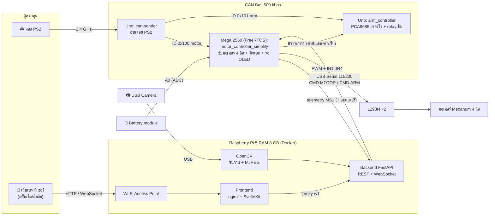
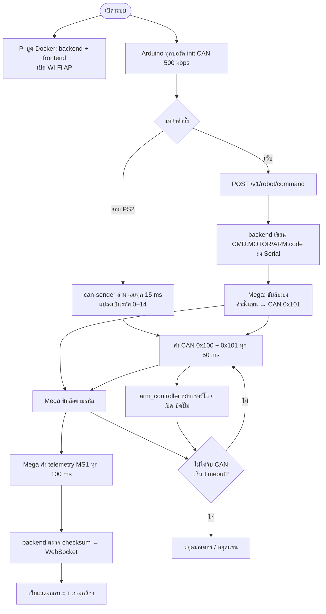
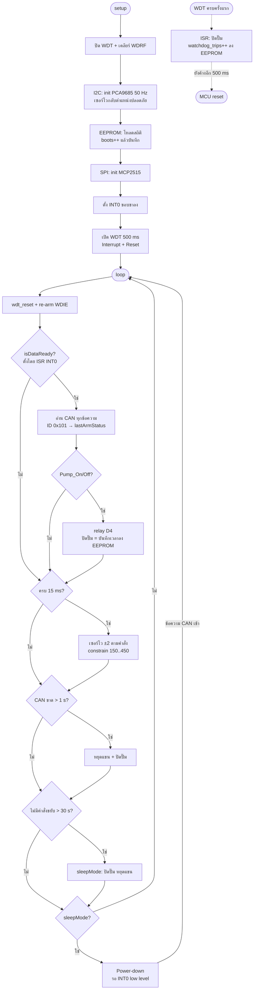
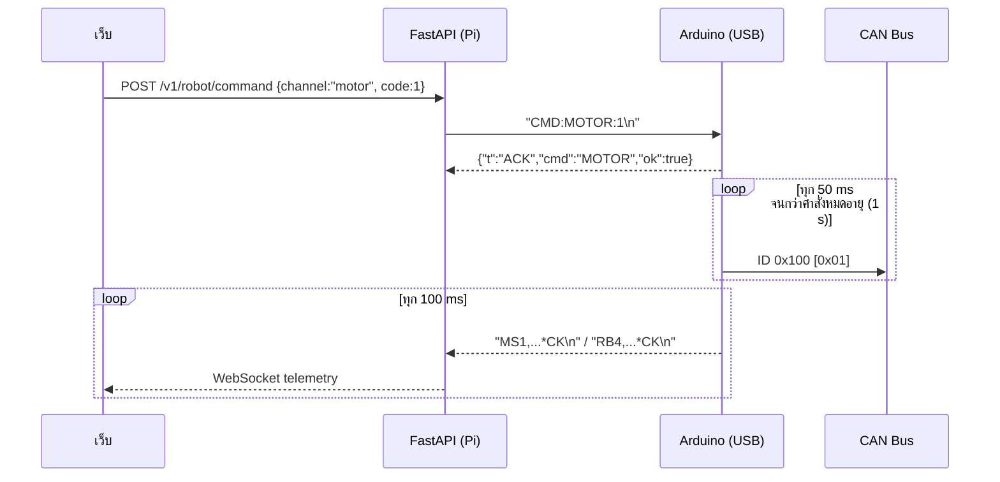
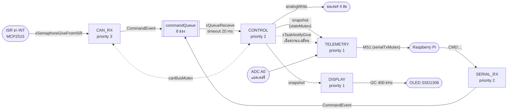

# โครงร่างรายงาน Durian Bot (Mini Project 240-319)

> ไฟล์นี้เป็น **โครงร่าง + เนื้อหาคร่าวๆ** สำหรับนำไปเรียบเรียงลงรายงาน Word
> อิงโครงสร้างจากตัวอย่าง `Report_SmartHome-1.pdf` และ `MiniProject-SmartCargo-2.pdf`
>
> - ข้อความใน `[วงเล็บเหลี่ยม]` = ต้องเติมเอง (ชื่อ, รูปถ่าย, ผลทดลอง, ราคา)
> - แผนภาพเขียนด้วย Mermaid — เปิดใน VS Code/GitHub เพื่อดู หรือวางที่ <https://mermaid.live> แล้ว export เป็น PNG ไปแปะใน Word
> - Code ที่แปะเป็น **ส่วนสำคัญที่ตัดมา** พร้อมชื่อไฟล์และบรรทัดอ้างอิง ไม่ใช่ทั้งไฟล์
> - **ภาคผนวก Z** ท้ายไฟล์เป็นบันทึกสำหรับทีม (สิ่งที่ยังขาดตามเนื้อหาวิชา + จุดที่ควรแก้) — ลบออกก่อนส่ง

---

## หน้าปก

```
รายงาน
Mini project วิชา 240-319 Embedded System Developer Module
หุ่นยนต์ฉีดพ่นยาในสวนทุเรียน (Durian Bot)

จัดทำโดย
[ชื่อ-สกุล]  รหัสนักศึกษา [xxxxxxxxxx]  Section [xx]
[ชื่อ-สกุล]  รหัสนักศึกษา [xxxxxxxxxx]  Section [xx]
[ชื่อ-สกุล]  รหัสนักศึกษา [xxxxxxxxxx]  Section [xx]

เสนอ
รศ.ดร. ปัญญยศ ไชยกาฬ
ผศ.ดร. วชรินทร์ แก้วอภิชัย
รศ.ดร. ทวีศักดิ์ เรืองพีระกุล

รายงานฉบับนี้เป็นส่วนหนึ่งของรายวิชา 240-319 ชุดวิชานักพัฒนาระบบฝังตัว
(Embedded System Developer Module)
คณะวิศวกรรมศาสตร์ สาขาวิศวกรรมคอมพิวเตอร์
มหาวิทยาลัยสงขลานครินทร์ วิทยาเขตหาดใหญ่
ภาคเรียนที่ [x] ปีการศึกษา [25xx]
```

## คำนำ

รายงานฉบับนี้เป็นส่วนหนึ่งของรายวิชา 240-319 ชุดวิชานักพัฒนาระบบฝังตัว (Embedded System Developer
Module) จัดทำขึ้นเพื่อศึกษา ออกแบบ และพัฒนาหุ่นยนต์ต้นแบบ "Durian Bot" สำหรับช่วยฉีดพ่นสารในสวนทุเรียน
โดยประยุกต์ใช้ความรู้ในรายวิชา ได้แก่ GPIO, PWM, ADC, Interrupt, Watchdog Timer, Sleep Mode, UART/USART,
SPI, I2C, CAN Bus, RTOS, EEPROM และการประมวลผลภาพด้วย OpenCV ร่วมกับ Raspberry Pi และเว็บแอปพลิเคชัน
เพื่อให้ผู้ควบคุมสั่งงานและติดตามสถานะหุ่นยนต์ได้จากระยะไกล

คณะผู้จัดทำหวังว่ารายงานฉบับนี้จะเป็นประโยชน์แก่ผู้อ่าน หากมีข้อผิดพลาดประการใด คณะผู้จัดทำขออภัยมา ณ ที่นี้

คณะผู้จัดทำ
[วันที่]

## สารบัญ / สารบัญภาพ / สารบัญตาราง

> สร้างอัตโนมัติใน Word (References → Table of Contents / Insert Table of Figures) หลังจัดหัวข้อด้วย Heading Style

---

# บทที่ 1 บทนำ

## 1.1 ที่มาและความสำคัญ

ทุเรียนเป็นพืชเศรษฐกิจสำคัญของภาคใต้ การดูแลสวนต้องฉีดพ่นสารป้องกันโรคและแมลง (เช่น โรครากเน่าโคนเน่า,
หนอนเจาะผล) อย่างสม่ำเสมอ ในทางปฏิบัติเกษตรกรต้องแบกถังหรือลากสายพ่นเดินไปตามแถวต้นเอง ซึ่ง

- เสี่ยงสัมผัสสารเคมีโดยตรงทั้งทางผิวหนังและการหายใจ
- ใช้แรงงานและเวลามาก โดยเฉพาะสวนขนาดใหญ่ที่แรงงานขาดแคลน
- ปริมาณการพ่นไม่สม่ำเสมอขึ้นกับผู้พ่นแต่ละคน

คณะผู้จัดทำจึงพัฒนา **Durian Bot** หุ่นยนต์ขับเคลื่อน 4 ล้อที่ติดตั้งปั๊มและหัวฉีดปรับมุมได้ ผู้ควบคุมบังคับจาก
ระยะไกลได้ 2 ช่องทาง คือ จอย PS2 ผ่าน CAN Bus และหน้าเว็บผ่าน Wi-Fi ของ Raspberry Pi บนตัวหุ่น พร้อม
ภาพจากกล้องและสถานะของหุ่นแบบเวลาจริง ช่วยให้ผู้ควบคุมอยู่ห่างจากละอองสารเคมี

## 1.2 วัตถุประสงค์

1. เพื่อออกแบบและพัฒนาหุ่นยนต์ต้นแบบสำหรับฉีดพ่นสารในสวนทุเรียนที่ควบคุมจากระยะไกลได้
2. เพื่อประยุกต์ใช้การสื่อสารระหว่างไมโครคอนโทรลเลอร์หลายบอร์ดผ่าน CAN Bus, SPI, I2C และ UART
3. เพื่อออกแบบระบบความปลอดภัย (fail-safe) เช่น Watchdog Timer และการหยุดอัตโนมัติเมื่อสัญญาณขาด
4. เพื่อพัฒนาเว็บแดชบอร์ดบน Raspberry Pi สำหรับสั่งงาน แสดงภาพจากกล้อง (OpenCV) และสถานะหุ่นยนต์

## 1.3 ขอบเขตของโครงงาน

- เป็นการจำลองตัวต้นแบบขนาดเล็ก โดยใช้ความรู้ในรายวิชา Embedded System Developer Module
- ใช้น้ำแทนสารเคมีจริงในการทดสอบ
- ควบคุมแบบ manual (ผู้ควบคุมบังคับ) ยังไม่มีการนำทางอัตโนมัติ
- ระยะการควบคุมผ่านเว็บจำกัดตามระยะ Wi-Fi Access Point ของ Raspberry Pi

---

# บทที่ 2 เอกสารและทฤษฎีที่เกี่ยวข้อง

> แนวเดียวกับตัวอย่าง SmartHome บทที่ 2: อธิบายอุปกรณ์แต่ละตัว + รูปประกอบ (ภาพ pinout)
> แล้วเพิ่มส่วน **2.2 ทฤษฎีตามเนื้อหาวิชา** ที่ผูกกับโค้ดจริงในโปรเจกต์ (อาจารย์น่าจะดูส่วนนี้เป็นหลัก)

## 2.1 อุปกรณ์ที่เกี่ยวข้อง

| หัวข้อย่อย | เนื้อหาคร่าวๆ | ใช้ในโปรเจกต์ |
| --- | --- | --- |
| 2.1.1 Arduino Uno R3 | ATmega328P 16 MHz, Flash 32 KB, SRAM 2 KB, EEPROM 1 KB, Digital I/O 14 ขา (PWM 6), Analog 6 ขา, USART 1 ชุด, SPI, I2C (TWI) | บอร์ดจอย (`can-sender`), บอร์ดแขน/ปั๊ม (`arm_controller`), bridge (`can_receiver`) |
| 2.1.2 Arduino Mega 2560 | ATmega2560 16 MHz, Flash 256 KB, SRAM 8 KB, EEPROM 4 KB, Digital I/O 54 ขา (PWM 15), Analog 16 ขา, USART 4 ชุด | บอร์ดขับมอเตอร์ 4 ล้อ (`motor_controller_simplify`) ต่อ USB กับ Pi |
| 2.1.3 Raspberry Pi 5 (RAM 8 GB) | SBC, CPU Cortex-A76 4 คอร์ 2.4 GHz, RAM LPDDR4X 8 GB, Wi-Fi 5 dual-band, USB 3.0 ×2 + USB 2.0 ×2, PCIe, ใช้ไฟ USB-C 5V 5A (27 W), Raspberry Pi OS 64-bit (Bookworm) | เป็น Wi-Fi Access Point, รัน FastAPI + เว็บด้วย Docker (build บนตัวเองได้), อ่านกล้อง USB ด้วย OpenCV |
| 2.1.4 MCP2515 CAN Module | CAN controller แบบ SPI + transceiver TJA1050, คริสตัล 8 MHz, มีขา INT แจ้งเมื่อมีข้อความเข้า | สายสื่อสารหลักระหว่างบอร์ด Arduino |
| 2.1.5 PCA9685 | ตัวสร้าง PWM 16 ช่อง ความละเอียด 12 bit ผ่าน I2C (address 0x40) | คุมเซอร์โว 3 แกนของหัวฉีด |
| 2.1.6 จอย PS2 ไร้สาย | สื่อสารแบบ synchronous serial คล้าย SPI (LSB first) มีแกนอนาล็อก 2 ข้าง + ปุ่ม 16 ปุ่ม | ช่องทางควบคุมหลักในสวน |
| 2.1.7 Motor Driver L298N | Dual H-bridge ขับมอเตอร์ DC 2 ตัวต่อโมดูล, Vs 5–35 V, กระแส 2 A ต่อช่อง (peak 3 A), มี regulator 5V บนบอร์ด, แรงดันตก ~2 V, คุมทิศด้วย IN1–IN4 และความเร็วด้วย PWM ที่ ENA/ENB | ใช้ 2 บอร์ด ขับล้อ Mecanum 4 ล้อ (หัวข้อ 2.2.14) |
| 2.1.8 Relay Module + ปั๊มน้ำ DC | relay แบบ active LOW แยกวงจรกำลังของปั๊มออกจาก MCU | เปิด/ปิดการฉีดพ่น |
| 2.1.9 Servo Motor | สั่งมุมด้วยความกว้างพัลส์ ~0.5–2.5 ms ที่คาบ 20 ms (50 Hz) | ปรับมุมหัวฉีด (ซ้าย-ขวา / หน้า-หลัง / ยกหัว) |
| 2.1.10 USB Webcam | UVC camera อ่านผ่าน V4L2 | ส่งภาพสดขึ้นหน้าเว็บ |
| 2.1.11 FastAPI / SvelteKit / Docker | Backend Python, Frontend เว็บ, container สำหรับ deploy บน Pi | ส่วนซอฟต์แวร์ฝั่ง Pi |
| 2.1.12 OpenCV | ไลบรารีประมวลผลภาพ (`cv2.VideoCapture`, `cv2.imencode`) | จับภาพจากกล้อง บีบอัด JPEG แล้วสตรีม MJPEG |
| 2.1.13 จอ OLED SSD1306 128×64 | จอ monochrome 0.96" สื่อสารผ่าน I2C (address 0x3C), ไลบรารี U8g2 | แสดงแบต / คำสั่งล้อ / คำสั่งแขน / แหล่งคำสั่ง บนตัวหุ่น |
| 2.1.14 Battery voltage sensor | โมดูลตัวแบ่งแรงดัน 30 kΩ / 7.5 kΩ (อัตราส่วน 5:1) วัดได้ 0–25 V ให้ออก 0–5 V เข้า ADC | วัดแรงดันแบตที่ A0 ของ Mega |

`[ใส่รูปภาพที่ 1–12: รูปอุปกรณ์ / pinout แต่ละตัว]`

## 2.2 ทฤษฎีตามเนื้อหาวิชาและการนำไปใช้ในโปรเจกต์

> แต่ละหัวข้อเขียน 3 ส่วน: **หลักการ → register/ค่าที่เกี่ยวข้อง → ใช้ที่ไหนในโปรเจกต์**
> สถานะ ✅ = มีในโค้ดแล้ว, ⚠️ = มีบางส่วน/อยู่ในไฟล์รุ่นเก่า, ❌ = ยังไม่มี (ดูภาคผนวก Z)

### 2.2.1 GPIO และ Digital Output ✅

- ขา I/O ของ AVR ควบคุมด้วย 3 register: `DDRx` (ทิศทาง), `PORTx` (เขียนค่า / เปิด pull-up), `PINx` (อ่านค่า)
- ใช้ใน: สั่งทิศมอเตอร์ `IN1/IN2`, ขา relay ปั๊ม (D4, active LOW), ขา chip select ของ MCP2515
- ตัวอย่างระดับ register ใน `arm_controller.ino`: `DDRD &= ~(1 << PD2); PORTD |= (1 << PD2);` = ตั้ง D2 เป็น input + pull-up

### 2.2.2 PWM (Pulse Width Modulation) ✅

- PWM สร้างจาก Timer/Counter ของ MCU โดยเทียบค่า counter กับ `OCRnx` → ได้ duty cycle
- **Hardware PWM บน Mega** (`analogWrite`) — ขา 5 = Timer3 (OC3A), ขา 6/7/8 = Timer4 (OC4A/B/C) ความถี่ default ~490 Hz,
  ค่า 0–255 → ใช้คุมความเร็วล้อ (`MOTOR_PWM = 150` ≈ 59% duty)
- **External PWM ผ่าน PCA9685** — oscillator 25 MHz, 12 bit (0–4095) ตั้ง prescale ให้ได้ 50 Hz สำหรับเซอร์โว

  ```
  prescale = round(25,000,000 / (4096 × f)) − 1        (โค้ดคูณ f × 0.9 ชดเชย oscillator คลาดเคลื่อน)
  1 tick ที่ 50 Hz = 20 ms / 4096 ≈ 4.88 µs
  ค่า 150 ≈ 0.73 ms, 305 ≈ 1.49 ms (กึ่งกลาง), 450 ≈ 2.20 ms  → constrain(150..450) กันเซอร์โวชนสุด
  ```

### 2.2.3 ADC (Analog to Digital Converter) ✅

- ADC ของ AVR เป็นแบบ successive approximation 10 bit (0–1023), เลือกช่องด้วย `ADMUX`, เริ่มแปลงด้วย `ADSC` ใน `ADCSRA`
  และรอจน `ADSC` กลับเป็น 0, clock ของ ADC ต้องอยู่ในช่วง 50–200 kHz → 16 MHz / 128 = 125 kHz (1 ครั้ง ≈ 13 clock ≈ 104 µs)
- `V = ADC × Vref / 1023` — วัดแบตผ่านตัวแบ่งแรงดัน `Vbat = V × (R1+R2)/R2`
- ในโปรเจกต์: Mega (`motor_controller_simplify`) อ่านโมดูลวัดแรงดันแบต 0–25 V (30 kΩ / 7.5 kΩ) ที่ `A0`
  **เขียนระดับ register** แทน `analogRead()` แล้วเฉลี่ย 8 ค่า (moving average) ลด noise จากมอเตอร์ ส่งขึ้นเว็บใน telemetry `MS1`

### 2.2.4 Interrupt ✅

- Interrupt ทำให้ CPU หยุดงานปัจจุบันไปทำ ISR ทันทีเมื่อเกิดเหตุการณ์ แทนการวนเช็ก (polling)
- External interrupt INT0 (ขา D2 ของ Uno): ตั้งชนิด edge ใน `EICRA` (`ISC01:ISC00`), เปิดใน `EIMSK`, flag อยู่ใน `EIFR`
- ในโปรเจกต์ (`arm_controller.ino`): ขา INT ของ MCP2515 ดึงลง LOW เมื่อมีข้อความ CAN → trigger ขอบขาลง →
  ISR ตั้งแค่ flag `volatile bool isDataReady` แล้วให้ `loop()` ไปอ่าน (หลัก "ISR ต้องสั้น")
- บอร์ด Mega รุ่นเต็มใช้ `attachInterrupt(..., RISING)` นับพัลส์ encoder ล้อ (`motor_controller_mega/encoder.cpp`)

### 2.2.5 Watchdog Timer (WDT) ✅

- WDT เป็น timer อิสระ (oscillator 128 kHz ภายใน) ถ้าโปรแกรมไม่ `wdt_reset()` ภายในเวลาที่กำหนด MCU จะ reset ตัวเอง
  → กันโปรแกรมค้าง (เช่น ติดใน `while` รอ I2C/SPI)
- ตั้งค่าผ่าน `WDTCSR`: ต้องเขียน `WDCE|WDE` ก่อนภายใน 4 clock cycle (timed sequence) แล้วจึงตั้ง prescaler `WDP3..0`
- WDT มี 3 โหมด: Interrupt (`WDIE`), System Reset (`WDE`), และ **Interrupt + System Reset** (`WDIE|WDE`)
  ที่ครบเวลาครั้งแรกจะเข้า ISR `WDT_vect` ก่อน (hardware ล้าง `WDIE` เอง) ถ้ายังไม่ `wdt_reset()` อีกรอบจึง reset
- ในโปรเจกต์ (`arm_controller.ino`): ตั้ง timeout **500 ms** (`WDP2|WDP0`) แบบ **Interrupt + System Reset**
  - ครบเวลาครั้งแรก → ISR ปิดปั๊มทันทีและบันทึกจำนวนครั้งที่ค้างลง EEPROM → อีก 500 ms ถ้ายังค้างจึง reset
  - ปิด WDT และเคลียร์ `WDRF` ใน `MCUSR` ตอนบูตก่อน (กัน reset loop), `wdt_reset()` ทุกรอบ `loop()`
  - หลัง reset เซอร์โวจะถูกสั่งกลับตำแหน่งปลอดภัยทันทีใน `setup()`
  - Mega (`motor_controller_simplify`) ใช้ WDT ไม่ได้ เพราะ FreeRTOS ใช้ WDT เป็นตัวสร้าง tick

### 2.2.6 Sleep Mode / Power Management ✅

- AVR มี sleep 6 ระดับ (Idle, ADC Noise Reduction, Power-down, Power-save, Standby, Extended Standby)
  เลือกผ่าน `SMCR` (`SM2..0`) แล้วสั่ง `sleep_cpu()` ปลุกด้วย interrupt
- **Power-down** ประหยัดที่สุด: หยุด oscillator หลักและ I/O clock ทั้งหมด (Timer0 หยุด → `millis()` หยุดนับระหว่างหลับ)
  ปลุกได้เฉพาะ external interrupt แบบ **low level**, pin change, TWI address match หรือ WDT
  — INT0 แบบขอบ (edge) ต้องใช้ I/O clock จึงปลุกจาก Power-down ไม่ได้
- ในโปรเจกต์ (`arm_controller.ino`): ไม่มีคำสั่งขยับเกิน 30 วินาที → ปิดปั๊ม หยุดแขน แล้ว **เข้า Power-down จริง**
  - ก่อนหลับ: `Serial.flush()`, `wdt_disable()`, ปิด ADC, ปิด BOD (`sleep_bod_disable()`), เปลี่ยน INT0 เป็น low level
  - MCP2515 ดึงขา INT ลงเมื่อมีข้อความ CAN → ตื่น → ISR ปิด INT0 ชั่วคราว (low level จะเข้า ISR ซ้ำไม่หยุด) → กลับเป็นขอบขาลง + เปิด WDT
  - ถ้าข้อความเป็นแค่ STOP heartbeat ของจอย (ทุก 50 ms) จะอ่านทิ้งแล้วหลับต่อ ตื่นจริงเมื่อมีคำสั่งขยับ
  - `can_receiver.ino` ยังเป็น software sleep (ตัดปั๊มอย่างเดียว)

### 2.2.7 UART / USART ✅

- USART = asynchronous serial: start bit + 8 data + (parity) + stop bit, ไม่มีสาย clock ทั้งสองฝั่งต้องตั้ง baud ตรงกัน
- Baud rate จาก `UBRRn = F_CPU / (16 × baud) − 1` (หรือ /8 เมื่อเปิด U2X) — ที่ 115200 บน 16 MHz ใช้โหมด U2X, UBRR = 16 (error ~2.1%)
- ในโปรเจกต์: USB ของ Arduino คือชิป ATmega16U2 แปลง USB ↔ USART0 ของ MCU → Pi เห็นเป็น `/dev/ttyACM0`
  ใช้ **115200 8N1** ส่งข้อความเป็นบรรทัด ASCII จบด้วย `\n` พร้อม XOR checksum (ออกแบบ protocol ในบทที่ 3.4)

### 2.2.8 SPI ✅

- Synchronous serial แบบ master/slave 4 สาย: `SCK`, `MOSI`, `MISO`, `SS/CS` (full-duplex)
- ในโปรเจกต์:
  - Arduino ↔ MCP2515 ผ่าน hardware SPI (Uno: D10–D13, Mega: D50–D53) — ต้องตั้งขา `SS` ของ MCU เป็น OUTPUT
    ไม่งั้น SPI จะหลุดไปเป็น slave mode
  - Arduino ↔ จอย PS2 เป็น **software SPI (bit-bang)** บน A0–A3 ส่งแบบ LSB first, คำสั่ง `0x01 0x42` (`PS2_Controller.cpp`)

### 2.2.9 I2C (TWI) ✅

- 2 สาย `SDA`/`SCL` (open-drain + pull-up), หลายอุปกรณ์บนบัสเดียวกันแยกด้วย address 7 bit
- ลำดับการเขียน register: START → address+W → register → data… → STOP
- ในโปรเจกต์: Uno (A4/A5) ↔ PCA9685 (0x40) — **เขียน driver เองระดับ register** (`PCA9685_Control.cpp`)
  ไม่ใช้ไลบรารี Adafruit: `MODE1 (0x00)`, `PRESCALE (0xFE)`, `LED0_ON_L (0x06) + 4×channel` และใช้ Auto-Increment
  เขียน 4 byte ต่อเนื่องในครั้งเดียว
- ในโปรเจกต์: Mega (D20 SDA / D21 SCL) ↔ **จอ OLED SSD1306** (0x3C) ผ่าน **hardware I2C (TWI)** ที่ 400 kHz (fast mode) ด้วยไลบรารี U8g2
  - **Hardware vs Software I2C:** โค้ดตัวอย่างเดิม (`receiver-canbus.ino`) ใช้ software I2C (bit-bang) บน D6/D7 ของ Uno
    แต่บน Mega ขา D6/D7 เป็น PWM ของ L298N จึงย้ายมาใช้ TWI ของชิปจริง — ฮาร์ดแวร์สร้าง clock/START/STOP/ACK ให้ CPU ว่างกว่าและเร็วกว่า
  - **Page buffer:** จอ 128×64 = 1024 byte ถ้าเก็บทั้งจอใน RAM จะกิน 1/8 ของ SRAM Mega จึงใช้โหมด `_1_` ของ U8g2
    วาดทีละ page (128×8 px = 128 byte) วน 8 รอบ (`firstPage()` / `nextPage()`)
  - **เวลาส่ง 1 เฟรม:** 1024 byte × 9 bit (8 data + ACK) ≈ 9,216 bit → ที่ 400 kHz ≈ 23 ms (ที่ 100 kHz ≈ 92 ms)

### 2.2.10 CAN Bus ✅

- บัส differential 2 สาย (CAN_H/CAN_L) ทนสัญญาณรบกวนสูง, multi-master, arbitration ด้วย ID (ID ต่ำ = priority สูง),
  มี CRC/ACK ในตัว ต้องมีตัวต้านทาน terminate 120 Ω ที่ปลายสายทั้ง 2 ด้าน
- ในโปรเจกต์: 500 kbps, Standard ID 11 bit, payload 1 byte = รหัสคำสั่ง, ส่งซ้ำทุก 50 ms เป็น heartbeat
  (ถ้าไม่ได้รับเกิน timeout ถือว่าสัญญาณขาด → หยุด)

### 2.2.11 RTOS ✅

- RTOS แบ่งงานเป็น task มี priority, scheduler แบบ preemptive สลับ task ตาม tick, และมีกลไกสื่อสารระหว่าง task
  - **Queue** — ส่งข้อมูลระหว่าง task แบบ FIFO (copy by value) task ที่รอจะ block ไม่กิน CPU
  - **Binary semaphore** — ใช้ส่งสัญญาณ เช่น ISR ปลุก task (`xSemaphoreGiveFromISR`)
  - **Mutex** — ล็อกทรัพยากรที่ใช้ร่วมกัน (SPI, Serial) มี priority inheritance กัน priority inversion
  - **Task notification** — ปลุก task เฉพาะตัวแบบเบาที่สุด
- FreeRTOS บน AVR (ไลบรารี Arduino_FreeRTOS) ใช้ **Watchdog Timer เป็นตัวสร้าง tick (~15 ms)** และ `loop()` กลายเป็น idle task
- ในโปรเจกต์: Mega (`motor_controller_simplify`) แบ่งเป็น 5 task — `CAN_RX`, `CONTROL`, `SERIAL_RX`, `TELEMETRY`, `DISPLAY`
  ใช้ครบทั้ง queue, semaphore จาก ISR, mutex 3 ตัว และ task notification (รายละเอียดหัวข้อ 4.4)

### 2.2.12 EEPROM ✅

- หน่วยความจำ non-volatile ภายใน MCU (Uno 1 KB, Mega 4 KB) เขียนได้ ~100,000 ครั้ง/ช่อง ใช้เวลาเขียน ~3.3 ms ต่อ byte
  จึงควรใช้ `EEPROM.update()` / `EEPROM.put()` (เขียนเฉพาะ byte ที่ค่าเปลี่ยน) และเก็บ magic/version ไว้ตรวจความถูกต้องของข้อมูล
  (EEPROM ที่ยังไม่เคยเขียนอ่านได้ `0xFF` ทุก byte)
- ในโปรเจกต์ (`arm_controller.ino`): เก็บ struct `ArmStats` = magic `0xA7A7`, version, **จำนวนการบูต**,
  **จำนวนครั้งที่ Watchdog ทำงาน** (เขียนจากใน ISR) และ **เวลาเปิดปั๊มสะสม** (ใช้ประเมินปริมาณสาร)
  — บันทึกเฉพาะตอนมีเหตุการณ์ (บูต / ปิดปั๊ม / WDT) ไม่ใช่ทุกรอบ loop
- ไม่เก็บตำแหน่งเซอร์โว เพราะตอนบูต (รวมถึงหลัง WDT reset) ต้องดึงแขนกลับจุดปลอดภัยเสมอ
- อีกตัวอย่าง: `firmware/motor_controller_rtos_pid/pid_config.cpp` เก็บค่า PID + magic `0x5049` + version

### 2.2.13 OpenCV และการประมวลผลภาพ ✅

- `cv2.VideoCapture` เปิดกล้องผ่าน V4L2, ตั้ง FOURCC เป็น MJPG ให้กล้องบีบอัดเองลดภาระ USB/CPU
- `cv2.imencode(".jpg", frame, [IMWRITE_JPEG_QUALITY, 80])` → ส่งเป็น MJPEG (`multipart/x-mixed-replace`) ให้ `` บนเว็บ
- **ตรวจจับทรงพุ่มทุเรียน** (`backend/apiapp/infrastructure/vision.py`) ทุกเฟรมก่อน encode:
  1. `GaussianBlur` ลด noise ของเซนเซอร์กล้อง
  2. `cvtColor(BGR2HSV)` — HSV แยก "สี" (Hue) ออกจาก "ความสว่าง" (Value) จึงทนแดด/เงาได้ดีกว่า RGB
  3. `inRange` เลือกสีเขียว H 35–85, S ≥ 60, V ≥ 40 (OpenCV ใช้ H 0–179) → ได้ mask ขาวดำ
  4. `morphologyEx` OPEN (erode → dilate) ลบจุดเล็ก / CLOSE (dilate → erode) อุดช่องระหว่างใบ
  5. `countNonZero / ขนาดภาพ` = สัดส่วนพื้นที่ใบ, `findContours` + `boundingRect` หาพุ่มที่ใหญ่ที่สุด
  6. วาดกรอบ + ข้อความ `CANOPY 42% READY` ลงบนภาพ — ถ้าสัดส่วน ≥ `CANOPY_READY_RATIO` (25%) ถือว่าหัวฉีดหันเข้าต้นแล้ว
- ระบบแค่ **แจ้งผู้ควบคุม** ไม่เปิดปั๊มเอง (การพ่นสารอัตโนมัติต้องมีระบบความปลอดภัยเพิ่ม)

### 2.2.14 H-Bridge และ Motor Driver L298N ✅

- **H-Bridge** คือสวิตช์ 4 ตัวต่อเป็นรูปตัว H รอบมอเตอร์ เปิดคู่ทแยงคู่หนึ่ง → กระแสไหลผ่านมอเตอร์ทางหนึ่ง (เดินหน้า)
  เปิดอีกคู่ → กระแสไหลกลับทาง (ถอยหลัง) ทำให้กลับทิศมอเตอร์ DC ได้โดยไม่ต้องสลับสาย
- MCU จ่ายกระแสได้แค่ ~20–40 mA ต่อขา แต่มอเตอร์กินเป็นแอมป์ จึงต้องมี driver คั่นกลาง (แยกวงจรสัญญาณกับวงจรกำลัง)
- **L298N** มี H-bridge 2 ชุดในชิปเดียว (ช่อง A: `IN1/IN2/ENA`, ช่อง B: `IN3/IN4/ENB`)

  | IN1 | IN2 | ENA | ผล |
  | :-: | :-: | :-: | --- |
  | 1 | 0 | PWM | เดินหน้า ความเร็วตาม duty |
  | 0 | 1 | PWM | ถอยหลัง |
  | 0 | 0 | 0 | ปล่อยหมุนอิสระ (coast) — firmware ใช้ตอนหยุด |
  | 1 | 1 | 1 | เบรก — ไม่ได้ใช้ |

- **ความเร็วด้วย PWM:** แรงดันเฉลี่ยที่มอเตอร์ ≈ (Vs − แรงดันตกของ L298N) × duty
  เช่น แบต 12 V, ตก ~2 V, `MOTOR_PWM = 150` (150/255 ≈ 59%) → ≈ 10 × 0.59 ≈ **5.9 V**
  (L298N เป็นทรานซิสเตอร์ BJT จึงตก ~2 V และร้อนกว่า driver แบบ MOSFET เช่น TB6612 / BTS7960)
- **จุดที่ต้องระวังในการต่อ:** ถอด jumper ที่ ENA/ENB ก่อนต่อ PWM, ต่อ GND ร่วมกับ Mega,
  jumper 5V-EN เสียบได้เมื่อ Vs ≤ 12 V, ไม่ต่อขา 5V ของ L298N เข้า Mega ขณะเสียบ USB กับ Pi
- ในโปรเจกต์: L298N 2 บอร์ดขับล้อ Mecanum 4 ล้อ ตารางต่อขาอยู่หัวข้อ 3.3.2 และตารางทิศทางอยู่หัวข้อ 4.4.5

---

# บทที่ 3 ระบบการทำงานและการเชื่อมต่อ

## 3.1 การทำงานโดยภาพรวม (System Architecture)

ระบบแบ่งเป็น 3 ชั้น

1. **ชั้นผู้ใช้** — จอย PS2 (ในสวน) และเว็บเบราว์เซอร์บนแท็บเล็ต/มือถือ
2. **ชั้นประมวลผลบนตัวหุ่น (Raspberry Pi)** — Wi-Fi AP, FastAPI backend, เว็บ frontend, อ่านกล้องด้วย OpenCV
3. **ชั้นควบคุมฮาร์ดแวร์ (Arduino บน CAN Bus)** — ขับล้อ, ขยับหัวฉีด, เปิด/ปิดปั๊ม



`[รูปภาพที่ x: แผนภาพการเชื่อมต่อระบบโดยภาพรวม]`

> **หมายเหตุสถาปัตยกรรม** — มี 2 รูปแบบการต่อ USB กับ Pi
>
> | โหมด | บอร์ดที่เสียบ USB กับ Pi | เว็บสั่งงานได้ไหม |
> | --- | --- | --- |
> | A (ปัจจุบัน) | Mega `motor_controller_simplify` | ได้ — Mega ขับล้อเองตาม `CMD:MOTOR` และส่งต่อ `CMD:ARM` เข้า CAN `0x101` ไปยัง arm_controller |
> | B (bridge) | Uno `can_receiver` | ได้ — รับ `CMD:...` จาก Pi แล้วส่งต่อเข้า CAN `0x100` และคุมแขน/ปั๊มเอง |

## 3.2 Flowchart

### 3.2.1 Flowchart การทำงานโดยรวม



### 3.2.2 Flowchart บอร์ด arm_controller (Interrupt + Watchdog + Sleep + EEPROM)



### 3.2.3 Flowchart บอร์ด can-sender และ motor_controller_simplify

`[วาดตามแบบเดียวกัน: can-sender = poll จอย 15 ms → deadzone → map เป็นรหัส → ส่ง CAN 50 ms;
Mega = ดูแผนภาพ task ในหัวข้อ 4.4.1]`

## 3.3 การทำงานในส่วนของ Hardware

### 3.3.1 Schematic Diagram

`[ใส่รูป schematic จาก Fritzing/KiCad และรูปต่อวงจรจริง]`

### 3.3.2 ตารางการต่อขา

**ตารางที่ x: Uno — can-sender (จอย PS2)**

| อุปกรณ์ | ขา Uno |
| --- | --- |
| PS2 DAT / CMD / ATT / CLK | A0 / A1 / A2 / A3 |
| MCP2515 CS | D10 |
| MCP2515 SI / SO / SCK | D11 / D12 / D13 |

**ตารางที่ x: Uno — arm_controller**

| อุปกรณ์ | ขา Uno |
| --- | --- |
| MCP2515 CS | D10 |
| MCP2515 INT | D2 (INT0) |
| MCP2515 SI / SO / SCK | D11 / D12 / D13 |
| PCA9685 SDA / SCL | A4 / A5 |
| Relay ปั๊ม IN (active LOW) | D4 |
| PCA9685 ช่อง 0 / 1 / 2 | เซอร์โว ซ้าย-ขวา / หน้า-หลัง / ยกหัวฉีด |

**ตารางที่ x: Mega 2560 — motor_controller_simplify**

| อุปกรณ์ | ขา L298N | ขา Mega | หมายเหตุ |
| --- | --- | --- | --- |
| L298N #1 ช่อง A → M1 หน้าซ้าย | ENA / IN1 / IN2 | D5 / D22 / D23 | ENA = PWM (Timer3) |
| L298N #1 ช่อง B → M2 หน้าขวา | ENB / IN3 / IN4 | D6 / D24 / D25 | ENB = PWM (Timer4) |
| L298N #2 ช่อง A → M3 หลังซ้าย | ENA / IN1 / IN2 | D7 / D30 / D31 | ENA = PWM (Timer4) |
| L298N #2 ช่อง B → M4 หลังขวา | ENB / IN3 / IN4 | D8 / D32 / D33 | ENB = PWM (Timer4) |
| L298N ทั้ง 2 บอร์ด | GND | GND | ต้องต่อ GND ร่วม |
| MCP2515 | CS / SO / SI / SCK | D53 / D50 / D51 / D52 | SPI |
| MCP2515 INT (ไม่บังคับ) | – | D2 (INT4) | ปลุก task CAN_RX |
| Battery module S | – | A0 | GND ร่วม |
| OLED SSD1306 SDA / SCL | – | D20 / D21 | hardware I2C, VCC 5V, GND ร่วม |

ตำแหน่งล้ออนุมานจากตารางทิศทาง (SPIN_LEFT = M1, M3 ถอย / M2, M4 เดินหน้า) — ถ้าล้อไหนกลับทาง ให้สลับสาย OUT1/OUT2 ที่ L298N

### 3.3.3 ตาราง CAN ID และรหัสคำสั่ง

| CAN ID | ผู้ส่ง → ผู้รับ | ข้อมูล |
| --- | --- | --- |
| `0x100` | can-sender (หรือ can_receiver ในโหมด B) → Mega | 1 byte รหัสมอเตอร์ 0–10 |
| `0x101` | can-sender และ Mega (คำสั่งจากเว็บ) → arm_controller | 1 byte รหัสแขน 0–8, 11–14 |

| รหัส | มอเตอร์ | แขน/หัวฉีด | ปุ่มจอย PS2 |
| ---: | --- | --- | --- |
| 0 | STOP | STOP | ปล่อยจอย |
| 1 / 2 | FORWARD / BACKWARD | เซอร์โว 1 −/+ | D-pad ↑↓, analog ซ้าย / analog ขวา ↑↓ |
| 3 / 4 | LEFT / RIGHT | เซอร์โว 0 −/+ | analog ซ้าย / analog ขวา ←→ |
| 5–8 | เฉียง 4 ทิศ | (ใช้เซอร์โว 0) | analog ซ้ายแนวทแยง |
| 9 / 10 | SPIN_LEFT / SPIN_RIGHT | – | D-pad ← → |
| 11 / 12 | – | PUMP_ON / PUMP_OFF | □ / ○ |
| 13 / 14 | – | HEAD_UP / HEAD_DOWN | △ / ✕ |

## 3.4 การออกแบบ Protocol ระหว่าง Raspberry Pi กับ Arduino (USB Serial)

**ตั้งค่า:** 115200 baud, 8N1, ข้อความ ASCII 1 บรรทัดต่อ 1 frame จบด้วย `\n`

### 3.4.1 Pi → Arduino (คำสั่ง)

```text
CMD:MOTOR:<0..10>     สั่งมอเตอร์ (backend เปิดให้ 0..8)
CMD:ARM:<0..8,11..14> สั่งแขน/ปั๊ม
CMD:ALL:0  หรือ STOP  หยุดทุกอย่าง
PING                  ตรวจลิงก์ → ตอบ {"t":"PONG"}
```

คำสั่งจาก Serial **หมดอายุใน 1000 ms** ถ้าไม่ได้รับซ้ำ → หยุดเองเมื่อสาย USB หลุด หรือ backend ค้าง

### 3.4.2 Arduino → Pi (Telemetry)

```text
MS1,motor,motor_alive,arm,arm_alive,battery_mV,battery_adc,pwm,age_ms,seq*CK   (motor_controller_simplify, ทุก 100 ms)
RB4,motor,motor_alive,arm,arm_alive,mV,adc,ax1,ax2,ax3,pump,seq*CK   (can_receiver)
```

`MS1` คือ prefix ของบรรทัด telemetry จาก Mega ย่อมาจาก **M**otor controller **S**implify รุ่นที่ **1**
แยกชื่อจาก `MC1` (Mega รุ่นเต็ม 20 field) เพื่อให้ backend รู้ว่าต้องแยก field แบบไหน
ความหมายของแต่ละ field ดูตารางใน `README.md` หัวข้อ Protocol

**เหตุผลการออกแบบ** (เขียนอธิบายในรายงาน)

- **Prefix** (`MS1`, `RB4`) — กรองขยะที่ bootloader พิมพ์ตอน reset และบอกเวอร์ชันของรูปแบบข้อมูล
- **CSV แทน JSON** — `snprintf` ครั้งเดียวจบ ไม่ต้องใช้ไลบรารีเพิ่ม ประหยัด SRAM 2 KB ของ Uno
- **XOR checksum** — ตรวจข้อมูลเพี้ยนจากสัญญาณรบกวน (มอเตอร์/ปั๊มสร้าง noise สูง) บรรทัดที่ checksum ผิดจะถูกทิ้ง
- **seq** — ตัวนับ frame ให้ backend รู้ว่ามี frame หาย
- **age_ms / alive** — บอกว่าคำสั่งล่าสุดเก่าแค่ไหน ใช้แสดงสถานะลิงก์บนเว็บ



## 3.5 การทำงานในส่วนของ Raspberry Pi และเว็บ

| ส่วน | รายละเอียด |
| --- | --- |
| Network | Pi เป็น Wi-Fi Access Point (`scripts/setup-rpi-ap.sh`) ผู้ใช้เชื่อม Wi-Fi ของหุ่นแล้วเปิด `http://<ip ของ Pi>/` |
| Deploy | Docker Compose 2 container: `frontend` (nginx พอร์ต 80) และ `backend` (FastAPI พอร์ต 9000) |
| API | `POST /v1/robot/command`, `GET /v1/robot/status`, `GET /v1/camera/stream` (MJPEG), `WS /v1/telemetry/ws` |
| หน้าเว็บ | `/` operator console, `/control` ปุ่มสั่งงาน + E-STOP, `/monitor` แสดง telemetry |

`[รูปภาพที่ x: หน้าเว็บ /control และ /monitor]`

---

# บทที่ 4 Code และการทำงาน

## 4.1 บอร์ด can-sender (Uno + จอย PS2) — `firmware/can-sender/`

### 4.1.1 อ่านจอยและแปลงแกนอนาล็อกเป็นทิศทาง (Deadzone)

ค่าแกนอนาล็อกของจอยอยู่ในช่วง 0–255 กึ่งกลาง 128 ใช้ deadzone ±12 กันหุ่นขยับเองจากค่ากึ่งกลางที่แกว่ง

```cpp
// can-sender.ino — ทุก 15 ms
uint8_t lx = ps2x.Analog(PSS_LX);
uint8_t ly = ps2x.Analog(PSS_LY);
if (lx != 255 || ly != 255)            // 255 ทั้งคู่ = จอยไม่ตอบ
{
    if (lx < (128 - PS2_DEADZONE)) x_left = -1;
    else if (lx > (128 + PS2_DEADZONE)) x_left = 1;
    if (ly < (128 - PS2_DEADZONE)) y_left = -1;
    else if (ly > (128 + PS2_DEADZONE)) y_left = 1;
}
currentMotorStatus = get_status_from_sticks(x_left, y_left, STOP);
if (ps2x.Button(PSB_PAD_LEFT))  currentMotorStatus = SPIN_LEFT;
else if (ps2x.Button(PSB_PAD_RIGHT)) currentMotorStatus = SPIN_RIGHT;
```

### 4.1.2 Software SPI กับจอย PS2 (bit-bang)

```cpp
// PS2_Controller.cpp — ส่ง/รับ 1 byte แบบ LSB first
uint8_t ps2Transfer(uint8_t outgoingByte)
{
    uint8_t incomingByte = 0;
    for (uint8_t bit = 0; bit < 8; bit++)
    {
        digitalWrite(PS2_CMD_PIN, (outgoingByte & 0x01) ? HIGH : LOW);
        outgoingByte >>= 1;
        digitalWrite(PS2_CLK_PIN, LOW);   delayMicroseconds(8);
        if (digitalRead(PS2_DAT_PIN) == HIGH) incomingByte |= (1 << bit);
        digitalWrite(PS2_CLK_PIN, HIGH);  delayMicroseconds(8);
    }
    return incomingByte;
}
```

### 4.1.3 ส่งคำสั่งขึ้น CAN Bus (heartbeat 50 ms)

```cpp
bool send_can_status(unsigned long canId, PS2_Status status)
{
    byte txData[1] = { (byte)status };
    return CAN0.sendMsgBuf(canId, 0 /* standard ID */, 1, txData) == CAN_OK;
}

if (currentTime - lastSendTime >= CAN_SEND_INTERVAL)   // 50 ms
{
    lastSendTime = currentTime;
    send_can_status(CAN_ID_MOTOR, currentMotorStatus);  // 0x100
    send_can_status(CAN_ID_ARM,   currentArmStatus);    // 0x101
}
```

**อธิบาย:** ส่งซ้ำแม้คำสั่งไม่เปลี่ยน (รวมถึง STOP) เพื่อให้ฝั่งรับรู้ว่าจอยยังเชื่อมต่ออยู่ ถ้าหยุดส่ง ฝั่งรับจะ timeout และหยุดเอง
และใช้ `millis()` แทน `delay()` ทำให้งานหลายอย่างทำงานพร้อมกันได้แบบ non-blocking

## 4.2 บอร์ด arm_controller (Uno + PCA9685 + ปั๊ม) — `firmware/arm_controller/`

### 4.2.1 External Interrupt INT0 ระดับ register

```cpp
ISR(INT0_vect)
{
    isDataReady = true;          // ISR สั้นที่สุด: ตั้ง flag อย่างเดียว
}

// setup()
cli();
DDRD  &= ~(1 << PD2);           // D2 = input
PORTD |=  (1 << PD2);           // เปิด pull-up
EICRA = (EICRA & ~((1 << ISC00) | (1 << ISC01))) | (1 << ISC01);  // ขอบขาลง
EIMSK |= (1 << INT0);           // เปิด INT0
sei();
```

**อธิบาย:** MCP2515 ดึงขา INT เป็น LOW เมื่อมีข้อความเข้า buffer ตัวแปร `isDataReady` ต้องเป็น `volatile`
เพราะถูกแก้ใน ISR และอ่านใน `loop()` — ถ้าไม่ใส่ compiler อาจ cache ค่าไว้ใน register แล้วไม่เห็นการเปลี่ยนแปลง

### 4.2.2 Watchdog Timer ระดับ register (Interrupt + System Reset)

```cpp
// 1) ตอนบูต: ปิด WDT ก่อน กันติด reset loop หลังโดน WDT reset
cli();
MCUSR  &= ~(1 << WDRF);
WDTCSR |= (1 << WDCE) | (1 << WDE);
WDTCSR = 0x00;
sei();

// 2) หลัง init เสร็จ: เปิด WDT แบบ Interrupt + System Reset, timeout 0.5 s
void watchdog_arm() {
    cli();
    wdt_reset();
    WDTCSR |= (1 << WDCE) | (1 << WDE);                               // timed sequence (ภายใน 4 clock)
    WDTCSR = (1 << WDIE) | (1 << WDE) | (1 << WDP2) | (1 << WDP0);    // WDP = 0101 → 0.5 s
    sei();
}

// 3) ครบเวลาครั้งแรก = loop ค้าง → ปิดปั๊มทันที + บันทึกลง EEPROM (hardware ล้าง WDIE เอง)
ISR(WDT_vect) {
    digitalWrite(RELAY_PUMP_PIN, RELAY_OFF_STATE);
    stats.watchdogTrips++;
    EEPROM.put(ARM_STATS_ADDRESS + offsetof(ArmStats, watchdogTrips), stats.watchdogTrips);
}

// 4) ใน loop()
wdt_reset();                 // "feed the dog"
WDTCSR |= (1 << WDIE);       // เปิด WDIE กลับ (แก้บิตนี้อย่างเดียวไม่ต้องใช้ timed sequence)
```

**อธิบาย:** ถ้าโปรแกรมค้าง (เช่น I2C bus ค้าง) เกิน 500 ms ISR จะปิดปั๊มก่อนเลยและจดลง EEPROM
ถ้ายังค้างต่ออีก 500 ms MCU จะ reset แล้ว `setup()` สั่งเซอร์โวกลับตำแหน่งปลอดภัย — ปั๊มจึงไม่ค้างเปิดพ่นสาร
และดูย้อนหลังได้ว่าบอร์ดเคยค้างกี่ครั้ง (พิมพ์ตอนบูต)

### 4.2.3 I2C: Driver PCA9685 ที่เขียนเอง

```cpp
// PCA9685_Control.cpp
void PCA9685Control::setPWMFreq(float freq) {
  freq *= 0.9;                                          // ชดเชย oscillator
  float prescaleval = 25000000.0 / 4096.0 / freq - 1.0;
  uint8_t prescale = floor(prescaleval + 0.5);

  uint8_t oldmode = readRegister(MODE1_REG);
  writeRegister(MODE1_REG, (oldmode & 0x7F) | 0x10);   // ต้อง SLEEP ก่อนเขียน PRESCALE
  writeRegister(PRESCALE_REG, prescale);
  writeRegister(MODE1_REG, oldmode);
  delay(5);
  writeRegister(MODE1_REG, oldmode | 0xA0);            // RESTART + Auto-Increment
}

void PCA9685Control::setPWM(uint8_t channel, uint16_t on, uint16_t off) {
  Wire.beginTransmission(_i2caddr);
  Wire.write(LED0_ON_L + 4 * channel);   // register ของช่องนั้น
  Wire.write(on & 0xFF);  Wire.write(on >> 8);
  Wire.write(off & 0xFF); Wire.write(off >> 8);
  Wire.endTransmission();
}
```

### 4.2.4 ขยับเซอร์โวแบบนุ่มนวล + Fail-safe + Sleep

```cpp
if (currentTime - last_servo_update_ms >= SERVO_UPDATE_INTERVAL)   // 15 ms
{
    if (lastArmStatus == Head_Up)        { servo2_pwm -= 2; servo_changed = true; }
    else if (lastArmStatus == Head_Down) { servo2_pwm += 2; servo_changed = true; }
    // ... แกน 0 และ 1 ในรูปแบบเดียวกัน
    if (servo_changed) {
        servo2_pwm = constrain(servo2_pwm, 150, 450);
        pca.setPWM(2, 0, servo2_pwm);
    }
}

if (lastArmStatus != -1 && currentTime - lastArmMessageTime > CAN_SIGNAL_TIMEOUT)  // 1 s
{
    lastArmStatus = -1;                                   // สัญญาณขาด → หยุดแขน
    set_pump(false);                                      // และปิดปั๊มทันที
}

if (!sleepMode && currentTime - lastActiveTime > SLEEP_TIMEOUT)                     // 30 s
{
    sleepMode = true;
    lastArmStatus = -1;
    set_pump(false);
}
```

**อธิบาย:** เพิ่มทีละ 2 tick ทุก 15 ms ≈ 0.65 ms/วินาที ของความกว้างพัลส์ → หัวฉีดหมุนช้าและนุ่ม ไม่กระชาก
`lastActiveTime` นับเฉพาะคำสั่งที่ไม่ใช่ STOP เพราะจอยส่ง STOP เป็น heartbeat ทุก 50 ms

### 4.2.5 EEPROM: สถิติที่จำข้ามการปิดเครื่อง

```cpp
struct ArmStats {
    uint16_t magic;           // 0xA7A7 = เคยบันทึกแล้ว (EEPROM ใหม่อ่านได้ 0xFF)
    uint8_t  version;
    uint16_t watchdogTrips;   // จำนวนครั้งที่ WDT ทำงาน
    uint16_t bootCount;
    uint32_t pumpSeconds;     // เวลาเปิดปั๊มสะสม
};

void load_stats() {
    EEPROM.get(ARM_STATS_ADDRESS, stats);
    if (stats.magic != ARM_STATS_MAGIC || stats.version != ARM_STATS_VERSION)
        stats = ArmStats{ARM_STATS_MAGIC, ARM_STATS_VERSION, 0, 0, 0};   // เริ่มนับใหม่
}

void save_stats() {
    EEPROM.put(ARM_STATS_ADDRESS, stats);     // เขียนเฉพาะ byte ที่ค่าเปลี่ยน
}

void set_pump(bool on) {
    if (on == pumpState) return;
    digitalWrite(RELAY_PUMP_PIN, on ? RELAY_ON_STATE : RELAY_OFF_STATE);
    pumpState = on;
    if (on) {
        pumpOnSince = millis();
    } else {
        stats.pumpSeconds += (millis() - pumpOnSince + 500) / 1000;
        save_stats();                          // บันทึกเฉพาะตอนปิดปั๊ม ไม่ใช่ทุกรอบ loop
    }
}
```

ตอนบูตพิมพ์ทาง Serial: `EEPROM stats: boots=12 watchdog_trips=1 pump_seconds=845`

### 4.2.6 Sleep Mode: Power-down ปลุกด้วย INT0

```cpp
void enter_power_down() {
    Serial.flush();                            // ส่งข้อความค้างให้หมดก่อนหลับ
    wdt_disable();                             // ไม่งั้น WDT จะ reset ระหว่างหลับ
    ADCSRA &= ~(1 << ADEN);                    // ไม่ใช้ ADC ปิดลดกระแส

    cli();
    EICRA &= ~((1 << ISC01) | (1 << ISC00));   // INT0 = low level (edge ปลุกจาก Power-down ไม่ได้)
    EIFR = (1 << INTF0);
    EIMSK |= (1 << INT0);
    asleep = true;
    set_sleep_mode(SLEEP_MODE_PWR_DOWN);
    sleep_enable();
    sleep_bod_disable();                       // ปิด brown-out detector ระหว่างหลับ
    sei();
    sleep_cpu();                               // ← หลับตรงนี้ (คำสั่งถัดจาก sei ทำก่อน interrupt เสมอ จึงไม่พลาดการปลุก)

    sleep_disable();                           // --- ตื่นแล้ว ---
    cli();
    asleep = false;
    EICRA = (EICRA & ~((1 << ISC00) | (1 << ISC01))) | (1 << ISC01);  // กลับเป็นขอบขาลง
    EIFR = (1 << INTF0);
    EIMSK |= (1 << INT0);
    sei();
    watchdog_arm();
}

ISR(INT0_vect) {
    isDataReady = true;
    if (asleep) EIMSK &= ~(1 << INT0);         // low level จะเข้า ISR ซ้ำตราบใดที่ขายัง LOW จึงปิดไว้ก่อน
}
```

**อธิบาย:** AVR รับประกันว่าคำสั่งถัดจาก `sei()` จะทำก่อนเข้า interrupt ที่รออยู่ ถ้ามีข้อความ CAN เข้าพอดีตอนกำลังจะหลับ
MCU จะหลับแล้วตื่นทันที ไม่ค้างหลับทั้งที่มีข้อความรอ — ช่วงหลับ `millis()` หยุดนับเพราะ Timer0 หยุด

## 4.3 บอร์ด can_receiver (USB ↔ CAN bridge) — `firmware/can_receiver/`

### 4.3.1 รับคำสั่งจาก UART แบบ line buffer

```cpp
void process_serial_commands()
{
    static char line[48];
    static uint8_t length = 0;
    while (Serial.available() > 0)
    {
        const char character = static_cast<char>(Serial.read());
        if (character == '\n') { line[length] = '\0'; process_serial_command(line); length = 0; continue; }
        if (character == '\r') continue;
        if (length < sizeof(line) - 1) line[length++] = character;
        else length = 0;   // บรรทัดยาวเกิน → ทิ้งทั้งบรรทัด ไม่รันคำสั่งที่ถูกตัด
    }
}
```

### 4.3.2 ตรวจรูปแบบคำสั่งอย่างเข้มงวด

```cpp
bool parse_code(const char *line, const char *prefix, int minimum, int maximum, int *result)
{
    const size_t prefixLength = strlen(prefix);
    if (strncmp(line, prefix, prefixLength) != 0 || line[prefixLength] == '\0') return false;
    char *end = nullptr;
    const long value = strtol(line + prefixLength, &end, 10);
    if (*end != '\0' || value < minimum || value > maximum) return false;   // "CMD:MOTOR:1x" = ผิด
    *result = static_cast<int>(value);
    return true;
}
```

### 4.3.3 ลำดับความสำคัญของแหล่งคำสั่ง (Serial override CAN)

```cpp
void refresh_active_commands()
{
    activeMotorCommand = serialMotorActive
        ? serialMotorCommand
        : (canMotorAlive ? canMotorCommand : -1);
}
```

**อธิบาย:** คำสั่งจากเว็บมีสิทธิ์เหนือจอยชั่วคราว (จอยส่ง STOP heartbeat ตลอด ถ้าไม่ override เว็บจะสั่งไม่ได้)
และเมื่อหมดอายุ 1 วินาทีจะส่ง STOP เข้า CAN แล้วคืนสิทธิ์ให้จอย — E-STOP จากเว็บก็ค้างไว้ 1 วินาทีเช่นกัน
เพื่อไม่ให้ heartbeat ของจอยทับคำสั่งหยุดฉุกเฉินทันที

### 4.3.4 Telemetry พร้อม XOR checksum

```cpp
uint8_t calculate_xor_checksum(const char *payload)
{
    uint8_t checksum = 0;
    while (*payload != '\0') checksum ^= static_cast<uint8_t>(*payload++);
    return checksum;
}
// ... snprintf(payload, ..., "RB4,%d,%d,...,%u", ...);
Serial.print(payload); Serial.print('*');
if (checksum < 0x10) Serial.print('0');
Serial.println(checksum, HEX);
```

## 4.4 บอร์ด motor_controller_simplify (Mega 2560 + FreeRTOS) — `firmware/motor_controller_simplify/`

บอร์ดนี้ทำงานหลายอย่างพร้อมกันที่สุดในระบบ (รับ CAN, รับ Serial, ขับมอเตอร์, จับเวลา timeout, ส่ง heartbeat แขน,
อ่านแบต, ส่ง telemetry, วาดจอ OLED) และมี SRAM 8 KB พอสำหรับหลาย task จึงเลือกใช้ FreeRTOS ที่บอร์ดนี้
(Uno มี 2 KB ไม่พอ และ `arm_controller` ใช้ Watchdog เป็น reset timer ซึ่งชนกับ tick ของ FreeRTOS)

### 4.4.1 โครงสร้าง Task



| Task | Priority | Stack (byte) | งาน |
| --- | ---: | ---: | --- |
| `CAN_RX` | 3 | 256 | รอ semaphore จาก ISR หรือ timeout 1 tick → อ่าน CAN ทุกข้อความ → ส่งเข้า queue |
| `CONTROL` | 2 | 256 | เจ้าของ state คำสั่งแต่ผู้เดียว — ดึง queue, เลือกแหล่งคำสั่ง, เช็ก timeout, ขับมอเตอร์ |
| `SERIAL_RX` | 2 | 320 | อ่านบรรทัดจาก Pi → ส่งเข้า queue → ตอบ ACK/ERR |
| `TELEMETRY` | 1 | 448 | อ่านแบต (task เดียวที่ใช้ ADC) + ส่ง `MS1` ทุก 100 ms หรือทันทีเมื่อถูก notify |
| `DISPLAY` | 1 | 384 | วาดจอ OLED ทุก 250 ms (task เดียวที่ใช้ I2C จึงไม่ต้องมี mutex ของบัส) |

**หลักการออกแบบ:** ให้ `CONTROL` เป็น task เดียวที่แก้ state คำสั่ง task อื่นส่งข้อมูลเข้ามาผ่าน queue เท่านั้น
จึงไม่มีตัวแปรที่หลาย task เขียนพร้อมกัน (ไม่เกิด race condition) ใช้ mutex เฉพาะกับทรัพยากรที่ต้องแชร์จริง
(SPI ของ MCP2515, Serial, snapshot สำหรับ telemetry)

### 4.4.2 สร้าง RTOS objects และ task

```cpp
commandQueue   = xQueueCreate(COMMAND_QUEUE_LENGTH, sizeof(CommandEvent));
canRxSemaphore = xSemaphoreCreateBinary();
canBusMutex    = xSemaphoreCreateMutex();
serialTxMutex  = xSemaphoreCreateMutex();
stateMutex     = xSemaphoreCreateMutex();

pinMode(CAN_INT_PIN, INPUT_PULLUP);   // pull-up กันขาลอยถ้าไม่ได้ต่อสาย INT
attachInterrupt(digitalPinToInterrupt(CAN_INT_PIN), onCanInterrupt, FALLING);

xTaskCreate(taskCanReceive,    "CAN_RX",    CAN_TASK_STACK,       nullptr, 3, nullptr);
xTaskCreate(taskControl,       "CONTROL",   CONTROL_TASK_STACK,   nullptr, 2, nullptr);
xTaskCreate(taskSerialReceive, "SERIAL_RX", SERIAL_TASK_STACK,    nullptr, 2, nullptr);
xTaskCreate(taskTelemetry,     "TELEMETRY", TELEMETRY_TASK_STACK, nullptr, 1, &telemetryTask);
// scheduler เริ่มหลัง setup() จบ และ loop() กลายเป็น idle task
```

### 4.4.3 Interrupt → Semaphore → Task (CAN_RX)

```cpp
void onCanInterrupt() {
  BaseType_t woken = pdFALSE;
  xSemaphoreGiveFromISR(canRxSemaphore, &woken);   // ISR สั้นที่สุด: ปลุก task อย่างเดียว
}

void taskCanReceive(void *) {
  for (;;) {
    xSemaphoreTake(canRxSemaphore, 1);             // รอ INT หรือ timeout 1 tick (ใช้ได้แม้ไม่ต่อสาย INT)
    for (;;) {
      bool got = false;
      if (xSemaphoreTake(canBusMutex, portMAX_DELAY) == pdTRUE) {
        got = CAN0.checkReceive() == CAN_MSGAVAIL &&
              CAN0.readMsgBuf(&id, &length, data) == CAN_OK;
        xSemaphoreGive(canBusMutex);
      }
      if (!got) break;
      // ... แปลงเป็น CommandEvent{FROM_CAN, CH_MOTOR/CH_ARM, code}
      xQueueSend(commandQueue, &event, 0);         // จอยส่งซ้ำทุก 50 ms, queue เต็มก็ทิ้งได้
    }
  }
}
```

**อธิบาย:** MCP2515 มี RX buffer แค่ 2 ช่อง แต่จอยส่ง 2 ข้อความ (0x100, 0x101) ติดกันทุก 50 ms
จึงให้ `CAN_RX` priority สูงสุดและอ่านจนหมด buffer ทุกครั้ง ไม่งั้นข้อความจะถูกเขียนทับ

### 4.4.4 CONTROL: รับจาก Queue + เลือกแหล่งคำสั่ง + Fail-safe

```cpp
void taskControl(void *) {
  ControlState state;
  for (;;) {
    CommandEvent event;
    if (xQueueReceive(commandQueue, &event, CONTROL_PERIOD) == pdTRUE) {   // block สูงสุด 20 ms
      do {
        handleEvent(state, event, millis());
      } while (xQueueReceive(commandQueue, &event, 0) == pdTRUE);          // ดึงที่ค้างให้หมด
    }
    const unsigned long now = millis();
    checkTimeouts(state, now);          // CAN 300 ms, Serial 1000 ms → หมดอายุ = หยุด
    serviceSerialArm(state, now);       // ส่งคำสั่งแขนจากเว็บซ้ำทุก 50 ms

    const int8_t motor = activeMotor(state);   // Serial ก่อน CAN, -1 = ไม่มีแหล่ง
    const bool changed = motor != state.appliedMotor;
    if (changed) {
      state.appliedMotor = motor;
      if (motor < 0) stopMotors();
      else applyCommand((uint8_t)motor);
    }
    // ... เขียน snapshot ภายใต้ stateMutex
    if (changed && telemetryTask) xTaskNotifyGive(telemetryTask);   // ส่ง telemetry ทันที
  }
}

int8_t activeMotor(const ControlState &s) {
  if (s.serialMotorActive) return s.serialMotor;   // จอยส่ง STOP heartbeat ตลอด ถ้าไม่ให้เว็บชนะ เว็บจะสั่งไม่ได้
  return s.canMotor;
}
```

**อธิบาย:** `xQueueReceive` แบบมี timeout ทำให้ task นี้เป็นทั้ง event-driven (ตื่นทันทีเมื่อมีคำสั่ง)
และ periodic (ตื่นทุก 20 ms เพื่อเช็ก timeout แม้ไม่มีคำสั่งเข้ามา) ในบรรทัดเดียว

E-STOP จากเว็บ (`CMD:ALL:0`) จะค้าง STOP ไว้ 1 วินาที และส่ง `PUMP_OFF` เข้า CAN เพราะ STOP อย่างเดียวไม่ปิด relay ปั๊ม

### 4.4.5 ตารางทิศทางมอเตอร์ (Lookup Table) + PWM

```cpp
void applyCommand(uint8_t command) {
  // +1 เดินหน้า, -1 ถอย, 0 หยุด  (ลำดับ M1..M4)
  static const int8_t directions[11][4] = {
    { 0, 0, 0, 0}, { 1, 1, 1, 1}, {-1,-1,-1,-1},   // STOP, FORWARD, BACKWARD
    {-1, 1, 1,-1}, { 1,-1,-1, 1}, { 0, 1, 1, 0},   // LEFT, RIGHT, FORWARD_LEFT
    { 1, 0, 0, 1}, { 0,-1,-1, 0}, {-1, 0, 0,-1},   // FORWARD_RIGHT, BACKWARD_LEFT, BACKWARD_RIGHT
    {-1, 1,-1, 1}, { 1,-1, 1,-1}                   // SPIN_LEFT, SPIN_RIGHT
  };
  for (uint8_t i = 0; i < 4; ++i) {
    const int8_t direction = directions[command][i];
    setMotor(i, direction, direction == 0 ? 0 : MOTOR_PWM);   // analogWrite → Timer3/Timer4
  }
}
```

### 4.4.6 อ่านแบตเตอรี่ด้วย ADC ระดับ register + Moving Average — `battery_sensor.cpp`

ยกโครงมาจาก `firmware/motor_controller_mega/battery_sensor.cpp` เดิม (API `battery_init()` / `battery_read()` → `BatterySample`,
ตัวแบ่ง 30k/7.5k, Vref 5 V, ตัวหาร 1023 — ค่าเดียวกับ `receiver-canbus.ino`) แต่เปลี่ยนจาก `analogRead()` เป็นเขียน register เอง
และเพิ่ม moving average

```cpp
uint16_t adc_read(uint8_t channel) {
  ADMUX = (1 << REFS0) | (channel & 0x07);             // Vref = AVCC, เลือกช่อง 0..7
  ADCSRB &= ~(1 << MUX5);                              // MUX5 = 0 → A0..A7
  ADCSRA = (1 << ADEN) | (1 << ADSC)                   // เปิด ADC + เริ่มแปลง
         | (1 << ADPS2) | (1 << ADPS1) | (1 << ADPS0); // prescaler 128 → 125 kHz
  while (ADCSRA & (1 << ADSC)) {}                      // รอ ~104 µs
  return ADC;
}

BatterySample battery_read() {
  samples[sampleIndex] = adc_read(BATTERY_ADC_CHANNEL);        // เฉลี่ย 8 ค่าล่าสุด (ring buffer)
  sampleIndex = (sampleIndex + 1) % BATTERY_SAMPLES;
  if (sampleCount < BATTERY_SAMPLES) sampleCount++;
  uint32_t sum = 0;
  for (uint8_t i = 0; i < sampleCount; i++) sum += samples[i];
  const uint16_t adc = static_cast<uint16_t>(sum / sampleCount);

  const float moduleVoltage = (static_cast<float>(adc) * ADC_REFERENCE_VOLTAGE) / ADC_COUNTS;
  const float batteryVoltage = moduleVoltage * ((BATTERY_R1_OHMS + BATTERY_R2_OHMS) / BATTERY_R2_OHMS);
  return BatterySample{adc, static_cast<uint32_t>(batteryVoltage * 1000.0f + 0.5f)};
}
```

**ตัวอย่างคำนวณ:** ADC = 493 → 493 × 5 / 1023 = 2.410 V ที่ขา A0 → × (30k + 7.5k) / 7.5k = **12.05 V**

### 4.4.7 TELEMETRY: Task Notification + MS1

```cpp
void taskTelemetry(void *) {
  uint16_t sequence = 0;
  for (;;) {
    ulTaskNotifyTake(pdTRUE, TELEMETRY_PERIOD);        // ตื่นเมื่อ CONTROL แจ้ง หรือครบ 100 ms
    const BatterySample battery = battery_read();       // task เดียวที่ใช้ ADC

    ControlSnapshot copy;
    xSemaphoreTake(stateMutex, portMAX_DELAY);          // เก็บค่าแบตให้ DISPLAY + copy สถานะ
    snapshot.battery = battery;
    copy = snapshot;
    xSemaphoreGive(stateMutex);

    snprintf(body, sizeof(body), "MS1,%d,%u,%d,%u,%lu,%u,%u,%lu,%u",
             copy.motor, copy.motor >= 0 ? 1 : 0, copy.arm, copy.arm >= 0 ? 1 : 0,
             (unsigned long)battery.millivolts, battery.adc, copy.pwm, age, sequence++);
    uint8_t checksum = 0;
    for (const char *p = body; *p; ++p) checksum ^= (uint8_t)*p;   // XOR ทุก byte ก่อน '*'

    xSemaphoreTake(serialTxMutex, portMAX_DELAY);       // กันบรรทัดปนกับ ACK จาก SERIAL_RX
    Serial.print(body); Serial.print('*');
    if (checksum < 16) Serial.print('0');
    Serial.println(checksum, HEX);
    xSemaphoreGive(serialTxMutex);
  }
}
// ตัวอย่าง: MS1,1,1,-1,0,12048,493,150,24,812*27
//          = เดินหน้า, แบต 12.05 V, PWM 150, คำสั่งอายุ 24 ms, ไม่มีคำสั่งแขน
```

### 4.4.8 I2C: จอ OLED — `oled_display.cpp` + task DISPLAY

```cpp
// Page buffer (_1_) → ใช้ RAM 128 byte แทน 1 KB, HW_I2C = ใช้ TWI ของ Mega (D20/D21)
U8G2_SSD1306_128X64_NONAME_1_HW_I2C oled(U8G2_R0, U8X8_PIN_NONE);

void oled_init() {
  oled.setBusClock(400000);          // I2C fast mode
  oled.begin();                      // เรียกใน setup() ก่อน scheduler เริ่ม เพราะ U8g2 ใช้ delay() ตอนบูตจอ
}

void oled_draw(const DisplayData &data) {
  oled.firstPage();
  do {                               // วาดซ้ำทุก page (8 รอบ) ส่งทีละ 128 byte ทาง I2C
    oled.setFont(u8g2_font_6x10_tf);
    oled.setCursor(0, 10); oled.print("DURIAN BOT   SRC:"); oled.print(source_text(data.source));
    oled.setCursor(0, 23); oled.print("BAT: "); oled.print(data.batteryMillivolts / 1000.0f, 2); oled.print(" V");
    oled.setCursor(0, 36); oled.print("M: ");   oled.print(status_text(data.motor));
    oled.setCursor(0, 49); oled.print("A: ");   oled.print(status_text(data.arm));
    oled.setCursor(0, 62); oled.print("PWM: "); oled.print(data.pwm); oled.print("/255");
  } while (oled.nextPage());
}

void taskDisplay(void *) {
  TickType_t lastWake = xTaskGetTickCount();
  for (;;) {
    vTaskDelayUntil(&lastWake, DISPLAY_PERIOD);          // ทุก 250 ms แบบคาบคงที่
    ControlSnapshot copy;
    xSemaphoreTake(stateMutex, portMAX_DELAY);
    copy = snapshot;
    xSemaphoreGive(stateMutex);
    // วาดนอก mutex: 1 เฟรมใช้เวลา I2C ~23 ms ไม่ควรถือ mutex นานขนาดนั้น
    oled_draw({copy.motor, copy.arm, copy.source, copy.pwm, copy.battery.millivolts});
  }
}
```

```text
┌────────────────────────────┐
│DURIAN BOT   SRC:WEB        │   แหล่งคำสั่งที่คุมล้อ: WEB / JOY / ---
│BAT: 12.05 V                │
│M: FWD                      │   คำสั่งล้อ
│A: PUMP ON                  │   คำสั่งแขน/ปั๊ม
│PWM: 150/255                │   duty ที่ส่งให้ L298N
└────────────────────────────┘
```

**อธิบาย:** `DISPLAY` priority ต่ำสุด (1) การส่ง I2C ~23 ms ต่อเฟรมจึงถูก task ที่สำคัญกว่า (CAN_RX, CONTROL) แทรกได้ตลอด
จอไม่มีผลต่อการคุมมอเตอร์ — ต่างจาก super loop ที่ถ้าวาดจอ 23 ms ทุกอย่างใน loop จะหยุดรอ 23 ms

### 4.4.9 เปรียบเทียบ Super Loop กับ RTOS

| ประเด็น | Super loop + `millis()` (รุ่นก่อน) | FreeRTOS (รุ่นปัจจุบัน) |
| --- | --- | --- |
| การแบ่งงาน | ทุกอย่างอยู่ใน `loop()` เรียงกัน | 5 task แยกหน้าที่ชัดเจน |
| ความสำคัญของงาน | ทุกงานเท่ากัน รอคิวใน loop | CAN_RX priority สูงสุด แย่ง CPU ได้ทันที |
| การรอ | ต้อง non-blocking ทุกบรรทัด | task block รอ queue/semaphore ได้ ไม่กิน CPU |
| ข้อมูลร่วม | ตัวแปร global | queue + mutex |
| ตอบสนอง interrupt | ISR ตั้ง flag แล้วรอ loop วนมาเช็ก | ISR ปลุก task ด้วย semaphore |
| ต้นทุน | ใช้ RAM น้อย | ใช้ RAM ~1.3 KB สำหรับ stack + tick ~15 ms, ใช้ WDT reset ไม่ได้ |

## 4.5 Backend Protocol บน Raspberry Pi — `backend/apiapp/infrastructure/receiver_canbus.py`

### 4.5.1 ถอดรหัสและตรวจ checksum

```python
def parse_line(raw: bytes) -> ReceiverSample | None:
    text = raw.decode("ascii", errors="ignore").strip()
    if not text.startswith(("MC1,", "MS1,", "RB1,", "RB2,", "RB3,", "RB4,")):
        return None                                   # ขยะจาก bootloader / debug print

    payload, separator, checksum_text = text.partition("*")
    if not separator or len(checksum_text) != 2:
        return None
    expected = int(checksum_text, 16)

    checksum = 0
    for value in payload.encode("ascii"):
        checksum ^= value
    if checksum != expected:
        return None                                   # ข้อมูลเพี้ยน → ทิ้ง
    fields = payload.split(",")
    ...
```

### 4.5.2 Thread อ่าน Serial + reconnect อัตโนมัติ

```python
while not self._stop.is_set():
    port = serial.Serial(settings.ROBOT_SERIAL_PORT, settings.ROBOT_SERIAL_BAUDRATE,
                         timeout=settings.ROBOT_SERIAL_TIMEOUT_S)
    self._stop.wait(settings.ROBOT_SERIAL_BOOT_DELAY_S)   # เปิดพอร์ต = Arduino reset → รอบูต 2 s
    port.reset_input_buffer()
    while not self._stop.is_set():
        line = port.readline()
        sample = parse_line(line)
        if sample is None:
            self._parse_errors += 1                       # นับ frame เสีย
            continue
        self._notify_sample(sample)                       # → telemetry hub → WebSocket
    # หลุด → state = "connecting" แล้วลองใหม่ทุก ROBOT_SERIAL_RECONNECT_S
```

**อธิบาย:** การเปิด serial port ทำให้ขา DTR ของ USB-serial กระตุ้นให้ Arduino reset จึงต้องรอบูตก่อนอ่าน
และแยกการอ่าน serial (blocking I/O) ไปไว้ใน thread แยก ไม่ให้บล็อก event loop ของ FastAPI

### 4.5.3 ส่งคำสั่งลง Serial

```python
def send_command(self, channel: str, code: int) -> bool:
    """Send a one-shot command; the firmware applies its own fail-safe."""
    command = f"CMD:{channel.upper()}:{code}\n".encode("ascii")
    with self._lock:
        port = self._serial
        if port is None or not port.is_open:
            return False                                   # → HTTP 503
        port.write(command)
        port.flush()
        return True
```

ตรวจช่วงรหัสก่อนส่งใน `modules/robot/use_case.py` (motor 0–8, arm 0–8/11–14, all = 0 เท่านั้น) → HTTP 422 ถ้าผิด

## 4.6 OpenCV: จับภาพจากกล้องและสตรีม — `backend/apiapp/infrastructure/camera_service.py`

```python
cap = cv2.VideoCapture(cand, cv2.CAP_V4L2)                 # เปิดกล้องผ่าน V4L2
cap.set(cv2.CAP_PROP_FRAME_WIDTH, self._width)             # 640x480 บน Pi 5 (โค้ดจำกัดสูงสุดไว้ที่ 640x480)
cap.set(cv2.CAP_PROP_FRAME_HEIGHT, self._height)
cap.set(cv2.CAP_PROP_FPS, self._fps)
cap.set(cv2.CAP_PROP_FOURCC, cv2.VideoWriter_fourcc(*"MJPG"))   # ให้กล้องบีบอัดเอง

def _capture_frame_sync(self) -> bytes:
    ret, frame = self._cv2_cap.read()
    if ret and frame is not None:
        success, enc_jpg = cv2.imencode(".jpg", frame, [int(cv2.IMWRITE_JPEG_QUALITY), 80])
        if success:
            return bytes(enc_jpg)
    return generate_mock_frame(...)                        # ไม่มีกล้อง → ภาพจำลอง

async def _grabber_loop(self) -> None:
    while True:
        self._latest_jpeg = await asyncio.to_thread(self._capture_frame_sync)   # ไม่บล็อก event loop
        await asyncio.sleep(1.0 / self._fps)

async def mjpeg_stream(self):
    while True:
        yield (b"--frame\r\nContent-Type: image/jpeg\r\n\r\n" + self._latest_jpeg + b"\r\n")
        await asyncio.sleep(1.0 / self._fps)
```

เว็บแสดงภาพด้วย `` (multipart MJPEG) ไม่ต้องใช้ JavaScript ถอดรหัสวิดีโอ

### 4.6.1 ตรวจจับทรงพุ่มทุเรียน — `backend/apiapp/infrastructure/vision.py`

```python
GREEN_LOWER = (35, 60, 40)      # H, S, V  (OpenCV: H 0-179)
GREEN_UPPER = (85, 255, 255)

def detect(self, frame) -> CanopyResult:
    blurred = cv2.GaussianBlur(frame, (5, 5), 0)
    hsv = cv2.cvtColor(blurred, cv2.COLOR_BGR2HSV)
    mask = cv2.inRange(hsv, self._lower, self._upper)
    mask = cv2.morphologyEx(mask, cv2.MORPH_OPEN, self._kernel)    # ลบจุดเล็ก
    mask = cv2.morphologyEx(mask, cv2.MORPH_CLOSE, self._kernel)   # อุดช่องระหว่างใบ

    ratio = cv2.countNonZero(mask) / float(mask.size)              # สัดส่วนพื้นที่ใบ
    box = None
    contours, _ = cv2.findContours(mask, cv2.RETR_EXTERNAL, cv2.CHAIN_APPROX_SIMPLE)
    if contours:
        largest = max(contours, key=cv2.contourArea)
        if cv2.contourArea(largest) >= MIN_CONTOUR_RATIO * mask.size:   # เล็กกว่า 1% = noise
            box = cv2.boundingRect(largest)
    return CanopyResult(ratio=ratio, detected=ratio >= self._ready_ratio, box=box)

def annotate(self, frame, result) -> None:
    color = (0, 220, 0) if result.detected else (0, 200, 255)
    if result.box is not None:
        x, y, w, h = result.box
        cv2.rectangle(frame, (x, y), (x + w, y + h), color, 2)
    label = f"CANOPY {result.ratio:.0%}" + ("  READY" if result.detected else "")
    cv2.putText(frame, label, (6, 19), cv2.FONT_HERSHEY_SIMPLEX, 0.55, color, 1, cv2.LINE_AA)
```

เรียกใน `_capture_frame_sync()` ก่อน `cv2.imencode` ผลลัพธ์จึงอยู่บนสตรีมทันที และ `GET /v1/camera/status`
คืน `canopy_ratio` / `canopy_detected` ด้วย ปิดได้ด้วย `CAMERA_VISION_ENABLED=False` ปรับเกณฑ์ด้วย `CANOPY_READY_RATIO`
มี unit test บนภาพสังเคราะห์ใน `backend/tests/test_vision.py`

## 4.7 Web (ส่วนสำคัญ)

```ts
// frontend/src/lib/features/robot/api.ts
export async function sendRobotCommand(command: RobotCommand): Promise<void> {
	await request('/v1/robot/command', { method: 'POST', body: JSON.stringify(command) });
}

// frontend/src/routes/control/+page.svelte
async function emergencyStop() {
	await send({ channel: 'all', code: 0 });   // → "CMD:ALL:0"
}
```

### 4.7.1 กดค้างเพื่อสั่ง (hold-to-drive) — `frontend/src/lib/features/robot/hold-command.ts`

firmware ทิ้งคำสั่งจาก serial หลัง 1 วินาทีถ้าไม่ส่งซ้ำ ปุ่มบนเว็บจึงส่งคำสั่งซ้ำทุก 200 ms ระหว่างกดค้าง และส่ง STOP ทันทีที่ปล่อย

```ts
export const HOLD_REPEAT_MS = 200;

start(command: RobotCommand) {
	this.clear();
	this.active = command;
	void this.fire(command);
	this.timer = setInterval(() => void this.fire(command), HOLD_REPEAT_MS);
}

release() {                                   // pointerup / pointercancel / blur / ซ่อนแท็บ
	const command = this.active;
	this.clear();
	if (command) void this.fire({ channel: command.channel, code: 0 }, true);
}
```

- ถ้า request ก่อนหน้ายังไม่กลับ จะข้ามรอบนั้น ไม่ให้คำสั่งเก่าต่อคิวยาวเมื่อ Wi-Fi ช้า (STOP ส่งเสมอ)
- ใช้ `setPointerCapture` ให้ยังได้ `pointerup` แม้นิ้วเลื่อนออกนอกปุ่ม และหยุดเมื่อหน้าต่างเสีย focus หรือแท็บถูกซ่อน
- ถ้าเน็ตหลุดระหว่างกดค้าง คำสั่งไม่ถูกส่งซ้ำ → firmware หยุดเองใน 1 วินาที (fail-safe เดิม)
- หน้า `/control` มีปุ่มขับ 8 ทิศ + หมุนตัว, แขน 4 ทิศ + หัวฉีดขึ้น/ลง และปั๊ม ON/OFF (กดครั้งเดียว)

Telemetry รับผ่าน WebSocket `/v1/telemetry/ws` พร้อม reconnect แบบ exponential backoff (`ws-source.ts`)

---

# บทที่ 5 รูปการต่อวงจรและผลการทำงานจริง

## 5.1 รูปการต่อวงจรจริง

`[ตารางที่ x: รูปถ่ายแต่ละบอร์ด + คำอธิบาย (Uno จอย / Uno แขน / Mega มอเตอร์ / Pi / สาย CAN + terminator)]`

## 5.2 ผลการทดสอบ

| การทดสอบ | วิธีทดสอบ | ผลที่คาดหวัง | ผลจริง |
| --- | --- | --- | --- |
| ขับเคลื่อน 10 ทิศ | กดจอยแต่ละทิศ | ล้อหมุนตามตาราง | `[ ]` |
| ปั๊มเปิด/ปิด | กด □ / ○ | relay ทำงาน น้ำพ่นออก | `[ ]` |
| หัวฉีด 3 แกน | analog ขวา, △ / ✕ | เซอร์โวขยับนุ่ม ไม่ชนสุด | `[ ]` |
| CAN timeout | ถอดสาย CAN ขณะเดิน | Mega หยุดใน 300 ms, แขนหยุดใน 1 s | `[ ]` |
| Watchdog | ใส่ `while(1);` ทดสอบใน arm_controller | ปั๊มปิดใน 0.5 s, บอร์ด reset ใน 1 s, `watchdog_trips` เพิ่ม 1 | `[ ]` |
| Sleep | ปล่อยจอย 30 s แล้ววัดกระแสบอร์ด Uno | กระแสลดลงจาก `[x]` mA เหลือ `[x]` mA, ขยับจอยแล้วตื่น | `[ ]` |
| EEPROM | เปิดปั๊ม 10 s แล้วถอดไฟ เสียบใหม่ | `boots` +1, `pump_seconds` +10 | `[ ]` |
| กดค้างบนเว็บ | กดปุ่ม ↑ ค้าง 5 s แล้วปล่อย | เดินต่อเนื่อง หยุดทันทีที่ปล่อย | `[ ]` |
| OpenCV | หันกล้องเข้าพุ่มไม้ / พื้นดิน | ขึ้น `CANOPY xx% READY` / ไม่ขึ้น READY | `[ ]` |
| Serial timeout | ถอด USB ขณะสั่งจากเว็บ | หยุดใน 1 s | `[ ]` |
| กล้อง | เปิดหน้า /monitor | เห็นภาพสด `[x]` fps | `[ ]` |
| ระยะ Wi-Fi | เดินห่างจากหุ่น | ควบคุมได้ถึง `[x]` เมตร | `[ ]` |

`[ใส่รูปการทดสอบในสวน/สถานที่จำลอง]`

---

# บทที่ 6 สรุปผล

## 6.1 สรุปผลการดำเนินงาน

`[สรุปว่าทำได้ตามวัตถุประสงค์ข้อใดบ้าง]`

## 6.2 ปัญหาและอุปสรรค

- เดิมใช้ Raspberry Pi 3 RAM 1 GB ไม่พอ build frontend (ต้อง cross-build บนโน้ตบุ๊ก) → เปลี่ยนเป็น Raspberry Pi 5 RAM 8 GB build บนตัวหุ่นได้เลย และเพิ่มความละเอียดกล้องเป็น 640×480
- L298N ร้อนและแรงดันตก ~2 V ทำให้มอเตอร์ได้แรงดันไม่เต็ม → `[วิธีแก้ที่ใช้จริง เช่น heatsink / เพิ่ม PWM]`
- สัญญาณรบกวนจากมอเตอร์/ปั๊มทำให้ข้อมูล serial เพี้ยน → ใช้ checksum ทิ้ง frame เสีย
- จอย PS2 ส่ง STOP heartbeat ตลอดทำให้เว็บสั่งไม่ได้ → ออกแบบ serial override มีวันหมดอายุ
- `[ปัญหาอื่นที่เจอจริง เช่น ไฟตก, CAN ไม่มี terminator]`

## 6.3 ข้อเสนอแนะ / แนวทางพัฒนาต่อ

- ตรวจจับต้นทุเรียนด้วย OpenCV แล้วพ่นเฉพาะเมื่อเจอเป้าหมาย (ลดการใช้สาร)
- วัดระดับสารในถังและแรงดันแบตเตอรี่ แจ้งเตือนบนเว็บ
- นำทางตามแถวต้นอัตโนมัติ

---

# ภาคผนวก

## ก. วัสดุและอุปกรณ์

| ลำดับ | รายการ | จำนวน | ราคาต่อหน่วย (บาท) | รวม (บาท) |
| ---: | --- | ---: | ---: | ---: |
| 1 | Arduino Uno R3 | 2–3 | `[ ]` | `[ ]` |
| 2 | Arduino Mega 2560 | 1 | `[ ]` | `[ ]` |
| 3 | Raspberry Pi 5 (RAM 8 GB) + adapter USB-C 5V 5A + microSD | 1 | `[ ]` | `[ ]` |
| 4 | MCP2515 CAN Module | 3–4 | `[ ]` | `[ ]` |
| 5 | PCA9685 16-ch PWM | 1 | `[ ]` | `[ ]` |
| 6 | Servo Motor | 3 | `[ ]` | `[ ]` |
| 7 | จอย PS2 ไร้สาย + receiver | 1 | `[ ]` | `[ ]` |
| 8 | Motor Driver L298N | 2 | `[ ]` | `[ ]` |
| 9 | DC Gear Motor + ล้อ Mecanum | 4 | `[ ]` | `[ ]` |
| 10 | Relay Module 5V | 1 | `[ ]` | `[ ]` |
| 11 | ปั๊มน้ำ DC + หัวฉีด + สายยาง + ถัง | 1 ชุด | `[ ]` | `[ ]` |
| 12 | USB Webcam | 1 | `[ ]` | `[ ]` |
| 13 | แบตเตอรี่ + Step-down | `[ ]` | `[ ]` | `[ ]` |
| 14 | จอ OLED SSD1306 128×64 (I2C) | 1 | `[ ]` | `[ ]` |
| 15 | Battery voltage sensor 0–25 V | 1 | `[ ]` | `[ ]` |
| 16 | โครงรถ / สายไฟ / อื่นๆ | `[ ]` | `[ ]` | `[ ]` |

## ข. การวิเคราะห์ต้นทุน (NRE — Non-Recurring Engineering)

> ตามแบบ SmartCargo: แยก **NRE cost** (ค่าแรงออกแบบ/พัฒนา = ชั่วโมง × อัตรา + ค่าอุปกรณ์ทดลอง) กับ **unit cost** (ต้นทุนผลิต 1 เครื่อง)

| รายการ NRE | ชั่วโมง | อัตรา (บาท/ชม.) | รวม |
| --- | ---: | ---: | ---: |
| ออกแบบระบบ / วงจร | `[ ]` | `[ ]` | `[ ]` |
| พัฒนา firmware | `[ ]` | `[ ]` | `[ ]` |
| พัฒนา backend + web | `[ ]` | `[ ]` | `[ ]` |
| ประกอบ + ทดสอบ | `[ ]` | `[ ]` | `[ ]` |

## ค. ข้อมูลอ้างอิง

1. Microchip, *ATmega328P Datasheet* — Watchdog Timer, External Interrupts, USART, TWI, Power Management
2. Microchip, *ATmega2560 Datasheet* — Timer/Counter PWM
3. Microchip, *MCP2515 Stand-Alone CAN Controller with SPI Datasheet*
4. NXP, *PCA9685 16-channel 12-bit PWM Fm+ I2C-bus LED controller Datasheet*
5. OpenCV Documentation — `VideoCapture`, `imencode`
6. FastAPI Documentation — WebSockets
7. `[เว็บ/บทความอื่นที่ใช้]`

## ง. รวมภาพการทำงาน

`[รูปถ่ายระหว่างทำงาน]`

---
---

# ภาคผนวก Z (สำหรับทีม — ลบออกก่อนส่ง): สิ่งที่ยังขาดและควรเพิ่ม

## Z.0 ตารางความครอบคลุมเนื้อหาวิชา (เทียบกับ 4 บอร์ดหลัก)

| หัวข้อ | can-sender | arm_controller | can_receiver | motor_simplify | สถานะ |
| --- | :-: | :-: | :-: | :-: | --- |
| GPIO | ✅ | ✅ register | ✅ | ✅ | ครบ |
| PWM | – | ✅ PCA9685 | ✅ PCA9685 | ✅ analogWrite | ครบ (อาจเพิ่มแบบ register) |
| ADC | – | – | – | ✅ register (แบต) | ครบ |
| Interrupt | – | ✅ INT0 register | – (polling) | ✅ INT4 → semaphore | มี 2 บอร์ด |
| Watchdog | – | ✅ register (Interrupt + Reset) | – | – (FreeRTOS ใช้ WDT เป็น tick) | มี 1 บอร์ด |
| Sleep mode | – | ✅ Power-down + INT0 | ⚠️ software | – | ครบ |
| UART | debug | debug | ✅ protocol 2 ทาง | ✅ protocol 2 ทาง | ครบ |
| SPI | ✅ bit-bang + MCP2515 | ✅ | ✅ | ✅ | ครบ |
| I2C | – | ✅ driver เอง | ✅ | ✅ OLED (HW I2C) | ครบ |
| RTOS | – | – | – | ✅ FreeRTOS 5 task | ครบ |
| EEPROM | – | ✅ สถิติ boot / WDT / ปั๊ม | – | – | ครบ |
| OpenCV | backend | | | | ✅ HSV mask + morphology + contour (ทรงพุ่ม) |

## Z.1 ✅ แก้แล้ว: Mega `motor_controller_simplify` ↔ backend

- เดิม firmware ส่ง `MC1,...,<CK>` (7 field, ไม่มี `*`) ซึ่ง parser ของ backend ปฏิเสธทุกบรรทัด และ Mega ไม่อ่านคำสั่งจาก Serial
- ตอนนี้ firmware ส่ง `MS1,motor,motor_alive,arm,arm_alive,battery_mV,battery_adc,pwm,age_ms,seq*CK` และ backend รู้จัก `MS1` แล้ว
  (`receiver_canbus.py`, schema ของ robot ทั้ง backend และ frontend, มี unit test)
- Mega รับ `CMD:MOTOR` / `CMD:ARM` / `CMD:ALL:0` / `STOP` / `PING` ผ่าน Serial, `CMD:ARM` ส่งต่อเข้า CAN `0x101`
- **ยังต้องทดสอบกับบอร์ดจริง** (ยังไม่ได้ compile ด้วย Arduino IDE — ตรวจแค่ syntax ด้วย g++)
- ข้อจำกัด: ถ้าเปิดจอยไว้ด้วย จอยส่ง `0x101` ตรงถึงบอร์ดแขน Mega กันไม่ได้ → คำสั่งแขนจากเว็บกับจอยจะสลับกัน
  (ล้อไม่มีปัญหาเพราะ Mega เป็นคนตัดสินเอง) — ถ้าจะแก้ ให้บอร์ดแขนเช็กแหล่งคำสั่งเหมือนหัวข้อ 4.4.2

✅ หน้า `/control` มีปุ่มกดค้างเพื่อสั่งแล้ว (หัวข้อ 4.7.1) และ backend เปิดรหัส SPIN 9/10 แล้ว

## Z.2 ✅ ADC — ทำแล้ว (แบตเตอรี่)

- Mega อ่านแบตที่ `A0` แบบ register + moving average แล้วส่งใน `MS1` → หน้า `/control` แสดงแรงดันแล้ว
- **ต้องทำเอง:** ต่อโมดูลวัดแรงดันเข้า A0 + GND ร่วม, วัดแบตจริงด้วยมัลติมิเตอร์เทียบกับค่าบนเว็บ ถ้าคลาดเคลื่อนให้แก้
  `ADC_REFERENCE_VOLTAGE` (วัดขา 5V ของ Mega จริง มักได้ 4.8–5.0 V) หรือค่าตัวต้านทาน
- ต่อยอดได้: เซนเซอร์ระดับน้ำ analog วัดสารในถัง (ใช้ `adc_read()` ใน `battery_sensor.cpp` ช่องอื่นได้เลย)

## Z.3 ✅ Sleep Mode — ทำแล้ว (Power-down ใน `arm_controller`, หัวข้อ 4.2.6)

- **ต้องทดสอบบนบอร์ดจริง:** วัดกระแสก่อน/หลังหลับด้วยมัลติมิเตอร์ใส่ในบทที่ 5 และเช็กว่าตื่นจากจอยได้
- ต่อยอดได้: ตั้ง mask/filter ของ MCP2515 ให้รับเฉพาะ ID `0x101` → ไม่ต้องตื่นเพราะข้อความ `0x100` ของล้อ (ตื่นน้อยลงครึ่งหนึ่ง)

## Z.4 ✅ EEPROM — ทำแล้ว (สถิติใน `arm_controller`, หัวข้อ 4.2.5)

- ต้องทดสอบ: ถอดไฟแล้วเสียบใหม่ ดูว่า `boots` เพิ่มและ `pump_seconds` ไม่หาย

## Z.5 ✅ RTOS — ทำแล้ว

- `motor_controller_simplify` เป็น FreeRTOS แล้ว (หัวข้อ 4.4) ต้องติดตั้งไลบรารี **FreeRTOS** (feilipu) ใน Arduino IDE ก่อน compile
- **ต้องทดสอบบนบอร์ดจริง:** ดูว่า stack ไม่ล้น (ถ้าล้น ไลบรารีจะกระพริบ LED ขา 13 ค้าง) และลองถอด/ต่อสาย INT ว่ายังรับ CAN ได้ทั้ง 2 แบบ

## Z.6 ✅ OpenCV — ทำแล้ว (ตรวจทรงพุ่ม, หัวข้อ 4.6.1)

- **ต้องปรับค่าในสวนจริง:** ช่วงสี `GREEN_LOWER` / `GREEN_UPPER` และ `CANOPY_READY_RATIO` ขึ้นกับแสงและกล้อง
  ลองถ่ายภาพในสวนแล้วปรับจน READY ขึ้นตอนหันเข้าต้นเท่านั้น
- ต่อยอดได้: ตรวจลำต้น/แนวแถวด้วย `Canny` + `HoughLinesP`, หรือ spot spraying อัตโนมัติ (ต้องมี E-STOP และโหมด manual override)

## Z.7 เติมเล็กๆ ที่ได้คะแนนง่าย

- **Watchdog ในบอร์ดอื่น:** เพิ่ม `wdt_enable(WDTO_500MS)` + `wdt_reset()` ใน `can_receiver`
  — ระวัง `while (CAN0.begin(...) != CAN_OK) delay(1000);` ใน setup ต้องเปิด WDT หลังบรรทัดนี้ หรือใส่ `wdt_reset()` ในลูปรอ
  (Mega ใช้ไม่ได้แล้ว เพราะ FreeRTOS ใช้ WDT เป็น tick — ถ้าต้องการกันค้างให้ทำ software watchdog: task CONTROL ต้อง "เช็กอิน" ทุกรอบ
  ไม่งั้น TELEMETRY หยุดมอเตอร์)
- **Interrupt ใน can_receiver:** ตอนนี้ poll `checkReceive()` — ต่อขา INT ของ MCP2515 แล้วใช้รูปแบบเดียวกับ arm_controller
- **Timer interrupt:** ส่ง telemetry ทุก 100 ms ด้วย Timer1 CTC (`TCCR1B`, `OCR1A`, `TIMSK1`) ตั้ง flag ใน ISR แทน `millis()`
  → ได้หัวข้อ Timer/Counter เพิ่ม (คำนวณ: 16 MHz / 1024 / 10 Hz − 1 = `OCR1A = 1562`)
- **Buzzer เตือน:** ปั๊มเปิด / แบตต่ำ / CAN หลุด → ใช้ `tone()` หรือ PWM Timer
