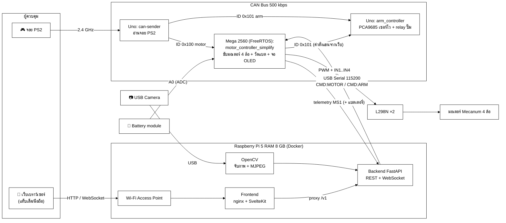
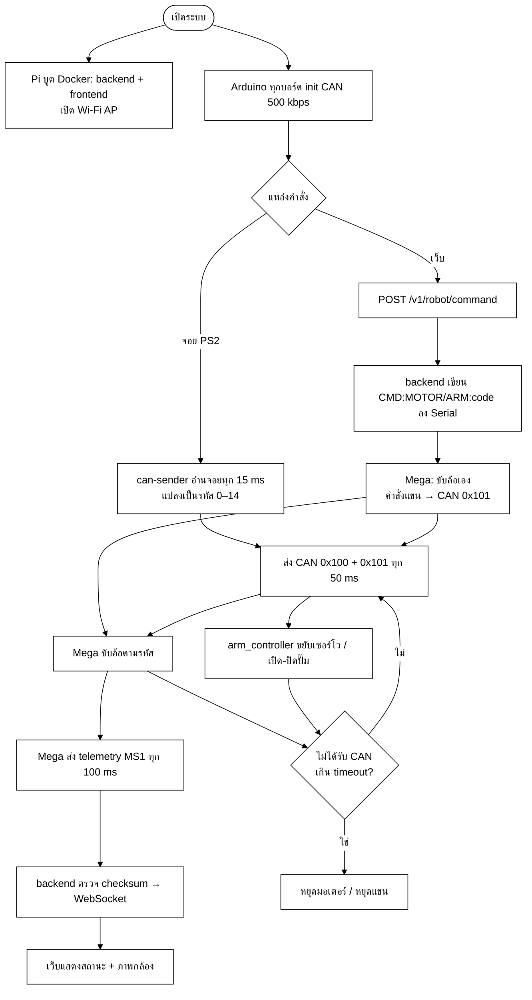
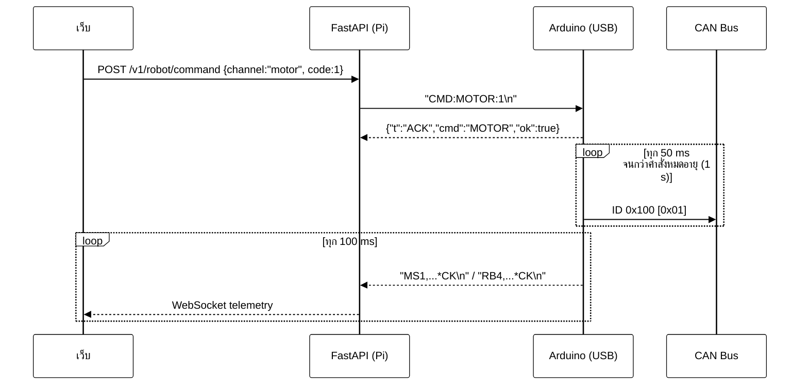
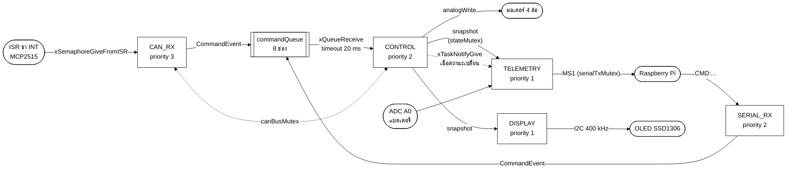
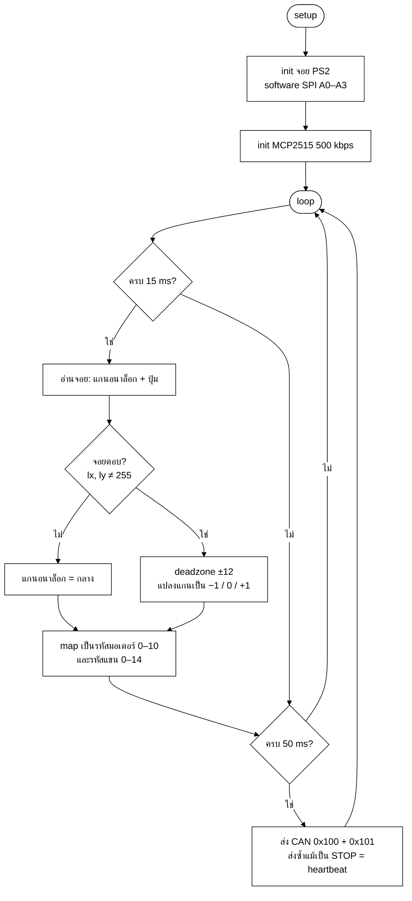
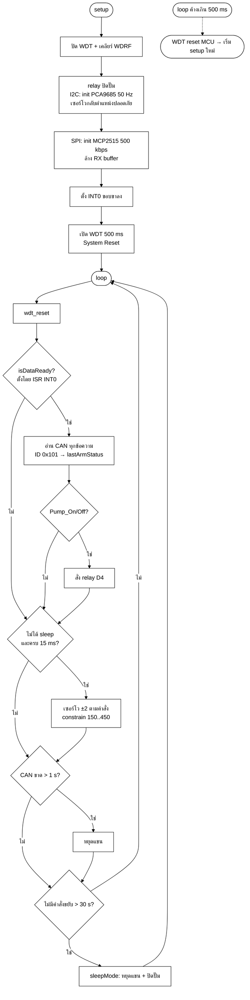
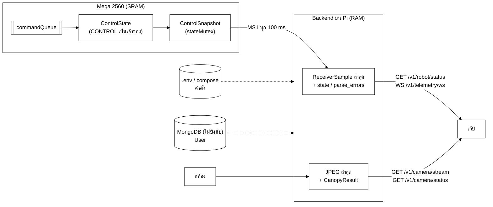

# โครงร่างรายงาน Durian Bot (Mini Project 240-319)

> ไฟล์นี้เป็น **โครงร่าง + เนื้อหาคร่าวๆ** สำหรับนำไปเรียบเรียงลงรายงาน Word
> เรียงหัวข้อตามโครงสร้างรายงานพัฒนาซอฟต์แวร์ 9 บท:
> บทนำ → การออกแบบระบบ → การพัฒนา → ข้อมูลจากเซนเซอร์ → การจัดเก็บข้อมูล → โค้ด → การทดสอบ → ปัญหาและวิธีแก้ → สรุป
>
> - ข้อความใน `[วงเล็บเหลี่ยม]` = ต้องเติมเอง (ชื่อ, รูปถ่าย, ผลทดลอง, ราคา)
> - แผนภาพเขียนด้วย Mermaid — เปิดใน VS Code/GitHub เพื่อดู หรือวางที่ <https://mermaid.live> แล้ว export เป็น PNG ไปแปะใน Word
> - Code ที่แปะเป็น **ส่วนสำคัญที่ตัดมา** พร้อมชื่อไฟล์อ้างอิง ไม่ใช่ทั้งไฟล์
> - **ภาคผนวก Z** ท้ายไฟล์เป็นบันทึกสำหรับทีม (สิ่งที่ยังขาดตามเนื้อหาวิชา + จุดที่ควรแก้) — ลบออกก่อนส่ง

---

## หน้าปก

```
รายงาน
Mini project วิชา 240-319 Embedded System Developer Module
หุ่นยนต์ฉีดพ่นยาในสวนทุเรียน (Durian Bot)

จัดทำโดย
[ชื่อ-สกุล]  รหัสนักศึกษา [xxxxxxxxxx]  Section [xx]
[ชื่อ-สกุล]  รหัสนักศึกษา [xxxxxxxxxx]  Section [xx]
[ชื่อ-สกุล]  รหัสนักศึกษา [xxxxxxxxxx]  Section [xx]

เสนอ
รศ.ดร. ปัญญยศ ไชยกาฬ
ผศ.ดร. วชรินทร์ แก้วอภิชัย
รศ.ดร. ทวีศักดิ์ เรืองพีระกุล

รายงานฉบับนี้เป็นส่วนหนึ่งของรายวิชา 240-319 ชุดวิชานักพัฒนาระบบฝังตัว
(Embedded System Developer Module)
คณะวิศวกรรมศาสตร์ สาขาวิศวกรรมคอมพิวเตอร์
มหาวิทยาลัยสงขลานครินทร์ วิทยาเขตหาดใหญ่
ภาคเรียนที่ [x] ปีการศึกษา [25xx]
```

## คำนำ

รายงานฉบับนี้เป็นส่วนหนึ่งของรายวิชา 240-319 ชุดวิชานักพัฒนาระบบฝังตัว (Embedded System Developer
Module) จัดทำขึ้นเพื่อศึกษา ออกแบบ และพัฒนาหุ่นยนต์ต้นแบบ "Durian Bot" สำหรับช่วยฉีดพ่นสารในสวนทุเรียน
โดยประยุกต์ใช้ความรู้ในรายวิชา ได้แก่ GPIO, PWM, ADC, Interrupt, Watchdog Timer, Sleep Mode, UART/USART,
SPI, I2C, CAN Bus, RTOS, EEPROM และการประมวลผลภาพด้วย OpenCV ร่วมกับ Raspberry Pi และเว็บแอปพลิเคชัน
เพื่อให้ผู้ควบคุมสั่งงานและติดตามสถานะหุ่นยนต์ได้จากระยะไกล

คณะผู้จัดทำหวังว่ารายงานฉบับนี้จะเป็นประโยชน์แก่ผู้อ่าน หากมีข้อผิดพลาดประการใด คณะผู้จัดทำขออภัยมา ณ ที่นี้

คณะผู้จัดทำ
[วันที่]

## บทคัดย่อ

การฉีดพ่นสารป้องกันโรคและแมลงในสวนทุเรียนยังพึ่งแรงงานคนที่ต้องแบกถังเดินพ่นเอง ทำให้ผู้พ่นเสี่ยงสัมผัสสารเคมี
ใช้แรงงานมาก และพ่นได้ไม่สม่ำเสมอ โครงงานนี้จึงพัฒนา **Durian Bot** หุ่นยนต์ต้นแบบขับเคลื่อนด้วยล้อ Mecanum 4 ล้อ
ที่บรรทุกถัง ปั๊ม และหัวฉีดปรับมุมได้ 3 แกน โดยมีวัตถุประสงค์ให้ผู้ควบคุมสั่งงานจากระยะไกลได้อย่างปลอดภัย

ระบบแบ่งเป็น 3 ชั้น ได้แก่ ชั้นผู้ใช้ (จอย PS2 และเว็บเบราว์เซอร์), ชั้นประมวลผลบน Raspberry Pi 5 (Wi-Fi Access Point,
FastAPI backend, เว็บ SvelteKit และ OpenCV) และชั้นควบคุมฮาร์ดแวร์ที่เป็น Arduino 4 บอร์ดสื่อสารกันผ่าน CAN Bus 500 kbps
firmware ประยุกต์ใช้ GPIO, PWM, ADC, External Interrupt, Watchdog Timer, UART, SPI, I2C, CAN Bus และ FreeRTOS
ส่วน Pi กับ Arduino คุยกันด้วย protocol บรรทัด ASCII ที่มี XOR checksum ทุกชั้นมี heartbeat และ timeout
เพื่อให้หุ่นหยุดเองเมื่อสัญญาณขาด กล้องบนตัวหุ่นสตรีมภาพสดขึ้นเว็บ พร้อมตรวจจับทรงพุ่มด้วย HSV color mask
เพื่อบอกผู้ควบคุมว่าหัวฉีดหันเข้าต้นแล้ว

ผลการทดสอบ: `[สรุปผลหลัก เช่น ขับเคลื่อนได้ครบ 10 ทิศ, หยุดเองภายใน x ms เมื่อถอดสาย CAN, ภาพสด x fps, ควบคุมผ่าน Wi-Fi ได้ไกล x เมตร]`

**คำสำคัญ:** หุ่นยนต์ฉีดพ่นสาร, CAN Bus, FreeRTOS, Raspberry Pi, OpenCV, ระบบฝังตัว

## สารบัญ

## สารบัญรูปและตาราง

> สร้างอัตโนมัติใน Word (References → Table of Contents / Insert Table of Figures) หลังจัดหัวข้อด้วย Heading Style

---

# บทที่ 1 บทนำ

## 1.1 ที่มาและความสำคัญของปัญหา

ทุเรียนเป็นพืชเศรษฐกิจสำคัญของภาคใต้ การดูแลสวนต้องฉีดพ่นสารป้องกันโรคและแมลง (เช่น โรครากเน่าโคนเน่า,
หนอนเจาะผล) อย่างสม่ำเสมอ ในทางปฏิบัติเกษตรกรต้องแบกถังหรือลากสายพ่นเดินไปตามแถวต้นเอง ซึ่ง

- เสี่ยงสัมผัสสารเคมีโดยตรงทั้งทางผิวหนังและการหายใจ
- ใช้แรงงานและเวลามาก โดยเฉพาะสวนขนาดใหญ่ที่แรงงานขาดแคลน
- ปริมาณการพ่นไม่สม่ำเสมอขึ้นกับผู้พ่นแต่ละคน

คณะผู้จัดทำจึงพัฒนา **Durian Bot** หุ่นยนต์ขับเคลื่อน 4 ล้อที่ติดตั้งปั๊มและหัวฉีดปรับมุมได้ ผู้ควบคุมบังคับจาก
ระยะไกลได้ 2 ช่องทาง คือ จอย PS2 ผ่าน CAN Bus และหน้าเว็บผ่าน Wi-Fi ของ Raspberry Pi บนตัวหุ่น พร้อม
ภาพจากกล้องและสถานะของหุ่นแบบเวลาจริง ช่วยให้ผู้ควบคุมอยู่ห่างจากละอองสารเคมี

## 1.2 ปัญหาที่ต้องการแก้ไข

1. **ผู้พ่นสัมผัสละอองสารเคมีโดยตรง** — แก้โดยให้ควบคุมจากระยะไกลด้วยจอย PS2 หรือเว็บ พร้อมภาพสดจากกล้องบนตัวหุ่น
2. **ต้องแบกถังและเดินพ่นเอง ใช้แรงงานมาก** — หุ่นบรรทุกถังและปั๊มแทน ขับด้วยล้อ Mecanum ที่เคลื่อนที่ได้ทุกทิศ
   เหมาะกับทางแคบระหว่างแถวต้น
3. **ปรับทิศการพ่นยาก ปริมาณพ่นไม่สม่ำเสมอ** — หัวฉีด 3 แกนขับด้วยเซอร์โว และ OpenCV แจ้งว่าหัวฉีดหันเข้าทรงพุ่มแล้วหรือยัง
4. **หุ่นอาจเดินต่อหรือพ่นค้างเมื่อสัญญาณหลุดหรือโปรแกรมค้าง** — มี heartbeat และ timeout ทุกชั้น, Watchdog Timer และปุ่ม E-STOP บนเว็บ
5. **ผู้ควบคุมไม่รู้สถานะหุ่น** (แบตใกล้หมด, ลิงก์หลุด) — ส่ง telemetry แรงดันแบตและสถานะลิงก์ขึ้นเว็บ และแสดงบนจอ OLED ที่ตัวหุ่น

### 1.2.1 วัตถุประสงค์

1. เพื่อออกแบบและพัฒนาหุ่นยนต์ต้นแบบสำหรับฉีดพ่นสารในสวนทุเรียนที่ควบคุมจากระยะไกลได้
2. เพื่อประยุกต์ใช้การสื่อสารระหว่างไมโครคอนโทรลเลอร์หลายบอร์ดผ่าน CAN Bus, SPI, I2C และ UART
3. เพื่อออกแบบระบบความปลอดภัย (fail-safe) เช่น Watchdog Timer และการหยุดอัตโนมัติเมื่อสัญญาณขาด
4. เพื่อพัฒนาเว็บแดชบอร์ดบน Raspberry Pi สำหรับสั่งงาน แสดงภาพจากกล้อง (OpenCV) และสถานะหุ่นยนต์

### 1.2.2 ขอบเขตของโครงงาน

- เป็นการจำลองตัวต้นแบบขนาดเล็ก โดยใช้ความรู้ในรายวิชา Embedded System Developer Module
- ใช้น้ำแทนสารเคมีจริงในการทดสอบ
- ควบคุมแบบ manual (ผู้ควบคุมบังคับ) ยังไม่มีการนำทางอัตโนมัติ
- ระยะการควบคุมผ่านเว็บจำกัดตามระยะ Wi-Fi Access Point ของ Raspberry Pi

## 1.3 อุปกรณ์ทั้งหมดที่ใช้ในงาน

### 1.3.1 Hardware

> อธิบายอุปกรณ์แต่ละตัว + รูปประกอบ (ภาพ pinout) จำนวนและราคาอยู่ในภาคผนวก ก

- **Arduino Uno R3** — ATmega328P 16 MHz, Flash 32 KB, SRAM 2 KB, EEPROM 1 KB, Digital I/O 14 ขา (PWM 6), Analog 6 ขา,
  USART 1 ชุด, SPI, I2C (TWI) ใช้เป็นบอร์ดจอย (`can-sender`), บอร์ดแขน/ปั๊ม (`arm_controller`) และ bridge (`can_receiver`)
- **Arduino Mega 2560** — ATmega2560 16 MHz, Flash 256 KB, SRAM 8 KB, EEPROM 4 KB, Digital I/O 54 ขา (PWM 15), Analog 16 ขา,
  USART 4 ชุด ใช้ขับมอเตอร์ 4 ล้อ (`motor_controller_simplify`) และต่อ USB กับ Pi
- **Raspberry Pi 5 (RAM 8 GB)** — CPU Cortex-A76 4 คอร์ 2.4 GHz, RAM LPDDR4X 8 GB, Wi-Fi 5 dual-band, USB 3.0 ×2 + USB 2.0 ×2,
  ใช้ไฟ USB-C 5V 5A (27 W) ทำหน้าที่เป็น Wi-Fi Access Point, รัน FastAPI + เว็บด้วย Docker และอ่านกล้อง USB ด้วย OpenCV
- **MCP2515 CAN Module** — CAN controller แบบ SPI + transceiver TJA1050, คริสตัล 8 MHz, มีขา INT แจ้งเมื่อมีข้อความเข้า
  เป็นสายสื่อสารหลักระหว่างบอร์ด Arduino
- **PCA9685** — ตัวสร้าง PWM 16 ช่อง ความละเอียด 12 bit ผ่าน I2C (address 0x40) ใช้คุมเซอร์โว 3 แกนของหัวฉีด
- **จอย PS2 ไร้สาย** — สื่อสารแบบ synchronous serial คล้าย SPI (LSB first) มีแกนอนาล็อก 2 ข้าง + ปุ่ม 16 ปุ่ม เป็นช่องทางควบคุมหลักในสวน
- **Motor Driver L298N** — Dual H-bridge ขับมอเตอร์ DC 2 ตัวต่อโมดูล, Vs 5–35 V, กระแส 2 A ต่อช่อง (peak 3 A), แรงดันตก ~2 V,
  คุมทิศด้วย IN1–IN4 และความเร็วด้วย PWM ที่ ENA/ENB ใช้ 2 บอร์ดขับล้อ Mecanum 4 ล้อ (หัวข้อ 6.5.1)
- **Relay Module + ปั๊มน้ำ DC** — relay แบบ active LOW แยกวงจรกำลังของปั๊มออกจาก MCU ใช้เปิด/ปิดการฉีดพ่น
- **Servo Motor** — สั่งมุมด้วยความกว้างพัลส์ ~0.5–2.5 ms ที่คาบ 20 ms (50 Hz) ใช้ปรับมุมหัวฉีด (ซ้าย-ขวา / หน้า-หลัง / ยกหัว)
- **USB Webcam** — UVC camera อ่านผ่าน V4L2 ส่งภาพสดขึ้นหน้าเว็บ
- **จอ OLED SSD1306 128×64** — จอ monochrome 0.96" ผ่าน I2C (address 0x3C) แสดงแบต / คำสั่งล้อ / คำสั่งแขน / แหล่งคำสั่งบนตัวหุ่น
- **Battery voltage sensor** — ตัวแบ่งแรงดัน 30 kΩ / 7.5 kΩ (อัตราส่วน 5:1) วัดได้ 0–25 V ให้ออก 0–5 V เข้า ADC ที่ A0 ของ Mega

`[ใส่รูปภาพที่ 1–14: รูปอุปกรณ์ / pinout แต่ละตัว]`

### 1.3.2 Software

- **Arduino IDE 2.x** — เขียน, compile และ upload firmware ทั้ง 4 บอร์ด
- **Raspberry Pi OS 64-bit (Bookworm)** — ระบบปฏิบัติการบน Pi 5 ตั้งเป็น Wi-Fi Access Point ด้วย NetworkManager (`scripts/setup-rpi-ap.sh`)
- **Docker + Docker Compose** — รัน backend และ frontend เป็น container บน Pi, **nginx 1.27** เสิร์ฟหน้าเว็บและ proxy `/v1` ไปยัง backend
- **Python 3.12 + Poetry** สำหรับ backend และ **Node.js 22 + pnpm** สำหรับ build frontend
- **Git / GitHub** จัดการเวอร์ชันโค้ดของทีม, **VS Code + Mermaid** เขียนโค้ดและแผนภาพ

### 1.3.3 Library

**Firmware**

- `mcp_can` — ควบคุม MCP2515 ผ่าน SPI
- `PS2X_lib` (อยู่ใน repo) + `PS2_Controller.cpp` — อ่านจอย PS2 แบบ software SPI
- FreeRTOS (Arduino_FreeRTOS โดย feilipu) — task, queue, semaphore, mutex บน Mega 2560
- `U8g2` — วาดจอ OLED แบบ page buffer
- `Wire`, `SPI` ของ Arduino core และ avr-libc (`avr/io.h`, `avr/interrupt.h`, `avr/wdt.h`) สำหรับเข้าถึง register, ISR และ Watchdog
- `PCA9685_Control` — driver PCA9685 ที่เขียนเองระดับ register แทนไลบรารี Adafruit

**Backend**

- FastAPI + Uvicorn (REST และ WebSocket), Pydantic / pydantic-settings (ตรวจรูปแบบข้อมูล, อ่านค่าตั้งจาก `.env`)
- pyserial (USB serial), opencv-python-headless + NumPy (กล้องและประมวลผลภาพ), loguru (log)
- Beanie + PyMongo และ python-jose — MongoDB และ JWT สำหรับระบบ login (ใช้เมื่อตั้ง `DATABASE_URI` — ดูบทที่ 5)
- pytest + pytest-asyncio สำหรับ unit test

**Frontend**

- SvelteKit 2 + Svelte 5 + TypeScript, Tailwind CSS 4, bits-ui (shadcn-svelte), lucide icons
- @tanstack/svelte-query และ openapi-fetch / openapi-typescript — เรียก API แบบมี type ตรงกับ backend

---

# บทที่ 2 การออกแบบระบบ

## 2.1 ภาพรวมสถาปัตยกรรมและองค์ประกอบของระบบ

ระบบแบ่งเป็น 3 ชั้น

1. **ชั้นผู้ใช้** — จอย PS2 (ในสวน) และเว็บเบราว์เซอร์บนแท็บเล็ต/มือถือ
2. **ชั้นประมวลผลบนตัวหุ่น (Raspberry Pi)** — Wi-Fi AP, FastAPI backend, เว็บ frontend, อ่านกล้องด้วย OpenCV
3. **ชั้นควบคุมฮาร์ดแวร์ (Arduino บน CAN Bus)** — ขับล้อ, ขยับหัวฉีด, เปิด/ปิดปั๊ม



`[รูปภาพที่ x: แผนภาพการเชื่อมต่อระบบโดยภาพรวม]`

> **หมายเหตุสถาปัตยกรรม** — มี 2 รูปแบบการต่อ USB กับ Pi
>
> - **โหมด A (ปัจจุบัน)** — เสียบ Mega `motor_controller_simplify` กับ Pi: Mega ขับล้อเองตาม `CMD:MOTOR`
>   และส่งต่อ `CMD:ARM` เข้า CAN `0x101` ไปยัง arm_controller
> - **โหมด B (bridge)** — เสียบ Uno `can_receiver` กับ Pi: รับ `CMD:...` จาก Pi แล้วส่งต่อเข้า CAN `0x100` และคุมแขน/ปั๊มเอง

### 2.1.1 Schematic Diagram

`[ใส่รูป schematic จาก Fritzing/KiCad และรูปต่อวงจรจริง]`

### 2.1.2 ตารางการต่อขา

**ตารางที่ x: Uno — can-sender (จอย PS2)**

| อุปกรณ์ | ขา Uno |
| --- | --- |
| PS2 DAT / CMD / ATT / CLK | A0 / A1 / A2 / A3 |
| MCP2515 CS | D10 |
| MCP2515 SI / SO / SCK | D11 / D12 / D13 |

**ตารางที่ x: Uno — arm_controller**

| อุปกรณ์ | ขา Uno |
| --- | --- |
| MCP2515 CS | D10 |
| MCP2515 INT | D2 (INT0) |
| MCP2515 SI / SO / SCK | D11 / D12 / D13 |
| PCA9685 SDA / SCL | A4 / A5 |
| Relay ปั๊ม IN (active LOW) | D4 |
| PCA9685 ช่อง 0 / 1 / 2 | เซอร์โว ซ้าย-ขวา / หน้า-หลัง / ยกหัวฉีด |

**ตารางที่ x: Mega 2560 — motor_controller_simplify**

| อุปกรณ์ | ขา L298N | ขา Mega | หมายเหตุ |
| --- | --- | --- | --- |
| L298N #1 ช่อง A → M1 หน้าซ้าย | ENA / IN1 / IN2 | D5 / D22 / D23 | ENA = PWM (Timer3) |
| L298N #1 ช่อง B → M2 หน้าขวา | ENB / IN3 / IN4 | D6 / D24 / D25 | ENB = PWM (Timer4) |
| L298N #2 ช่อง A → M3 หลังซ้าย | ENA / IN1 / IN2 | D7 / D30 / D31 | ENA = PWM (Timer4) |
| L298N #2 ช่อง B → M4 หลังขวา | ENB / IN3 / IN4 | D8 / D32 / D33 | ENB = PWM (Timer4) |
| L298N ทั้ง 2 บอร์ด | GND | GND | ต้องต่อ GND ร่วม |
| MCP2515 | CS / SO / SI / SCK | D53 / D50 / D51 / D52 | SPI |
| MCP2515 INT (ไม่บังคับ) | – | D2 (INT4) | ปลุก task CAN_RX |
| Battery module S | – | A0 | GND ร่วม |
| OLED SSD1306 SDA / SCL | – | D20 / D21 | hardware I2C, VCC 5V, GND ร่วม |

ตำแหน่งล้ออนุมานจากตารางทิศทาง (SPIN_LEFT = M1, M3 ถอย / M2, M4 เดินหน้า) — ถ้าล้อไหนกลับทาง ให้สลับสาย OUT1/OUT2 ที่ L298N

### 2.1.3 ตาราง CAN ID และรหัสคำสั่ง

- `0x100` — จาก can-sender (หรือ can_receiver ในโหมด B) ไปยัง Mega: 1 byte รหัสมอเตอร์ 0–10
- `0x101` — จาก can-sender และ Mega (คำสั่งแขนจากเว็บ) ไปยัง arm_controller: 1 byte รหัสแขน 0–8, 11–14

| รหัส | มอเตอร์ | แขน/หัวฉีด | ปุ่มจอย PS2 |
| ---: | --- | --- | --- |
| 0 | STOP | STOP | ปล่อยจอย |
| 1 / 2 | FORWARD / BACKWARD | เซอร์โว 1 −/+ | D-pad ↑↓, analog ซ้าย / analog ขวา ↑↓ |
| 3 / 4 | LEFT / RIGHT | เซอร์โว 0 −/+ | analog ซ้าย / analog ขวา ←→ |
| 5–8 | เฉียง 4 ทิศ | (ใช้เซอร์โว 0) | analog ซ้ายแนวทแยง |
| 9 / 10 | SPIN_LEFT / SPIN_RIGHT | – | D-pad ← → |
| 11 / 12 | – | PUMP_ON / PUMP_OFF | □ / ○ |
| 13 / 14 | – | HEAD_UP / HEAD_DOWN | △ / ✕ |

### 2.1.4 ส่วน Raspberry Pi และเว็บ

- **Network** — Pi เป็น Wi-Fi Access Point (`scripts/setup-rpi-ap.sh`) ผู้ใช้เชื่อม Wi-Fi ของหุ่นแล้วเปิด `http://<ip ของ Pi>/`
- **Deploy** — Docker Compose 2 container: `frontend` (nginx พอร์ต 80) และ `backend` (FastAPI พอร์ต 9000)
- **API** — `POST /v1/robot/command`, `GET /v1/robot/status`, `GET /v1/camera/stream` (MJPEG), `WS /v1/telemetry/ws`
- **หน้าเว็บ** — `/` operator console, `/control` ปุ่มสั่งงาน + E-STOP, `/monitor` แสดง telemetry

`[รูปภาพที่ x: หน้าเว็บ /control และ /monitor]`

## 2.2 ลำดับขั้นตอนและการไหลของข้อมูล

ข้อมูลในระบบไหล 4 เส้นทาง

1. **คำสั่งจากจอย** — จอย PS2 → can-sender → CAN `0x100`/`0x101` → Mega / arm_controller ทุก 50 ms
2. **คำสั่งจากเว็บ** — เว็บ → FastAPI → USB serial `CMD:...` → Mega ขับล้อ และส่ง CAN `0x101` ต่อให้ arm_controller
   ทุก 200 ms ระหว่างกดค้าง
3. **Telemetry** — Mega → USB serial `MS1` → FastAPI → เว็บ (REST poll / WebSocket) ทุก 100 ms หรือทันทีเมื่อสถานะเปลี่ยน
4. **ภาพ** — USB Webcam → OpenCV → MJPEG → `` บนเว็บ ที่ 15 fps (ตั้งค่าได้)

### 2.2.1 Flowchart การทำงานโดยรวม



### 2.2.2 การออกแบบ Protocol ระหว่าง Raspberry Pi กับ Arduino (USB Serial)

**ตั้งค่า:** 115200 baud, 8N1, ข้อความ ASCII 1 บรรทัดต่อ 1 frame จบด้วย `\n`

#### 2.2.2.1 Pi → Arduino (คำสั่ง)

```text
CMD:MOTOR:<0..10>     สั่งมอเตอร์ (backend เปิดให้ 0..8)
CMD:ARM:<0..8,11..14> สั่งแขน/ปั๊ม
CMD:ALL:0  หรือ STOP  หยุดทุกอย่าง
PING                  ตรวจลิงก์ → ตอบ {"t":"PONG"}
```

คำสั่งจาก Serial **หมดอายุใน 1000 ms** ถ้าไม่ได้รับซ้ำ → หยุดเองเมื่อสาย USB หลุด หรือ backend ค้าง

#### 2.2.2.2 Arduino → Pi (Telemetry)

```text
MS1,motor,motor_alive,arm,arm_alive,battery_mV,battery_adc,pwm,age_ms,seq*CK   (motor_controller_simplify, ทุก 100 ms)
RB4,motor,motor_alive,arm,arm_alive,mV,adc,ax1,ax2,ax3,pump,seq*CK   (can_receiver)
```

`MS1` คือ prefix ของบรรทัด telemetry จาก Mega ย่อมาจาก **M**otor controller **S**implify รุ่นที่ **1**
แยกชื่อจาก `MC1` (Mega รุ่นเต็ม 20 field) เพื่อให้ backend รู้ว่าต้องแยก field แบบไหน
ความหมายของแต่ละ field ดูตารางใน `README.md` หัวข้อ Protocol

**เหตุผลการออกแบบ** (เขียนอธิบายในรายงาน)

- **Prefix** (`MS1`, `RB4`) — กรองขยะที่ bootloader พิมพ์ตอน reset และบอกเวอร์ชันของรูปแบบข้อมูล
- **CSV แทน JSON** — `snprintf` ครั้งเดียวจบ ไม่ต้องใช้ไลบรารีเพิ่ม ประหยัด SRAM 2 KB ของ Uno
- **XOR checksum** — ตรวจข้อมูลเพี้ยนจากสัญญาณรบกวน (มอเตอร์/ปั๊มสร้าง noise สูง) บรรทัดที่ checksum ผิดจะถูกทิ้ง
- **seq** — ตัวนับ frame ให้ backend รู้ว่ามี frame หาย
- **age_ms / alive** — บอกว่าคำสั่งล่าสุดเก่าแค่ไหน ใช้แสดงสถานะลิงก์บนเว็บ



## 2.3 การออกแบบขั้นตอนประมวลผล

### 2.3.1 ลำดับความสำคัญของแหล่งคำสั่งและ Fail-safe

ระบบมีผู้สั่ง 2 ทาง (จอยและเว็บ) และทุกช่องทางอาจหลุดได้ จึงออกแบบตามหลัก 2 ข้อ

1. **คำสั่งจากเว็บชนะจอยชั่วคราว** — จอยส่ง STOP เป็น heartbeat ตลอดเวลา ถ้าให้สิทธิ์เท่ากัน เว็บจะสั่งไม่ได้เลย
   บอร์ดที่รับ serial (Mega หรือ can_receiver) จึงให้คำสั่ง serial ชนะ และคืนสิทธิ์ให้จอยเมื่อคำสั่ง serial หมดอายุ
2. **ไม่มีคำสั่งใหม่ = หยุด** — ทุกคำสั่งมีอายุ ผู้ส่งต้องส่งซ้ำเรื่อยๆ ถ้าสายหลุดหรือโปรแกรมฝั่งส่งค้าง ฝั่งรับจะหยุดเอง

ค่าเวลาที่ใช้ในแต่ละชั้น

- **เว็บ** ส่งคำสั่งซ้ำทุก 200 ms ระหว่างกดค้าง และส่ง STOP ทันทีที่ปล่อย ส่วน **จอย** ส่ง heartbeat บน CAN ทุก 50 ms แม้คำสั่งเป็น STOP
- **Mega** ทิ้งคำสั่งจาก Serial ที่ไม่ได้รับซ้ำเกิน 1 s (หยุดล้อแล้วคืนสิทธิ์ให้จอย) และคำสั่งจาก CAN ที่เกิน 300 ms (หยุดล้อ)
- **arm_controller** หยุดแขนเมื่อ CAN ขาดเกิน 1 s, เข้า software sleep (หยุดแขน + ปิดปั๊ม) เมื่อไม่มีคำสั่งขยับ 30 s
  และถ้าโปรแกรมค้างเกิน 500 ms Watchdog จะ reset บอร์ด → ปิดปั๊ม เซอร์โวกลับตำแหน่งปลอดภัย
- **E-STOP** บนเว็บส่ง `CMD:ALL:0` ค้าง STOP ไว้ 1 s และส่ง `PUMP_OFF` หยุดทั้งล้อ แขน และปั๊ม
- **backend** แสดงสถานะ `disconnected` บนเว็บเมื่อไม่ได้รับ telemetry เกิน 1.5 s

### 2.3.2 การออกแบบ Task บน Mega 2560 (FreeRTOS)

บอร์ดนี้ทำงานหลายอย่างพร้อมกันที่สุดในระบบ (รับ CAN, รับ Serial, ขับมอเตอร์, จับเวลา timeout, ส่ง heartbeat แขน,
อ่านแบต, ส่ง telemetry, วาดจอ OLED) และมี SRAM 8 KB พอสำหรับหลาย task จึงเลือกใช้ FreeRTOS ที่บอร์ดนี้
(Uno มี 2 KB ไม่พอ และ `arm_controller` ใช้ Watchdog เป็น reset timer ซึ่งชนกับ tick ของ FreeRTOS)



| Task | Priority | Stack (byte) | งาน |
| --- | ---: | ---: | --- |
| `CAN_RX` | 3 | 256 | รอ semaphore จาก ISR หรือ timeout 1 tick → อ่าน CAN ทุกข้อความ → ส่งเข้า queue |
| `CONTROL` | 2 | 256 | เจ้าของ state คำสั่งแต่ผู้เดียว — ดึง queue, เลือกแหล่งคำสั่ง, เช็ก timeout, ขับมอเตอร์ |
| `SERIAL_RX` | 2 | 320 | อ่านบรรทัดจาก Pi → ส่งเข้า queue → ตอบ ACK/ERR |
| `TELEMETRY` | 1 | 448 | อ่านแบต (task เดียวที่ใช้ ADC) + ส่ง `MS1` ทุก 100 ms หรือทันทีเมื่อถูก notify |
| `DISPLAY` | 1 | 384 | วาดจอ OLED ทุก 250 ms (task เดียวที่ใช้ I2C จึงไม่ต้องมี mutex ของบัส) |

**หลักการออกแบบ:** ให้ `CONTROL` เป็น task เดียวที่แก้ state คำสั่ง task อื่นส่งข้อมูลเข้ามาผ่าน queue เท่านั้น
จึงไม่มีตัวแปรที่หลาย task เขียนพร้อมกัน (ไม่เกิด race condition) ใช้ mutex เฉพาะกับทรัพยากรที่ต้องแชร์จริง
(SPI ของ MCP2515, Serial, snapshot สำหรับ telemetry)

### 2.3.3 Flowchart บอร์ด can-sender



### 2.3.4 Flowchart บอร์ด arm_controller (Interrupt + Watchdog + Sleep)



### 2.3.5 การออกแบบการประมวลผลภาพ (ตรวจจับทรงพุ่ม)

- `cv2.VideoCapture` เปิดกล้องผ่าน V4L2, ตั้ง FOURCC เป็น MJPG ให้กล้องบีบอัดเองลดภาระ USB/CPU
- `cv2.imencode(".jpg", frame, [IMWRITE_JPEG_QUALITY, 80])` → ส่งเป็น MJPEG (`multipart/x-mixed-replace`) ให้ `` บนเว็บ
- **ตรวจจับทรงพุ่มทุเรียน** (`backend/apiapp/infrastructure/vision.py`) ทุกเฟรมก่อน encode:
  1. `GaussianBlur` ลด noise ของเซนเซอร์กล้อง
  2. `cvtColor(BGR2HSV)` — HSV แยก "สี" (Hue) ออกจาก "ความสว่าง" (Value) จึงทนแดด/เงาได้ดีกว่า RGB
  3. `inRange` เลือกสีเขียว H 35–85, S ≥ 60, V ≥ 40 (OpenCV ใช้ H 0–179) → ได้ mask ขาวดำ
  4. `morphologyEx` OPEN (erode → dilate) ลบจุดเล็ก / CLOSE (dilate → erode) อุดช่องระหว่างใบ
  5. `countNonZero / ขนาดภาพ` = สัดส่วนพื้นที่ใบ, `findContours` + `boundingRect` หาพุ่มที่ใหญ่ที่สุด
  6. วาดกรอบ + ข้อความ `CANOPY 42% READY` ลงบนภาพ — ถ้าสัดส่วน ≥ `CANOPY_READY_RATIO` (25%) ถือว่าหัวฉีดหันเข้าต้นแล้ว
- ระบบแค่ **แจ้งผู้ควบคุม** ไม่เปิดปั๊มเอง (การพ่นสารอัตโนมัติต้องมีระบบความปลอดภัยเพิ่ม)

## 2.4 การออกแบบส่วนติดต่อผู้ใช้

### 2.4.1 หน้าเว็บ

เว็บมี 4 หน้า ได้แก่ `/` Operator Console (ภาพรวมสถานะและลิงก์ไปหน้าอื่น), `/control` (ภาพสดจากกล้อง, ปุ่มขับ 8 ทิศ
และหมุนตัว, ปุ่มแขน 4 ทิศ + หัวฉีดขึ้น/ลง, ปั๊ม ON/OFF, E-STOP, แรงดันแบต, สถานะลิงก์), `/monitor` (telemetry แบบเวลาจริง
ผ่าน WebSocket) และ `/login` (ใช้เมื่อเปิดระบบผู้ใช้ — บทที่ 5)

หลักการออกแบบ

- **ใช้บนแท็บเล็ต/มือถือในสวน** — ปุ่มใหญ่ กดด้วยนิ้วได้ง่าย
- **กดค้างเพื่อขับ (hold-to-drive)** — ปล่อยนิ้วเมื่อไหร่หุ่นหยุดทันที ทำหน้าที่เหมือน dead-man switch
  ถ้านิ้วเลื่อนออกนอกปุ่ม สลับแท็บ หรือหน้าจอดับ ก็ถือว่าปล่อย
- **ปั๊มกดครั้งเดียว** แยกปุ่ม ON / OFF ชัดเจน ไม่ต้องกดค้างตลอดการพ่น
- **E-STOP** แยกสีและตำแหน่งให้เห็นชัด หยุดทั้งล้อ แขน และปั๊มพร้อมกัน
- **สถานะต้องเห็นตลอด** — สถานะลิงก์ (streaming / connecting / disconnected), อายุ frame ล่าสุด และแรงดันแบต
- **ภาพสดมีข้อความ `CANOPY xx% READY`** ซ้อนบนภาพ ผู้ควบคุมรู้ได้ทันทีว่าหัวฉีดหันเข้าทรงพุ่มแล้ว

`[รูปภาพที่ x: หน้าเว็บ /control และ /monitor]`

### 2.4.2 จอ OLED บนตัวหุ่น

ให้ผู้ที่อยู่ข้างหุ่นเห็นสถานะโดยไม่ต้องเปิดเว็บ อัปเดตทุก 250 ms

```text
┌────────────────────────────┐
│DURIAN BOT   SRC:WEB        │   แหล่งคำสั่งที่คุมล้อ: WEB / JOY / ---
│BAT: 12.05 V                │
│M: FWD                      │   คำสั่งล้อ
│A: PUMP ON                  │   คำสั่งแขน/ปั๊ม
│PWM: 150/255                │   duty ที่ส่งให้ L298N
└────────────────────────────┘
```

### 2.4.3 จอย PS2

ปุ่มแต่ละปุ่มแปลงเป็นรหัสคำสั่งตามตารางในหัวข้อ 2.1.3 — analog ซ้ายขับล้อ, D-pad ซ้าย/ขวาหมุนตัว,
analog ขวาหมุนหัวฉีด, △ / ✕ ยกหัวฉีดขึ้น/ลง, □ / ○ เปิด/ปิดปั๊ม

---

# บทที่ 3 การพัฒนา

## 3.1 ภาษา เครื่องมือ และสภาพแวดล้อมที่ใช้พัฒนา

- **Firmware** — ภาษา C/C++ (Arduino core + avr-libc) พัฒนาด้วย Arduino IDE 2.x รันบน Arduino Uno R3 ×3 และ Mega 2560 ×1
- **Backend** — Python 3.12 จัดการแพ็กเกจด้วย Poetry ทดสอบด้วย pytest รันใน Docker (`python:3.12-slim-bookworm`) บน Pi 5
- **Frontend** — TypeScript + Svelte 5 ใช้ pnpm, Vite, ESLint, Prettier build ด้วย `node:22-alpine` แล้วเสิร์ฟด้วย `nginx:1.27-alpine`
- **Deploy** — Docker Compose และ `scripts/deploy-to-pi.sh` บน Raspberry Pi OS 64-bit (Bookworm)

- ค่าตั้งของ backend ทั้งหมดอ่านจาก environment / `.env` (`backend/apiapp/core/config.py`) เช่น พอร์ต serial, ขนาดภาพ, เกณฑ์ทรงพุ่ม
  จึงสลับระหว่างเครื่องพัฒนา (ใช้ mock) กับบน Pi (ใช้ serial และกล้องจริง) ได้โดยไม่ต้องแก้โค้ด
- ค่าคงที่ของ firmware (ขา, CAN ID, timeout) รวมไว้ใน `robot_config.h` และส่วนหัวของไฟล์ `.ino` แต่ละบอร์ด
- Pi 5 RAM 8 GB build image ของ frontend และ backend บนตัวเองได้ (ดูปัญหาเรื่อง Pi 3 ในบทที่ 8)

## 3.2 โครงสร้างซอฟต์แวร์และหน้าที่ของส่วนประกอบหลัก

ฝั่ง **firmware** มี 4 บอร์ด

- `can-sender` (Uno) — อ่านจอย PS2 แปลงเป็นรหัสคำสั่ง แล้วส่ง CAN heartbeat ทุก 50 ms
- `arm_controller` (Uno) — รับ CAN `0x101` ขยับเซอร์โว 3 แกนผ่าน PCA9685 และเปิด/ปิด relay ปั๊ม
- `motor_controller_simplify` (Mega 2560) — FreeRTOS 5 task: รับ CAN และ Serial, ขับล้อ 4 ล้อ, วัดแบต, ส่ง telemetry `MS1`,
  วาดจอ OLED และส่งต่อคำสั่งแขนจากเว็บเข้า CAN
- `can_receiver` (Uno) — bridge USB ↔ CAN ที่คุมแขน/ปั๊มเองได้ ใช้แทน Mega ในโหมด B

ฝั่ง **Raspberry Pi** แบ่งเป็น `receiver_canbus.py` (thread อ่าน serial, ตรวจ checksum, เก็บ sample ล่าสุด, เขียนคำสั่งลง serial),
`camera_service.py` + `vision.py` (อ่านกล้อง ตรวจทรงพุ่ม สตรีม MJPEG) และ `modules/robot`, `camera`, `telemetry`
ที่เปิดเป็น REST / WebSocket API ตามรูปแบบ router → use_case → schemas
ส่วน **frontend** แยกตาม feature (`robot`, `camera`, `telemetry`) ทำหน้าที่เรียก API, ปุ่มกดค้าง และแสดงภาพกับสถานะ

## 3.3 การพัฒนาฟังก์ชันหลักและการเชื่อมต่อระหว่างส่วนประกอบ

### 3.3.1 จุดเชื่อมต่อระหว่างส่วนประกอบ

- **จอย PS2 → can-sender** — สัญญาณไร้สาย 2.4 GHz เข้า receiver ที่อ่านด้วย software SPI (`PS2_Controller.cpp`)
- **can-sender → Mega, arm_controller** และ **Mega → arm_controller** — CAN 500 kbps, ID `0x100`/`0x101` ข้อมูล 1 byte
- **Pi ↔ Mega** — USB serial 115200 8N1: `CMD:...` ลง, `MS1,...*CK` และ ACK แบบ JSON ขึ้น (`receiver_canbus.py` ↔ `motor_controller_simplify.ino`)
- **Mega → L298N** — GPIO IN1–IN4 + PWM ที่ ENA/ENB (`applyCommand()` / `setMotor()`)
- **arm_controller → PCA9685** และ **Mega → OLED** — I2C (`PCA9685_Control.cpp`, `oled_display.cpp` ที่ 400 kHz)
- **เว็บ ↔ backend** — HTTP / WebSocket ผ่าน nginx รูปแบบ JSON (`robot/api.ts` ↔ `robot/router.py`)
- **กล้อง → backend → เว็บ** — USB UVC (V4L2) เข้า, HTTP MJPEG ออก (`camera_service.py`)

### 3.3.2 ลำดับการพัฒนา

`[ปรับให้ตรงกับลำดับที่ทีมทำจริง]`

1. เริ่มจาก firmware บอร์ดเดียว (`Robot_main`) ที่อ่านจอยและขับทุกอย่างเอง → แยกเป็นหลายบอร์ดคุยกันบน CAN Bus
   (`can-sender`, `arm_controller`, บอร์ดมอเตอร์) เพื่อลดสายไฟและแยกงานให้แต่ละบอร์ดชัดเจน
2. บอร์ดมอเตอร์: super loop + encoder (`motor_controller_mega`) → ทดลอง FreeRTOS (`motor_controller_rtos`)
   → รุ่นปัจจุบัน `motor_controller_simplify` (FreeRTOS 5 task + แบต + OLED + รับคำสั่งจาก Serial)
3. Protocol serial: `RB1`–`RB4` (can_receiver) → `MC1` (Mega รุ่นเต็ม) → `MS1` (Mega รุ่นปัจจุบัน) โดย backend รองรับทุกรุ่นด้วย prefix
4. Backend: telemetry แบบ mock → อ่าน serial จริง, เพิ่ม API สั่งงาน, สตรีมกล้อง แล้วจึงเพิ่มตรวจจับทรงพุ่ม
5. Frontend: ปุ่มกดครั้งเดียว → ปุ่มกดค้าง (hold-to-drive) ให้สอดคล้องกับ timeout 1 s ของ firmware
6. ย้ายจาก Raspberry Pi 3 เป็น Pi 5 เพื่อ build บนตัวหุ่นได้และเพิ่มความละเอียดกล้อง

### 3.3.3 เปรียบเทียบ Super Loop กับ RTOS บนบอร์ดมอเตอร์

| ประเด็น | Super loop + `millis()` (รุ่นก่อน) | FreeRTOS (รุ่นปัจจุบัน) |
| --- | --- | --- |
| การแบ่งงาน | ทุกอย่างอยู่ใน `loop()` เรียงกัน | 5 task แยกหน้าที่ชัดเจน |
| ความสำคัญของงาน | ทุกงานเท่ากัน รอคิวใน loop | CAN_RX priority สูงสุด แย่ง CPU ได้ทันที |
| การรอ | ต้อง non-blocking ทุกบรรทัด | task block รอ queue/semaphore ได้ ไม่กิน CPU |
| ข้อมูลร่วม | ตัวแปร global | queue + mutex |
| ตอบสนอง interrupt | ISR ตั้ง flag แล้วรอ loop วนมาเช็ก | ISR ปลุก task ด้วย semaphore |
| ต้นทุน | ใช้ RAM น้อย | ใช้ RAM ~1.3 KB สำหรับ stack + tick ~15 ms, ใช้ WDT reset ไม่ได้ |

---

# บทที่ 4 ข้อมูลจากเซนเซอร์

## 4.1 กล้องและเซนเซอร์ที่ใช้: ค่าที่อ่านโดยตรง ช่วงค่า และหน่วย

- **USB Webcam (UVC)** — Pi อ่านด้วย OpenCV `VideoCapture` (V4L2, MJPG) ได้ภาพสี BGR ขนาด 640×480 pixel ช่องสีละ 8 bit
- **Battery voltage sensor** (ตัวแบ่ง 30 kΩ / 7.5 kΩ) — Mega อ่านที่ ADC ช่อง A0 ความละเอียด 10 bit ได้ค่า 0–1023 count
  ซึ่งตรงกับแรงดันที่ขา 0–5 V หรือแรงดันแบต 0–25 V
- **จอย PS2** — can-sender อ่านแกนอนาล็อก 4 แกนได้ค่า 0–255 (กึ่งกลาง 128, ถ้าได้ 255 ทั้งคู่แปลว่าจอยไม่ตอบ)
  และปุ่ม 16 ปุ่มแบบกด / ไม่กด
- **MCP2515 (CAN)** — Mega และ arm_controller อ่านได้ CAN ID และรหัสคำสั่ง 1 byte ค่า 0–14

หมายเหตุ: บอร์ดรุ่นก่อน (`motor_controller_mega`) มี encoder ล้อและ IR sensor และ backend ยังรับ field เหล่านี้จาก `MC1`
แต่บอร์ดรุ่นปัจจุบัน (`MS1`) ไม่ได้ต่อ จึงเป็น 0 เสมอ

## 4.2 อัตราการอ่าน การปรับเทียบ และค่าที่คำนวณต่อ

### 4.2.1 อัตราการอ่าน

- อ่านจอย PS2 ทุก 15 ms (`PS2_POLL_INTERVAL_MS`) และส่งคำสั่งบน CAN ทุก 50 ms (`CAN_SEND_INTERVAL`)
- อ่าน ADC แบตพร้อมส่ง telemetry `MS1` ทุก 100 ms หรือทันทีเมื่อคำสั่งเปลี่ยน (`TELEMETRY_PERIOD`)
- วาดจอ OLED ทุก 250 ms (`DISPLAY_PERIOD`)
- อ่านภาพจากกล้อง 15 fps ตามค่า default ของ compose (`CAMERA_FPS`)
- หน้า `/control` ดึงสถานะจาก backend ทุก 500 ms

### 4.2.2 การปรับเทียบ

- **แรงดันแบต** — สูตร `Vbat = ADC × Vref / 1023 × (R1 + R2) / R2` ค่า `Vref` ตั้งไว้ 5.0 V แต่ไฟ 5 V ของ Mega จาก USB
  จริงมักอยู่ที่ 4.8–5.0 V ให้วัดขา 5V ด้วยมัลติมิเตอร์แล้วแก้ `ADC_REFERENCE_VOLTAGE` ใน `battery_sensor.h`
  จากนั้นวัดแบตจริงเทียบกับค่าบนเว็บอย่างน้อย 3 ระดับแรงดัน

  | แรงดันจากมัลติมิเตอร์ (V) | ADC | ค่าบนเว็บ (V) | ความคลาดเคลื่อน (%) |
  | ---: | ---: | ---: | ---: |
  | `[ ]` | `[ ]` | `[ ]` | `[ ]` |
  | `[ ]` | `[ ]` | `[ ]` | `[ ]` |
  | `[ ]` | `[ ]` | `[ ]` | `[ ]` |

- **จอย PS2** — กึ่งกลางแกนแกว่ง ±ไม่กี่ค่า จึงใช้ deadzone ±12 (`PS2_DEADZONE`) กันหุ่นขยับเองขณะปล่อยจอย
- **ตรวจจับทรงพุ่ม** — ช่วงสีเขียว `GREEN_LOWER = (35, 60, 40)`, `GREEN_UPPER = (85, 255, 255)` และเกณฑ์
  `CANOPY_READY_RATIO = 0.25` ต้องปรับตามแสงและกล้องในสวนจริง: ถ่ายภาพหันเข้าต้น / หันไปพื้นดิน / หันไปท้องฟ้า
  แล้วปรับจนขึ้น READY เฉพาะตอนหันเข้าต้น

### 4.2.3 ค่าที่คำนวณต่อ

- **แรงดันแบต** — Mega เฉลี่ย ADC 8 ค่าล่าสุด (moving average ≈ 0.8 s) แล้วแปลงเป็น `battery_mV` ส่วน backend แปลงต่อเป็น
  `battery_volts` (หาร 1000 ปัด 3 ตำแหน่ง)
- **รหัสทิศทาง 0–10** — can-sender แปลงแกนอนาล็อกหลังผ่าน deadzone เป็น −1 / 0 / +1 ต่อแกน รวมกับปุ่ม D-pad
- **`motor_alive` / `arm_alive` และ `age_ms`** — Mega บอกว่ามีแหล่งคำสั่งที่ยังไม่หมดอายุหรือไม่ และคำสั่งที่ขับล้ออยู่เก่าแค่ไหน
- **`canopy_ratio` และ `canopy_detected`** — `vision.py` นับ pixel สีเขียวหลัง morphology หารด้วย pixel ทั้งหมด
  และถือว่าเจอทรงพุ่มเมื่อ `canopy_ratio ≥ CANOPY_READY_RATIO`
- **คุณภาพลิงก์** — backend คำนวณ `last_frame_age_ms` และ `state` (เกิน 1.5 s = `disconnected`), นับ `parse_errors`
  จากบรรทัดที่ checksum ผิด และนับ frame ที่หายจากช่องว่างของ `seq`

## 4.3 ฟิลด์ข้อมูลที่ส่งออกและข้อจำกัดของค่าประมาณ

### 4.3.1 ฟิลด์ใน telemetry `MS1` (Mega → Pi)

| ลำดับ | Field | ชนิด | ช่วงค่า | ความหมาย |
| ---: | --- | --- | --- | --- |
| 1 | `motor` | int | −1, 0–10 | คำสั่งล้อที่ใช้อยู่ (−1 = ไม่มีแหล่งคำสั่ง) |
| 2 | `motor_alive` | 0/1 | – | มีแหล่งคำสั่งล้อที่ยังไม่หมดอายุ |
| 3 | `arm` | int | −1, 0–8, 11–14 | คำสั่งแขนล่าสุด |
| 4 | `arm_alive` | 0/1 | – | มีแหล่งคำสั่งแขนที่ยังไม่หมดอายุ |
| 5 | `battery_mV` | uint | 0–25000 | แรงดันแบต (mV) |
| 6 | `battery_adc` | uint | 0–1023 | ค่า ADC ดิบหลังเฉลี่ย |
| 7 | `pwm` | uint | 0–255 | duty ที่ส่งให้ L298N |
| 8 | `age_ms` | uint | ≥ 0 | อายุคำสั่งที่ขับล้อ (ms) |
| 9 | `seq` | uint | 0–65535 วนกลับ | ตัวนับ frame |
| – | `*CK` | hex 2 หลัก | 00–FF | XOR ของทุก byte ก่อน `*` |

### 4.3.2 ฟิลด์ที่ backend ส่งให้เว็บ

`GET /v1/robot/status` (field หลัก): `state`, `protocol`, `last_frame_age_ms`, `parse_errors`, `sequence`,
`motor_code` / `motor_status` / `motor_can_alive`, `arm_code` / `arm_status` / `arm_can_alive`,
`battery_volts` / `battery_millivolts` / `battery_adc`, `last_command`, `last_command_at`

`GET /v1/camera/status`: สถานะกล้อง + `canopy_ratio`, `canopy_detected`

### 4.3.3 ข้อจำกัดของค่าประมาณ

- **ความละเอียดแรงดันแบต** — ADC 1 step = 5 V / 1023 × 5 ≈ **24 mV** ที่แบต และค่า `Vref` ที่ไม่ตรง 5.00 V ทำให้คลาดได้หลาย %
  ถ้าไม่ปรับเทียบ (Vref 4.9 V แต่ตั้ง 5.0 V → อ่านสูงเกิน ~2%)
- **แรงดันขณะมีโหลด** — ตอนมอเตอร์หรือปั๊มทำงาน แรงดันแบตตกชั่วคราว ค่าที่อ่านจึงต่ำกว่าแรงดันขณะพัก
  moving average 8 ค่าช่วยลด noise แต่ทำให้ค่าตามทันช้าลง ~0.8 s
- **`canopy_ratio` ไม่ใช่ขนาดทรงพุ่มจริง** — เป็นแค่สัดส่วนพื้นที่สีเขียวในภาพ หญ้าหรือวัชพืชสีเขียวก็นับด้วย
  แสงแดดจัดหรือเงาเข้มทำให้ค่าเปลี่ยน ใช้เป็นตัวช่วยตัดสินใจของผู้ควบคุมเท่านั้น
- **ความละเอียดของเวลา** — tick ของ FreeRTOS บน AVR ≈ 15 ms ค่า `age_ms` และคาบของ task จึงคลาดได้ราว 1 tick
- **Field ที่ไม่มีข้อมูล** — `ir_*`, `encoder_*`, `speed_*`, `arm_axis_*_pwm` มาจาก protocol รุ่นอื่น เมื่อใช้ `MS1` จะเป็น 0 หรือ `null`

---

# บทที่ 5 การจัดเก็บข้อมูลและการนำไปใช้

## 5.1 ภาพรวมข้อมูลสด ข้อมูลที่บันทึก และความสัมพันธ์ของข้อมูล

ระบบควบคุมหุ่นต้องใช้ **ข้อมูลล่าสุด** เป็นหลัก ข้อมูลเก่ากว่าไม่กี่ร้อยมิลลิวินาทีไม่มีประโยชน์ต่อการสั่งงาน
จึงออกแบบให้ข้อมูลส่วนใหญ่อยู่ในหน่วยความจำแบบ **latest-wins** (ค่าใหม่ทับค่าเก่า) และยังไม่บันทึก telemetry ลงฐานข้อมูล
ช่วยลดการเขียน microSD ของ Pi และทำให้ระบบเริ่มทำงานได้โดยไม่ต้องมีฐานข้อมูล

ข้อมูลในระบบแบ่งได้ 5 ประเภท

1. **ข้อมูลสดบน MCU** — อยู่ใน SRAM ของ Mega / Uno เช่น `ControlState`, `ControlSnapshot`, ตำแหน่งเซอร์โว หายเมื่อปิดไฟหรือ reset
2. **ข้อมูลสดบน Pi** — อยู่ในหน่วยความจำของ backend เช่น sample ล่าสุด, JPEG ล่าสุด, ผลตรวจทรงพุ่ม, สถิติลิงก์ หายเมื่อ backend restart
3. **ข้อมูลระหว่างทาง** — queue ของ FreeRTOS (`commandQueue` 8 ช่อง) และ asyncio (queue 1 ช่องต่อ WebSocket client) ถูกดึงไปใช้ทันที
4. **ค่าตั้ง (configuration)** — `.env`, `docker-compose*.yml`, `robot_config.h` เช่น พอร์ต serial, ขนาดภาพ, CAN ID, timeout ถาวรจนกว่าจะแก้ไฟล์
5. **ข้อมูลผู้ใช้ (ไม่บังคับ)** — collection `User` ใน MongoDB ผ่าน Beanie สำหรับ login ใช้เมื่อตั้ง `DATABASE_URI` เท่านั้น

รุ่นปัจจุบันตั้ง `DATABASE_URI` เป็นค่าว่าง backend จะข้ามการเชื่อม MongoDB (`run.py`) ส่วนควบคุมหุ่นทั้งหมดจึงทำงานได้โดยไม่มีฐานข้อมูล



## 5.2 โครงสร้างข้อมูลและฟิลด์สำคัญ

**`ControlSnapshot`** — Mega (`motor_controller_simplify.ino`) สำเนาสถานะที่ `CONTROL` เขียน ให้ `TELEMETRY` และ `DISPLAY` อ่าน

- `motor` / `arm` (`int8_t`) — คำสั่งล้อ / แขนที่ใช้อยู่ (−1 = ไม่มี)
- `source` (`CommandSource`) — แหล่งคำสั่งที่คุมล้อ (WEB / JOY / ไม่มี)
- `pwm` (`uint8_t`) — duty ของมอเตอร์
- `commandTime` (`unsigned long`) — `millis()` ตอนได้รับคำสั่งที่ขับล้อ
- `battery` (`BatterySample{adc, millivolts}`) — ผลอ่านแบตล่าสุด

**`ReceiverSample`** — Pi (`receiver_canbus.py`) 1 frame ที่ผ่านการตรวจ checksum แล้ว (`frozen dataclass` แก้ไขไม่ได้)

- `protocol` — `MS1` / `MC1` / `RB1`–`RB4`
- `motor_code`, `motor_alive`, `arm_code`, `arm_alive` — สถานะคำสั่ง
- `battery_millivolts`, `battery_adc` — แบต
- `sequence` — ตัวนับ frame และ `received_at` — เวลาที่ backend ได้รับ (UTC)

**`CanopyResult`** — Pi (`vision.py`): `ratio` (0.0–1.0), `detected` (bool), `box` (x, y, w, h ของพุ่มที่ใหญ่ที่สุด หรือ `None`)

**`User`** (MongoDB, ไม่บังคับ) — `backend/apiapp/modules/user/model.py`: `username` (unique index, แปลงเป็นตัวพิมพ์เล็ก),
`name`, `email`, `hashed_password` (werkzeug hash), `created_at`, `updated_at`, `last_login_date`

## 5.3 เก็บข้อมูลแต่ละประเภทเพื่อใช้ทำอะไร และส่วนใดของระบบเรียกใช้จริง

**บน MCU**

- `ControlState` (Mega) ใช้ตัดสินว่าจะขับล้อตามแหล่งไหนและเช็ก timeout — task `CONTROL` เป็นผู้เขียนและผู้อ่านเพียงผู้เดียว
- `ControlSnapshot` (Mega) ใช้ส่ง telemetry และแสดงบน OLED — `CONTROL` เขียนสถานะ, `TELEMETRY` เขียนค่าแบต,
  `TELEMETRY` และ `DISPLAY` เป็นผู้อ่าน
- ตำแหน่งเซอร์โว (arm_controller) ใช้ขยับหัวฉีดทีละขั้นจากตำแหน่งเดิมใน `loop()` เมื่อ reset จะกลับตำแหน่งปลอดภัย

**บน Pi**

- `ReceiverSample` ล่าสุด — thread อ่าน serial เป็นผู้เขียน ถูกเรียกใช้จริงผ่าน `GET /v1/robot/status` (หน้า `/control`)
  และ telemetry hub → `WS /v1/telemetry/ws` (หน้า `/monitor`)
- `state`, `parse_errors`, อายุ frame และ `last_command` / `last_command_at` — บอกคุณภาพลิงก์และคำสั่งล่าสุด ส่งออกทาง `GET /v1/robot/status`
- JPEG ล่าสุด — grabber loop ของกล้องเป็นผู้เขียน ส่งออกทาง `GET /v1/camera/stream` ให้ `` บนเว็บ
- `CanopyResult` ล่าสุด — `_capture_frame_sync()` เป็นผู้เขียน ใช้วาดข้อความบนภาพและส่งออกทาง `GET /v1/camera/status`
- ค่าตั้ง `.env` — `Settings` อ่านตอน backend เริ่มทำงาน ใช้สลับ mock / serial, พอร์ต, ขนาดภาพ และเกณฑ์ทรงพุ่ม
- `User` (MongoDB) — สร้างด้วย `scripts/init-admin` ใช้ใน `modules/auth` สำหรับ login / JWT เฉพาะเมื่อตั้ง `DATABASE_URI`

## 5.4 ตัวอย่างข้อมูล การค้นคืน และอายุข้อมูล

**ตัวอย่าง frame `MS1` บนสาย serial**

```text
MS1,1,1,-1,0,12048,493,150,24,812*27
```

= เดินหน้า, มีแหล่งคำสั่งล้อ, ไม่มีคำสั่งแขน, แบต 12.05 V (ADC 493), PWM 150, คำสั่งอายุ 24 ms, frame ที่ 812

**ตัวอย่างผล `GET /v1/robot/status`** (ตัดมาบาง field)

```json
{
  "type": "robot_status",
  "protocol": "MS1",
  "state": "streaming",
  "last_frame_age_ms": 42,
  "parse_errors": 0,
  "sequence": 812,
  "motor_code": 1,
  "motor_status": "FORWARD",
  "motor_can_alive": true,
  "arm_code": -1,
  "arm_status": "NO_DATA",
  "battery_volts": 12.048,
  "last_command": "CMD:MOTOR:1"
}
```

`[ใส่ผลจริงที่ได้จากหุ่น]`

**การค้นคืน** — ข้อมูลสดดึงได้ผ่าน API เท่านั้น (ไม่มี query ย้อนหลัง): `GET /v1/robot/status`, `GET /v1/telemetry`,
`WS /v1/telemetry/ws`, `GET /v1/camera/status`, `GET /v1/camera/stream`
ส่วน collection `User` ค้นด้วย `username` ซึ่งมี unique index

**อายุข้อมูล**

- คำสั่งจาก Serial บน Mega หมดอายุใน 1 s ถ้าไม่ได้รับซ้ำ, คำสั่งจาก CAN หมดอายุใน 300 ms (Mega) และ 1 s (arm_controller)
- sample ล่าสุดบน backend ถูกทับทุก frame (~100 ms) ถ้าเก่ากว่า 1.5 s ถือว่า `disconnected`, JPEG ล่าสุดถูกทับทุกเฟรม (1/15 s)
- queue ของ WebSocket client มี 1 ช่อง เต็มแล้วทิ้ง frame เก่า client ที่ช้าจึงไม่ถ่วงคนอื่น
- ข้อมูลสดทั้งหมดหายเมื่อ reset บอร์ดหรือ restart backend ส่วนค่าตั้งและ `User` เก็บถาวร

---

# บทที่ 6 โครงสร้างและการทำงานของโค้ด

## 6.1 แผนผัง codebase และหน้าที่ของเฟิร์มแวร์ เว็บ และ API

```text
rescue-robot/
├── firmware/
│   ├── can-sender/                  Uno: อ่านจอย PS2 → CAN 0x100 / 0x101
│   ├── arm_controller/              Uno: เซอร์โว 3 แกน (PCA9685) + relay ปั๊ม
│   ├── motor_controller_simplify/   Mega 2560 + FreeRTOS: ล้อ 4 ล้อ, แบต, OLED, Serial ↔ Pi
│   ├── can_receiver/                Uno: USB ↔ CAN bridge (โหมด B)
│   ├── can_bus_debug/               เครื่องมือดูข้อความบน CAN
│   └── Robot_main/, motor_controller*/, receiver-canbus/, flame_telemetry/   รุ่นก่อน/ทดลอง ไม่ได้ใช้ในระบบหลัก
├── backend/
│   ├── apiapp/infrastructure/       receiver_canbus.py (protocol serial), camera_service.py, vision.py, telemetry_hub.py
│   ├── apiapp/modules/              robot/, camera/, telemetry/, auth/, user/, health/  (router → use_case → schemas)
│   ├── apiapp/core/config.py        ค่าตั้งทั้งหมดจาก .env
│   └── tests/                       pytest
├── frontend/
│   ├── src/routes/                  /, /control, /monitor, /login
│   ├── src/lib/features/            robot/ (api.ts, hold-command.ts), camera/, telemetry/ (ws-source.ts)
│   └── nginx.conf                   เสิร์ฟเว็บ + proxy /v1 ไป backend
├── scripts/                         setup-rpi-ap.sh, deploy-to-pi.sh, read_receiver_canbus.py
└── docker-compose*.yml              compose หลัก + ไฟล์เสริม (serial, camera, AP, prebuilt)
```

แบ่งหน้าที่เป็น 3 ชั้น: **firmware** อ่านจอยและเซนเซอร์ ขับมอเตอร์ เซอร์โว ปั๊ม และทำ fail-safe ระดับฮาร์ดแวร์ (timeout, watchdog),
**API (FastAPI)** แปลงคำขอ HTTP เป็นคำสั่ง serial ตรวจช่วงรหัสคำสั่ง ถอด telemetry และสตรีมภาพ,
**เว็บ (SvelteKit)** เป็นส่วนติดต่อผู้ควบคุม ส่งคำสั่งซ้ำระหว่างกดค้าง และแสดงภาพกับสถานะ

## 6.2 บอร์ด can-sender (Uno + จอย PS2): SPI และ CAN Bus — `firmware/can-sender/`

### 6.2.1 หลักการที่ใช้

#### SPI

- Synchronous serial แบบ master/slave 4 สาย: `SCK`, `MOSI`, `MISO`, `SS/CS` (full-duplex)
- ในโปรเจกต์:
  - Arduino ↔ MCP2515 ผ่าน hardware SPI (Uno: D10–D13, Mega: D50–D53) — ต้องตั้งขา `SS` ของ MCU เป็น OUTPUT
    ไม่งั้น SPI จะหลุดไปเป็น slave mode
  - Arduino ↔ จอย PS2 เป็น **software SPI (bit-bang)** บน A0–A3 ส่งแบบ LSB first, คำสั่ง `0x01 0x42` (`PS2_Controller.cpp`)

#### CAN Bus

- บัส differential 2 สาย (CAN_H/CAN_L) ทนสัญญาณรบกวนสูง, multi-master, arbitration ด้วย ID (ID ต่ำ = priority สูง),
  มี CRC/ACK ในตัว ต้องมีตัวต้านทาน terminate 120 Ω ที่ปลายสายทั้ง 2 ด้าน
- ในโปรเจกต์: 500 kbps, Standard ID 11 bit, payload 1 byte = รหัสคำสั่ง, ส่งซ้ำทุก 50 ms เป็น heartbeat
  (ถ้าไม่ได้รับเกิน timeout ถือว่าสัญญาณขาด → หยุด)

### 6.2.2 อ่านจอยและแปลงแกนอนาล็อกเป็นทิศทาง (Deadzone)

ค่าแกนอนาล็อกของจอยอยู่ในช่วง 0–255 กึ่งกลาง 128 ใช้ deadzone ±12 กันหุ่นขยับเองจากค่ากึ่งกลางที่แกว่ง

```cpp
// can-sender.ino — ทุก 15 ms
uint8_t lx = ps2x.Analog(PSS_LX);
uint8_t ly = ps2x.Analog(PSS_LY);
if (lx != 255 || ly != 255)            // 255 ทั้งคู่ = จอยไม่ตอบ
{
    if (lx < (128 - PS2_DEADZONE)) x_left = -1;
    else if (lx > (128 + PS2_DEADZONE)) x_left = 1;
    if (ly < (128 - PS2_DEADZONE)) y_left = -1;
    else if (ly > (128 + PS2_DEADZONE)) y_left = 1;
}
currentMotorStatus = get_status_from_sticks(x_left, y_left, STOP);
if (ps2x.Button(PSB_PAD_LEFT))  currentMotorStatus = SPIN_LEFT;
else if (ps2x.Button(PSB_PAD_RIGHT)) currentMotorStatus = SPIN_RIGHT;
```

### 6.2.3 Software SPI กับจอย PS2 (bit-bang)

```cpp
// PS2_Controller.cpp — ส่ง/รับ 1 byte แบบ LSB first
uint8_t ps2Transfer(uint8_t outgoingByte)
{
    uint8_t incomingByte = 0;
    for (uint8_t bit = 0; bit < 8; bit++)
    {
        digitalWrite(PS2_CMD_PIN, (outgoingByte & 0x01) ? HIGH : LOW);
        outgoingByte >>= 1;
        digitalWrite(PS2_CLK_PIN, LOW);   delayMicroseconds(8);
        if (digitalRead(PS2_DAT_PIN) == HIGH) incomingByte |= (1 << bit);
        digitalWrite(PS2_CLK_PIN, HIGH);  delayMicroseconds(8);
    }
    return incomingByte;
}
```

### 6.2.4 ส่งคำสั่งขึ้น CAN Bus (heartbeat 50 ms)

```cpp
bool send_can_status(unsigned long canId, PS2_Status status)
{
    byte txData[1] = { (byte)status };
    return CAN0.sendMsgBuf(canId, 0 /* standard ID */, 1, txData) == CAN_OK;
}

if (currentTime - lastSendTime >= CAN_SEND_INTERVAL)   // 50 ms
{
    lastSendTime = currentTime;
    send_can_status(CAN_ID_MOTOR, currentMotorStatus);  // 0x100
    send_can_status(CAN_ID_ARM,   currentArmStatus);    // 0x101
}
```

**อธิบาย:** ส่งซ้ำแม้คำสั่งไม่เปลี่ยน (รวมถึง STOP) เพื่อให้ฝั่งรับรู้ว่าจอยยังเชื่อมต่ออยู่ ถ้าหยุดส่ง ฝั่งรับจะ timeout และหยุดเอง
และใช้ `millis()` แทน `delay()` ทำให้งานหลายอย่างทำงานพร้อมกันได้แบบ non-blocking

## 6.3 บอร์ด arm_controller (Uno + PCA9685 + ปั๊ม): GPIO, Interrupt, Watchdog, I2C และ PWM — `firmware/arm_controller/`

### 6.3.1 หลักการที่ใช้

#### GPIO และ Digital Output

- ขา I/O ของ AVR ควบคุมด้วย 3 register: `DDRx` (ทิศทาง), `PORTx` (เขียนค่า / เปิด pull-up), `PINx` (อ่านค่า)
- ใช้ใน: สั่งทิศมอเตอร์ `IN1/IN2`, ขา relay ปั๊ม (D4, active LOW), ขา chip select ของ MCP2515
- ตัวอย่างระดับ register ใน `arm_controller.ino`: `DDRD &= ~(1 << PD2); PORTD |= (1 << PD2);` = ตั้ง D2 เป็น input + pull-up

#### Interrupt

- Interrupt ทำให้ CPU หยุดงานปัจจุบันไปทำ ISR ทันทีเมื่อเกิดเหตุการณ์ แทนการวนเช็ก (polling)
- External interrupt INT0 (ขา D2 ของ Uno): ตั้งชนิด edge ใน `EICRA` (`ISC01:ISC00`), เปิดใน `EIMSK`, flag อยู่ใน `EIFR`
- ในโปรเจกต์ (`arm_controller.ino`): ขา INT ของ MCP2515 ดึงลง LOW เมื่อมีข้อความ CAN → trigger ขอบขาลง →
  ISR ตั้งแค่ flag `volatile bool isDataReady` แล้วให้ `loop()` ไปอ่าน (หลัก "ISR ต้องสั้น")

#### Watchdog Timer (WDT)

- WDT เป็น timer อิสระ (oscillator 128 kHz ภายใน) ถ้าโปรแกรมไม่ `wdt_reset()` ภายในเวลาที่กำหนด MCU จะ reset ตัวเอง
  → กันโปรแกรมค้าง (เช่น ติดใน `while` รอ I2C/SPI)
- ตั้งค่าผ่าน `WDTCSR`: ต้องเขียน `WDCE|WDE` ก่อนภายใน 4 clock cycle (timed sequence) แล้วจึงตั้ง prescaler `WDP3..0`
- WDT มี 3 โหมด: Interrupt (`WDIE`), System Reset (`WDE`), และ **Interrupt + System Reset** (`WDIE|WDE`)
  ที่ครบเวลาครั้งแรกจะเข้า ISR `WDT_vect` ก่อน (hardware ล้าง `WDIE` เอง) ถ้ายังไม่ `wdt_reset()` อีกรอบจึง reset
- ในโปรเจกต์ (`arm_controller.ino`): ตั้ง timeout **500 ms** (`WDP2|WDP0`) แบบ **System Reset** (`WDE`)
  - ปิด WDT และเคลียร์ `WDRF` ใน `MCUSR` ตอนบูตก่อน (กัน reset loop) แล้วเปิด WDT หลัง init MCP2515 เสร็จ
    (ลูปรอ `CAN0.begin()` มี `delay(1000)` ถ้าเปิด WDT ก่อนจะโดน reset วนไม่จบ)
  - `wdt_reset()` ทุกรอบ `loop()` ถ้า loop ค้างเกิน 500 ms → MCU reset → `setup()` ปิด relay ปั๊มและสั่งเซอร์โวกลับตำแหน่งปลอดภัย
  - Mega (`motor_controller_simplify`) ใช้ WDT ไม่ได้ เพราะ FreeRTOS ใช้ WDT เป็นตัวสร้าง tick

#### Sleep Mode / Power Management

- AVR มี sleep 6 ระดับ (Idle, ADC Noise Reduction, Power-down, Power-save, Standby, Extended Standby)
  เลือกผ่าน `SMCR` (`SM2..0`) แล้วสั่ง `sleep_cpu()` ปลุกด้วย interrupt
- **Power-down** ประหยัดที่สุด: หยุด oscillator หลักและ I/O clock ทั้งหมด (Timer0 หยุด → `millis()` หยุดนับระหว่างหลับ)
  ปลุกได้เฉพาะ external interrupt แบบ **low level**, pin change, TWI address match หรือ WDT
  — INT0 แบบขอบ (edge) ต้องใช้ I/O clock จึงปลุกจาก Power-down ไม่ได้
- ในโปรเจกต์ (`arm_controller.ino`): ใช้ **software sleep** — ไม่มีคำสั่งขยับเกิน 30 วินาที → ตั้ง `sleepMode`
  ปิดปั๊ม หยุดแขน และหยุดอัปเดตเซอร์โว ตื่นเมื่อได้รับคำสั่งที่ไม่ใช่ STOP
  - CPU ยังทำงานเต็มความเร็ว (ยังไม่ได้สั่ง `sleep_cpu()` ของ AVR) จึงยังไม่ลดกระแสของ MCU
  - `lastActiveTime` นับเฉพาะคำสั่งที่ไม่ใช่ STOP เพราะจอยส่ง STOP เป็น heartbeat ทุก 50 ms

#### I2C (TWI)

- 2 สาย `SDA`/`SCL` (open-drain + pull-up), หลายอุปกรณ์บนบัสเดียวกันแยกด้วย address 7 bit
- ลำดับการเขียน register: START → address+W → register → data… → STOP
- ในโปรเจกต์: Uno (A4/A5) ↔ PCA9685 (0x40) — **เขียน driver เองระดับ register** (`PCA9685_Control.cpp`)
  ไม่ใช้ไลบรารี Adafruit: `MODE1 (0x00)`, `PRESCALE (0xFE)`, `LED0_ON_L (0x06) + 4×channel` และใช้ Auto-Increment
  เขียน 4 byte ต่อเนื่องในครั้งเดียว

#### PWM ผ่าน PCA9685

- PWM สร้างจาก Timer/Counter ของ MCU โดยเทียบค่า counter กับ `OCRnx` → ได้ duty cycle
- บอร์ดนี้สร้าง PWM ของเซอร์โวด้วย **PCA9685** แทน timer ของ Uno — oscillator 25 MHz, 12 bit (0–4095) ตั้ง prescale ให้ได้ 50 Hz

  ```
  prescale = round(25,000,000 / (4096 × f)) − 1        (โค้ดคูณ f × 0.9 ชดเชย oscillator คลาดเคลื่อน)
  1 tick ที่ 50 Hz = 20 ms / 4096 ≈ 4.88 µs
  ค่า 150 ≈ 0.73 ms, 305 ≈ 1.49 ms (กึ่งกลาง), 450 ≈ 2.20 ms  → constrain(150..450) กันเซอร์โวชนสุด
  ```

### 6.3.2 External Interrupt INT0 ระดับ register

```cpp
ISR(INT0_vect)
{
    isDataReady = true;          // ISR สั้นที่สุด: ตั้ง flag อย่างเดียว
}

// setup()
cli();
DDRD  &= ~(1 << PD2);           // D2 = input
PORTD |=  (1 << PD2);           // เปิด pull-up
EICRA = (EICRA & ~((1 << ISC00) | (1 << ISC01))) | (1 << ISC01);  // ขอบขาลง
EIMSK |= (1 << INT0);           // เปิด INT0
sei();
```

**อธิบาย:** MCP2515 ดึงขา INT เป็น LOW เมื่อมีข้อความเข้า buffer ตัวแปร `isDataReady` ต้องเป็น `volatile`
เพราะถูกแก้ใน ISR และอ่านใน `loop()` — ถ้าไม่ใส่ compiler อาจ cache ค่าไว้ใน register แล้วไม่เห็นการเปลี่ยนแปลง

### 6.3.3 Watchdog Timer ระดับ register (System Reset)

```cpp
// setup() — 1) ปิด WDT ก่อน กันติด reset loop หลังโดน WDT reset
cli();
MCUSR  &= ~(1 << WDRF);                           // เคลียร์ flag ว่าเพิ่งโดน WDT reset
WDTCSR |= (1 << WDCE) | (1 << WDE);
WDTCSR = 0x00;
sei();

// ... relay ปิดปั๊ม, PCA9685 + เซอร์โวกลับตำแหน่งปลอดภัย, init MCP2515, ตั้ง INT0

// 2) หลัง init เสร็จ: เปิด WDT แบบ System Reset, timeout 0.5 s
WDTCSR |= (1 << WDCE) | (1 << WDE);               // timed sequence (ต้องเขียนค่าจริงภายใน 4 clock)
WDTCSR = (1 << WDE) | (1 << WDP2) | (1 << WDP0);  // WDP = 0101 → 0.5 s
sei();

// loop()
wdt_reset();                                      // "feed the dog" ทุกรอบ
```

**อธิบาย:** ถ้าโปรแกรมค้าง (เช่น I2C bus ค้าง) เกิน 500 ms MCU จะ reset แล้ว `setup()` ดึง relay เป็น OFF
และสั่งเซอร์โวกลับตำแหน่งปลอดภัย (335 / 305 / 305) ก่อนทำอย่างอื่น — ปั๊มจึงไม่ค้างเปิดพ่นสารขณะโปรแกรมค้าง

### 6.3.4 I2C: Driver PCA9685 ที่เขียนเอง

```cpp
// PCA9685_Control.cpp
void PCA9685Control::setPWMFreq(float freq) {
  freq *= 0.9;                                          // ชดเชย oscillator
  float prescaleval = 25000000.0 / 4096.0 / freq - 1.0;
  uint8_t prescale = floor(prescaleval + 0.5);

  uint8_t oldmode = readRegister(MODE1_REG);
  writeRegister(MODE1_REG, (oldmode & 0x7F) | 0x10);   // ต้อง SLEEP ก่อนเขียน PRESCALE
  writeRegister(PRESCALE_REG, prescale);
  writeRegister(MODE1_REG, oldmode);
  delay(5);
  writeRegister(MODE1_REG, oldmode | 0xA0);            // RESTART + Auto-Increment
}

void PCA9685Control::setPWM(uint8_t channel, uint16_t on, uint16_t off) {
  Wire.beginTransmission(_i2caddr);
  Wire.write(LED0_ON_L + 4 * channel);   // register ของช่องนั้น
  Wire.write(on & 0xFF);  Wire.write(on >> 8);
  Wire.write(off & 0xFF); Wire.write(off >> 8);
  Wire.endTransmission();
}
```

### 6.3.5 ขยับเซอร์โวแบบนุ่มนวล + Fail-safe + Software Sleep

```cpp
if (!sleepMode && lastArmStatus != -1)
{
    if (currentTime - last_servo_update_ms >= SERVO_UPDATE_INTERVAL)   // 15 ms
    {
        last_servo_update_ms = currentTime;
        bool servo_changed = false;
        if (lastArmStatus == Head_Up)        { servo2_pwm -= 2; servo_changed = true; }
        else if (lastArmStatus == Head_Down) { servo2_pwm += 2; servo_changed = true; }
        // ... แกน 0 (LEFT/RIGHT และแนวทแยง) และแกน 1 (FORWARD/BACKWARD) ในรูปแบบเดียวกัน
        if (servo_changed) {
            servo0_pwm = constrain(servo0_pwm, 150, 450);   // กันเซอร์โวชนสุด (ทำทั้ง 3 แกน)
            pca.setPWM(0, 0, servo0_pwm);
            // ... แกน 1 และ 2
        }
    }
}

// Fail-safe: สัญญาณ CAN ขาดเกิน 1 s → หยุดแขน
if (lastArmStatus != -1 && (currentTime - lastArmMessageTime > CAN_SIGNAL_TIMEOUT))
{
    lastArmStatus = -1;
}

// Software sleep: ไม่มีคำสั่งขยับเกิน 30 s → หยุดแขน + ปิดปั๊ม
if (!sleepMode && (currentTime - lastActiveTime > SLEEP_TIMEOUT))
{
    sleepMode = true;
    lastArmStatus = -1;
    digitalWrite(RELAY_PUMP_PIN, RELAY_OFF_STATE);
    pumpState = false;
}
```

**อธิบาย:** เพิ่มทีละ 2 tick ทุก 15 ms ≈ 0.65 ms/วินาที ของความกว้างพัลส์ → หัวฉีดหมุนช้าและนุ่ม ไม่กระชาก
ข้อจำกัด: เมื่อ CAN ขาด โค้ดหยุดแค่แขน **ยังไม่ปิดปั๊ม** ปั๊มจะปิดเมื่อครบ 30 วินาทีของ sleep (ดูบทที่ 8)

## 6.4 บอร์ด can_receiver (USB ↔ CAN bridge): UART — `firmware/can_receiver/`

### 6.4.1 หลักการที่ใช้

#### UART / USART

- USART = asynchronous serial: start bit + 8 data + (parity) + stop bit, ไม่มีสาย clock ทั้งสองฝั่งต้องตั้ง baud ตรงกัน
- Baud rate จาก `UBRRn = F_CPU / (16 × baud) − 1` (หรือ /8 เมื่อเปิด U2X) — ที่ 115200 บน 16 MHz ใช้โหมด U2X, UBRR = 16 (error ~2.1%)
- ในโปรเจกต์: USB ของ Arduino คือชิป ATmega16U2 แปลง USB ↔ USART0 ของ MCU → Pi เห็นเป็น `/dev/ttyACM0`
  ใช้ **115200 8N1** ส่งข้อความเป็นบรรทัด ASCII จบด้วย `\n` พร้อม XOR checksum (ออกแบบ protocol ในหัวข้อ 2.2.2)

### 6.4.2 รับคำสั่งจาก UART แบบ line buffer

```cpp
void process_serial_commands()
{
    static char line[48];
    static uint8_t length = 0;
    while (Serial.available() > 0)
    {
        const char character = static_cast<char>(Serial.read());
        if (character == '\n') { line[length] = '\0'; process_serial_command(line); length = 0; continue; }
        if (character == '\r') continue;
        if (length < sizeof(line) - 1) line[length++] = character;
        else length = 0;   // บรรทัดยาวเกิน → ทิ้งทั้งบรรทัด ไม่รันคำสั่งที่ถูกตัด
    }
}
```

### 6.4.3 ตรวจรูปแบบคำสั่งอย่างเข้มงวด

```cpp
bool parse_code(const char *line, const char *prefix, int minimum, int maximum, int *result)
{
    const size_t prefixLength = strlen(prefix);
    if (strncmp(line, prefix, prefixLength) != 0 || line[prefixLength] == '\0') return false;
    char *end = nullptr;
    const long value = strtol(line + prefixLength, &end, 10);
    if (*end != '\0' || value < minimum || value > maximum) return false;   // "CMD:MOTOR:1x" = ผิด
    *result = static_cast<int>(value);
    return true;
}
```

### 6.4.4 ลำดับความสำคัญของแหล่งคำสั่ง (Serial override CAN)

```cpp
void refresh_active_commands()
{
    activeMotorCommand = serialMotorActive
        ? serialMotorCommand
        : (canMotorAlive ? canMotorCommand : -1);
}
```

**อธิบาย:** คำสั่งจากเว็บมีสิทธิ์เหนือจอยชั่วคราว (จอยส่ง STOP heartbeat ตลอด ถ้าไม่ override เว็บจะสั่งไม่ได้)
และเมื่อหมดอายุ 1 วินาทีจะส่ง STOP เข้า CAN แล้วคืนสิทธิ์ให้จอย — E-STOP จากเว็บก็ค้างไว้ 1 วินาทีเช่นกัน
เพื่อไม่ให้ heartbeat ของจอยทับคำสั่งหยุดฉุกเฉินทันที

### 6.4.5 Telemetry พร้อม XOR checksum

```cpp
uint8_t calculate_xor_checksum(const char *payload)
{
    uint8_t checksum = 0;
    while (*payload != '\0') checksum ^= static_cast<uint8_t>(*payload++);
    return checksum;
}
// ... snprintf(payload, ..., "RB4,%d,%d,...,%u", ...);
Serial.print(payload); Serial.print('*');
if (checksum < 0x10) Serial.print('0');
Serial.println(checksum, HEX);
```

## 6.5 บอร์ด motor_controller_simplify (Mega 2560): FreeRTOS, PWM, ADC และ I2C — `firmware/motor_controller_simplify/`

โครงสร้าง task และเหตุผลที่เลือก FreeRTOS อยู่ในหัวข้อ 2.3.2

### 6.5.1 หลักการที่ใช้

#### RTOS

- RTOS แบ่งงานเป็น task มี priority, scheduler แบบ preemptive สลับ task ตาม tick, และมีกลไกสื่อสารระหว่าง task
  - **Queue** — ส่งข้อมูลระหว่าง task แบบ FIFO (copy by value) task ที่รอจะ block ไม่กิน CPU
  - **Binary semaphore** — ใช้ส่งสัญญาณ เช่น ISR ปลุก task (`xSemaphoreGiveFromISR`)
  - **Mutex** — ล็อกทรัพยากรที่ใช้ร่วมกัน (SPI, Serial) มี priority inheritance กัน priority inversion
  - **Task notification** — ปลุก task เฉพาะตัวแบบเบาที่สุด
- FreeRTOS บน AVR (ไลบรารี Arduino_FreeRTOS) ใช้ **Watchdog Timer เป็นตัวสร้าง tick (~15 ms)** และ `loop()` กลายเป็น idle task
- ในโปรเจกต์: Mega (`motor_controller_simplify`) แบ่งเป็น 5 task — `CAN_RX`, `CONTROL`, `SERIAL_RX`, `TELEMETRY`, `DISPLAY`
  ใช้ครบทั้ง queue, semaphore จาก ISR, mutex 3 ตัว และ task notification (ออกแบบในหัวข้อ 2.3.2)

#### PWM บน Mega

- PWM สร้างจาก Timer/Counter ของ MCU โดยเทียบค่า counter กับ `OCRnx` → ได้ duty cycle

- **Hardware PWM บน Mega** (`analogWrite`) — ขา 5 = Timer3 (OC3A), ขา 6/7/8 = Timer4 (OC4A/B/C) ความถี่ default ~490 Hz,
  ค่า 0–255 → ใช้คุมความเร็วล้อ (`MOTOR_PWM = 150` ≈ 59% duty)

#### H-Bridge และ Motor Driver L298N

- **H-Bridge** คือสวิตช์ 4 ตัวต่อเป็นรูปตัว H รอบมอเตอร์ เปิดคู่ทแยงคู่หนึ่ง → กระแสไหลผ่านมอเตอร์ทางหนึ่ง (เดินหน้า)
  เปิดอีกคู่ → กระแสไหลกลับทาง (ถอยหลัง) ทำให้กลับทิศมอเตอร์ DC ได้โดยไม่ต้องสลับสาย
- MCU จ่ายกระแสได้แค่ ~20–40 mA ต่อขา แต่มอเตอร์กินเป็นแอมป์ จึงต้องมี driver คั่นกลาง (แยกวงจรสัญญาณกับวงจรกำลัง)
- **L298N** มี H-bridge 2 ชุดในชิปเดียว (ช่อง A: `IN1/IN2/ENA`, ช่อง B: `IN3/IN4/ENB`)

  | IN1 | IN2 | ENA | ผล |
  | :-: | :-: | :-: | --- |
  | 1 | 0 | PWM | เดินหน้า ความเร็วตาม duty |
  | 0 | 1 | PWM | ถอยหลัง |
  | 0 | 0 | 0 | ปล่อยหมุนอิสระ (coast) — firmware ใช้ตอนหยุด |
  | 1 | 1 | 1 | เบรก — ไม่ได้ใช้ |

- **ความเร็วด้วย PWM:** แรงดันเฉลี่ยที่มอเตอร์ ≈ (Vs − แรงดันตกของ L298N) × duty
  เช่น แบต 12 V, ตก ~2 V, `MOTOR_PWM = 150` (150/255 ≈ 59%) → ≈ 10 × 0.59 ≈ **5.9 V**
  (L298N เป็นทรานซิสเตอร์ BJT จึงตก ~2 V และร้อนกว่า driver แบบ MOSFET เช่น TB6612 / BTS7960)
- **จุดที่ต้องระวังในการต่อ:** ถอด jumper ที่ ENA/ENB ก่อนต่อ PWM, ต่อ GND ร่วมกับ Mega,
  jumper 5V-EN เสียบได้เมื่อ Vs ≤ 12 V, ไม่ต่อขา 5V ของ L298N เข้า Mega ขณะเสียบ USB กับ Pi
- ในโปรเจกต์: L298N 2 บอร์ดขับล้อ Mecanum 4 ล้อ ตารางต่อขาอยู่หัวข้อ 2.1.2 และตารางทิศทางอยู่หัวข้อ 6.5.5

#### ADC (Analog to Digital Converter)

- ADC ของ AVR เป็นแบบ successive approximation 10 bit (0–1023), เลือกช่องด้วย `ADMUX`, เริ่มแปลงด้วย `ADSC` ใน `ADCSRA`
  และรอจน `ADSC` กลับเป็น 0, clock ของ ADC ต้องอยู่ในช่วง 50–200 kHz → 16 MHz / 128 = 125 kHz (1 ครั้ง ≈ 13 clock ≈ 104 µs)
- `V = ADC × Vref / 1023` — วัดแบตผ่านตัวแบ่งแรงดัน `Vbat = V × (R1+R2)/R2`
- ในโปรเจกต์: Mega (`motor_controller_simplify`) อ่านโมดูลวัดแรงดันแบต 0–25 V (30 kΩ / 7.5 kΩ) ที่ `A0`
  **เขียนระดับ register** แทน `analogRead()` แล้วเฉลี่ย 8 ค่า (moving average) ลด noise จากมอเตอร์ ส่งขึ้นเว็บใน telemetry `MS1`

#### I2C กับจอ OLED

- ในโปรเจกต์: Mega (D20 SDA / D21 SCL) ↔ **จอ OLED SSD1306** (0x3C) ผ่าน **hardware I2C (TWI)** ที่ 400 kHz (fast mode) ด้วยไลบรารี U8g2
  - **Hardware vs Software I2C:** โค้ดตัวอย่างเดิม (`receiver-canbus.ino`) ใช้ software I2C (bit-bang) บน D6/D7 ของ Uno
    แต่บน Mega ขา D6/D7 เป็น PWM ของ L298N จึงย้ายมาใช้ TWI ของชิปจริง — ฮาร์ดแวร์สร้าง clock/START/STOP/ACK ให้ CPU ว่างกว่าและเร็วกว่า
  - **Page buffer:** จอ 128×64 = 1024 byte ถ้าเก็บทั้งจอใน RAM จะกิน 1/8 ของ SRAM Mega จึงใช้โหมด `_1_` ของ U8g2
    วาดทีละ page (128×8 px = 128 byte) วน 8 รอบ (`firstPage()` / `nextPage()`)
  - **เวลาส่ง 1 เฟรม:** 1024 byte × 9 bit (8 data + ACK) ≈ 9,216 bit → ที่ 400 kHz ≈ 23 ms (ที่ 100 kHz ≈ 92 ms)

### 6.5.2 สร้าง RTOS objects และ task

```cpp
commandQueue   = xQueueCreate(COMMAND_QUEUE_LENGTH, sizeof(CommandEvent));
canRxSemaphore = xSemaphoreCreateBinary();
canBusMutex    = xSemaphoreCreateMutex();
serialTxMutex  = xSemaphoreCreateMutex();
stateMutex     = xSemaphoreCreateMutex();

pinMode(CAN_INT_PIN, INPUT_PULLUP);   // pull-up กันขาลอยถ้าไม่ได้ต่อสาย INT
attachInterrupt(digitalPinToInterrupt(CAN_INT_PIN), onCanInterrupt, FALLING);

xTaskCreate(taskCanReceive,    "CAN_RX",    CAN_TASK_STACK,       nullptr, 3, nullptr);
xTaskCreate(taskControl,       "CONTROL",   CONTROL_TASK_STACK,   nullptr, 2, nullptr);
xTaskCreate(taskSerialReceive, "SERIAL_RX", SERIAL_TASK_STACK,    nullptr, 2, nullptr);
xTaskCreate(taskTelemetry,     "TELEMETRY", TELEMETRY_TASK_STACK, nullptr, 1, &telemetryTask);
xTaskCreate(taskDisplay,       "DISPLAY",   DISPLAY_TASK_STACK,   nullptr, 1, nullptr);
// scheduler เริ่มหลัง setup() จบ และ loop() กลายเป็น idle task
```

### 6.5.3 Interrupt → Semaphore → Task (CAN_RX)

```cpp
void onCanInterrupt() {
  BaseType_t woken = pdFALSE;
  xSemaphoreGiveFromISR(canRxSemaphore, &woken);   // ISR สั้นที่สุด: ปลุก task อย่างเดียว
}

void taskCanReceive(void *) {
  for (;;) {
    xSemaphoreTake(canRxSemaphore, 1);             // รอ INT หรือ timeout 1 tick (ใช้ได้แม้ไม่ต่อสาย INT)
    for (;;) {
      bool got = false;
      if (xSemaphoreTake(canBusMutex, portMAX_DELAY) == pdTRUE) {
        got = CAN0.checkReceive() == CAN_MSGAVAIL &&
              CAN0.readMsgBuf(&id, &length, data) == CAN_OK;
        xSemaphoreGive(canBusMutex);
      }
      if (!got) break;
      // ... แปลงเป็น CommandEvent{FROM_CAN, CH_MOTOR/CH_ARM, code}
      xQueueSend(commandQueue, &event, 0);         // จอยส่งซ้ำทุก 50 ms, queue เต็มก็ทิ้งได้
    }
  }
}
```

**อธิบาย:** MCP2515 มี RX buffer แค่ 2 ช่อง แต่จอยส่ง 2 ข้อความ (0x100, 0x101) ติดกันทุก 50 ms
จึงให้ `CAN_RX` priority สูงสุดและอ่านจนหมด buffer ทุกครั้ง ไม่งั้นข้อความจะถูกเขียนทับ

### 6.5.4 CONTROL: รับจาก Queue + เลือกแหล่งคำสั่ง + Fail-safe

```cpp
void taskControl(void *) {
  ControlState state;
  for (;;) {
    CommandEvent event;
    if (xQueueReceive(commandQueue, &event, CONTROL_PERIOD) == pdTRUE) {   // block สูงสุด 20 ms
      do {
        handleEvent(state, event, millis());
      } while (xQueueReceive(commandQueue, &event, 0) == pdTRUE);          // ดึงที่ค้างให้หมด
    }
    const unsigned long now = millis();
    checkTimeouts(state, now);          // CAN 300 ms, Serial 1000 ms → หมดอายุ = หยุด
    serviceSerialArm(state, now);       // ส่งคำสั่งแขนจากเว็บซ้ำทุก 50 ms

    const int8_t motor = activeMotor(state);   // Serial ก่อน CAN, -1 = ไม่มีแหล่ง
    const bool changed = motor != state.appliedMotor;
    if (changed) {
      state.appliedMotor = motor;
      if (motor < 0) stopMotors();
      else applyCommand((uint8_t)motor);
    }
    // ... เขียน snapshot ภายใต้ stateMutex
    if (changed && telemetryTask) xTaskNotifyGive(telemetryTask);   // ส่ง telemetry ทันที
  }
}

int8_t activeMotor(const ControlState &s) {
  if (s.serialMotorActive) return s.serialMotor;   // จอยส่ง STOP heartbeat ตลอด ถ้าไม่ให้เว็บชนะ เว็บจะสั่งไม่ได้
  return s.canMotor;
}
```

**อธิบาย:** `xQueueReceive` แบบมี timeout ทำให้ task นี้เป็นทั้ง event-driven (ตื่นทันทีเมื่อมีคำสั่ง)
และ periodic (ตื่นทุก 20 ms เพื่อเช็ก timeout แม้ไม่มีคำสั่งเข้ามา) ในบรรทัดเดียว

E-STOP จากเว็บ (`CMD:ALL:0`) จะค้าง STOP ไว้ 1 วินาที และส่ง `PUMP_OFF` เข้า CAN เพราะ STOP อย่างเดียวไม่ปิด relay ปั๊ม

### 6.5.5 ตารางทิศทางมอเตอร์ (Lookup Table) + PWM

```cpp
void applyCommand(uint8_t command) {
  // +1 เดินหน้า, -1 ถอย, 0 หยุด  (ลำดับ M1..M4)
  static const int8_t directions[11][4] = {
    { 0, 0, 0, 0}, { 1, 1, 1, 1}, {-1,-1,-1,-1},   // STOP, FORWARD, BACKWARD
    {-1, 1, 1,-1}, { 1,-1,-1, 1}, { 0, 1, 1, 0},   // LEFT, RIGHT, FORWARD_LEFT
    { 1, 0, 0, 1}, { 0,-1,-1, 0}, {-1, 0, 0,-1},   // FORWARD_RIGHT, BACKWARD_LEFT, BACKWARD_RIGHT
    {-1, 1,-1, 1}, { 1,-1, 1,-1}                   // SPIN_LEFT, SPIN_RIGHT
  };
  for (uint8_t i = 0; i < 4; ++i) {
    const int8_t direction = directions[command][i];
    setMotor(i, direction, direction == 0 ? 0 : MOTOR_PWM);   // analogWrite → Timer3/Timer4
  }
}
```

### 6.5.6 อ่านแบตเตอรี่ด้วย ADC ระดับ register + Moving Average — `battery_sensor.cpp`

ยกโครงมาจาก `firmware/motor_controller_mega/battery_sensor.cpp` เดิม (API `battery_init()` / `battery_read()` → `BatterySample`,
ตัวแบ่ง 30k/7.5k, Vref 5 V, ตัวหาร 1023 — ค่าเดียวกับ `receiver-canbus.ino`) แต่เปลี่ยนจาก `analogRead()` เป็นเขียน register เอง
และเพิ่ม moving average

```cpp
uint16_t adc_read(uint8_t channel) {
  ADMUX = (1 << REFS0) | (channel & 0x07);             // Vref = AVCC, เลือกช่อง 0..7
  ADCSRB &= ~(1 << MUX5);                              // MUX5 = 0 → A0..A7
  ADCSRA = (1 << ADEN) | (1 << ADSC)                   // เปิด ADC + เริ่มแปลง
         | (1 << ADPS2) | (1 << ADPS1) | (1 << ADPS0); // prescaler 128 → 125 kHz
  while (ADCSRA & (1 << ADSC)) {}                      // รอ ~104 µs
  return ADC;
}

BatterySample battery_read() {
  samples[sampleIndex] = adc_read(BATTERY_ADC_CHANNEL);        // เฉลี่ย 8 ค่าล่าสุด (ring buffer)
  sampleIndex = (sampleIndex + 1) % BATTERY_SAMPLES;
  if (sampleCount < BATTERY_SAMPLES) sampleCount++;
  uint32_t sum = 0;
  for (uint8_t i = 0; i < sampleCount; i++) sum += samples[i];
  const uint16_t adc = static_cast<uint16_t>(sum / sampleCount);

  const float moduleVoltage = (static_cast<float>(adc) * ADC_REFERENCE_VOLTAGE) / ADC_COUNTS;
  const float batteryVoltage = moduleVoltage * ((BATTERY_R1_OHMS + BATTERY_R2_OHMS) / BATTERY_R2_OHMS);
  return BatterySample{adc, static_cast<uint32_t>(batteryVoltage * 1000.0f + 0.5f)};
}
```

**ตัวอย่างคำนวณ:** ADC = 493 → 493 × 5 / 1023 = 2.410 V ที่ขา A0 → × (30k + 7.5k) / 7.5k = **12.05 V**

### 6.5.7 TELEMETRY: Task Notification + MS1

```cpp
void taskTelemetry(void *) {
  uint16_t sequence = 0;
  for (;;) {
    ulTaskNotifyTake(pdTRUE, TELEMETRY_PERIOD);        // ตื่นเมื่อ CONTROL แจ้ง หรือครบ 100 ms
    const BatterySample battery = battery_read();       // task เดียวที่ใช้ ADC

    ControlSnapshot copy;
    xSemaphoreTake(stateMutex, portMAX_DELAY);          // เก็บค่าแบตให้ DISPLAY + copy สถานะ
    snapshot.battery = battery;
    copy = snapshot;
    xSemaphoreGive(stateMutex);

    snprintf(body, sizeof(body), "MS1,%d,%u,%d,%u,%lu,%u,%u,%lu,%u",
             copy.motor, copy.motor >= 0 ? 1 : 0, copy.arm, copy.arm >= 0 ? 1 : 0,
             (unsigned long)battery.millivolts, battery.adc, copy.pwm, age, sequence++);
    uint8_t checksum = 0;
    for (const char *p = body; *p; ++p) checksum ^= (uint8_t)*p;   // XOR ทุก byte ก่อน '*'

    xSemaphoreTake(serialTxMutex, portMAX_DELAY);       // กันบรรทัดปนกับ ACK จาก SERIAL_RX
    Serial.print(body); Serial.print('*');
    if (checksum < 16) Serial.print('0');
    Serial.println(checksum, HEX);
    xSemaphoreGive(serialTxMutex);
  }
}
// ตัวอย่าง: MS1,1,1,-1,0,12048,493,150,24,812*27
//          = เดินหน้า, แบต 12.05 V, PWM 150, คำสั่งอายุ 24 ms, ไม่มีคำสั่งแขน
```

### 6.5.8 I2C: จอ OLED — `oled_display.cpp` + task DISPLAY

```cpp
// Page buffer (_1_) → ใช้ RAM 128 byte แทน 1 KB, HW_I2C = ใช้ TWI ของ Mega (D20/D21)
U8G2_SSD1306_128X64_NONAME_1_HW_I2C oled(U8G2_R0, U8X8_PIN_NONE);

void oled_init() {
  oled.setBusClock(400000);          // I2C fast mode
  oled.begin();                      // เรียกใน setup() ก่อน scheduler เริ่ม เพราะ U8g2 ใช้ delay() ตอนบูตจอ
}

void oled_draw(const DisplayData &data) {
  oled.firstPage();
  do {                               // วาดซ้ำทุก page (8 รอบ) ส่งทีละ 128 byte ทาง I2C
    oled.setFont(u8g2_font_6x10_tf);
    oled.setCursor(0, 10); oled.print("DURIAN BOT   SRC:"); oled.print(source_text(data.source));
    oled.setCursor(0, 23); oled.print("BAT: "); oled.print(data.batteryMillivolts / 1000.0f, 2); oled.print(" V");
    oled.setCursor(0, 36); oled.print("M: ");   oled.print(status_text(data.motor));
    oled.setCursor(0, 49); oled.print("A: ");   oled.print(status_text(data.arm));
    oled.setCursor(0, 62); oled.print("PWM: "); oled.print(data.pwm); oled.print("/255");
  } while (oled.nextPage());
}

void taskDisplay(void *) {
  TickType_t lastWake = xTaskGetTickCount();
  for (;;) {
    vTaskDelayUntil(&lastWake, DISPLAY_PERIOD);          // ทุก 250 ms แบบคาบคงที่
    ControlSnapshot copy;
    xSemaphoreTake(stateMutex, portMAX_DELAY);
    copy = snapshot;
    xSemaphoreGive(stateMutex);
    // วาดนอก mutex: 1 เฟรมใช้เวลา I2C ~23 ms ไม่ควรถือ mutex นานขนาดนั้น
    oled_draw({copy.motor, copy.arm, copy.source, copy.pwm, copy.battery.millivolts});
  }
}
```
**อธิบาย:** `DISPLAY` priority ต่ำสุด (1) การส่ง I2C ~23 ms ต่อเฟรมจึงถูก task ที่สำคัญกว่า (CAN_RX, CONTROL) แทรกได้ตลอด
จอไม่มีผลต่อการคุมมอเตอร์ — ต่างจาก super loop ที่ถ้าวาดจอ 23 ms ทุกอย่างใน loop จะหยุดรอ 23 ms

## 6.6 เว็บและเซิร์ฟเวอร์บน Raspberry Pi: รับ telemetry, ส่งคำสั่ง, สตรีมภาพ และตรวจทรงพุ่ม

### 6.6.1 ถอดรหัส telemetry และตรวจ checksum — `backend/apiapp/infrastructure/receiver_canbus.py`

```python
def parse_line(raw: bytes) -> ReceiverSample | None:
    text = raw.decode("ascii", errors="ignore").strip()
    if not text.startswith(("MC1,", "MS1,", "RB1,", "RB2,", "RB3,", "RB4,")):
        return None                                   # ขยะจาก bootloader / debug print

    payload, separator, checksum_text = text.partition("*")
    if not separator or len(checksum_text) != 2:
        return None
    expected = int(checksum_text, 16)

    checksum = 0
    for value in payload.encode("ascii"):
        checksum ^= value
    if checksum != expected:
        return None                                   # ข้อมูลเพี้ยน → ทิ้ง
    fields = payload.split(",")
    ...
```

### 6.6.2 Thread อ่าน Serial + reconnect อัตโนมัติ

```python
while not self._stop.is_set():
    port = serial.Serial(settings.ROBOT_SERIAL_PORT, settings.ROBOT_SERIAL_BAUDRATE,
                         timeout=settings.ROBOT_SERIAL_TIMEOUT_S)
    self._stop.wait(settings.ROBOT_SERIAL_BOOT_DELAY_S)   # เปิดพอร์ต = Arduino reset → รอบูต 2 s
    port.reset_input_buffer()
    while not self._stop.is_set():
        line = port.readline()
        sample = parse_line(line)
        if sample is None:
            self._parse_errors += 1                       # นับ frame เสีย
            continue
        self._notify_sample(sample)                       # → telemetry hub → WebSocket
    # หลุด → state = "connecting" แล้วลองใหม่ทุก ROBOT_SERIAL_RECONNECT_S
```

**อธิบาย:** การเปิด serial port ทำให้ขา DTR ของ USB-serial กระตุ้นให้ Arduino reset จึงต้องรอบูตก่อนอ่าน
และแยกการอ่าน serial (blocking I/O) ไปไว้ใน thread แยก ไม่ให้บล็อก event loop ของ FastAPI

### 6.6.3 ส่งคำสั่งลง Serial

```python
def send_command(self, channel: str, code: int) -> bool:
    """Send a one-shot command; the firmware applies its own fail-safe."""
    command = f"CMD:{channel.upper()}:{code}\n".encode("ascii")
    with self._lock:
        port = self._serial
        if port is None or not port.is_open:
            return False                                   # → HTTP 503
        port.write(command)
        port.flush()
        return True
```

ตรวจช่วงรหัสก่อนส่งใน `modules/robot/use_case.py` (motor 0–8, arm 0–8/11–14, all = 0 เท่านั้น) → HTTP 422 ถ้าผิด

### 6.6.4 OpenCV: จับภาพจากกล้องและสตรีม — `backend/apiapp/infrastructure/camera_service.py`

```python
cap = cv2.VideoCapture(cand, cv2.CAP_V4L2)                 # เปิดกล้องผ่าน V4L2
cap.set(cv2.CAP_PROP_FRAME_WIDTH, self._width)             # 640x480 บน Pi 5 (โค้ดจำกัดสูงสุดไว้ที่ 640x480)
cap.set(cv2.CAP_PROP_FRAME_HEIGHT, self._height)
cap.set(cv2.CAP_PROP_FPS, self._fps)
cap.set(cv2.CAP_PROP_FOURCC, cv2.VideoWriter_fourcc(*"MJPG"))   # ให้กล้องบีบอัดเอง

def _capture_frame_sync(self) -> bytes:
    ret, frame = self._cv2_cap.read()
    if ret and frame is not None:
        success, enc_jpg = cv2.imencode(".jpg", frame, [int(cv2.IMWRITE_JPEG_QUALITY), 80])
        if success:
            return bytes(enc_jpg)
    return generate_mock_frame(...)                        # ไม่มีกล้อง → ภาพจำลอง

async def _grabber_loop(self) -> None:
    while True:
        self._latest_jpeg = await asyncio.to_thread(self._capture_frame_sync)   # ไม่บล็อก event loop
        await asyncio.sleep(1.0 / self._fps)

async def mjpeg_stream(self):
    while True:
        yield (b"--frame\r\nContent-Type: image/jpeg\r\n\r\n" + self._latest_jpeg + b"\r\n")
        await asyncio.sleep(1.0 / self._fps)
```

เว็บแสดงภาพด้วย `` (multipart MJPEG) ไม่ต้องใช้ JavaScript ถอดรหัสวิดีโอ

### 6.6.5 ตรวจจับทรงพุ่มทุเรียน — `backend/apiapp/infrastructure/vision.py`

```python
GREEN_LOWER = (35, 60, 40)      # H, S, V  (OpenCV: H 0-179)
GREEN_UPPER = (85, 255, 255)

def detect(self, frame) -> CanopyResult:
    blurred = cv2.GaussianBlur(frame, (5, 5), 0)
    hsv = cv2.cvtColor(blurred, cv2.COLOR_BGR2HSV)
    mask = cv2.inRange(hsv, self._lower, self._upper)
    mask = cv2.morphologyEx(mask, cv2.MORPH_OPEN, self._kernel)    # ลบจุดเล็ก
    mask = cv2.morphologyEx(mask, cv2.MORPH_CLOSE, self._kernel)   # อุดช่องระหว่างใบ

    ratio = cv2.countNonZero(mask) / float(mask.size)              # สัดส่วนพื้นที่ใบ
    box = None
    contours, _ = cv2.findContours(mask, cv2.RETR_EXTERNAL, cv2.CHAIN_APPROX_SIMPLE)
    if contours:
        largest = max(contours, key=cv2.contourArea)
        if cv2.contourArea(largest) >= MIN_CONTOUR_RATIO * mask.size:   # เล็กกว่า 1% = noise
            box = cv2.boundingRect(largest)
    return CanopyResult(ratio=ratio, detected=ratio >= self._ready_ratio, box=box)

def annotate(self, frame, result) -> None:
    color = (0, 220, 0) if result.detected else (0, 200, 255)
    if result.box is not None:
        x, y, w, h = result.box
        cv2.rectangle(frame, (x, y), (x + w, y + h), color, 2)
    label = f"CANOPY {result.ratio:.0%}" + ("  READY" if result.detected else "")
    cv2.putText(frame, label, (6, 19), cv2.FONT_HERSHEY_SIMPLEX, 0.55, color, 1, cv2.LINE_AA)
```

เรียกใน `_capture_frame_sync()` ก่อน `cv2.imencode` ผลลัพธ์จึงอยู่บนสตรีมทันที และ `GET /v1/camera/status`
คืน `canopy_ratio` / `canopy_detected` ด้วย ปิดได้ด้วย `CAMERA_VISION_ENABLED=False` ปรับเกณฑ์ด้วย `CANOPY_READY_RATIO`
มี unit test บนภาพสังเคราะห์ใน `backend/tests/test_vision.py`

### 6.6.6 Web: เรียก API และ E-STOP

```ts
// frontend/src/lib/features/robot/api.ts
export async function sendRobotCommand(command: RobotCommand): Promise<void> {
	await request('/v1/robot/command', { method: 'POST', body: JSON.stringify(command) });
}

// frontend/src/routes/control/+page.svelte
async function emergencyStop() {
	await send({ channel: 'all', code: 0 });   // → "CMD:ALL:0"
}
```

### 6.6.7 กดค้างเพื่อสั่ง (hold-to-drive) — `frontend/src/lib/features/robot/hold-command.ts`

firmware ทิ้งคำสั่งจาก serial หลัง 1 วินาทีถ้าไม่ส่งซ้ำ ปุ่มบนเว็บจึงส่งคำสั่งซ้ำทุก 200 ms ระหว่างกดค้าง และส่ง STOP ทันทีที่ปล่อย

```ts
export const HOLD_REPEAT_MS = 200;

start(command: RobotCommand) {
	this.clear();
	this.active = command;
	void this.fire(command);
	this.timer = setInterval(() => void this.fire(command), HOLD_REPEAT_MS);
}

release() {                                   // pointerup / pointercancel / blur / ซ่อนแท็บ
	const command = this.active;
	this.clear();
	if (command) void this.fire({ channel: command.channel, code: 0 }, true);
}
```

- ถ้า request ก่อนหน้ายังไม่กลับ จะข้ามรอบนั้น ไม่ให้คำสั่งเก่าต่อคิวยาวเมื่อ Wi-Fi ช้า (STOP ส่งเสมอ)
- ใช้ `setPointerCapture` ให้ยังได้ `pointerup` แม้นิ้วเลื่อนออกนอกปุ่ม และหยุดเมื่อหน้าต่างเสีย focus หรือแท็บถูกซ่อน
- ถ้าเน็ตหลุดระหว่างกดค้าง คำสั่งไม่ถูกส่งซ้ำ → firmware หยุดเองใน 1 วินาที (fail-safe เดิม)
- หน้า `/control` มีปุ่มขับ 8 ทิศ + หมุนตัว, แขน 4 ทิศ + หัวฉีดขึ้น/ลง และปั๊ม ON/OFF (กดครั้งเดียว)

Telemetry รับผ่าน WebSocket `/v1/telemetry/ws` พร้อม reconnect แบบ exponential backoff (`ws-source.ts`)

## 6.7 เส้นทางข้อมูลแบบครบวงจรและตัวอย่างโค้ดสำคัญ

### 6.7.1 กดปุ่ม ↑ บนเว็บ → ล้อหมุน → สถานะกลับขึ้นเว็บ

1. ผู้ใช้กดปุ่ม ↑ ค้าง → `hold-command.ts` `start()` ส่ง `{channel:"motor", code:1}` ทันทีและซ้ำทุก 200 ms
2. `robot/api.ts` ส่ง `POST /v1/robot/command` ผ่าน nginx (proxy `/v1`) ไปยัง FastAPI
3. `modules/robot/use_case.py` ตรวจช่วงรหัส ถ้าผิดตอบ HTTP 422
4. `receiver_canbus.py` `send_command()` เขียน `CMD:MOTOR:1\n` ลง `/dev/ttyACM0` (serial ไม่พร้อม → HTTP 503)
5. task `SERIAL_RX` บน Mega อ่านบรรทัด สร้าง `CommandEvent{FROM_SERIAL, CH_MOTOR, 1}` ส่งเข้า `commandQueue` แล้วตอบ ACK
6. task `CONTROL` ตื่นจาก queue → `activeMotor()` เลือก Serial → `applyCommand(1)` → `analogWrite` → L298N → ล้อหมุน
7. สถานะเปลี่ยน `CONTROL` จึง `xTaskNotifyGive` ปลุก `TELEMETRY` ให้ส่ง `MS1` ทันที
8. thread ของ backend `readline()` → `parse_line()` ตรวจ checksum → เก็บเป็น sample ล่าสุด
9. หน้า `/control` ดึง `GET /v1/robot/status` ทุก 500 ms แล้วแสดง `FORWARD` พร้อมแรงดันแบต
10. ปล่อยปุ่ม → `release()` ส่ง code 0 ทันที ถ้าเน็ตหลุดจนส่งไม่ได้ Mega จะหยุดเองเมื่อคำสั่งหมดอายุ 1 s (`checkTimeouts()`)

### 6.7.2 สั่งหัวฉีดจากเว็บ → arm_controller

`CMD:ARM:13` → Mega `SERIAL_RX` → `CONTROL` เก็บเป็นคำสั่งแขนจาก serial → `serviceSerialArm()` ส่ง CAN `0x101 [13]` ทุก 50 ms
→ MCP2515 ของ arm_controller ดึงขา INT ลง → ISR `INT0_vect` ตั้ง `isDataReady` → `loop()` อ่าน CAN → ยกหัวฉีดทีละ 2 tick ทุก 15 ms

### 6.7.3 ภาพจากกล้อง → เว็บ

กล้อง → `_grabber_loop()` (ใน thread แยกด้วย `asyncio.to_thread`) → `VideoCapture.read()` → `vision.detect()` + `annotate()`
→ `cv2.imencode(".jpg")` เก็บเป็น JPEG ล่าสุด → `mjpeg_stream()` ส่ง `multipart/x-mixed-replace` → ``

---

# บทที่ 7 การทดสอบและผลลัพธ์

## 7.1 วัตถุประสงค์ วิธีการ และสภาพแวดล้อมการทดสอบ

**วัตถุประสงค์**

1. ยืนยันว่าหุ่นทำงานตามคำสั่งจากทั้งจอย PS2 และเว็บครบทุกคำสั่ง
2. ยืนยันว่า fail-safe ทุกชั้นทำงาน (หยุดเองเมื่อสัญญาณขาด, E-STOP, Watchdog)
3. วัดประสิทธิภาพที่ผู้ใช้รับรู้ได้ (fps ของภาพ, ระยะ Wi-Fi, ความแม่นยำของค่าแบต)
4. ตรวจความถูกต้องของซอฟต์แวร์ฝั่ง Pi ด้วย unit test

**วิธีการ**

- **Unit test** — pytest ทดสอบ backend: ถอด protocol / checksum, telemetry hub, WebSocket, API, กล้อง, ตรวจจับทรงพุ่มด้วยภาพสังเคราะห์
- **ทดสอบบนโต๊ะ (bench test)** — ยกล้อลอยจากพื้น ทดสอบทิศทาง, timeout และ Watchdog
- **ทดสอบภาคสนาม** — `[สถานที่ เช่น สนามหญ้า / สวนจำลอง]` ใช้น้ำแทนสารเคมี

**สภาพแวดล้อม**

ทดสอบบน Raspberry Pi 5 RAM 8 GB, Mega 2560 และ Uno 2–3 บอร์ด ใช้แบต `[x]` V ซอฟต์แวร์เป็น Raspberry Pi OS Bookworm 64-bit
+ Docker Compose และ backend Python 3.12 ผู้ควบคุมใช้ `[รุ่นมือถือ/แท็บเล็ต + เบราว์เซอร์]` เครื่องมือวัดที่ใช้ ได้แก่ มัลติมิเตอร์,
นาฬิกาจับเวลา / วิดีโอ slow-motion, `scripts/read_receiver_canbus.py` และ `firmware/can_bus_debug`

## 7.2 กรณีทดสอบและเกณฑ์ประเมินผล

### 7.2.1 การทดสอบระบบ

| รหัส | การทดสอบ | วิธีทดสอบ | เกณฑ์ผ่าน |
| --- | --- | --- | --- |
| T01 | ขับเคลื่อน 10 ทิศ | กดจอยแต่ละทิศ | ล้อหมุนตามตารางทิศทางครบทุกทิศ |
| T02 | ปั๊มเปิด/ปิด | กด □ / ○ | relay ทำงาน น้ำพ่นออก/หยุด |
| T03 | หัวฉีด 3 แกน | analog ขวา, △ / ✕ | เซอร์โวขยับนุ่ม ไม่ชนสุด |
| T04 | CAN timeout | ถอดสาย CAN ขณะเดิน | Mega หยุดล้อใน 300 ms, แขนหยุดใน 1 s |
| T05 | Serial timeout | ถอด USB ขณะสั่งจากเว็บ | หยุดใน 1 s |
| T06 | กดค้างบนเว็บ | กดปุ่ม ↑ ค้าง 5 s แล้วปล่อย | เดินต่อเนื่อง หยุดทันทีที่ปล่อย |
| T07 | E-STOP | กด E-STOP ขณะเดินและปั๊มเปิด | ล้อหยุดและปั๊มปิดทันที |
| T08 | Watchdog | ใส่ `while(1);` ทดสอบใน arm_controller | บอร์ด reset ใน 0.5 s, ปั๊มปิด, เซอร์โวกลับตำแหน่งปลอดภัย |
| T09 | Software sleep | ปล่อยจอย 30 s | ปั๊มปิด แขนหยุด, ขยับจอยแล้วกลับมาทำงาน |
| T10 | ค่าแบต | เทียบกับมัลติมิเตอร์ | คลาดเคลื่อน ≤ `[x]` % หลังปรับเทียบ |
| T11 | OpenCV | หันกล้องเข้าพุ่มไม้ / พื้นดิน | ขึ้น `CANOPY xx% READY` / ไม่ขึ้น READY |
| T12 | กล้อง | เปิดหน้า `/control` | เห็นภาพสด ≥ `[x]` fps |
| T13 | ระยะ Wi-Fi | เดินห่างจากหุ่น | ควบคุมได้ถึง ≥ `[x]` เมตร |
| T14 | checksum | รันหุ่นพร้อมมอเตอร์และปั๊มทำงาน 5 นาที | ไม่มีคำสั่งผิดพลาด, บันทึก `parse_errors` |

### 7.2.2 Unit test ฝั่ง backend (`backend/tests/`)

- `test_receiver_canbus_protocol.py` (12 test) — ถอด `MS1` / `MC1` / `RB*` และปฏิเสธ checksum หรือ prefix ที่ผิด
- `test_telemetry_protocol.py` (11), `test_telemetry_hub.py` (18), `test_telemetry_api.py` (15), `test_telemetry_ws.py` (7) —
  รูปแบบ frame, การกระจายไปหลาย client, การนับ frame หาย, สถานะ stale, REST และ WebSocket
- `test_camera.py` (3) และ `test_vision.py` (4) — สตรีม/สถานะกล้องแบบ mock และตรวจทรงพุ่มบนภาพสังเคราะห์
- `test_health.py`, `test_auth_refresh.py`, `test_user_unit.py` (4) — health check, JWT refresh และ user

## 7.3 ผลการทดสอบและตัวอย่างผลลัพธ์

บันทึกว่าแต่ละกรณี T01–T14 ผ่านหรือไม่ผ่าน และค่าที่วัดได้จริงของกรณีที่มีตัวเลข

- T04 CAN timeout: ล้อหยุดใน `[ ]` ms, แขนหยุดใน `[ ]` ms
- T05 Serial timeout: หยุดใน `[ ]` ms
- T10 ค่าแบต: คลาดเคลื่อน `[ ]` % (ตารางปรับเทียบในหัวข้อ 4.2.2)
- T12 กล้อง: `[ ]` fps
- T13 ระยะ Wi-Fi: `[ ]` เมตร
- T14 checksum: `parse_errors = [ ]` ใน 5 นาที
- กรณีอื่น: `[ผ่าน/ไม่ผ่าน + หมายเหตุ]`

ผล unit test: `[ผลจาก poetry run pytest เช่น 74 passed]`

`[ตารางที่ x: รูปถ่ายแต่ละบอร์ด + คำอธิบาย (Uno จอย / Uno แขน / Mega มอเตอร์ / Pi / สาย CAN + terminator)]`

`[ใส่รูปการทดสอบในสวน/สถานที่จำลอง, ภาพหน้าจอ CANOPY READY]`

## 7.4 การวิเคราะห์ผลและข้อจำกัดที่พบ

`[วิเคราะห์จากผลจริง เช่น เวลาหยุดเทียบกับค่า timeout ที่ออกแบบ, fps ที่ได้เทียบกับที่ตั้ง, ระยะ Wi-Fi ในที่โล่ง/มีต้นไม้บัง]`

ข้อจำกัดที่ทราบก่อนทดสอบ

- เมื่อ CAN ขาด arm_controller หยุดแขนแต่ไม่ปิดปั๊มทันที (ปิดเมื่อครบ 30 s)
- ถ้าเปิดจอยไว้พร้อมกับสั่งแขนจากเว็บ คำสั่งแขนจาก 2 แหล่งจะสลับกันบน CAN `0x101`
- การตรวจทรงพุ่มนับทุกอย่างที่เป็นสีเขียว รวมถึงหญ้า
- ความเร็วล้อคงที่ (`MOTOR_PWM = 150`) ยังไม่มี encoder ควบคุมความเร็ว

---

# บทที่ 8 ปัญหาที่พบและวิธีแก้ไข

## 8.1 ปัญหาที่พบระหว่างการพัฒนาและการทดสอบ

1. **P1** — Raspberry Pi 3 RAM 1 GB build frontend ไม่ได้
2. **P2** — เว็บสั่งหุ่นไม่ได้ขณะเปิดจอย PS2
3. **P3** — ข้อมูล serial เพี้ยนขณะมอเตอร์/ปั๊มทำงาน
4. **P4** — backend ไม่รับ telemetry จาก Mega เลย
5. **P5** — ข้อความ CAN หายบน Mega
6. **P6** — จอ OLED ใช้ขาชนกับ PWM ของมอเตอร์
7. **P7** — อ่าน serial ไม่ได้ช่วงแรกหลังเปิดพอร์ต
8. **P8** — กดปุ่มบนเว็บขณะ Wi-Fi ช้าแล้วหุ่นเดินต่อหลังปล่อย
9. **P9** — L298N ร้อนและมอเตอร์ได้แรงดันไม่เต็ม
10. **P10** — ใช้ Watchdog บน Mega ไม่ได้
11. **P11** — `[ปัญหาอื่นที่เจอจริง เช่น ไฟตก, CAN ไม่มี terminator]`

## 8.2 สาเหตุและผลกระทบของแต่ละปัญหา

- **P1** — build SvelteKit/Vite ใช้ RAM เกิน 1 GB ต้อง cross-build บนโน้ตบุ๊กแล้วโหลด image เข้า Pi ซึ่งช้าและยุ่งยาก
- **P2** — จอยส่ง STOP เป็น heartbeat ทุก 50 ms ทับคำสั่งจากเว็บ หุ่นจึงกระตุกหรือไม่ขยับตามเว็บ
- **P3** — noise จากมอเตอร์และปั๊มเข้าสาย USB และไฟเลี้ยง ทำให้อาจอ่านคำสั่งหรือสถานะผิด
- **P4** — firmware รุ่นแรกส่ง `MC1,...,<CK>` 7 field ไม่มี `*` แต่ parser รอรูปแบบ `...*CK` เว็บจึงแสดง disconnected ตลอด
- **P5** — MCP2515 มี RX buffer 2 ช่อง แต่จอยส่ง 2 ข้อความติดกัน ข้อความจึงถูกเขียนทับ คำสั่งแขนหรือล้อหาย
- **P6** — ตัวอย่างเดิมใช้ software I2C บน D6/D7 ซึ่งบน Mega เป็น PWM ของ L298N จึงใช้จอกับมอเตอร์พร้อมกันไม่ได้
- **P7** — เปิดพอร์ตแล้ว DTR สั่ง Arduino reset ช่วง 1–2 s แรกจึงได้ข้อความ bootloader หรือขยะ
- **P8** — request ค้างต่อคิวเมื่อเน็ตช้า คำสั่งเก่าจึงถูกส่งหลังปล่อยปุ่ม
- **P9** — L298N เป็นทรานซิสเตอร์ BJT แรงดันตก ~2 V มอเตอร์จึงช้าลงและ driver ร้อน
- **P10** — FreeRTOS บน AVR ใช้ WDT เป็นตัวสร้าง tick Mega จึงไม่มีกลไก reset เมื่อโปรแกรมค้าง

## 8.3 วิธีที่ใช้แก้ไขและเหตุผลที่เลือกวิธีนั้น

- **P1** — เปลี่ยนเป็น Raspberry Pi 5 RAM 8 GB เพราะ build บนตัวหุ่นได้เลย และ CPU แรงพอสำหรับกล้อง 640×480 + OpenCV
- **P2** — ทำ serial override ให้คำสั่งเว็บชนะชั่วคราว หมดอายุใน 1 s แล้วคืนสิทธิ์ให้จอย ยังคงหลัก "ไม่มีคำสั่ง = หยุด"
  และจอยกลับมาใช้ได้เองโดยไม่ต้องสลับโหมด
- **P3** — ใส่ XOR checksum + prefix + `seq` แล้วทิ้ง frame เสีย เพราะง่าย ใช้ RAM น้อยเหมาะกับ Uno และ frame ถัดไปมาใน 100 ms อยู่แล้ว
- **P4** — ออกแบบ `MS1` ใหม่ให้มี `*CK` และให้ backend รู้จัก prefix ใหม่พร้อม unit test backend จึงรองรับหลายรุ่นโดยไม่กระทบรุ่นเก่า
- **P5** — ให้ task `CAN_RX` มี priority สูงสุด ปลุกด้วย semaphore จาก ISR และอ่านจน buffer ว่าง ตอบสนองเร็วที่สุดโดยไม่ต้อง poll ถี่
- **P6** — ย้ายไปใช้ hardware I2C (D20/D21) + page buffer ไม่ชนขา เร็วกว่า และใช้ RAM 128 byte แทน 1 KB
- **P7** — รอ `ROBOT_SERIAL_BOOT_DELAY_S` = 2 s แล้วล้าง input buffer และกรองด้วย prefix ไม่ต้องแก้ฮาร์ดแวร์ (ตัดสาย DTR)
- **P8** — ข้ามรอบที่ request ก่อนหน้ายังไม่กลับ แต่ส่ง STOP เสมอ เพราะ STOP สำคัญที่สุดและต้องไม่ถูกข้าม
- **P9** — `[วิธีที่ใช้จริง เช่น heatsink / ปรับ PWM และเหตุผล]`
- **P10** — ใช้ timeout ของคำสั่งแทน และเสนอ software watchdog เป็นงานต่อ (ภาคผนวก Z.7) เพราะ tick ของ RTOS สำคัญกว่า

## 8.4 ผลหลังแก้ไขและปัญหาที่ยังเหลืออยู่

- P1–P8: `[ยืนยันผลหลังแก้จากการทดสอบในบทที่ 7]`
- **ยังเหลือ:** CAN ขาดแล้วปั๊มยังเปิดได้นานสุด 30 s — แก้ได้โดยปิด relay ใน fail-safe ของ arm_controller
- **ยังเหลือ:** คำสั่งแขนจากเว็บกับจอยชนกันบน CAN `0x101` — ต้องให้บอร์ดแขนเลือกแหล่งคำสั่งแบบเดียวกับ Mega
- **ยังเหลือ:** Mega ยังไม่มีกลไกกันโปรแกรมค้าง (P10)

---

# บทที่ 9 สรุปและแนวทางพัฒนา

## 9.1 สรุปสิ่งที่พัฒนาและผลที่ได้เทียบกับวัตถุประสงค์

เทียบกับวัตถุประสงค์ในหัวข้อ 1.2.1

1. **หุ่นฉีดพ่นที่ควบคุมจากระยะไกล** — พัฒนาหุ่น Mecanum 4 ล้อ + ปั๊ม + หัวฉีด 3 แกน ควบคุมด้วยจอย PS2 และเว็บ ผล: `[ ]`
2. **สื่อสารหลายบอร์ดผ่าน CAN, SPI, I2C, UART** — Arduino 4 บอร์ดบน CAN 500 kbps, MCP2515 (SPI), PCA9685 + OLED (I2C)
   และ protocol serial กับ Pi ผล: `[ ]`
3. **ระบบความปลอดภัย (fail-safe)** — timeout ทุกชั้น, Watchdog, E-STOP และ hold-to-drive ผล: `[ ]`
4. **เว็บแดชบอร์ด + กล้อง + สถานะ** — FastAPI + SvelteKit บน Pi 5, สตรีม MJPEG, ตรวจทรงพุ่ม และ telemetry แบต ผล: `[ ]`

`[สรุปภาพรวมว่าทำได้ตามวัตถุประสงค์ข้อใดบ้าง]`

## 9.2 ข้อจำกัดของโครงงาน

- เป็นต้นแบบขนาดเล็ก ทดสอบด้วยน้ำแทนสารเคมีจริง
- ควบคุมแบบ manual ทั้งหมด ยังไม่มีการนำทางอัตโนมัติ
- ระยะควบคุมผ่านเว็บจำกัดตามระยะ Wi-Fi AP ของ Pi
- ความเร็วล้อคงที่ ไม่มี encoder ควบคุมความเร็วแบบวงปิด
- ยังไม่บันทึกข้อมูลย้อนหลัง (ปริมาณการพ่น, เส้นทาง, แบต) ลงฐานข้อมูล
- ข้อจำกัดด้าน fail-safe ที่เหลือตามหัวข้อ 8.4

## 9.3 แนวทางพัฒนาต่อ

- Spot spraying: เปิดปั๊มอัตโนมัติเมื่อ OpenCV เจอทรงพุ่ม (ต้องมี E-STOP และ manual override) เพื่อลดการใช้สาร
- วัดระดับสารในถังด้วยเซนเซอร์ analog (ใช้ `adc_read()` ช่องอื่นได้เลย) และแจ้งเตือนแบตต่ำบนเว็บ
- นำทางตามแถวต้นอัตโนมัติ เช่น ตรวจแนวลำต้นด้วย `Canny` + `HoughLinesP`
- Power-down sleep จริง และเก็บสถิติการใช้งานลง EEPROM (ภาคผนวก Z.3–Z.4)
- บันทึก telemetry และประวัติการพ่นลง MongoDB เพื่อดูย้อนหลัง
- เปลี่ยน driver เป็นแบบ MOSFET (เช่น TB6612 / BTS7960) ลดความร้อนและแรงดันตก

---

# ส่วนท้าย

## เอกสารอ้างอิง

1. Microchip, *ATmega328P Datasheet* — Watchdog Timer, External Interrupts, USART, TWI, Power Management
2. Microchip, *ATmega2560 Datasheet* — Timer/Counter PWM, ADC
3. Microchip, *MCP2515 Stand-Alone CAN Controller with SPI Datasheet*
4. NXP, *PCA9685 16-channel 12-bit PWM Fm+ I2C-bus LED controller Datasheet*
5. STMicroelectronics, *L298 Dual Full-Bridge Driver Datasheet*
6. FreeRTOS Documentation — Tasks, Queues, Semaphores, Task Notifications; และไลบรารี Arduino_FreeRTOS (feilipu)
7. U8g2 Library Documentation — Page buffer mode
8. OpenCV Documentation — `VideoCapture`, `cvtColor`, `inRange`, `morphologyEx`, `findContours`, `imencode`
9. FastAPI Documentation — WebSockets, StreamingResponse
10. SvelteKit Documentation
11. `[เว็บ/บทความอื่นที่ใช้]`

# ภาคผนวก

## ก. วัสดุและอุปกรณ์

| ลำดับ | รายการ | จำนวน | ราคาต่อหน่วย (บาท) | รวม (บาท) |
| ---: | --- | ---: | ---: | ---: |
| 1 | Arduino Uno R3 | 2–3 | `[ ]` | `[ ]` |
| 2 | Arduino Mega 2560 | 1 | `[ ]` | `[ ]` |
| 3 | Raspberry Pi 5 (RAM 8 GB) + adapter USB-C 5V 5A + microSD | 1 | `[ ]` | `[ ]` |
| 4 | MCP2515 CAN Module | 3–4 | `[ ]` | `[ ]` |
| 5 | PCA9685 16-ch PWM | 1 | `[ ]` | `[ ]` |
| 6 | Servo Motor | 3 | `[ ]` | `[ ]` |
| 7 | จอย PS2 ไร้สาย + receiver | 1 | `[ ]` | `[ ]` |
| 8 | Motor Driver L298N | 2 | `[ ]` | `[ ]` |
| 9 | DC Gear Motor + ล้อ Mecanum | 4 | `[ ]` | `[ ]` |
| 10 | Relay Module 5V | 1 | `[ ]` | `[ ]` |
| 11 | ปั๊มน้ำ DC + หัวฉีด + สายยาง + ถัง | 1 ชุด | `[ ]` | `[ ]` |
| 12 | USB Webcam | 1 | `[ ]` | `[ ]` |
| 13 | แบตเตอรี่ + Step-down | `[ ]` | `[ ]` | `[ ]` |
| 14 | จอ OLED SSD1306 128×64 (I2C) | 1 | `[ ]` | `[ ]` |
| 15 | Battery voltage sensor 0–25 V | 1 | `[ ]` | `[ ]` |
| 16 | โครงรถ / สายไฟ / อื่นๆ | `[ ]` | `[ ]` | `[ ]` |

## ข. การวิเคราะห์ต้นทุน (NRE — Non-Recurring Engineering)

> ตามแบบ SmartCargo: แยก **NRE cost** (ค่าแรงออกแบบ/พัฒนา = ชั่วโมง × อัตรา + ค่าใช้จ่ายครั้งเดียว) กับ **unit cost** (ต้นทุนวัสดุผลิต 1 เครื่อง = ยอดรวมภาคผนวก ก)
> ชั่วโมงในตารางเป็น **ค่าประมาณ** แบ่งตามงานที่ทำจริงในโปรเจกต์ — ปรับให้ตรงกับเวลาที่ทีมใช้จริงก่อนส่ง อัตราค่าแรงอิงตัวอย่าง SmartCargo (งานวิศวกรรม 250 บาท/ชม., งานประกอบ/เอกสาร 200 บาท/ชม.)

ในการพัฒนาโครงงาน "หุ่นยนต์ฉีดพ่นยาในสวนทุเรียน (Durian Bot)" มีการประเมินต้นทุนการออกแบบและ
Non-Recurring Engineering (NRE) รวมประมาณ **65,450 บาท** ต้นทุนส่วนใหญ่มาจากงานวิศวกรรม ได้แก่ การออกแบบ
สถาปัตยกรรมระบบที่มีบอร์ด Arduino 4 บอร์ดสื่อสารกันผ่าน CAN Bus ร่วมกับ Raspberry Pi 5, การพัฒนา firmware
ของแต่ละบอร์ด (Software SPI กับจอย PS2, driver PCA9685 ผ่าน I2C, Interrupt / Watchdog ระดับ register
และ FreeRTOS บน Mega 2560), การออกแบบ protocol ระหว่าง Pi กับ Arduino พร้อม checksum, การพัฒนา
backend และเว็บสำหรับควบคุมระยะไกล ตลอดจนการประมวลผลภาพด้วย OpenCV เพื่อตรวจจับทรงพุ่มทุเรียน

นอกจากนี้ยังมีต้นทุนด้านโครงสร้างเครื่องกล (ฐานรถล้อ Mecanum, ขาจับหัวฉีด 3 แกน, ถังและปั๊ม) การประกอบวงจร
การทดสอบในสถานที่จำลอง และการจัดทำเอกสาร รวมถึงค่าอุปกรณ์ที่เสียหายหรือใช้ทดลองระหว่างพัฒนาซึ่งจ่ายเพียงครั้งเดียว

ต้นทุน NRE นี้จ่ายครั้งเดียวในการพัฒนาต้นแบบ เมื่อผลิตจำนวนมากขึ้นจะถูกเฉลี่ยลงในต้นทุนต่อเครื่อง จนเหลือใกล้เคียง
ต้นทุนวัสดุจริงประมาณ `[U]` บาทต่อเครื่อง (ยอดรวมภาคผนวก ก)

### ข.1 รายละเอียด NRE คิดเป็นราคา 65,450 บาท

| ลำดับ | รายการ NRE | งานที่ทำ | ชั่วโมง | อัตรา (บาท/ชม.) | รวม (บาท) |
| ---: | --- | --- | ---: | ---: | ---: |
| 1 | ออกแบบระบบและวงจร | ออกแบบสถาปัตยกรรม 4 บอร์ด + Pi, เลือกอุปกรณ์, วางตาราง CAN ID, ตารางต่อขา, ระบบไฟ/แบตเตอรี่ + step-down | 30 | 250 | 7,500 |
| 2 | Firmware `can-sender` + `can_receiver` | อ่านจอย PS2 ด้วย Software SPI, deadzone, ส่ง CAN heartbeat, USB↔CAN bridge, ตรวจรูปแบบคำสั่ง, serial override | 30 | 250 | 7,500 |
| 3 | Firmware `arm_controller` | driver PCA9685 (I2C) เขียนเอง, เซอร์โวนุ่มนวล, INT0 และ Watchdog ระดับ register, software sleep | 30 | 250 | 7,500 |
| 4 | Firmware `motor_controller_simplify` | ออกแบบ task FreeRTOS + queue/semaphore/notification, ตารางทิศทาง Mecanum + PWM, ADC แบตเตอรี่, จอ OLED, telemetry MS1 | 35 | 250 | 8,750 |
| 5 | Backend บน Raspberry Pi | FastAPI + WebSocket, thread อ่าน serial + checksum + reconnect, ตั้ง Wi-Fi AP, Docker deploy | 30 | 250 | 7,500 |
| 6 | Computer Vision (OpenCV) | อ่านกล้อง V4L2/MJPG, สตรีม MJPEG, ตรวจจับทรงพุ่ม (HSV mask + สัดส่วนพื้นที่), ปรับ threshold | 25 | 250 | 6,250 |
| 7 | Frontend เว็บ | หน้า control / monitor (SvelteKit), ปุ่มกดค้างเพื่อสั่ง (hold-to-drive), แสดง telemetry | 25 | 250 | 6,250 |
| 8 | โครงสร้างเครื่องกล / Prototype | ยึดมอเตอร์ + ล้อ Mecanum, ขาจับหัวฉีด 3 แกน, ติดตั้งถัง ปั๊ม สายยาง, จัดวางบอร์ดและสายไฟ | 20 | 200 | 4,000 |
| 9 | ประกอบวงจรและทดสอบต้นแบบ | เดินสาย CAN + terminator, debug hardware/software, ทดสอบตามบทที่ 7 | 25 | 200 | 5,000 |
| 10 | จัดทำเอกสารและแผนการทดสอบ | เขียนรายงาน, แผนภาพ, คู่มือการใช้งาน, ออกแบบ test case | 16 | 200 | 3,200 |
| 11 | อุปกรณ์ทดลอง / อะไหล่ (ครั้งเดียว) | โมดูลที่เสียระหว่างทดลอง (เช่น MCP2515, เซอร์โว, L298N), สายจั๊มเปอร์, breadboard, วัสดุทดลองโครงรถ | – | – | 2,000 |
| 12 | ซอฟต์แวร์ / ลิขสิทธิ์ (ครั้งเดียว) | Arduino IDE, FreeRTOS, OpenCV, FastAPI, SvelteKit, Docker เป็น open-source ทั้งหมด | – | – | 0 |
| | **รวม** | | **266** | | **65,450** |

### ข.2 ต้นทุนต่อเครื่องเมื่อผลิตจำนวนมาก (Amortization)

ต้นทุนต่อเครื่อง = NRE ÷ จำนวนที่ผลิต + unit cost (`[U]` = ยอดรวมภาคผนวก ก)

| จำนวนที่ผลิต (เครื่อง) | NRE ต่อเครื่อง (บาท) | Unit cost (บาท) | ต้นทุนรวมต่อเครื่อง (บาท) |
| ---: | ---: | ---: | ---: |
| 1 | 65,450.00 | `[U]` | `[65,450 + U]` |
| 10 | 6,545.00 | `[U]` | `[6,545 + U]` |
| 100 | 654.50 | `[U]` | `[654.50 + U]` |
| 1,000 | 65.45 | `[U]` | `[65.45 + U]` |

จะเห็นว่าเมื่อผลิตตั้งแต่ประมาณ 100 เครื่องขึ้นไป NRE ต่อเครื่องมีสัดส่วนน้อยมากเทียบกับค่าวัสดุ
ต้นทุนหลักจึงอยู่ที่อุปกรณ์ โดยเฉพาะ Raspberry Pi 5, แบตเตอรี่ และชุดมอเตอร์ + ล้อ Mecanum

> **หมายเหตุ** การประมาณค่าใช้จ่าย NRE ในรายงานฉบับนี้เป็นการประเมินเบื้องต้นเพื่อประกอบการศึกษาและวิเคราะห์เท่านั้น
> ตัวเลขที่แสดงมิได้มีผลผูกพันเชิงพาณิชย์หรือทางบัญชีโดยตรง

## ค. คู่มือใช้งานเบื้องต้น

1. เสียบแบต เปิดสวิตช์บอร์ด Arduino และ Raspberry Pi รอ Pi บูตประมาณ `[x]` วินาที
2. เชื่อมมือถือ/แท็บเล็ตเข้า Wi-Fi ของหุ่น (ค่า default `RescueRobot-WiFi` ตั้งใน `scripts/setup-rpi-ap.sh`)
3. เปิดเบราว์เซอร์ไปที่ `http://<ip ของ Pi>/` แล้วเข้าหน้า `/control`
4. ตรวจว่าสถานะลิงก์เป็น `streaming` และแรงดันแบตแสดงค่า
5. ขับด้วยการกดค้างที่ปุ่มทิศทาง ปล่อยเพื่อหยุด หรือใช้จอย PS2
6. หันหัวฉีดจนภาพขึ้น `CANOPY xx% READY` แล้วกดปั๊ม ON
7. เหตุฉุกเฉิน กด **E-STOP** บนเว็บ หรือปล่อยจอย / ถอดสาย — หุ่นหยุดเองภายใน 1 วินาที

การติดตั้ง/อัปเดตซอฟต์แวร์บน Pi ดู `docs/docker-deployment.md` และ `scripts/deploy-to-pi.sh`

## ง. รวมภาพการทำงาน

`[รูปถ่ายระหว่างทำงาน]`

---
---

# ภาคผนวก Z (สำหรับทีม — ลบออกก่อนส่ง): สิ่งที่ยังขาดและควรเพิ่ม

## Z.0 ตารางความครอบคลุมเนื้อหาวิชา (เทียบกับ 4 บอร์ดหลัก)

| หัวข้อ | can-sender | arm_controller | can_receiver | motor_simplify | สถานะ |
| --- | :-: | :-: | :-: | :-: | --- |
| GPIO | ✅ | ✅ register | ✅ | ✅ | ครบ |
| PWM | – | ✅ PCA9685 | ✅ PCA9685 | ✅ analogWrite | ครบ (อาจเพิ่มแบบ register) |
| ADC | – | – | – | ✅ register (แบต) | ครบ |
| Interrupt | – | ✅ INT0 register | – (polling) | ✅ INT4 → semaphore | มี 2 บอร์ด |
| Watchdog | – | ✅ register (System Reset) | – | – (FreeRTOS ใช้ WDT เป็น tick) | มี 1 บอร์ด (ยังไม่มีโหมด Interrupt) |
| Sleep mode | – | ⚠️ software | ⚠️ software | – | ยังไม่มี sleep mode ของ AVR จริง (Z.3) |
| UART | debug | debug | ✅ protocol 2 ทาง | ✅ protocol 2 ทาง | ครบ |
| SPI | ✅ bit-bang + MCP2515 | ✅ | ✅ | ✅ | ครบ |
| I2C | – | ✅ driver เอง | ✅ | ✅ OLED (HW I2C) | ครบ |
| RTOS | – | – | – | ✅ FreeRTOS 5 task | ครบ |
| EEPROM | – | ❌ | – | – | ยังไม่มีในบอร์ดหลัก (Z.4) |
| OpenCV | backend | | | | ✅ HSV mask + morphology + contour (ทรงพุ่ม) |

## Z.1 ✅ แก้แล้ว: Mega `motor_controller_simplify` ↔ backend

- เดิม firmware ส่ง `MC1,...,<CK>` (7 field, ไม่มี `*`) ซึ่ง parser ของ backend ปฏิเสธทุกบรรทัด และ Mega ไม่อ่านคำสั่งจาก Serial
- ตอนนี้ firmware ส่ง `MS1,motor,motor_alive,arm,arm_alive,battery_mV,battery_adc,pwm,age_ms,seq*CK` และ backend รู้จัก `MS1` แล้ว
  (`receiver_canbus.py`, schema ของ robot ทั้ง backend และ frontend, มี unit test)
- Mega รับ `CMD:MOTOR` / `CMD:ARM` / `CMD:ALL:0` / `STOP` / `PING` ผ่าน Serial, `CMD:ARM` ส่งต่อเข้า CAN `0x101`
- **ยังต้องทดสอบกับบอร์ดจริง** (ยังไม่ได้ compile ด้วย Arduino IDE — ตรวจแค่ syntax ด้วย g++)
- ข้อจำกัด: ถ้าเปิดจอยไว้ด้วย จอยส่ง `0x101` ตรงถึงบอร์ดแขน Mega กันไม่ได้ → คำสั่งแขนจากเว็บกับจอยจะสลับกัน
  (ล้อไม่มีปัญหาเพราะ Mega เป็นคนตัดสินเอง) — ถ้าจะแก้ ให้บอร์ดแขนเช็กแหล่งคำสั่งเหมือนหัวข้อ 6.5.4

✅ หน้า `/control` มีปุ่มกดค้างเพื่อสั่งแล้ว (หัวข้อ 6.6.7) และ backend เปิดรหัส SPIN 9/10 แล้ว

## Z.2 ✅ ADC — ทำแล้ว (แบตเตอรี่)

- Mega อ่านแบตที่ `A0` แบบ register + moving average แล้วส่งใน `MS1` → หน้า `/control` แสดงแรงดันแล้ว
- **ต้องทำเอง:** ต่อโมดูลวัดแรงดันเข้า A0 + GND ร่วม, วัดแบตจริงด้วยมัลติมิเตอร์เทียบกับค่าบนเว็บ ถ้าคลาดเคลื่อนให้แก้
  `ADC_REFERENCE_VOLTAGE` (วัดขา 5V ของ Mega จริง มักได้ 4.8–5.0 V) หรือค่าตัวต้านทาน
- ต่อยอดได้: เซนเซอร์ระดับน้ำ analog วัดสารในถัง (ใช้ `adc_read()` ใน `battery_sensor.cpp` ช่องอื่นได้เลย)

## Z.3 ⚠️ Sleep Mode — ตอนนี้เป็น software sleep (ยังไม่ได้ทำ Power-down)

- โครงร่างรุ่นก่อนเขียนถึง Power-down ที่ปลุกด้วย INT0 และ Watchdog แบบ Interrupt + Reset แต่ **ยังไม่มีใน `arm_controller.ino`**
  ตอนนี้เนื้อหาในรายงาน (หัวข้อ 6.3) เขียนตามโค้ดจริงแล้ว ถ้าจะทำเพิ่ม ใช้แบบร่างนี้:

```cpp
void enter_power_down() {
    Serial.flush();                            // ส่งข้อความค้างให้หมดก่อนหลับ
    wdt_disable();                             // ไม่งั้น WDT จะ reset ระหว่างหลับ
    ADCSRA &= ~(1 << ADEN);                    // ไม่ใช้ ADC ปิดลดกระแส

    cli();
    EICRA &= ~((1 << ISC01) | (1 << ISC00));   // INT0 = low level (edge ปลุกจาก Power-down ไม่ได้)
    EIFR = (1 << INTF0);
    EIMSK |= (1 << INT0);
    asleep = true;
    set_sleep_mode(SLEEP_MODE_PWR_DOWN);       // ต้อง #include <avr/sleep.h>
    sleep_enable();
    sleep_bod_disable();                       // ปิด brown-out detector ระหว่างหลับ
    sei();
    sleep_cpu();                               // คำสั่งถัดจาก sei ทำก่อน interrupt เสมอ จึงไม่พลาดการปลุก

    sleep_disable();                           // --- ตื่นแล้ว ---
    cli();
    asleep = false;
    EICRA = (EICRA & ~((1 << ISC00) | (1 << ISC01))) | (1 << ISC01);  // กลับเป็นขอบขาลง
    EIFR = (1 << INTF0);
    EIMSK |= (1 << INT0);
    sei();
    // เปิด WDT กลับ
}

ISR(INT0_vect) {
    isDataReady = true;
    if (asleep) EIMSK &= ~(1 << INT0);         // low level จะเข้า ISR ซ้ำตราบใดที่ขายัง LOW จึงปิดไว้ก่อน
}
```

- ถ้าข้อความที่ปลุกเป็นแค่ STOP heartbeat ให้อ่านทิ้งแล้วหลับต่อ, ช่วงหลับ `millis()` หยุดนับ (Timer0 หยุด)
- ทำแล้วต้องวัดกระแสก่อน/หลังหลับด้วยมัลติมิเตอร์ใส่ในบทที่ 7
- ต่อยอดได้: ตั้ง mask/filter ของ MCP2515 ให้รับเฉพาะ ID `0x101` → ไม่ต้องตื่นเพราะข้อความ `0x100` ของล้อ

## Z.4 ❌ EEPROM — ยังไม่มีในบอร์ดหลัก

- มีแค่ใน `firmware/motor_controller_rtos_pid/pid_config.cpp` (รุ่นทดลอง ไม่ได้ใช้ในระบบหลัก) — เก็บค่า PID + magic `0x5049` + version
- แบบร่างสำหรับ `arm_controller` (สถิติที่จำข้ามการปิดเครื่อง):

```cpp
struct ArmStats {
    uint16_t magic;           // 0xA7A7 = เคยบันทึกแล้ว (EEPROM ใหม่อ่านได้ 0xFF)
    uint8_t  version;
    uint16_t watchdogTrips;   // จำนวนครั้งที่ WDT ทำงาน (ต้องใช้ WDT โหมด Interrupt + Reset)
    uint16_t bootCount;
    uint32_t pumpSeconds;     // เวลาเปิดปั๊มสะสม
};
// load: EEPROM.get → ถ้า magic/version ไม่ตรง ให้เริ่มนับใหม่
// save: EEPROM.put เฉพาะตอนบูต / ปิดปั๊ม / WDT (เขียนเฉพาะ byte ที่เปลี่ยน ยืดอายุ ~100,000 ครั้ง/ช่อง)
```

- Watchdog โหมด Interrupt + Reset: ตั้ง `WDTCSR = (1 << WDIE) | (1 << WDE) | (1 << WDP2) | (1 << WDP0)`,
  ใน `ISR(WDT_vect)` ปิดปั๊มทันทีและ `watchdogTrips++` ลง EEPROM, ใน `loop()` ต้อง `WDTCSR |= (1 << WDIE)` ทุกรอบ
  (hardware ล้าง `WDIE` เองหลังเข้า ISR)
- ทำแล้วเพิ่มกรณีทดสอบ: เปิดปั๊ม 10 s แล้วถอดไฟ เสียบใหม่ → `boots` +1, `pump_seconds` +10

## Z.4.1 ⚠️ Fail-safe ปั๊มเมื่อ CAN ขาด

- ตอนนี้ CAN ขาด > 1 s แค่หยุดแขน ปั๊มยังเปิดจนครบ 30 s ของ sleep — ควรเพิ่ม `digitalWrite(RELAY_PUMP_PIN, RELAY_OFF_STATE)` ใน fail-safe

## Z.5 ✅ RTOS — ทำแล้ว

- `motor_controller_simplify` เป็น FreeRTOS แล้ว (หัวข้อ 6.5) ต้องติดตั้งไลบรารี **FreeRTOS** (feilipu) ใน Arduino IDE ก่อน compile
- **ต้องทดสอบบนบอร์ดจริง:** ดูว่า stack ไม่ล้น (ถ้าล้น ไลบรารีจะกระพริบ LED ขา 13 ค้าง) และลองถอด/ต่อสาย INT ว่ายังรับ CAN ได้ทั้ง 2 แบบ

## Z.6 ✅ OpenCV — ทำแล้ว (ตรวจทรงพุ่ม, หัวข้อ 6.6.5)

- **ต้องปรับค่าในสวนจริง:** ช่วงสี `GREEN_LOWER` / `GREEN_UPPER` และ `CANOPY_READY_RATIO` ขึ้นกับแสงและกล้อง
  ลองถ่ายภาพในสวนแล้วปรับจน READY ขึ้นตอนหันเข้าต้นเท่านั้น
- ต่อยอดได้: ตรวจลำต้น/แนวแถวด้วย `Canny` + `HoughLinesP`, หรือ spot spraying อัตโนมัติ (ต้องมี E-STOP และโหมด manual override)

## Z.7 เติมเล็กๆ ที่ได้คะแนนง่าย

- **Watchdog ในบอร์ดอื่น:** เพิ่ม `wdt_enable(WDTO_500MS)` + `wdt_reset()` ใน `can_receiver`
  — ระวัง `while (CAN0.begin(...) != CAN_OK) delay(1000);` ใน setup ต้องเปิด WDT หลังบรรทัดนี้ หรือใส่ `wdt_reset()` ในลูปรอ
  (Mega ใช้ไม่ได้แล้ว เพราะ FreeRTOS ใช้ WDT เป็น tick — ถ้าต้องการกันค้างให้ทำ software watchdog: task CONTROL ต้อง "เช็กอิน" ทุกรอบ
  ไม่งั้น TELEMETRY หยุดมอเตอร์)
- **Interrupt ใน can_receiver:** ตอนนี้ poll `checkReceive()` — ต่อขา INT ของ MCP2515 แล้วใช้รูปแบบเดียวกับ arm_controller
- **Timer interrupt:** ส่ง telemetry ทุก 100 ms ด้วย Timer1 CTC (`TCCR1B`, `OCR1A`, `TIMSK1`) ตั้ง flag ใน ISR แทน `millis()`
  → ได้หัวข้อ Timer/Counter เพิ่ม (คำนวณ: 16 MHz / 1024 / 10 Hz − 1 = `OCR1A = 1562`)
- **Buzzer เตือน:** ปั๊มเปิด / แบตต่ำ / CAN หลุด → ใช้ `tone()` หรือ PWM Timer
