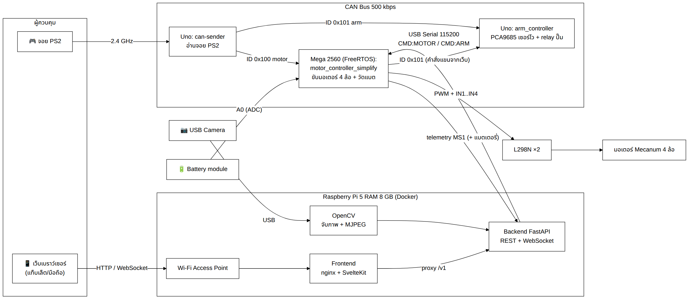
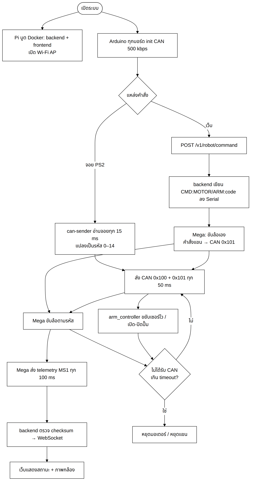
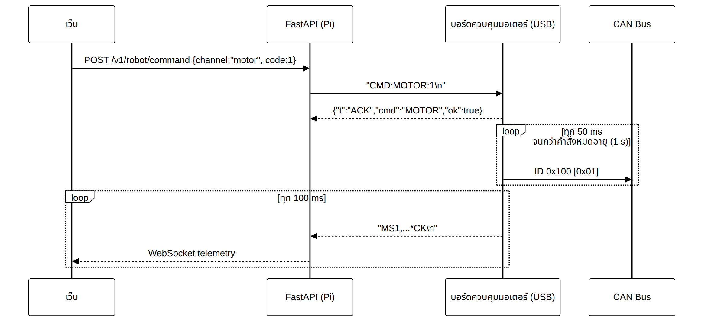
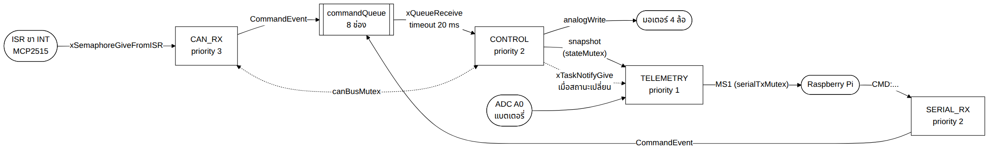
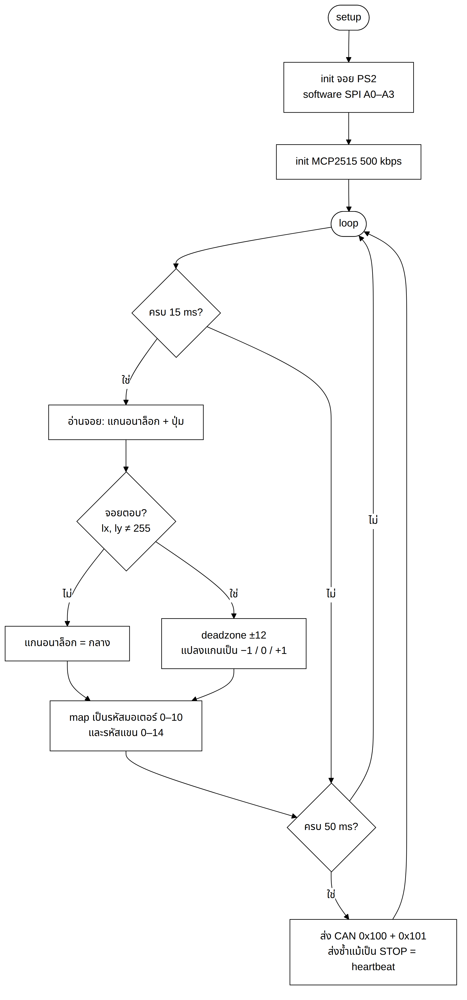
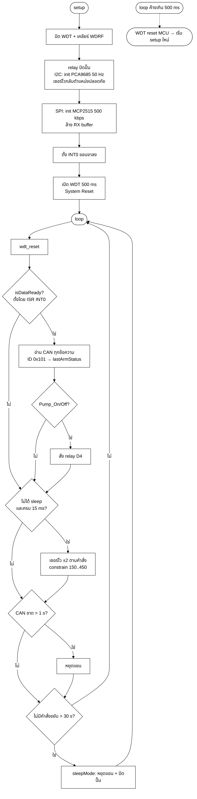
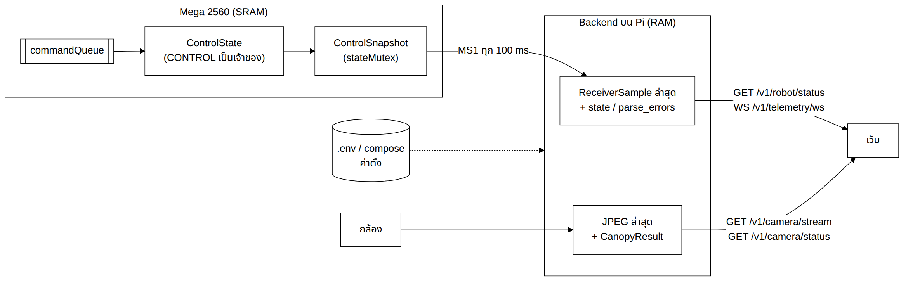

# หน้าปก

รายงาน

Mini Project วิชา 240-319 Embedded System Developer Module

**หุ่นยนต์ฉีดพ่นสารในสวนทุเรียน (Durian Bot)**

จัดทำโดย

[ชื่อ-สกุล] รหัสนักศึกษา [xxxxxxxxxx] Section [xx]

[ชื่อ-สกุล] รหัสนักศึกษา [xxxxxxxxxx] Section [xx]

[ชื่อ-สกุล] รหัสนักศึกษา [xxxxxxxxxx] Section [xx]

เสนอ

รศ.ดร. ปัญญยศ ไชยกาฬ

ผศ.ดร. วชรินทร์ แก้วอภิชัย

รศ.ดร. ทวีศักดิ์ เรืองพีระกุล

รายงานฉบับนี้เป็นส่วนหนึ่งของรายวิชา 240-319 ชุดวิชานักพัฒนาระบบฝังตัว (Embedded System Developer Module)
คณะวิศวกรรมศาสตร์ สาขาวิศวกรรมคอมพิวเตอร์ มหาวิทยาลัยสงขลานครินทร์ วิทยาเขตหาดใหญ่
ภาคเรียนที่ [x] ปีการศึกษา [25xx]

---

# คำนำ

รายงานฉบับนี้เป็นส่วนหนึ่งของรายวิชา 240-319 ชุดวิชานักพัฒนาระบบฝังตัว (Embedded System Developer Module)
จัดทำขึ้นเพื่อนำเสนอการศึกษา ออกแบบ และพัฒนาหุ่นยนต์ต้นแบบ "Durian Bot" สำหรับช่วยฉีดพ่นสารในสวนทุเรียน
โดยประยุกต์ใช้ความรู้ในรายวิชา ได้แก่ GPIO, PWM, ADC, Interrupt, Watchdog Timer, Sleep Mode, UART, SPI, I2C,
CAN Bus และ RTOS ร่วมกับการประมวลผลภาพด้วย OpenCV บน Raspberry Pi และเว็บแอปพลิเคชัน
เพื่อให้ผู้ควบคุมสามารถสั่งงานและติดตามสถานะของหุ่นยนต์ได้จากระยะไกล

เนื้อหาของรายงานแบ่งออกเป็น 5 บท ได้แก่ บทนำ การออกแบบระบบ การพัฒนาและโค้ดโปรแกรม ผลการทดลองและการนำไปใช้งาน
และสรุปผลพร้อมการประเมินวิธีการที่ใช้ในโครงงาน

คณะผู้จัดทำหวังว่ารายงานฉบับนี้จะเป็นประโยชน์แก่ผู้อ่าน หากมีข้อผิดพลาดประการใด คณะผู้จัดทำขออภัยมา ณ ที่นี้

คณะผู้จัดทำ

[วันที่]

# บทคัดย่อ

การฉีดพ่นสารป้องกันโรคและแมลงในสวนทุเรียนยังคงพึ่งพาแรงงานคนที่ต้องแบกถังและเดินฉีดพ่นด้วยตนเอง
ส่งผลให้ผู้ฉีดพ่นเสี่ยงต่อการสัมผัสสารเคมี ใช้แรงงานมาก และปริมาณการฉีดพ่นไม่สม่ำเสมอ
โครงงานนี้จึงพัฒนา Durian Bot ซึ่งเป็นหุ่นยนต์ต้นแบบขับเคลื่อนด้วยล้อ Mecanum 4 ล้อ บรรทุกถัง ปั๊ม
และหัวฉีดที่ปรับมุมได้ 3 แกน เพื่อให้ผู้ควบคุมสั่งงานจากระยะไกลได้อย่างปลอดภัย

ระบบแบ่งออกเป็น 3 ชั้น ได้แก่ ชั้นผู้ใช้ซึ่งประกอบด้วยจอยสติ๊ก PS2 และเว็บเบราว์เซอร์ ชั้นประมวลผลบน
Raspberry Pi 5 ซึ่งทำหน้าที่เป็น Wi-Fi Access Point และให้บริการ FastAPI, เว็บ SvelteKit และ OpenCV
และชั้นควบคุมฮาร์ดแวร์ซึ่งประกอบด้วย Arduino 4 บอร์ดที่สื่อสารกันผ่าน CAN Bus ความเร็ว 500 kbps
เฟิร์มแวร์ประยุกต์ใช้ GPIO, PWM, ADC, External Interrupt, Watchdog Timer, UART, SPI, I2C, CAN Bus และ FreeRTOS
Raspberry Pi และ Arduino สื่อสารกันด้วยโปรโตคอลข้อความ ASCII ที่มี XOR checksum และทุกชั้นของระบบมี heartbeat
และ timeout เพื่อให้หุ่นยนต์หยุดทำงานเองเมื่อสัญญาณขาดหาย นอกจากนี้กล้องบนตัวหุ่นยนต์ยังส่งภาพสดขึ้นเว็บ
พร้อมตรวจจับทรงพุ่มด้วย HSV color mask เพื่อแจ้งผู้ควบคุมเมื่อหัวฉีดหันเข้าหาต้นแล้ว

ผลการทดสอบพบว่า [สรุปผลหลัก เช่น หุ่นยนต์ขับเคลื่อนได้ครบ 10 ทิศทาง หยุดทำงานภายใน x ms เมื่อสาย CAN ขาด
แสดงภาพสดได้ x fps และควบคุมผ่าน Wi-Fi ได้ในระยะ x เมตร]

**คำสำคัญ:** หุ่นยนต์ฉีดพ่นสาร, CAN Bus, FreeRTOS, Raspberry Pi, OpenCV, ระบบฝังตัว

# สารบัญ

[สร้างอัตโนมัติใน Word]

# สารบัญรูปและตาราง

[สร้างอัตโนมัติใน Word]

# บทที่ 1 บทนำ

## 1.1 ที่มาและความสำคัญของปัญหา

ทุเรียนเป็นพืชเศรษฐกิจสำคัญของภาคใต้ การดูแลสวนทุเรียนจำเป็นต้องฉีดพ่นสารป้องกันโรคและแมลง เช่น
โรครากเน่าโคนเน่าและหนอนเจาะผล อย่างสม่ำเสมอ ในทางปฏิบัติ เกษตรกรต้องแบกถังหรือลากสายฉีดพ่นเดินไปตามแถวต้นด้วยตนเอง
ซึ่งก่อให้เกิดปัญหาดังนี้

- เสี่ยงต่อการสัมผัสสารเคมีโดยตรงทั้งทางผิวหนังและทางการหายใจ
- ใช้แรงงานและเวลามาก โดยเฉพาะในสวนขนาดใหญ่ที่ประสบปัญหาขาดแคลนแรงงาน
- ปริมาณการฉีดพ่นไม่สม่ำเสมอ เนื่องจากขึ้นอยู่กับผู้ฉีดพ่นแต่ละคน

คณะผู้จัดทำจึงพัฒนา Durian Bot หุ่นยนต์ขับเคลื่อน 4 ล้อที่ติดตั้งปั๊มและหัวฉีดปรับมุมได้ ผู้ควบคุมสามารถบังคับหุ่นยนต์
จากระยะไกลได้ 2 ช่องทาง คือ จอยสติ๊ก PS2 ผ่าน CAN Bus และหน้าเว็บผ่าน Wi-Fi ของ Raspberry Pi ที่ติดตั้งบนตัวหุ่นยนต์
พร้อมแสดงภาพจากกล้องและสถานะของหุ่นยนต์แบบเวลาจริง ช่วยให้ผู้ควบคุมอยู่ห่างจากละอองสารเคมีได้

## 1.2 ปัญหาที่ต้องการแก้ไข

1. **ผู้ฉีดพ่นสัมผัสละอองสารเคมีโดยตรง** แก้ไขโดยให้ผู้ควบคุมสั่งงานจากระยะไกลด้วยจอยสติ๊ก PS2 หรือหน้าเว็บ
   พร้อมภาพสดจากกล้องบนตัวหุ่นยนต์
2. **ต้องแบกถังและเดินฉีดพ่นเอง ใช้แรงงานมาก** แก้ไขโดยให้หุ่นยนต์บรรทุกถังและปั๊มแทน และใช้ล้อ Mecanum
   ที่เคลื่อนที่ได้ทุกทิศทาง เหมาะกับทางแคบระหว่างแถวต้น
3. **ปรับทิศทางการฉีดพ่นได้ยากและปริมาณการฉีดพ่นไม่สม่ำเสมอ** แก้ไขโดยใช้หัวฉีด 3 แกนที่ขับด้วยเซอร์โวมอเตอร์
   และใช้ OpenCV แจ้งว่าหัวฉีดหันเข้าหาทรงพุ่มแล้วหรือไม่
4. **หุ่นยนต์อาจเคลื่อนที่ต่อหรือฉีดพ่นค้างเมื่อสัญญาณขาดหายหรือโปรแกรมค้าง** แก้ไขโดยใช้ heartbeat และ timeout
   ในทุกชั้นของระบบ ร่วมกับ Watchdog Timer และปุ่ม E-STOP บนหน้าเว็บ
5. **ผู้ควบคุมไม่ทราบสถานะของหุ่นยนต์** เช่น แบตเตอรี่ใกล้หมดหรือการเชื่อมต่อขาดหาย แก้ไขโดยส่งข้อมูล telemetry
   ของแรงดันแบตเตอรี่และสถานะการเชื่อมต่อขึ้นหน้าเว็บ

### 1.2.1 วัตถุประสงค์

1. เพื่อออกแบบและพัฒนาหุ่นยนต์ต้นแบบสำหรับฉีดพ่นสารในสวนทุเรียนที่ควบคุมจากระยะไกลได้
2. เพื่อประยุกต์ใช้การสื่อสารระหว่างไมโครคอนโทรลเลอร์หลายบอร์ดผ่าน CAN Bus, SPI, I2C และ UART
3. เพื่อออกแบบระบบความปลอดภัย (fail-safe) เช่น Watchdog Timer และการหยุดทำงานอัตโนมัติเมื่อสัญญาณขาดหาย
4. เพื่อพัฒนาเว็บแดชบอร์ดบน Raspberry Pi สำหรับสั่งงาน แสดงภาพจากกล้อง และแสดงสถานะของหุ่นยนต์

### 1.2.2 ขอบเขตของโครงงาน

1. เป็นหุ่นยนต์ต้นแบบขนาดเล็กที่พัฒนาด้วยความรู้ในรายวิชา Embedded System Developer Module
2. ใช้น้ำแทนสารเคมีจริงในการทดสอบ
3. ควบคุมแบบ manual โดยผู้ควบคุม ยังไม่มีระบบนำทางอัตโนมัติ
4. ระยะการควบคุมผ่านหน้าเว็บจำกัดตามระยะสัญญาณ Wi-Fi Access Point ของ Raspberry Pi

## 1.3 อุปกรณ์ทั้งหมดที่ใช้ในงาน

### 1.3.1 Hardware

อุปกรณ์ฮาร์ดแวร์ที่ใช้ในโครงงานมีรายละเอียดดังนี้ สำหรับจำนวนและราคาของอุปกรณ์แสดงไว้ในภาคผนวก ก

1. **Arduino Uno R3** ใช้ไมโครคอนโทรลเลอร์ ATmega328P ความถี่ 16 MHz มี Flash 32 KB, SRAM 2 KB, EEPROM 1 KB,
   Digital I/O 14 ขา (PWM 6 ขา), Analog Input 6 ขา, USART 1 ชุด, SPI และ I2C (TWI)
   ในโครงงานนี้ใช้เป็นบอร์ดอ่านจอยสติ๊ก (`can-sender`), บอร์ดควบคุมแขนและปั๊ม (`arm_controller`)
   และบอร์ดแปลงสัญญาณ USB กับ CAN (`can_receiver`)
2. **Arduino Mega 2560** ใช้ไมโครคอนโทรลเลอร์ ATmega2560 ความถี่ 16 MHz มี Flash 256 KB, SRAM 8 KB, EEPROM 4 KB,
   Digital I/O 54 ขา (PWM 15 ขา), Analog Input 16 ขา และ USART 4 ชุด ใช้ขับมอเตอร์ 4 ล้อ
   (`motor_controller_simplify`) และเชื่อมต่อกับ Raspberry Pi ผ่าน USB
3. **Raspberry Pi 5 (RAM 8 GB)** ใช้ CPU Cortex-A76 4 คอร์ ความถี่ 2.4 GHz, RAM LPDDR4X 8 GB, Wi-Fi 5 แบบ dual-band,
   USB 3.0 จำนวน 2 พอร์ต และ USB 2.0 จำนวน 2 พอร์ต ใช้แหล่งจ่ายไฟ USB-C 5 V 5 A (27 W)
   ทำหน้าที่เป็น Wi-Fi Access Point ให้บริการ FastAPI และเว็บผ่าน Docker และอ่านภาพจากกล้อง USB ด้วย OpenCV
4. **MCP2515 CAN Module** เป็น CAN controller ที่สื่อสารผ่าน SPI ร่วมกับ transceiver TJA1050 ใช้คริสตัล 8 MHz
   และมีขา INT แจ้งเมื่อมีข้อความเข้า ใช้เป็นช่องทางสื่อสารหลักระหว่างบอร์ด Arduino
5. **PCA9685** เป็นวงจรสร้างสัญญาณ PWM 16 ช่อง ความละเอียด 12 บิต สื่อสารผ่าน I2C (address 0x40)
   ใช้ควบคุมเซอร์โวมอเตอร์ 3 แกนของหัวฉีด
6. **จอยสติ๊ก PS2 แบบไร้สาย** สื่อสารแบบ synchronous serial คล้าย SPI (ส่งบิตต่ำก่อน) มีแกนอนาล็อก 2 ข้างและปุ่ม 16 ปุ่ม
   เป็นช่องทางควบคุมหลักในสวน
7. **Motor Driver L298N** เป็น Dual H-bridge ที่ขับมอเตอร์ DC ได้ 2 ตัวต่อโมดูล รับแรงดัน 5–35 V
   จ่ายกระแสได้ 2 A ต่อช่อง (สูงสุด 3 A) มีแรงดันตกคร่อมประมาณ 2 V ควบคุมทิศทางด้วยขา IN1–IN4
   และควบคุมความเร็วด้วย PWM ที่ขา ENA/ENB ในโครงงานใช้ 2 โมดูลขับล้อ Mecanum 4 ล้อ
8. **Relay Module และปั๊มน้ำ DC** ใช้ relay แบบ active LOW แยกวงจรกำลังของปั๊มออกจากไมโครคอนโทรลเลอร์
   เพื่อเปิดและปิดการฉีดพ่น
9. **Servo Motor** ควบคุมมุมด้วยความกว้างพัลส์ประมาณ 0.5–2.5 ms ที่คาบ 20 ms (50 Hz)
   ใช้ปรับมุมหัวฉีดในแนวซ้าย-ขวา แนวหน้า-หลัง และการยกหัวฉีด
10. **USB Webcam** เป็นกล้องมาตรฐาน UVC ที่อ่านผ่าน V4L2 ใช้ส่งภาพสดขึ้นหน้าเว็บ
11. **Battery Voltage Sensor** เป็นวงจรแบ่งแรงดันจากตัวต้านทาน 30 kΩ และ 7.5 kΩ (อัตราส่วน 5:1)
    วัดแรงดันได้ 0–25 V โดยให้แรงดันออก 0–5 V เข้าขา ADC A0 ของ Arduino Mega

[แทรกรูปที่ 1.1 อุปกรณ์ฮาร์ดแวร์ที่ใช้ในโครงงาน]

### 1.3.2 Software

1. **Arduino IDE 2.x** ใช้เขียน คอมไพล์ และอัปโหลดเฟิร์มแวร์ทั้ง 4 บอร์ด
2. **Raspberry Pi OS 64-bit (Bookworm)** เป็นระบบปฏิบัติการของ Raspberry Pi 5 และตั้งค่าเป็น Wi-Fi Access Point
   ด้วย NetworkManager ผ่านสคริปต์ `scripts/setup-rpi-ap.sh`
3. **Docker และ Docker Compose** ใช้รัน backend และ frontend เป็น container บน Raspberry Pi
   โดยใช้ **nginx 1.27** ให้บริการหน้าเว็บและส่งต่อคำขอ `/v1` ไปยัง backend
4. **Python 3.12 และ Poetry** สำหรับพัฒนา backend และ **Node.js 22 และ pnpm** สำหรับ build frontend
5. **Git และ GitHub** ใช้จัดการเวอร์ชันของโค้ด และ **VS Code** ร่วมกับ **Mermaid** ใช้เขียนโค้ดและแผนภาพ

### 1.3.3 Library

**Library ฝั่งเฟิร์มแวร์**

1. `mcp_can` สำหรับควบคุม MCP2515 ผ่าน SPI
2. `PS2X_lib` และ `PS2_Controller.cpp` สำหรับอ่านจอยสติ๊ก PS2 แบบ software SPI
3. FreeRTOS (Arduino_FreeRTOS โดย feilipu) สำหรับ task, queue, semaphore และ mutex บน Arduino Mega 2560
4. `Wire` และ `SPI` ของ Arduino core ร่วมกับ avr-libc (`avr/io.h`, `avr/interrupt.h`, `avr/wdt.h`)
   สำหรับเข้าถึง register, ISR และ Watchdog Timer โดยตรง
5. `PCA9685_Control` ซึ่งคณะผู้จัดทำเขียนขึ้นเองในระดับ register แทนการใช้ไลบรารีของ Adafruit

**Library ฝั่ง backend**

1. FastAPI และ Uvicorn สำหรับ REST API และ WebSocket
2. Pydantic และ pydantic-settings สำหรับตรวจสอบรูปแบบข้อมูลและอ่านค่าตั้งจากไฟล์ `.env`
3. pyserial สำหรับสื่อสารผ่าน USB serial
4. opencv-python-headless และ NumPy สำหรับอ่านภาพจากกล้องและประมวลผลภาพ
5. loguru สำหรับบันทึก log
6. pytest และ pytest-asyncio สำหรับ unit test

**Library ฝั่ง frontend**

1. SvelteKit 2, Svelte 5 และ TypeScript สำหรับโครงสร้างเว็บ
2. Tailwind CSS 4, bits-ui (shadcn-svelte) และ lucide สำหรับรูปแบบหน้าเว็บ component และไอคอน
3. @tanstack/svelte-query, openapi-fetch และ openapi-typescript สำหรับเรียก API โดยมีชนิดข้อมูลตรงกับ backend

---

# บทที่ 2 การออกแบบระบบ

## 2.1 ภาพรวมสถาปัตยกรรมและองค์ประกอบของระบบ

ระบบแบ่งออกเป็น 3 ชั้น ดังแสดงในรูปที่ 2.1

1. **ชั้นผู้ใช้** ประกอบด้วยจอยสติ๊ก PS2 สำหรับใช้งานในสวน และเว็บเบราว์เซอร์บนแท็บเล็ตหรือโทรศัพท์มือถือ
2. **ชั้นประมวลผลบนตัวหุ่นยนต์** คือ Raspberry Pi ทำหน้าที่เป็น Wi-Fi Access Point ให้บริการ FastAPI backend
   และเว็บ frontend รวมถึงอ่านภาพจากกล้องด้วย OpenCV
3. **ชั้นควบคุมฮาร์ดแวร์** คือ Arduino ที่เชื่อมต่อกันบน CAN Bus ทำหน้าที่ขับล้อ ขยับหัวฉีด และเปิดปิดปั๊ม



**รูปที่ 2.1** แผนภาพสถาปัตยกรรมระบบ Durian Bot

การเชื่อมต่อ USB ระหว่าง Raspberry Pi กับ Arduino ทำได้ 2 รูปแบบ ได้แก่

- **รูปแบบ A (ใช้งานปัจจุบัน)** เชื่อมต่อ Arduino Mega (`motor_controller_simplify`) กับ Raspberry Pi
  โดย Mega ขับล้อตามคำสั่ง `CMD:MOTOR` และส่งต่อคำสั่ง `CMD:ARM` เข้า CAN ID `0x101` ไปยังบอร์ด `arm_controller`
- **รูปแบบ B (bridge)** เชื่อมต่อ Arduino Uno (`can_receiver`) กับ Raspberry Pi โดยบอร์ดรับคำสั่ง `CMD:...`
  แล้วส่งต่อเข้า CAN ID `0x100` และควบคุมแขนกับปั๊มด้วยตนเอง

### 2.1.1 Schematic Diagram

[แทรกรูปที่ 2.2 Schematic diagram ของระบบ]

**รูปที่ 2.2** Schematic diagram ของระบบ

### 2.1.2 ตารางการต่อขา

**ตารางที่ 2.1** การต่อขาของบอร์ด can-sender (Arduino Uno)

| อุปกรณ์            | ขา Uno          |
| ------------------------- | ----------------- |
| PS2 DAT / CMD / ATT / CLK | A0 / A1 / A2 / A3 |
| MCP2515 CS                | D10               |
| MCP2515 SI / SO / SCK     | D11 / D12 / D13   |

**ตารางที่ 2.2** การต่อขาของบอร์ด arm_controller (Arduino Uno)

| อุปกรณ์                 | ขา Uno                                                              |
| ------------------------------ | --------------------------------------------------------------------- |
| MCP2515 CS                     | D10                                                                   |
| MCP2515 INT                    | D2 (INT0)                                                             |
| MCP2515 SI / SO / SCK          | D11 / D12 / D13                                                       |
| PCA9685 SDA / SCL              | A4 / A5                                                               |
| Relay ปั๊ม IN (active LOW) | D4                                                                    |
| PCA9685 ช่อง 0 / 1 / 2     | เซอร์โว ซ้าย-ขวา / หน้า-หลัง / ยกหัวฉีด |

**ตารางที่ 2.3** การต่อขาของบอร์ด motor_controller_simplify (Arduino Mega 2560)

| อุปกรณ์                            | ขา L298N         | ขา Mega             | หมายเหตุ                   |
| ----------------------------------------- | ------------------ | --------------------- | ---------------------------------- |
| L298N#1 ช่อง A → M1 หน้าซ้าย | ENA / IN1 / IN2    | D5 / D22 / D23        | ENA = PWM (Timer3)                 |
| L298N#1 ช่อง B → M2 หน้าขวา   | ENB / IN3 / IN4    | D6 / D24 / D25        | ENB = PWM (Timer4)                 |
| L298N#2 ช่อง A → M3 หลังซ้าย | ENA / IN1 / IN2    | D7 / D30 / D31        | ENA = PWM (Timer4)                 |
| L298N#2 ช่อง B → M4 หลังขวา   | ENB / IN3 / IN4    | D8 / D32 / D33        | ENB = PWM (Timer4)                 |
| L298N ทั้ง 2 บอร์ด               | GND                | GND                   | ต้องต่อ GND ร่วม        |
| MCP2515                                   | CS / SO / SI / SCK | D53 / D50 / D51 / D52 | SPI                                |
| MCP2515 INT (ไม่บังคับ)          | –                 | D2 (INT4)             | ปลุก task CAN_RX               |
| Battery module S                          | –                 | A0                    | GND ร่วม                       |

ตำแหน่งของล้อกำหนดตามตารางทิศทางการหมุน โดยคำสั่ง SPIN_LEFT ให้ล้อ M1 และ M3 หมุนถอยหลัง ส่วนล้อ M2 และ M4
หมุนไปข้างหน้า หากล้อใดหมุนกลับทิศ สามารถแก้ไขได้โดยสลับสาย OUT1 และ OUT2 ที่ L298N

### 2.1.3 CAN ID และรหัสคำสั่ง

ระบบใช้ CAN ID แบบ Standard 11 บิต จำนวน 2 ค่า และบรรจุรหัสคำสั่งขนาด 1 ไบต์ ดังนี้

- `0x100` ส่งจาก can-sender (หรือ can_receiver ในรูปแบบ B) ไปยัง Arduino Mega บรรจุรหัสมอเตอร์ 0–10
- `0x101` ส่งจาก can-sender และ Arduino Mega (กรณีคำสั่งแขนจากหน้าเว็บ) ไปยัง arm_controller บรรจุรหัสแขน 0–8 และ 11–14

ความหมายของรหัสคำสั่งแต่ละค่าและปุ่มของจอยสติ๊กที่สอดคล้องกันแสดงในตารางที่ 2.4

**ตารางที่ 2.4** รหัสคำสั่งและปุ่มจอยสติ๊ก PS2

| รหัส | มอเตอร์         | แขน/หัวฉีด      | ปุ่มจอยสติ๊กสติ๊ก PS2           |
| -------: | ---------------------- | ------------------------ | ------------------------------------------------ |
|        0 | STOP                   | STOP                     | ปล่อยจอยสติ๊ก                       |
|    1 / 2 | FORWARD / BACKWARD     | เซอร์โว 1 −/+    | D-pad ↑↓, analog ซ้าย / analog ขวา ↑↓ |
|    3 / 4 | LEFT / RIGHT           | เซอร์โว 0 −/+    | analog ซ้าย / analog ขวา ←→             |
|     5–8 | เฉียง 4 ทิศ    | (ใช้เซอร์โว 0) | analog ซ้ายแนวทแยง                    |
|   9 / 10 | SPIN_LEFT / SPIN_RIGHT | –                       | D-pad ← →                                      |
|  11 / 12 | –                     | PUMP_ON / PUMP_OFF       | □ / ○                                          |
|  13 / 14 | –                     | HEAD_UP / HEAD_DOWN      | △ / ✕                                          |

### 2.1.4 ส่วน Raspberry Pi และเว็บ

- **เครือข่าย** Raspberry Pi ทำหน้าที่เป็น Wi-Fi Access Point ผู้ใช้เชื่อมต่อ Wi-Fi ของหุ่นยนต์ แล้วเปิดหน้าเว็บที่
  `http://<IP ของ Raspberry Pi>/`
- **การติดตั้ง** ใช้ Docker Compose จำนวน 2 container คือ `frontend` (nginx พอร์ต 80) และ `backend` (FastAPI พอร์ต 9000)
- **API หลัก** ได้แก่ `POST /v1/robot/command`, `GET /v1/robot/status`, `GET /v1/camera/stream` (MJPEG)
  และ `WS /v1/telemetry/ws`
- **หน้าเว็บ** ได้แก่ `/` (Operator Console), `/control` (ปุ่มสั่งงานและ E-STOP) และ `/monitor` (แสดง telemetry)

## 2.2 ลำดับขั้นตอนและการไหลของข้อมูล

ข้อมูลในระบบไหลผ่าน 4 เส้นทาง ดังนี้

1. **คำสั่งจากจอยสติ๊ก** ส่งจากจอยสติ๊ก PS2 ไปยัง can-sender แล้วส่งต่อบน CAN ID `0x100` และ `0x101`
   ไปยัง Arduino Mega และ arm_controller ทุก 50 ms
2. **คำสั่งจากหน้าเว็บ** ส่งจากหน้าเว็บไปยัง FastAPI แล้วส่งเป็นข้อความ `CMD:...` ผ่าน USB serial ไปยัง Arduino Mega
   ซึ่งขับล้อและส่งคำสั่งแขนต่อบน CAN ID `0x101` ให้ arm_controller โดยหน้าเว็บส่งคำสั่งซ้ำทุก 200 ms ขณะกดปุ่มค้าง
3. **Telemetry** ส่งจาก Arduino Mega เป็นข้อความ `MS1` ผ่าน USB serial ไปยัง FastAPI แล้วส่งต่อให้หน้าเว็บ
   ผ่าน REST และ WebSocket ทุก 100 ms หรือทันทีเมื่อสถานะเปลี่ยน
4. **ภาพจากกล้อง** ส่งจาก USB Webcam ไปยัง OpenCV แล้วส่งเป็น MJPEG ไปแสดงบนหน้าเว็บที่อัตรา 15 fps (ปรับตั้งได้)

### 2.2.1 Flowchart การทำงานโดยรวม

ลำดับการทำงานโดยรวมของระบบตั้งแต่เปิดเครื่อง รับคำสั่ง ขับเคลื่อน และหยุดเมื่อสัญญาณขาดหาย แสดงในรูปที่ 2.3



**รูปที่ 2.3** Flowchart การทำงานโดยรวมของระบบ

### 2.2.2 การออกแบบโปรโตคอลระหว่าง Raspberry Pi กับ Arduino

การสื่อสารผ่าน USB serial ตั้งค่าที่ 115200 baud แบบ 8N1 โดยส่งข้อความ ASCII 1 บรรทัดต่อ 1 frame และปิดท้ายด้วย `\n`

#### 2.2.2.1 คำสั่งจาก Raspberry Pi ไปยัง Arduino

```text
CMD:MOTOR:<0..10>     สั่งมอเตอร์ (backend เปิดให้ 0..8)
CMD:ARM:<0..8,11..14> สั่งแขน/ปั๊ม
CMD:ALL:0  หรือ STOP  หยุดทุกอย่าง
PING                  ตรวจลิงก์ → ตอบ {"t":"PONG"}
```

คำสั่งจาก serial มีอายุ 1,000 ms หากไม่ได้รับคำสั่งซ้ำภายในเวลาดังกล่าว บอร์ดจะหยุดการทำงานเอง
จึงปลอดภัยแม้สาย USB หลุดหรือ backend หยุดทำงาน

#### 2.2.2.2 Telemetry จาก Arduino ไปยัง Raspberry Pi

```text
MS1,motor,motor_alive,arm,arm_alive,battery_mV,battery_adc,pwm,age_ms,seq*CK   (motor_controller_simplify, ทุก 100 ms)
RB4,motor,motor_alive,arm,arm_alive,mV,adc,ax1,ax2,ax3,pump,seq*CK   (can_receiver)
```

`MS1` เป็นคำนำหน้า (prefix) ของบรรทัด telemetry จาก Arduino Mega ย่อมาจาก **M**otor controller **S**implify รุ่นที่ **1**
โดยตั้งชื่อแยกจาก `MC1` ซึ่งเป็นรูปแบบของบอร์ดรุ่นก่อน เพื่อให้ backend แยกรูปแบบของข้อมูลได้ถูกต้อง

การออกแบบโปรโตคอลมีเหตุผลดังนี้

- **ใช้ prefix** (`MS1`, `RB4`) เพื่อคัดข้อความที่ bootloader พิมพ์ออกมาขณะรีเซ็ตทิ้ง และเพื่อระบุเวอร์ชันของรูปแบบข้อมูล
- **ใช้ CSV แทน JSON** เพราะสร้างข้อความได้ด้วย `snprintf` เพียงครั้งเดียว ไม่ต้องใช้ไลบรารีเพิ่ม
  และประหยัดหน่วยความจำ SRAM 2 KB ของ Arduino Uno
- **ใช้ XOR checksum** เพื่อตรวจจับข้อมูลที่ผิดเพี้ยนจากสัญญาณรบกวนของมอเตอร์และปั๊ม บรรทัดที่ checksum ไม่ถูกต้องจะถูกทิ้ง
- **ใช้ตัวนับ `seq`** เพื่อให้ backend ตรวจพบ frame ที่สูญหาย
- **ใช้ `age_ms` และ `alive`** เพื่อบอกอายุของคำสั่งล่าสุด และใช้แสดงสถานะการเชื่อมต่อบนหน้าเว็บ

ลำดับการสื่อสารเมื่อผู้ใช้สั่งงานจากหน้าเว็บแสดงในรูปที่ 2.4



**รูปที่ 2.4** Sequence diagram การสั่งงานจากหน้าเว็บ

## 2.3 การออกแบบขั้นตอนประมวลผล

### 2.3.1 ลำดับความสำคัญของแหล่งคำสั่งและ Fail-safe

ระบบรับคำสั่งได้จาก 2 แหล่ง คือ จอยสติ๊กและหน้าเว็บ และทุกช่องทางอาจขาดการเชื่อมต่อได้
จึงออกแบบตามหลักการ 2 ข้อ ดังนี้

1. **คำสั่งจากหน้าเว็บมีสิทธิ์เหนือจอยสติ๊กชั่วคราว** เนื่องจากจอยสติ๊กส่งคำสั่ง STOP เป็น heartbeat ตลอดเวลา
   หากให้สิทธิ์เท่ากัน คำสั่งจากหน้าเว็บจะถูกคำสั่ง STOP เขียนทับ บอร์ดที่รับ serial จึงให้คำสั่งจาก serial มีสิทธิ์ก่อน
   และคืนสิทธิ์ให้จอยสติ๊กเมื่อคำสั่งจาก serial หมดอายุ
2. **เมื่อไม่มีคำสั่งใหม่ หุ่นยนต์ต้องหยุด** ทุกคำสั่งมีอายุ ผู้ส่งต้องส่งคำสั่งซ้ำอย่างต่อเนื่อง
   หากสายขาดหรือโปรแกรมฝั่งผู้ส่งค้าง ฝั่งผู้รับจะหยุดการทำงานเอง

ค่าเวลาที่ใช้ในแต่ละชั้นมีดังนี้

- **หน้าเว็บ** ส่งคำสั่งซ้ำทุก 200 ms ขณะกดปุ่มค้าง และส่ง STOP ทันทีเมื่อปล่อยปุ่ม ส่วน **จอยสติ๊ก** ส่ง heartbeat บน CAN
  ทุก 50 ms แม้คำสั่งเป็น STOP
- **Arduino Mega** ยกเลิกคำสั่งจาก serial ที่ไม่ได้รับซ้ำเกิน 1 s (หยุดล้อแล้วคืนสิทธิ์ให้จอยสติ๊ก)
  และยกเลิกคำสั่งจาก CAN ที่เกิน 300 ms (หยุดล้อ)
- **arm_controller** หยุดแขนเมื่อ CAN ขาดหายเกิน 1 s เข้าสู่ software sleep (หยุดแขนและปิดปั๊ม)
  เมื่อไม่มีคำสั่งขยับเป็นเวลา 30 s และหากโปรแกรมค้างเกิน 500 ms Watchdog Timer จะรีเซ็ตบอร์ด
  ซึ่งทำให้ปั๊มปิดและเซอร์โวกลับสู่ตำแหน่งปลอดภัย
- **ปุ่ม E-STOP** บนหน้าเว็บส่งคำสั่ง `CMD:ALL:0` ซึ่งคงสถานะ STOP ไว้ 1 s และส่ง `PUMP_OFF` เพื่อหยุดล้อ แขน และปั๊มพร้อมกัน
- **backend** แสดงสถานะ `disconnected` บนหน้าเว็บเมื่อไม่ได้รับ telemetry เกิน 1.5 s

### 2.3.2 การออกแบบ Task บน Arduino Mega 2560 (FreeRTOS)

บอร์ด Arduino Mega ต้องทำงานหลายอย่างพร้อมกันมากที่สุดในระบบ ได้แก่ รับข้อความ CAN รับคำสั่งจาก serial ขับมอเตอร์
จับเวลา timeout ส่ง heartbeat ให้แขน อ่านแรงดันแบตเตอรี่ และส่ง telemetry ประกอบกับมี SRAM 8 KB
เพียงพอสำหรับหลาย task จึงเลือกใช้ FreeRTOS บนบอร์ดนี้ ส่วน Arduino Uno มี SRAM เพียง 2 KB ซึ่งไม่เพียงพอ
และบอร์ด `arm_controller` ใช้ Watchdog Timer สำหรับรีเซ็ต ซึ่งขัดกับการที่ FreeRTOS ใช้ Watchdog Timer เป็นตัวสร้าง tick

โครงสร้างของ task และช่องทางสื่อสารระหว่าง task แสดงในรูปที่ 2.5 และรายละเอียดของแต่ละ task แสดงในตารางที่ 2.5



**รูปที่ 2.5** โครงสร้าง Task และการสื่อสารระหว่าง Task บน Arduino Mega

**ตารางที่ 2.5** รายละเอียดของ Task บน Arduino Mega

| Task          | Priority | Stack (byte) | งาน                                                                                                                                                  |
| ------------- | -------: | -----------: | ------------------------------------------------------------------------------------------------------------------------------------------------------- |
| `CAN_RX`    |        3 |          256 | รอ semaphore จาก ISR หรือ timeout 1 tick → อ่าน CAN ทุกข้อความ → ส่งเข้า queue                                          |
| `CONTROL`   |        2 |          256 | เจ้าของ state คำสั่งแต่ผู้เดียว — ดึง queue, เลือกแหล่งคำสั่ง, ตรวจสอบ timeout, ขับมอเตอร์ |
| `SERIAL_RX` |        2 |          320 | อ่านบรรทัดจาก Pi → ส่งเข้า queue → ตอบ ACK/ERR                                                                                 |
| `TELEMETRY` |        1 |          448 | อ่านแบตเตอรี่ (task เดียวที่ใช้ ADC) + ส่ง`MS1` ทุก 100 ms หรือทันทีเมื่อถูก notify                    |

หลักการออกแบบคือให้ `CONTROL` เป็น task เดียวที่แก้ไขสถานะคำสั่ง task อื่นส่งข้อมูลเข้ามาผ่าน queue เท่านั้น
จึงไม่มีตัวแปรที่หลาย task เขียนพร้อมกัน และไม่เกิด race condition ส่วน mutex ใช้เฉพาะกับทรัพยากรที่ต้องใช้ร่วมกันจริง
ได้แก่ SPI ของ MCP2515, serial และข้อมูล snapshot สำหรับ telemetry

### 2.3.3 Flowchart บอร์ด can-sender

บอร์ด can-sender อ่านจอยสติ๊กทุก 15 ms แปลงค่าแกนอนาล็อกเป็นรหัสคำสั่ง และส่งคำสั่งขึ้น CAN Bus ทุก 50 ms
ดังแสดงในรูปที่ 2.6



**รูปที่ 2.6** Flowchart การทำงานของบอร์ด can-sender

### 2.3.4 Flowchart บอร์ด arm_controller

บอร์ด arm_controller รับข้อความ CAN ผ่าน External Interrupt ขยับเซอร์โวอย่างนุ่มนวล ควบคุมปั๊ม
และมีกลไก fail-safe ได้แก่ timeout ของสัญญาณ CAN, software sleep และ Watchdog Timer ดังแสดงในรูปที่ 2.7



**รูปที่ 2.7** Flowchart การทำงานของบอร์ด arm_controller

### 2.3.5 การออกแบบการประมวลผลภาพเพื่อตรวจจับทรงพุ่ม

backend เปิดกล้องด้วย `cv2.VideoCapture` ผ่าน V4L2 และตั้ง FOURCC เป็น MJPG ให้กล้องบีบอัดภาพเอง
เพื่อลดภาระของ USB และ CPU จากนั้นตรวจจับทรงพุ่มทุเรียน (`backend/apiapp/infrastructure/vision.py`)
ในทุกเฟรมก่อนบีบอัดเป็น JPEG ตามขั้นตอนดังนี้

1. ใช้ `GaussianBlur` ลดสัญญาณรบกวนของเซนเซอร์กล้อง
2. แปลงภาพเป็นปริภูมิสี HSV ด้วย `cvtColor` เนื่องจาก HSV แยกค่าสี (Hue) ออกจากความสว่าง (Value)
   จึงทนต่อแสงแดดและเงาได้ดีกว่า RGB
3. ใช้ `inRange` เลือกช่วงสีเขียว H 35–85, S ≥ 60 และ V ≥ 40 (OpenCV ใช้ช่วง H 0–179) ได้ mask ขาวดำ
4. ใช้ `morphologyEx` แบบ OPEN (erode แล้ว dilate) เพื่อลบจุดเล็ก และแบบ CLOSE (dilate แล้ว erode) เพื่อปิดช่องว่างระหว่างใบ
5. คำนวณสัดส่วนพื้นที่ใบจาก `countNonZero` หารด้วยขนาดภาพ และใช้ `findContours` ร่วมกับ `boundingRect`
   หาทรงพุ่มที่ใหญ่ที่สุด
6. วาดกรอบและข้อความ เช่น `CANOPY 42% READY` ลงบนภาพ โดยถือว่าหัวฉีดหันเข้าหาต้นแล้วเมื่อสัดส่วนพื้นที่
   มากกว่าหรือเท่ากับ `CANOPY_READY_RATIO` (25%)

ภาพที่ผ่านการประมวลผลจะถูกบีบอัดด้วย `cv2.imencode` ที่คุณภาพ 80 และส่งเป็น MJPEG (`multipart/x-mixed-replace`)
ไปแสดงบนหน้าเว็บ ทั้งนี้ระบบทำหน้าที่ **แจ้งผู้ควบคุมเท่านั้น** และไม่เปิดปั๊มเอง เนื่องจากการฉีดพ่นอัตโนมัติ
ต้องมีระบบความปลอดภัยเพิ่มเติม

## 2.4 การออกแบบส่วนติดต่อผู้ใช้

### 2.4.1 หน้าเว็บ

หน้าเว็บประกอบด้วย 3 หน้า ได้แก่ `/` Operator Console แสดงภาพรวมสถานะและลิงก์ไปยังหน้าอื่น, `/control`
แสดงภาพสดจากกล้อง ปุ่มขับเคลื่อน 8 ทิศทางและหมุนตัว ปุ่มแขน 4 ทิศทางและยกหัวฉีดขึ้นลง ปุ่มเปิดปิดปั๊ม ปุ่ม E-STOP
แรงดันแบตเตอรี่ และสถานะการเชื่อมต่อ, `/monitor` แสดง telemetry แบบเวลาจริงผ่าน WebSocket

หลักการออกแบบหน้าเว็บมีดังนี้

1. **รองรับการใช้งานบนแท็บเล็ตและโทรศัพท์มือถือในสวน** โดยใช้ปุ่มขนาดใหญ่ที่กดด้วยนิ้วได้สะดวก
2. **กดค้างเพื่อขับเคลื่อน (hold-to-drive)** หุ่นยนต์หยุดทันทีเมื่อปล่อยนิ้ว ทำหน้าที่เหมือน dead-man switch
   และถือว่าปล่อยปุ่มเช่นกันเมื่อนิ้วเลื่อนออกนอกปุ่ม สลับแท็บ หรือหน้าจอดับ
3. **ปุ่มปั๊มแบบกดครั้งเดียว** แยกปุ่ม ON และ OFF อย่างชัดเจน ผู้ใช้ไม่ต้องกดค้างตลอดการฉีดพ่น
4. **ปุ่ม E-STOP** แยกสีและตำแหน่งให้เห็นชัด และหยุดทั้งล้อ แขน และปั๊มพร้อมกัน
5. **แสดงสถานะตลอดเวลา** ได้แก่ สถานะการเชื่อมต่อ (streaming, connecting, disconnected) อายุของ frame ล่าสุด
   และแรงดันแบตเตอรี่
6. **แสดงข้อความ `CANOPY xx% READY` ซ้อนบนภาพสด** เพื่อให้ผู้ควบคุมทราบทันทีว่าหัวฉีดหันเข้าหาทรงพุ่มแล้ว

[แทรกรูปที่ 2.8 หน้าเว็บ /control และ /monitor]

**รูปที่ 2.8** หน้าเว็บ /control และ /monitor

### 2.4.2 จอยสติ๊ก PS2

ปุ่มแต่ละปุ่มของจอยสติ๊กถูกแปลงเป็นรหัสคำสั่งตามตารางที่ 2.4 โดยแกนอนาล็อกซ้ายใช้ขับล้อ ปุ่ม D-pad ซ้ายและขวาใช้หมุนตัว
แกนอนาล็อกขวาใช้หมุนหัวฉีด ปุ่ม △ และ ✕ ใช้ยกหัวฉีดขึ้นและลง และปุ่ม □ และ ○ ใช้เปิดและปิดปั๊ม

## 2.5 ข้อมูลจากเซนเซอร์

หัวข้อนี้อธิบายข้อมูลที่ระบบอ่านจากกล้องและเซนเซอร์ อัตราการอ่าน ค่าที่คำนวณต่อ และฟิลด์ข้อมูลที่ส่งออก
ส่วนการปรับเทียบและข้อจำกัดของค่าที่วัดได้อธิบายไว้ในบทที่ 4

### 2.5.1 กล้องและเซนเซอร์ที่ใช้: ค่าที่อ่านโดยตรง ช่วงค่า และหน่วย

1. **USB Webcam (UVC)** Raspberry Pi อ่านภาพด้วย OpenCV `VideoCapture` ผ่าน V4L2 ในรูปแบบ MJPG
   ได้ภาพสี BGR ขนาด 640×480 pixel ความละเอียดช่องสีละ 8 บิต
2. **Battery Voltage Sensor** (วงจรแบ่งแรงดัน 30 kΩ และ 7.5 kΩ) Arduino Mega อ่านที่ ADC ช่อง A0 ความละเอียด 10 บิต
   ได้ค่า 0–1023 ซึ่งสอดคล้องกับแรงดันที่ขา 0–5 V หรือแรงดันแบตเตอรี่ 0–25 V
3. **จอยสติ๊ก PS2** บอร์ด can-sender อ่านแกนอนาล็อก 4 แกนได้ค่า 0–255 (ค่ากึ่งกลาง 128 และหากได้ 255 ทั้งสองแกน
   หมายถึงจอยสติ๊กไม่ตอบสนอง) และอ่านสถานะปุ่ม 16 ปุ่มแบบกดหรือไม่กด
4. **MCP2515 (CAN)** Arduino Mega และ arm_controller อ่านได้ CAN ID และรหัสคำสั่งขนาด 1 ไบต์ ค่า 0–14

ทั้งนี้ บอร์ดมอเตอร์รุ่นก่อน (`motor_controller_mega`) มี encoder ของล้อและ IR sensor และ backend ยังรองรับข้อมูลเหล่านี้
จากรูปแบบ `MC1` แต่บอร์ดรุ่นปัจจุบัน (`MS1`) ไม่ได้ติดตั้งเซนเซอร์ดังกล่าว ค่าที่เกี่ยวข้องจึงเป็น 0 เสมอ

### 2.5.2 อัตราการอ่าน

1. อ่านจอยสติ๊ก PS2 ทุก 15 ms (`PS2_POLL_INTERVAL_MS`) และส่งคำสั่งบน CAN Bus ทุก 50 ms (`CAN_SEND_INTERVAL`)
2. อ่าน ADC ของแบตเตอรี่พร้อมส่ง telemetry `MS1` ทุก 100 ms หรือทันทีเมื่อคำสั่งเปลี่ยน (`TELEMETRY_PERIOD`)
3. อ่านภาพจากกล้องที่ 15 fps ตามค่าเริ่มต้นใน Docker Compose (`CAMERA_FPS`)
4. หน้า `/control` ขอข้อมูลสถานะจาก backend ทุก 500 ms

### 2.5.3 ค่าที่คำนวณต่อ

1. **แรงดันแบตเตอรี่** Arduino Mega เฉลี่ยค่า ADC 8 ค่าล่าสุด (moving average ประมาณ 0.8 s) แล้วแปลงเป็น `battery_mV`
   จากนั้น backend แปลงเป็น `battery_volts` โดยหารด้วย 1,000 และปัดเศษ 3 ตำแหน่ง
2. **รหัสทิศทาง 0–10** บอร์ด can-sender แปลงค่าแกนอนาล็อกหลังผ่าน deadzone เป็น −1, 0 หรือ +1 ต่อแกน
   แล้วรวมกับสถานะปุ่ม D-pad
3. **`motor_alive`, `arm_alive` และ `age_ms`** Arduino Mega ระบุว่ามีแหล่งคำสั่งที่ยังไม่หมดอายุหรือไม่
   และคำสั่งที่กำลังขับล้อมีอายุเท่าใด
4. **`canopy_ratio` และ `canopy_detected`** `vision.py` นับ pixel สีเขียวหลังผ่าน morphology แล้วหารด้วยจำนวน pixel ทั้งหมด
   และถือว่าพบทรงพุ่มเมื่อ `canopy_ratio` มากกว่าหรือเท่ากับ `CANOPY_READY_RATIO`
5. **คุณภาพการเชื่อมต่อ** backend คำนวณ `last_frame_age_ms` และ `state` (หากเกิน 1.5 s ถือว่า `disconnected`)
   นับ `parse_errors` จากบรรทัดที่ checksum ไม่ถูกต้อง และนับ frame ที่สูญหายจากช่วงที่ขาดหายของ `seq`

### 2.5.4 ฟิลด์ใน telemetry `MS1`

ข้อมูล telemetry ที่ Arduino Mega ส่งไปยัง Raspberry Pi มีฟิลด์ดังตารางที่ 2.6

**ตารางที่ 2.6** ฟิลด์ข้อมูลใน telemetry `MS1`

| ลำดับ | Field           | ชนิด       | ช่วงค่า        | ความหมาย                                                                |
| ---------: | --------------- | -------------- | --------------------- | ------------------------------------------------------------------------------- |
|          1 | `motor`       | int            | −1, 0–10            | คำสั่งล้อที่ใช้อยู่ (−1 = ไม่มีแหล่งคำสั่ง) |
|          2 | `motor_alive` | 0/1            | –                    | มีแหล่งคำสั่งล้อที่ยังไม่หมดอายุ                |
|          3 | `arm`         | int            | −1, 0–8, 11–14     | คำสั่งแขนล่าสุด                                                  |
|          4 | `arm_alive`   | 0/1            | –                    | มีแหล่งคำสั่งแขนที่ยังไม่หมดอายุ                |
|          5 | `battery_mV`  | uint           | 0–25000              | แรงดันแบตเตอรี่ (mV)                                             |
|          6 | `battery_adc` | uint           | 0–1023               | ค่า ADC ดิบหลังเฉลี่ย                                           |
|          7 | `pwm`         | uint           | 0–255                | duty ที่ส่งให้ L298N                                                   |
|          8 | `age_ms`      | uint           | ≥ 0                  | อายุคำสั่งที่ขับล้อ (ms)                                     |
|          9 | `seq`         | uint           | 0–65535 วนกลับ | ตัวนับ frame                                                              |
|         – | `*CK`         | hex 2 หลัก | 00–FF                | XOR ของทุก byte ก่อน`*`                                             |

### 2.5.5 ฟิลด์ที่ backend ส่งให้หน้าเว็บ

`GET /v1/robot/status` ส่งฟิลด์หลัก ได้แก่ `state`, `protocol`, `last_frame_age_ms`, `parse_errors`, `sequence`,
`motor_code`, `motor_status`, `motor_can_alive`, `arm_code`, `arm_status`, `arm_can_alive`, `battery_volts`,
`battery_millivolts`, `battery_adc`, `last_command` และ `last_command_at`

`GET /v1/camera/status` ส่งสถานะของกล้องพร้อมฟิลด์ `canopy_ratio` และ `canopy_detected`

## 2.6 การจัดเก็บข้อมูลและการนำไปใช้

### 2.6.1 ภาพรวมข้อมูลสด ข้อมูลที่บันทึก และความสัมพันธ์ของข้อมูล

การควบคุมหุ่นยนต์ต้องใช้ข้อมูลล่าสุดเป็นหลัก ข้อมูลที่มีอายุเกินไม่กี่ร้อยมิลลิวินาทีไม่มีประโยชน์ต่อการสั่งงาน
ระบบจึงเก็บข้อมูลส่วนใหญ่ไว้ในหน่วยความจำแบบ latest-wins คือค่าใหม่เขียนทับค่าเดิม และไม่บันทึก telemetry ลงฐานข้อมูล
วิธีนี้ช่วยลดการเขียนข้อมูลลง microSD ของ Raspberry Pi และทำให้ระบบเริ่มทำงานได้โดยไม่ต้องมีฐานข้อมูล

ข้อมูลในระบบแบ่งได้ 4 ประเภท ดังนี้

1. **ข้อมูลสดบนไมโครคอนโทรลเลอร์** เก็บใน SRAM ของ Arduino Mega และ Uno เช่น `ControlState`, `ControlSnapshot`
   และตำแหน่งเซอร์โว ข้อมูลจะหายไปเมื่อปิดไฟหรือรีเซ็ตบอร์ด
2. **ข้อมูลสดบน Raspberry Pi** เก็บในหน่วยความจำของ backend เช่น ข้อมูล telemetry ล่าสุด ภาพ JPEG ล่าสุด
   ผลการตรวจจับทรงพุ่ม และสถิติการเชื่อมต่อ ข้อมูลจะหายไปเมื่อ backend เริ่มทำงานใหม่
3. **ข้อมูลระหว่างทาง** เก็บใน queue ของ FreeRTOS (`commandQueue` ขนาด 8 ช่อง) และ queue ของ asyncio
   (1 ช่องต่อ WebSocket client) ข้อมูลจะถูกนำไปใช้ทันที
4. **ค่าตั้ง (configuration)** เก็บในไฟล์ `.env`, `docker-compose*.yml` และ `robot_config.h` เช่น พอร์ต serial ขนาดภาพ
   CAN ID และค่า timeout ข้อมูลคงอยู่ถาวรจนกว่าจะแก้ไขไฟล์

ระบบไม่ใช้ฐานข้อมูล ส่วนควบคุมหุ่นยนต์ทั้งหมดจึงทำงานได้ด้วยข้อมูลในหน่วยความจำและไฟล์ค่าตั้งเท่านั้น ความสัมพันธ์ของข้อมูลแสดงในรูปที่ 2.9



**รูปที่ 2.9** ความสัมพันธ์ของข้อมูลในระบบ

### 2.6.2 โครงสร้างข้อมูลและฟิลด์สำคัญ

**`ControlSnapshot`** บน Arduino Mega (`motor_controller_simplify.ino`) เป็นสำเนาสถานะที่ task `CONTROL` เขียน
และ task `TELEMETRY` อ่าน ประกอบด้วยฟิลด์ดังนี้

- `motor` และ `arm` (`int8_t`) คำสั่งล้อและคำสั่งแขนที่ใช้งานอยู่ (−1 หมายถึงไม่มีคำสั่ง)
- `pwm` (`uint8_t`) ค่า duty cycle ของมอเตอร์
- `commandTime` (`unsigned long`) เวลาจาก `millis()` เมื่อได้รับคำสั่งที่กำลังขับล้อ
- `battery` (`BatterySample{adc, millivolts}`) ผลการอ่านแรงดันแบตเตอรี่ล่าสุด

**`ReceiverSample`** บน Raspberry Pi (`receiver_canbus.py`) คือข้อมูล 1 frame ที่ผ่านการตรวจสอบ checksum แล้ว
และกำหนดเป็น `frozen dataclass` ซึ่งแก้ไขค่าไม่ได้ ประกอบด้วยฟิลด์ดังนี้

- `protocol` รูปแบบโปรโตคอล (`MS1`, `MC1` หรือ `RB1`–`RB4`)
- `motor_code`, `motor_alive`, `arm_code` และ `arm_alive` สถานะคำสั่ง
- `battery_millivolts` และ `battery_adc` ข้อมูลแบตเตอรี่
- `sequence` ตัวนับ frame และ `received_at` เวลาที่ backend ได้รับข้อมูล (UTC)

**`CanopyResult`** บน Raspberry Pi (`vision.py`) ประกอบด้วย `ratio` (0.0–1.0), `detected` (bool)
และ `box` (x, y, w, h ของทรงพุ่มที่ใหญ่ที่สุด หรือ `None`)

### 2.6.3 เก็บข้อมูลแต่ละประเภทเพื่อใช้ทำอะไร และส่วนใดของระบบเรียกใช้จริง

**ข้อมูลบนไมโครคอนโทรลเลอร์**

1. `ControlState` (Arduino Mega) ใช้ตัดสินว่าจะขับล้อตามแหล่งคำสั่งใดและใช้ตรวจสอบ timeout
   โดย task `CONTROL` เป็นผู้เขียนและผู้อ่านเพียงผู้เดียว
2. `ControlSnapshot` (Arduino Mega) ใช้ส่ง telemetry โดย `CONTROL` เขียนสถานะคำสั่ง
   และ `TELEMETRY` เขียนค่าแบตเตอรี่และเป็นผู้อ่าน
3. ตำแหน่งเซอร์โว (arm_controller) ใช้ขยับหัวฉีดทีละขั้นจากตำแหน่งเดิมภายใน `loop()`
   และเมื่อบอร์ดรีเซ็ตจะกลับสู่ตำแหน่งปลอดภัย

**ข้อมูลบน Raspberry Pi**

1. `ReceiverSample` ล่าสุด เขียนโดย thread ที่อ่าน serial และถูกเรียกใช้ผ่าน `GET /v1/robot/status` (หน้า `/control`)
   และผ่าน telemetry hub ไปยัง `WS /v1/telemetry/ws` (หน้า `/monitor`)
2. `state`, `parse_errors`, อายุของ frame, `last_command` และ `last_command_at` ใช้บอกคุณภาพการเชื่อมต่อและคำสั่งล่าสุด
   และส่งออกผ่าน `GET /v1/robot/status`
3. ภาพ JPEG ล่าสุด เขียนโดย grabber loop ของกล้อง และส่งออกผ่าน `GET /v1/camera/stream` ไปแสดงใน `` บนหน้าเว็บ
4. `CanopyResult` ล่าสุด เขียนโดย `_capture_frame_sync()` ใช้วาดข้อความบนภาพ และส่งออกผ่าน `GET /v1/camera/status`
5. ค่าตั้งใน `.env` ถูกอ่านโดย `Settings` เมื่อ backend เริ่มทำงาน ใช้เลือกโหมดข้อมูลจำลองหรือ serial พอร์ต ขนาดภาพ
   และเกณฑ์ตรวจจับทรงพุ่ม

### 2.6.4 ตัวอย่างข้อมูล การค้นคืน และอายุข้อมูล

**ตัวอย่าง frame `MS1` บนสาย serial**

```text
MS1,1,1,-1,0,12048,493,150,24,812*27
```

ข้อความข้างต้นหมายถึง หุ่นยนต์กำลังเดินหน้า มีแหล่งคำสั่งล้อ ไม่มีคำสั่งแขน แรงดันแบตเตอรี่ 12.05 V (ADC 493)
PWM 150 คำสั่งมีอายุ 24 ms และเป็น frame ลำดับที่ 812

**ตัวอย่างผลลัพธ์ของ `GET /v1/robot/status`** (แสดงบางฟิลด์)

```json
{
  "type": "robot_status",
  "protocol": "MS1",
  "state": "streaming",
  "last_frame_age_ms": 42,
  "parse_errors": 0,
  "sequence": 812,
  "motor_code": 1,
  "motor_status": "FORWARD",
  "motor_can_alive": true,
  "arm_code": -1,
  "arm_status": "NO_DATA",
  "battery_volts": 12.048,
  "last_command": "CMD:MOTOR:1"
}
```

**การค้นคืนข้อมูล** ข้อมูลสดเรียกได้ผ่าน API เท่านั้น และไม่มีการค้นคืนข้อมูลย้อนหลัง ได้แก่ `GET /v1/robot/status`,
`GET /v1/telemetry`, `WS /v1/telemetry/ws`, `GET /v1/camera/status` และ `GET /v1/camera/stream`

**อายุของข้อมูล**

1. คำสั่งจาก serial บน Arduino Mega หมดอายุใน 1 s หากไม่ได้รับซ้ำ ส่วนคำสั่งจาก CAN หมดอายุใน 300 ms (Arduino Mega)
   และ 1 s (arm_controller)
2. ข้อมูล telemetry ล่าสุดบน backend ถูกเขียนทับทุก frame (ประมาณ 100 ms) และหากมีอายุเกิน 1.5 s จะถือว่า `disconnected`
   ส่วนภาพ JPEG ล่าสุดถูกเขียนทับทุกเฟรม (1/15 s)
3. queue ของ WebSocket client มีขนาด 1 ช่อง เมื่อเต็มจะทิ้ง frame เก่า client ที่ช้าจึงไม่ส่งผลต่อ client อื่น
4. ข้อมูลสดทั้งหมดหายไปเมื่อรีเซ็ตบอร์ดหรือเริ่ม backend ใหม่ ส่วนค่าตั้งเก็บไว้ถาวร

---

# บทที่ 3 การพัฒนาและโค้ดโปรแกรม

## 3.1 ภาษา เครื่องมือ และสภาพแวดล้อมที่ใช้พัฒนา

1. **เฟิร์มแวร์** พัฒนาด้วยภาษา C/C++ บน Arduino core ร่วมกับ avr-libc ผ่าน Arduino IDE 2.x
   และทำงานบน Arduino Uno R3 จำนวน 3 บอร์ด และ Arduino Mega 2560 จำนวน 1 บอร์ด
2. **Backend** พัฒนาด้วยภาษา Python 3.12 จัดการแพ็กเกจด้วย Poetry ทดสอบด้วย pytest
   และทำงานใน Docker container (`python:3.12-slim-bookworm`) บน Raspberry Pi 5
3. **Frontend** พัฒนาด้วย TypeScript และ Svelte 5 ใช้ pnpm, Vite, ESLint และ Prettier
   build ด้วย `node:22-alpine` และให้บริการด้วย `nginx:1.27-alpine`
4. **การติดตั้ง** ใช้ Docker Compose และสคริปต์ `scripts/deploy-to-pi.sh` บน Raspberry Pi OS 64-bit (Bookworm)

ค่าตั้งทั้งหมดของ backend อ่านจากตัวแปรสภาพแวดล้อมหรือไฟล์ `.env` (`backend/apiapp/core/config.py`)
เช่น พอร์ต serial ขนาดภาพ และเกณฑ์ตรวจจับทรงพุ่ม จึงสลับระหว่างเครื่องพัฒนาซึ่งใช้ข้อมูลจำลอง (mock)
กับ Raspberry Pi ซึ่งใช้ serial และกล้องจริงได้โดยไม่ต้องแก้ไขโค้ด ส่วนค่าคงที่ของเฟิร์มแวร์ เช่น หมายเลขขา CAN ID
และค่า timeout รวมไว้ในไฟล์ `robot_config.h` และส่วนต้นของไฟล์ `.ino` ของแต่ละบอร์ด
นอกจากนี้ Raspberry Pi 5 ที่มี RAM 8 GB สามารถ build image ของ frontend และ backend บนตัวเองได้

## 3.2 โครงสร้างซอฟต์แวร์และ codebase

ฝั่งเฟิร์มแวร์ประกอบด้วย 4 บอร์ด ดังนี้

1. `can-sender` (Arduino Uno) อ่านจอยสติ๊ก PS2 แปลงเป็นรหัสคำสั่ง และส่ง CAN heartbeat ทุก 50 ms
2. `arm_controller` (Arduino Uno) รับข้อความ CAN ID `0x101` ขยับเซอร์โว 3 แกนผ่าน PCA9685 และเปิดปิด relay ของปั๊ม
3. `motor_controller_simplify` (Arduino Mega 2560) ทำงานด้วย FreeRTOS 4 task ได้แก่ รับข้อความ CAN และคำสั่งจาก serial
   ขับล้อ 4 ล้อ วัดแรงดันแบตเตอรี่ ส่ง telemetry `MS1` และส่งต่อคำสั่งแขนจากหน้าเว็บเข้า CAN Bus
4. `can_receiver` (Arduino Uno) แปลงสัญญาณระหว่าง USB กับ CAN และควบคุมแขนกับปั๊มได้เอง ใช้แทน Arduino Mega ในรูปแบบ B

ฝั่ง Raspberry Pi แบ่งเป็น `receiver_canbus.py` ซึ่งอ่านข้อมูลจาก serial ใน thread แยก ตรวจสอบ checksum
เก็บข้อมูลล่าสุด และเขียนคำสั่งลง serial, `camera_service.py` และ `vision.py` ซึ่งอ่านภาพจากกล้อง ตรวจจับทรงพุ่ม
และส่งภาพแบบ MJPEG และโมดูล `robot`, `camera` และ `telemetry` ซึ่งให้บริการ REST API และ WebSocket
ตามรูปแบบ router, use_case และ schemas ส่วนฝั่ง frontend แยกตาม feature (`robot`, `camera`, `telemetry`)
ทำหน้าที่เรียก API จัดการปุ่มกดค้าง และแสดงภาพกับสถานะ

โครงสร้างไดเรกทอรีของโครงงานแสดงในรูปที่ 3.1

```text
rescue-robot/
├── firmware/
│   ├── can-sender/                  Uno: อ่านจอย PS2 → CAN 0x100 / 0x101
│   ├── arm_controller/              Uno: เซอร์โว 3 แกน (PCA9685) + relay ปั๊ม
│   ├── motor_controller_simplify/   Mega 2560 + FreeRTOS: ล้อ 4 ล้อ, แบต, Serial ↔ Pi
│   ├── can_receiver/                Uno: USB ↔ CAN bridge (โหมด B)
│   ├── can_bus_debug/               เครื่องมือดูข้อความบน CAN
│   └── Robot_main/, motor_controller*/, receiver-canbus/, flame_telemetry/   รุ่นก่อน/ทดลอง ไม่ได้ใช้ในระบบหลัก
├── backend/
│   ├── apiapp/infrastructure/       receiver_canbus.py (protocol serial), camera_service.py, vision.py, telemetry_hub.py
│   ├── apiapp/modules/              robot/, camera/, telemetry/, health/  (router → use_case → schemas)
│   ├── apiapp/core/config.py        ค่าตั้งทั้งหมดจาก .env
│   └── tests/                       pytest
├── frontend/
│   ├── src/routes/                  /, /control, /monitor
│   ├── src/lib/features/            robot/ (api.ts, hold-command.ts), camera/, telemetry/ (ws-source.ts)
│   └── nginx.conf                   เสิร์ฟเว็บ + proxy /v1 ไป backend
├── scripts/                         setup-rpi-ap.sh, deploy-to-pi.sh, read_receiver_canbus.py
└── docker-compose*.yml              compose หลัก + ไฟล์เสริม (serial, camera, AP, prebuilt)
```

**รูปที่ 3.1** โครงสร้างไดเรกทอรีของโครงงาน

โค้ดแบ่งหน้าที่ออกเป็น 3 ชั้น ได้แก่ **เฟิร์มแวร์** ทำหน้าที่อ่านจอยสติ๊กและเซนเซอร์ ขับมอเตอร์ เซอร์โว และปั๊ม
รวมถึงทำ fail-safe ระดับฮาร์ดแวร์ เช่น timeout และ Watchdog Timer, **API (FastAPI)** ทำหน้าที่แปลงคำขอ HTTP
เป็นคำสั่ง serial ตรวจสอบช่วงของรหัสคำสั่ง ถอดรหัส telemetry และส่งภาพจากกล้อง และ **หน้าเว็บ (SvelteKit)**
ทำหน้าที่เป็นส่วนติดต่อผู้ควบคุม ส่งคำสั่งซ้ำขณะกดปุ่มค้าง และแสดงภาพกับสถานะของหุ่นยนต์

## 3.3 การพัฒนาฟังก์ชันหลักและการเชื่อมต่อระหว่างส่วนประกอบ

### 3.3.1 จุดเชื่อมต่อระหว่างส่วนประกอบ

1. **จอยสติ๊ก PS2 กับ can-sender** ใช้สัญญาณไร้สาย 2.4 GHz เข้าตัวรับสัญญาณที่อ่านด้วย software SPI (`PS2_Controller.cpp`)
2. **can-sender กับ Arduino Mega และ arm_controller** รวมถึง **Arduino Mega กับ arm_controller** ใช้ CAN Bus 500 kbps
   CAN ID `0x100` และ `0x101` ข้อมูลขนาด 1 ไบต์
3. **Raspberry Pi กับ Arduino Mega** ใช้ USB serial 115200 8N1 โดยส่งคำสั่ง `CMD:...` ลงไป และรับ `MS1,...*CK`
   กับข้อความตอบรับ (ACK) แบบ JSON กลับมา (`receiver_canbus.py` และ `motor_controller_simplify.ino`)
4. **Arduino Mega กับ L298N** ใช้ GPIO ที่ขา IN1–IN4 และ PWM ที่ขา ENA/ENB (`applyCommand()` และ `setMotor()`)
5. **arm_controller กับ PCA9685** ใช้ I2C (`PCA9685_Control.cpp`)
6. **หน้าเว็บกับ backend** ใช้ HTTP และ WebSocket ผ่าน nginx ในรูปแบบ JSON (`robot/api.ts` และ `robot/router.py`)
7. **กล้อง backend และหน้าเว็บ** รับภาพผ่าน USB UVC (V4L2) และส่งออกเป็น HTTP MJPEG (`camera_service.py`)

### 3.3.2 ลำดับการพัฒนา

1. เริ่มจากเฟิร์มแวร์บอร์ดเดียว (`Robot_main`) ที่อ่านจอยสติ๊กและควบคุมทุกอุปกรณ์ จากนั้นแยกเป็นหลายบอร์ด
   ที่สื่อสารกันบน CAN Bus (`can-sender`, `arm_controller` และบอร์ดมอเตอร์) เพื่อลดจำนวนสายไฟและแบ่งหน้าที่ของแต่ละบอร์ดให้ชัดเจน
2. บอร์ดมอเตอร์พัฒนาจากแบบ super loop ร่วมกับ encoder (`motor_controller_mega`) ไปเป็นการทดลองใช้ FreeRTOS
   (`motor_controller_rtos`) และพัฒนาเป็นรุ่นปัจจุบัน `motor_controller_simplify` ซึ่งใช้ FreeRTOS 4 task
   พร้อมวัดแรงดันแบตเตอรี่และรับคำสั่งจาก serial
3. โปรโตคอล serial พัฒนาจาก `RB1`–`RB4` (can_receiver) เป็น `MC1` (Arduino Mega รุ่นก่อน) และ `MS1` (รุ่นปัจจุบัน)
   โดย backend รองรับทุกรูปแบบด้วยการแยกตาม prefix
4. Backend พัฒนาจากการใช้ข้อมูลจำลอง ไปเป็นการอ่าน serial จริง เพิ่ม API สั่งงาน เพิ่มการส่งภาพจากกล้อง
   และเพิ่มการตรวจจับทรงพุ่มในลำดับสุดท้าย
5. Frontend พัฒนาจากปุ่มกดครั้งเดียวเป็นปุ่มกดค้าง (hold-to-drive) ให้สอดคล้องกับ timeout 1 s ของเฟิร์มแวร์
6. เปลี่ยนจาก Raspberry Pi 3 เป็น Raspberry Pi 5 เพื่อให้ build ซอฟต์แวร์บนตัวหุ่นยนต์ได้และเพิ่มความละเอียดของกล้อง

[ปรับลำดับการพัฒนาให้ตรงกับที่คณะผู้จัดทำดำเนินการจริง]

## 3.4 บอร์ด can-sender (Arduino Uno และจอยสติ๊ก PS2): SPI และ CAN Bus

โค้ดของบอร์ดนี้อยู่ในไดเรกทอรี `firmware/can-sender/`

### 3.4.1 หลักการที่ใช้

#### SPI

SPI เป็นการสื่อสารอนุกรมแบบ synchronous ระหว่าง master และ slave ผ่านสาย 4 เส้น ได้แก่ `SCK`, `MOSI`, `MISO`
และ `SS/CS` และรับส่งข้อมูลได้พร้อมกันทั้งสองทิศทาง (full-duplex) ในโครงงานนี้ใช้ SPI 2 ลักษณะ คือ

- Arduino กับ MCP2515 ใช้ hardware SPI (Arduino Uno ขา D10–D13 และ Arduino Mega ขา D50–D53)
  โดยต้องตั้งขา `SS` ของไมโครคอนโทรลเลอร์เป็น OUTPUT มิฉะนั้น SPI จะเปลี่ยนไปทำงานในโหมด slave
- Arduino กับจอยสติ๊ก PS2 ใช้ software SPI (bit-bang) ที่ขา A0–A3 ส่งข้อมูลแบบบิตต่ำก่อน และใช้คำสั่ง `0x01 0x42`
  (`PS2_Controller.cpp`)

#### CAN Bus

CAN Bus เป็นบัสแบบ differential 2 สาย (CAN_H และ CAN_L) ที่ทนต่อสัญญาณรบกวนสูง รองรับหลาย master
และตัดสินสิทธิ์การส่ง (arbitration) ด้วย ID โดย ID ที่มีค่าต่ำกว่าจะมีลำดับความสำคัญสูงกว่า มี CRC และ ACK ในตัว
และต้องติดตั้งตัวต้านทาน terminator 120 Ω ที่ปลายสายทั้งสองด้าน

ในโครงงานนี้ใช้ความเร็ว 500 kbps, Standard ID 11 บิต และ payload ขนาด 1 ไบต์ซึ่งเป็นรหัสคำสั่ง
โดยส่งซ้ำทุก 50 ms เป็น heartbeat หากฝั่งผู้รับไม่ได้รับข้อความเกินเวลา timeout จะถือว่าสัญญาณขาดหายและหยุดการทำงาน

### 3.4.2 การอ่านจอยสติ๊กและแปลงแกนอนาล็อกเป็นทิศทาง

ค่าแกนอนาล็อกของจอยสติ๊กอยู่ในช่วง 0–255 โดยมีค่ากึ่งกลางที่ 128 โปรแกรมใช้ deadzone ±12
เพื่อป้องกันไม่ให้หุ่นยนต์เคลื่อนที่เองจากค่ากึ่งกลางที่แกว่ง

```cpp
// can-sender.ino — ทุก 15 ms
uint8_t lx = ps2x.Analog(PSS_LX);
uint8_t ly = ps2x.Analog(PSS_LY);
if (lx != 255 || ly != 255)            // 255 ทั้งคู่ = จอยไม่ตอบ
{
    if (lx < (128 - PS2_DEADZONE)) x_left = -1;
    else if (lx > (128 + PS2_DEADZONE)) x_left = 1;
    if (ly < (128 - PS2_DEADZONE)) y_left = -1;
    else if (ly > (128 + PS2_DEADZONE)) y_left = 1;
}
currentMotorStatus = get_status_from_sticks(x_left, y_left, STOP);
if (ps2x.Button(PSB_PAD_LEFT))  currentMotorStatus = SPIN_LEFT;
else if (ps2x.Button(PSB_PAD_RIGHT)) currentMotorStatus = SPIN_RIGHT;
```

### 3.4.3 Software SPI กับจอยสติ๊ก PS2

ฟังก์ชัน `ps2Transfer()` ส่งและรับข้อมูลครั้งละ 1 ไบต์โดยสร้างสัญญาณนาฬิกาด้วยซอฟต์แวร์

```cpp
// PS2_Controller.cpp — ส่ง/รับ 1 byte แบบ LSB first
uint8_t ps2Transfer(uint8_t outgoingByte)
{
    uint8_t incomingByte = 0;
    for (uint8_t bit = 0; bit < 8; bit++)
    {
        digitalWrite(PS2_CMD_PIN, (outgoingByte & 0x01) ? HIGH : LOW);
        outgoingByte >>= 1;
        digitalWrite(PS2_CLK_PIN, LOW);   delayMicroseconds(8);
        if (digitalRead(PS2_DAT_PIN) == HIGH) incomingByte |= (1 << bit);
        digitalWrite(PS2_CLK_PIN, HIGH);  delayMicroseconds(8);
    }
    return incomingByte;
}
```

### 3.4.4 การส่งคำสั่งขึ้น CAN Bus

```cpp
bool send_can_status(unsigned long canId, PS2_Status status)
{
    byte txData[1] = { (byte)status };
    return CAN0.sendMsgBuf(canId, 0 /* standard ID */, 1, txData) == CAN_OK;
}

if (currentTime - lastSendTime >= CAN_SEND_INTERVAL)   // 50 ms
{
    lastSendTime = currentTime;
    send_can_status(CAN_ID_MOTOR, currentMotorStatus);  // 0x100
    send_can_status(CAN_ID_ARM,   currentArmStatus);    // 0x101
}
```

บอร์ดส่งคำสั่งซ้ำแม้คำสั่งไม่เปลี่ยนแปลง รวมถึงคำสั่ง STOP เพื่อให้ฝั่งผู้รับทราบว่าจอยสติ๊กยังเชื่อมต่ออยู่
หากหยุดส่ง ฝั่งผู้รับจะเกิด timeout และหยุดการทำงานเอง นอกจากนี้โปรแกรมใช้ `millis()` แทน `delay()`
เพื่อให้งานหลายอย่างทำงานร่วมกันได้แบบ non-blocking

## 3.5 บอร์ด arm_controller (Arduino Uno, PCA9685 และปั๊ม): GPIO, Interrupt, Watchdog, I2C และ PWM

โค้ดของบอร์ดนี้อยู่ในไดเรกทอรี `firmware/arm_controller/`

### 3.5.1 หลักการที่ใช้

#### GPIO และ Digital Output

ขา I/O ของ AVR ควบคุมด้วย register 3 ตัว ได้แก่ `DDRx` (กำหนดทิศทาง), `PORTx` (เขียนค่าหรือเปิด pull-up)
และ `PINx` (อ่านค่า) ในโครงงานใช้ GPIO สั่งทิศทางมอเตอร์ที่ขา `IN1/IN2` ควบคุม relay ของปั๊มที่ขา D4 (active LOW)
และควบคุมขา chip select ของ MCP2515 ตัวอย่างการเขียนระดับ register ใน `arm_controller.ino` คือ
`DDRD &= ~(1 << PD2); PORTD |= (1 << PD2);` ซึ่งตั้งขา D2 เป็น input และเปิด pull-up

#### Interrupt

Interrupt ทำให้ CPU หยุดงานปัจจุบันและไปทำงานใน Interrupt Service Routine (ISR) ทันทีเมื่อเกิดเหตุการณ์
แทนการวนตรวจสอบ (polling) External interrupt INT0 (ขา D2 ของ Arduino Uno) กำหนดชนิดของขอบสัญญาณใน `EICRA`
(`ISC01:ISC00`) เปิดใช้งานใน `EIMSK` และมี flag อยู่ใน `EIFR`

ในโครงงาน ขา INT ของ MCP2515 จะถูกดึงลงเป็น LOW เมื่อมีข้อความ CAN เข้า ทำให้เกิด interrupt ที่ขอบขาลง
ISR ตั้งค่าเพียง flag `volatile bool isDataReady` แล้วให้ `loop()` เป็นผู้อ่านข้อความ ตามหลักการที่ว่า ISR ต้องทำงานให้สั้นที่สุด

#### Watchdog Timer (WDT)

Watchdog Timer เป็น timer อิสระที่ใช้ oscillator ภายในความถี่ 128 kHz หากโปรแกรมไม่เรียก `wdt_reset()`
ภายในเวลาที่กำหนด ไมโครคอนโทรลเลอร์จะรีเซ็ตตัวเอง จึงป้องกันกรณีโปรแกรมค้าง เช่น ค้างอยู่ใน `while` ขณะรอ I2C หรือ SPI
การตั้งค่าทำผ่าน `WDTCSR` โดยต้องเขียน `WDCE|WDE` ก่อนภายใน 4 clock cycle (timed sequence) แล้วจึงกำหนด prescaler `WDP3..0`

WDT มี 3 โหมด ได้แก่ Interrupt (`WDIE`), System Reset (`WDE`) และ Interrupt + System Reset (`WDIE|WDE`)
ซึ่งเมื่อครบเวลาครั้งแรกจะเข้า ISR `WDT_vect` ก่อน (ฮาร์ดแวร์ล้าง `WDIE` เอง) และหากยังไม่เรียก `wdt_reset()`
ภายในรอบถัดไปจึงรีเซ็ต

ในโครงงาน (`arm_controller.ino`) ตั้ง timeout ไว้ที่ 500 ms (`WDP2|WDP0`) ในโหมด System Reset (`WDE`) ดังนี้

- ปิด WDT และล้าง `WDRF` ใน `MCUSR` เมื่อเริ่มทำงาน เพื่อป้องกันการรีเซ็ตวนซ้ำ แล้วจึงเปิด WDT หลังเริ่มต้น MCP2515 เสร็จ
  เนื่องจากลูปรอ `CAN0.begin()` มี `delay(1000)` หากเปิด WDT ก่อน บอร์ดจะถูกรีเซ็ตซ้ำไม่สิ้นสุด
- เรียก `wdt_reset()` ทุกรอบของ `loop()` หาก `loop()` ค้างเกิน 500 ms ไมโครคอนโทรลเลอร์จะรีเซ็ต
  และ `setup()` จะปิด relay ของปั๊มและสั่งเซอร์โวกลับสู่ตำแหน่งปลอดภัย
- บอร์ด Arduino Mega (`motor_controller_simplify`) ใช้ WDT ไม่ได้ เนื่องจาก FreeRTOS ใช้ WDT เป็นตัวสร้าง tick

#### Sleep Mode และการจัดการพลังงาน

AVR มี sleep mode 6 ระดับ ได้แก่ Idle, ADC Noise Reduction, Power-down, Power-save, Standby และ Extended Standby
เลือกผ่าน `SMCR` (`SM2..0`) แล้วสั่ง `sleep_cpu()` และปลุกด้วย interrupt โหมด Power-down ประหยัดพลังงานมากที่สุด
เนื่องจากหยุด oscillator หลักและ I/O clock ทั้งหมด (Timer0 หยุด ทำให้ `millis()` หยุดนับระหว่างหลับ) และปลุกได้เฉพาะ
external interrupt แบบ low level, pin change, TWI address match หรือ WDT เท่านั้น INT0 แบบขอบสัญญาณต้องใช้ I/O clock
จึงปลุกจากโหมด Power-down ไม่ได้

ในโครงงาน (`arm_controller.ino`) ใช้ **software sleep** กล่าวคือ เมื่อไม่มีคำสั่งขยับเกิน 30 วินาที โปรแกรมจะตั้งค่า `sleepMode`
ปิดปั๊ม หยุดแขน และหยุดปรับตำแหน่งเซอร์โว และกลับมาทำงานเมื่อได้รับคำสั่งที่ไม่ใช่ STOP ทั้งนี้ CPU ยังทำงานที่ความเร็วเต็ม
เนื่องจากยังไม่ได้เรียก `sleep_cpu()` ของ AVR จึงยังไม่ลดกระแสของไมโครคอนโทรลเลอร์ นอกจากนี้ตัวแปร `lastActiveTime`
นับเฉพาะคำสั่งที่ไม่ใช่ STOP เนื่องจากจอยสติ๊กส่ง STOP เป็น heartbeat ทุก 50 ms

#### I2C (TWI)

I2C ใช้สาย 2 เส้น คือ `SDA` และ `SCL` แบบ open-drain พร้อมตัวต้านทาน pull-up และแยกอุปกรณ์หลายตัวบนบัสเดียวกันด้วย
address 7 บิต ลำดับการเขียน register คือ START, address+W, register, data และ STOP

ในโครงงาน Arduino Uno (ขา A4/A5) สื่อสารกับ PCA9685 (address 0x40) ผ่าน driver ที่เขียนขึ้นเองในระดับ register
(`PCA9685_Control.cpp`) แทนการใช้ไลบรารีของ Adafruit โดยใช้ register `MODE1 (0x00)`, `PRESCALE (0xFE)`
และ `LED0_ON_L (0x06) + 4×channel` และใช้ Auto-Increment เพื่อเขียนข้อมูล 4 ไบต์ต่อเนื่องในครั้งเดียว

#### PWM ผ่าน PCA9685

PWM สร้างจาก Timer/Counter โดยเปรียบเทียบค่าของ counter กับ `OCRnx` เพื่อกำหนด duty cycle
บอร์ดนี้สร้างสัญญาณ PWM ของเซอร์โวด้วย PCA9685 แทน timer ของ Arduino Uno โดย PCA9685 ใช้ oscillator 25 MHz
ความละเอียด 12 บิต (0–4095) และตั้งค่า prescale ให้ได้ความถี่ 50 Hz ตามการคำนวณดังนี้

```
prescale = round(25,000,000 / (4096 × f)) − 1        (โค้ดคูณ f × 0.9 ชดเชย oscillator คลาดเคลื่อน)
1 tick ที่ 50 Hz = 20 ms / 4096 ≈ 4.88 µs
ค่า 150 ≈ 0.73 ms, 305 ≈ 1.49 ms (กึ่งกลาง), 450 ≈ 2.20 ms  → constrain(150..450) กันเซอร์โวชนสุด
```

### 3.5.2 External Interrupt INT0 ระดับ register

```cpp
ISR(INT0_vect)
{
    isDataReady = true;          // ISR สั้นที่สุด: ตั้ง flag อย่างเดียว
}

// setup()
cli();
DDRD  &= ~(1 << PD2);           // D2 = input
PORTD |=  (1 << PD2);           // เปิด pull-up
EICRA = (EICRA & ~((1 << ISC00) | (1 << ISC01))) | (1 << ISC01);  // ขอบขาลง
EIMSK |= (1 << INT0);           // เปิด INT0
sei();
```

MCP2515 ดึงขา INT เป็น LOW เมื่อมีข้อความเข้า buffer ตัวแปร `isDataReady` ต้องประกาศเป็น `volatile`
เนื่องจากถูกแก้ไขใน ISR และถูกอ่านใน `loop()` หากไม่ประกาศ compiler อาจเก็บค่าไว้ใน register และไม่เห็นการเปลี่ยนแปลง

### 3.5.3 Watchdog Timer ระดับ register (System Reset)

```cpp
// setup() — 1) ปิด WDT ก่อน กันติด reset loop หลังโดน WDT reset
cli();
MCUSR  &= ~(1 << WDRF);                           // เคลียร์ flag ว่าเพิ่งโดน WDT reset
WDTCSR |= (1 << WDCE) | (1 << WDE);
WDTCSR = 0x00;
sei();

// ... relay ปิดปั๊ม, PCA9685 + เซอร์โวกลับตำแหน่งปลอดภัย, init MCP2515, ตั้ง INT0

// 2) หลัง init เสร็จ: เปิด WDT แบบ System Reset, timeout 0.5 s
WDTCSR |= (1 << WDCE) | (1 << WDE);               // timed sequence (ต้องเขียนค่าจริงภายใน 4 clock)
WDTCSR = (1 << WDE) | (1 << WDP2) | (1 << WDP0);  // WDP = 0101 → 0.5 s
sei();

// loop()
wdt_reset();                                      // "feed the dog" ทุกรอบ
```

หากโปรแกรมค้าง เช่น I2C bus ค้าง นานเกิน 500 ms ไมโครคอนโทรลเลอร์จะรีเซ็ต จากนั้น `setup()` จะตั้ง relay เป็น OFF
และสั่งเซอร์โวกลับสู่ตำแหน่งปลอดภัย (335, 305 และ 305) ก่อนทำงานอื่น ปั๊มจึงไม่ค้างอยู่ในสถานะเปิดขณะโปรแกรมค้าง

### 3.5.4 I2C: Driver PCA9685 ที่เขียนขึ้นเอง

```cpp
// PCA9685_Control.cpp
void PCA9685Control::setPWMFreq(float freq) {
  freq *= 0.9;                                          // ชดเชย oscillator
  float prescaleval = 25000000.0 / 4096.0 / freq - 1.0;
  uint8_t prescale = floor(prescaleval + 0.5);

  uint8_t oldmode = readRegister(MODE1_REG);
  writeRegister(MODE1_REG, (oldmode & 0x7F) | 0x10);   // ต้อง SLEEP ก่อนเขียน PRESCALE
  writeRegister(PRESCALE_REG, prescale);
  writeRegister(MODE1_REG, oldmode);
  delay(5);
  writeRegister(MODE1_REG, oldmode | 0xA0);            // RESTART + Auto-Increment
}

void PCA9685Control::setPWM(uint8_t channel, uint16_t on, uint16_t off) {
  Wire.beginTransmission(_i2caddr);
  Wire.write(LED0_ON_L + 4 * channel);   // register ของช่องนั้น
  Wire.write(on & 0xFF);  Wire.write(on >> 8);
  Wire.write(off & 0xFF); Wire.write(off >> 8);
  Wire.endTransmission();
}
```

### 3.5.5 การขยับเซอร์โวแบบนุ่มนวล Fail-safe และ Software Sleep

```cpp
if (!sleepMode && lastArmStatus != -1)
{
    if (currentTime - last_servo_update_ms >= SERVO_UPDATE_INTERVAL)   // 15 ms
    {
        last_servo_update_ms = currentTime;
        bool servo_changed = false;
        if (lastArmStatus == Head_Up)        { servo2_pwm -= 2; servo_changed = true; }
        else if (lastArmStatus == Head_Down) { servo2_pwm += 2; servo_changed = true; }
        // ... แกน 0 (LEFT/RIGHT และแนวทแยง) และแกน 1 (FORWARD/BACKWARD) ในรูปแบบเดียวกัน
        if (servo_changed) {
            servo0_pwm = constrain(servo0_pwm, 150, 450);   // กันเซอร์โวชนสุด (ทำทั้ง 3 แกน)
            pca.setPWM(0, 0, servo0_pwm);
            // ... แกน 1 และ 2
        }
    }
}

// Fail-safe: สัญญาณ CAN ขาดเกิน 1 s → หยุดแขน
if (lastArmStatus != -1 && (currentTime - lastArmMessageTime > CAN_SIGNAL_TIMEOUT))
{
    lastArmStatus = -1;
}

// Software sleep: ไม่มีคำสั่งขยับเกิน 30 s → หยุดแขน + ปิดปั๊ม
if (!sleepMode && (currentTime - lastActiveTime > SLEEP_TIMEOUT))
{
    sleepMode = true;
    lastArmStatus = -1;
    digitalWrite(RELAY_PUMP_PIN, RELAY_OFF_STATE);
    pumpState = false;
}
```

โปรแกรมเพิ่มหรือลดค่าครั้งละ 2 tick ทุก 15 ms ซึ่งเท่ากับประมาณ 0.65 ms ต่อวินาทีของความกว้างพัลส์
หัวฉีดจึงหมุนอย่างช้าและนุ่มนวลโดยไม่กระชาก ทั้งนี้มีข้อจำกัดคือ เมื่อสัญญาณ CAN ขาดหาย โปรแกรมหยุดเฉพาะแขน
แต่ยังไม่ปิดปั๊ม ปั๊มจะปิดเมื่อครบ 30 วินาทีของ software sleep (รายละเอียดในหัวข้อ 4.7)

## 3.6 บอร์ด can_receiver (USB กับ CAN bridge): UART

โค้ดของบอร์ดนี้อยู่ในไดเรกทอรี `firmware/can_receiver/`

### 3.6.1 หลักการที่ใช้

#### UART / USART

USART เป็นการสื่อสารอนุกรมแบบ asynchronous ประกอบด้วย start bit, ข้อมูล 8 บิต, parity (ถ้ามี) และ stop bit
โดยไม่มีสายสัญญาณนาฬิกา ทั้งสองฝั่งจึงต้องตั้งค่า baud rate ให้ตรงกัน baud rate คำนวณจาก `UBRRn = F_CPU / (16 × baud) − 1`
(หรือหารด้วย 8 เมื่อเปิด U2X) สำหรับ 115200 baud ที่ 16 MHz ใช้โหมด U2X และ UBRR = 16 ซึ่งมีความคลาดเคลื่อนประมาณ 2.1%

ในโครงงาน พอร์ต USB ของ Arduino ใช้ชิป ATmega16U2 แปลงสัญญาณ USB เป็น USART0 ของไมโครคอนโทรลเลอร์
Raspberry Pi จึงมองเห็นเป็นอุปกรณ์ `/dev/ttyACM0` การสื่อสารใช้ 115200 8N1 ส่งข้อความเป็นบรรทัด ASCII
ปิดท้ายด้วย `\n` พร้อม XOR checksum ตามโปรโตคอลที่ออกแบบในหัวข้อ 2.2.2

### 3.6.2 การรับคำสั่งจาก UART แบบ line buffer

```cpp
void process_serial_commands()
{
    static char line[48];
    static uint8_t length = 0;
    while (Serial.available() > 0)
    {
        const char character = static_cast<char>(Serial.read());
        if (character == '\n') { line[length] = '\0'; process_serial_command(line); length = 0; continue; }
        if (character == '\r') continue;
        if (length < sizeof(line) - 1) line[length++] = character;
        else length = 0;   // บรรทัดยาวเกิน → ทิ้งทั้งบรรทัด ไม่รันคำสั่งที่ถูกตัด
    }
}
```

### 3.6.3 การตรวจสอบรูปแบบคำสั่งอย่างเข้มงวด

```cpp
bool parse_code(const char *line, const char *prefix, int minimum, int maximum, int *result)
{
    const size_t prefixLength = strlen(prefix);
    if (strncmp(line, prefix, prefixLength) != 0 || line[prefixLength] == '\0') return false;
    char *end = nullptr;
    const long value = strtol(line + prefixLength, &end, 10);
    if (*end != '\0' || value < minimum || value > maximum) return false;   // "CMD:MOTOR:1x" = ผิด
    *result = static_cast<int>(value);
    return true;
}
```

### 3.6.4 ลำดับความสำคัญของแหล่งคำสั่ง (Serial override CAN)

```cpp
void refresh_active_commands()
{
    activeMotorCommand = serialMotorActive
        ? serialMotorCommand
        : (canMotorAlive ? canMotorCommand : -1);
}
```

คำสั่งจากหน้าเว็บมีสิทธิ์เหนือจอยสติ๊กชั่วคราว เนื่องจากจอยสติ๊กส่ง STOP เป็น heartbeat ตลอดเวลา
หากไม่ให้สิทธิ์แก่คำสั่งจาก serial หน้าเว็บจะสั่งงานไม่ได้ เมื่อคำสั่งหมดอายุใน 1 วินาที บอร์ดจะส่ง STOP เข้า CAN Bus
แล้วคืนสิทธิ์ให้จอยสติ๊ก คำสั่ง E-STOP จากหน้าเว็บก็คงสถานะไว้ 1 วินาทีเช่นกัน
เพื่อไม่ให้ heartbeat ของจอยสติ๊กเขียนทับคำสั่งหยุดฉุกเฉินในทันที

### 3.6.5 Telemetry พร้อม XOR checksum

```cpp
uint8_t calculate_xor_checksum(const char *payload)
{
    uint8_t checksum = 0;
    while (*payload != '\0') checksum ^= static_cast<uint8_t>(*payload++);
    return checksum;
}
// ... snprintf(payload, ..., "RB4,%d,%d,...,%u", ...);
Serial.print(payload); Serial.print('*');
if (checksum < 0x10) Serial.print('0');
Serial.println(checksum, HEX);
```

## 3.7 บอร์ด motor_controller_simplify (Arduino Mega 2560): FreeRTOS, PWM และ ADC

โค้ดของบอร์ดนี้อยู่ในไดเรกทอรี `firmware/motor_controller_simplify/` โครงสร้างของ task
และเหตุผลที่เลือกใช้ FreeRTOS อธิบายไว้ในหัวข้อ 2.3.2

### 3.7.1 หลักการที่ใช้

#### RTOS

RTOS แบ่งงานออกเป็น task ที่มีลำดับความสำคัญ (priority) โดย scheduler แบบ preemptive สลับการทำงานของ task ตาม tick
และมีกลไกสื่อสารระหว่าง task ดังนี้

- **Queue** ส่งข้อมูลระหว่าง task แบบ FIFO (คัดลอกค่า) task ที่รอข้อมูลจะถูก block และไม่ใช้เวลาประมวลผล
- **Binary semaphore** ใช้ส่งสัญญาณ เช่น ให้ ISR ปลุก task ด้วย `xSemaphoreGiveFromISR`
- **Mutex** ใช้ล็อกทรัพยากรที่ใช้ร่วมกัน เช่น SPI และ serial และมี priority inheritance ป้องกัน priority inversion
- **Task notification** ใช้ปลุก task ที่ระบุโดยตรง และมีภาระน้อยที่สุด

FreeRTOS บน AVR (ไลบรารี Arduino_FreeRTOS) ใช้ Watchdog Timer เป็นตัวสร้าง tick (ประมาณ 15 ms) และ `loop()` ทำหน้าที่เป็น
idle task ในโครงงาน Arduino Mega แบ่งงานเป็น 4 task ได้แก่ `CAN_RX`, `CONTROL`, `SERIAL_RX` และ `TELEMETRY`
และใช้ครบทั้ง queue, semaphore จาก ISR, mutex 3 ตัว และ task notification

#### PWM บน Arduino Mega

Arduino Mega สร้าง hardware PWM ด้วย `analogWrite` โดยขา 5 ใช้ Timer3 (OC3A) และขา 6, 7 และ 8 ใช้ Timer4
(OC4A, OC4B และ OC4C) ที่ความถี่เริ่มต้นประมาณ 490 Hz และรับค่า 0–255 ใช้ควบคุมความเร็วล้อ
(`MOTOR_PWM = 150` ประมาณ 59% duty cycle)

#### H-Bridge และ Motor Driver L298N

H-Bridge คือสวิตช์ 4 ตัวที่ต่อกันเป็นรูปตัว H รอบมอเตอร์ เมื่อเปิดสวิตช์คู่ทแยงคู่หนึ่ง กระแสจะไหลผ่านมอเตอร์ในทิศทางหนึ่ง
(เดินหน้า) และเมื่อเปิดอีกคู่หนึ่ง กระแสจะไหลในทิศทางตรงข้าม (ถอยหลัง) จึงกลับทิศทางของมอเตอร์ DC ได้โดยไม่ต้องสลับสาย
เนื่องจากขาของไมโครคอนโทรลเลอร์จ่ายกระแสได้เพียงประมาณ 20–40 mA แต่มอเตอร์ใช้กระแสหลายแอมแปร์ จึงต้องมี driver คั่นกลาง
เพื่อแยกวงจรสัญญาณออกจากวงจรกำลัง

L298N มี H-bridge 2 ชุดในชิปเดียว (ช่อง A ใช้ขา `IN1/IN2/ENA` และช่อง B ใช้ขา `IN3/IN4/ENB`)
การทำงานตามสถานะของขาควบคุมแสดงในตารางที่ 3.1

**ตารางที่ 3.1** การทำงานของ L298N ตามสถานะขาควบคุม

| IN1 | IN2 | ENA | ผล                                                                  |
| :-: | :-: | :-: | --------------------------------------------------------------------- |
|  1  |  0  | PWM | เดินหน้า ความเร็วตาม duty                          |
|  0  |  1  | PWM | ถอยหลัง                                                        |
|  0  |  0  |  0  | ปล่อยหมุนอิสระ (coast) — firmware ใช้ตอนหยุด |
|  1  |  1  |  1  | เบรก — ไม่ได้ใช้                                        |

แรงดันเฉลี่ยที่มอเตอร์ได้รับประมาณเท่ากับ (Vs − แรงดันตกคร่อม L298N) × duty cycle เช่น แบตเตอรี่ 12 V
แรงดันตกคร่อมประมาณ 2 V และ `MOTOR_PWM = 150` (150/255 ≈ 59%) จะได้แรงดันประมาณ 10 × 0.59 ≈ 5.9 V
L298N ใช้ทรานซิสเตอร์ BJT จึงมีแรงดันตกคร่อมประมาณ 2 V และร้อนกว่า driver แบบ MOSFET เช่น TB6612 หรือ BTS7960

ข้อควรระวังในการต่อวงจร ได้แก่ ถอด jumper ที่ขา ENA/ENB ก่อนต่อสัญญาณ PWM, ต่อ GND ร่วมกับ Arduino Mega,
เสียบ jumper 5V-EN ได้เมื่อ Vs ไม่เกิน 12 V และไม่ต่อขา 5V ของ L298N เข้ากับ Arduino Mega ขณะเชื่อมต่อ USB กับ Raspberry Pi
ในโครงงานใช้ L298N 2 โมดูลขับล้อ Mecanum 4 ล้อ ตามการต่อขาในตารางที่ 2.3 และทิศทางการหมุนตามหัวข้อ 3.7.5

#### ADC (Analog to Digital Converter)

ADC ของ AVR เป็นแบบ successive approximation ความละเอียด 10 บิต (0–1023) เลือกช่องด้วย `ADMUX` เริ่มแปลงค่าด้วย `ADSC`
ใน `ADCSRA` และรอจน `ADSC` กลับเป็น 0 สัญญาณนาฬิกาของ ADC ต้องอยู่ในช่วง 50–200 kHz จึงใช้ 16 MHz / 128 = 125 kHz
ซึ่งการแปลง 1 ครั้งใช้ประมาณ 13 clock หรือ 104 µs แรงดันคำนวณจาก `V = ADC × Vref / 1023` และวัดแบตเตอรี่ผ่านวงจรแบ่งแรงดัน
ด้วย `Vbat = V × (R1 + R2) / R2`

ในโครงงาน Arduino Mega อ่านโมดูลวัดแรงดันแบตเตอรี่ 0–25 V (30 kΩ / 7.5 kΩ) ที่ขา `A0` โดยเขียนโปรแกรมระดับ register
แทน `analogRead()` แล้วเฉลี่ย 8 ค่า (moving average) เพื่อลดสัญญาณรบกวนจากมอเตอร์ และส่งค่าขึ้นหน้าเว็บใน telemetry `MS1`

### 3.7.2 การสร้าง RTOS objects และ task

```cpp
commandQueue   = xQueueCreate(COMMAND_QUEUE_LENGTH, sizeof(CommandEvent));
canRxSemaphore = xSemaphoreCreateBinary();
canBusMutex    = xSemaphoreCreateMutex();
serialTxMutex  = xSemaphoreCreateMutex();
stateMutex     = xSemaphoreCreateMutex();

pinMode(CAN_INT_PIN, INPUT_PULLUP);   // pull-up กันขาลอยถ้าไม่ได้ต่อสาย INT
attachInterrupt(digitalPinToInterrupt(CAN_INT_PIN), onCanInterrupt, FALLING);

xTaskCreate(taskCanReceive,    "CAN_RX",    CAN_TASK_STACK,       nullptr, 3, nullptr);
xTaskCreate(taskControl,       "CONTROL",   CONTROL_TASK_STACK,   nullptr, 2, nullptr);
xTaskCreate(taskSerialReceive, "SERIAL_RX", SERIAL_TASK_STACK,    nullptr, 2, nullptr);
xTaskCreate(taskTelemetry,     "TELEMETRY", TELEMETRY_TASK_STACK, nullptr, 1, &telemetryTask);
// scheduler เริ่มหลัง setup() จบ และ loop() กลายเป็น idle task
```

### 3.7.3 Interrupt, Semaphore และ Task CAN_RX

```cpp
void onCanInterrupt() {
  BaseType_t woken = pdFALSE;
  xSemaphoreGiveFromISR(canRxSemaphore, &woken);   // ISR สั้นที่สุด: ปลุก task อย่างเดียว
}

void taskCanReceive(void *) {
  for (;;) {
    xSemaphoreTake(canRxSemaphore, 1);             // รอ INT หรือ timeout 1 tick (ใช้ได้แม้ไม่ต่อสาย INT)
    for (;;) {
      bool got = false;
      if (xSemaphoreTake(canBusMutex, portMAX_DELAY) == pdTRUE) {
        got = CAN0.checkReceive() == CAN_MSGAVAIL &&
              CAN0.readMsgBuf(&id, &length, data) == CAN_OK;
        xSemaphoreGive(canBusMutex);
      }
      if (!got) break;
      // ... แปลงเป็น CommandEvent{FROM_CAN, CH_MOTOR/CH_ARM, code}
      xQueueSend(commandQueue, &event, 0);         // จอยส่งซ้ำทุก 50 ms, queue เต็มก็ทิ้งได้
    }
  }
}
```

MCP2515 มี RX buffer เพียง 2 ช่อง แต่จอยสติ๊กส่ง 2 ข้อความ (`0x100` และ `0x101`) ติดกันทุก 50 ms
จึงกำหนดให้ `CAN_RX` มี priority สูงสุดและอ่านข้อความจนหมด buffer ทุกครั้ง มิฉะนั้นข้อความจะถูกเขียนทับ

### 3.7.4 Task CONTROL: การรับจาก Queue การเลือกแหล่งคำสั่ง และ Fail-safe

```cpp
void taskControl(void *) {
  ControlState state;
  for (;;) {
    CommandEvent event;
    if (xQueueReceive(commandQueue, &event, CONTROL_PERIOD) == pdTRUE) {   // block สูงสุด 20 ms
      do {
        handleEvent(state, event, millis());
      } while (xQueueReceive(commandQueue, &event, 0) == pdTRUE);          // ดึงที่ค้างให้หมด
    }
    const unsigned long now = millis();
    checkTimeouts(state, now);          // CAN 300 ms, Serial 1000 ms → หมดอายุ = หยุด
    serviceSerialArm(state, now);       // ส่งคำสั่งแขนจากเว็บซ้ำทุก 50 ms

    const int8_t motor = activeMotor(state);   // Serial ก่อน CAN, -1 = ไม่มีแหล่ง
    const bool changed = motor != state.appliedMotor;
    if (changed) {
      state.appliedMotor = motor;
      if (motor < 0) stopMotors();
      else applyCommand((uint8_t)motor);
    }
    // ... เขียน snapshot ภายใต้ stateMutex
    if (changed && telemetryTask) xTaskNotifyGive(telemetryTask);   // ส่ง telemetry ทันที
  }
}

int8_t activeMotor(const ControlState &s) {
  if (s.serialMotorActive) return s.serialMotor;   // จอยส่ง STOP heartbeat ตลอด ถ้าไม่ให้เว็บชนะ เว็บจะสั่งไม่ได้
  return s.canMotor;
}
```

การเรียก `xQueueReceive` แบบกำหนด timeout ทำให้ task นี้ทำงานได้ทั้งแบบ event-driven คือทำงานทันทีเมื่อมีคำสั่ง
และแบบ periodic คือทำงานทุก 20 ms เพื่อตรวจสอบ timeout แม้ไม่มีคำสั่งเข้ามา สำหรับคำสั่ง E-STOP จากหน้าเว็บ (`CMD:ALL:0`)
บอร์ดจะคงสถานะ STOP ไว้ 1 วินาที และส่ง `PUMP_OFF` เข้า CAN Bus เนื่องจากคำสั่ง STOP เพียงอย่างเดียวไม่ปิด relay ของปั๊ม

### 3.7.5 ตารางทิศทางมอเตอร์ (Lookup Table) และ PWM

```cpp
void applyCommand(uint8_t command) {
  // +1 เดินหน้า, -1 ถอย, 0 หยุด  (ลำดับ M1..M4)
  static const int8_t directions[11][4] = {
    { 0, 0, 0, 0}, { 1, 1, 1, 1}, {-1,-1,-1,-1},   // STOP, FORWARD, BACKWARD
    {-1, 1, 1,-1}, { 1,-1,-1, 1}, { 0, 1, 1, 0},   // LEFT, RIGHT, FORWARD_LEFT
    { 1, 0, 0, 1}, { 0,-1,-1, 0}, {-1, 0, 0,-1},   // FORWARD_RIGHT, BACKWARD_LEFT, BACKWARD_RIGHT
    {-1, 1,-1, 1}, { 1,-1, 1,-1}                   // SPIN_LEFT, SPIN_RIGHT
  };
  for (uint8_t i = 0; i < 4; ++i) {
    const int8_t direction = directions[command][i];
    setMotor(i, direction, direction == 0 ? 0 : MOTOR_PWM);   // analogWrite → Timer3/Timer4
  }
}
```

### 3.7.6 การอ่านแรงดันแบตเตอรี่ด้วย ADC ระดับ register และ Moving Average

ไฟล์ `battery_sensor.cpp` พัฒนาต่อจาก `firmware/motor_controller_mega/battery_sensor.cpp` โดยคงรูปแบบ API
`battery_init()` และ `battery_read()` ที่คืนค่าเป็น `BatterySample` และใช้ค่าตัวแบ่งแรงดัน 30k/7.5k, Vref 5 V และตัวหาร 1023
เช่นเดิม แต่เปลี่ยนจาก `analogRead()` เป็นการเขียน register โดยตรง และเพิ่ม moving average

```cpp
uint16_t adc_read(uint8_t channel) {
  ADMUX = (1 << REFS0) | (channel & 0x07);             // Vref = AVCC, เลือกช่อง 0..7
  ADCSRB &= ~(1 << MUX5);                              // MUX5 = 0 → A0..A7
  ADCSRA = (1 << ADEN) | (1 << ADSC)                   // เปิด ADC + เริ่มแปลง
         | (1 << ADPS2) | (1 << ADPS1) | (1 << ADPS0); // prescaler 128 → 125 kHz
  while (ADCSRA & (1 << ADSC)) {}                      // รอ ~104 µs
  return ADC;
}

BatterySample battery_read() {
  samples[sampleIndex] = adc_read(BATTERY_ADC_CHANNEL);        // เฉลี่ย 8 ค่าล่าสุด (ring buffer)
  sampleIndex = (sampleIndex + 1) % BATTERY_SAMPLES;
  if (sampleCount < BATTERY_SAMPLES) sampleCount++;
  uint32_t sum = 0;
  for (uint8_t i = 0; i < sampleCount; i++) sum += samples[i];
  const uint16_t adc = static_cast<uint16_t>(sum / sampleCount);

  const float moduleVoltage = (static_cast<float>(adc) * ADC_REFERENCE_VOLTAGE) / ADC_COUNTS;
  const float batteryVoltage = moduleVoltage * ((BATTERY_R1_OHMS + BATTERY_R2_OHMS) / BATTERY_R2_OHMS);
  return BatterySample{adc, static_cast<uint32_t>(batteryVoltage * 1000.0f + 0.5f)};
}
```

ตัวอย่างการคำนวณ เมื่อ ADC = 493 จะได้ 493 × 5 / 1023 = 2.410 V ที่ขา A0 และเมื่อคูณด้วย (30k + 7.5k) / 7.5k
จะได้แรงดันแบตเตอรี่ 12.05 V

### 3.7.7 Task TELEMETRY: Task Notification และ MS1

```cpp
void taskTelemetry(void *) {
  uint16_t sequence = 0;
  for (;;) {
    ulTaskNotifyTake(pdTRUE, TELEMETRY_PERIOD);        // ตื่นเมื่อ CONTROL แจ้ง หรือครบ 100 ms
    const BatterySample battery = battery_read();       // task เดียวที่ใช้ ADC

    ControlSnapshot copy;
    xSemaphoreTake(stateMutex, portMAX_DELAY);          // เก็บค่าแบตลง snapshot + copy สถานะ
    snapshot.battery = battery;
    copy = snapshot;
    xSemaphoreGive(stateMutex);

    snprintf(body, sizeof(body), "MS1,%d,%u,%d,%u,%lu,%u,%u,%lu,%u",
             copy.motor, copy.motor >= 0 ? 1 : 0, copy.arm, copy.arm >= 0 ? 1 : 0,
             (unsigned long)battery.millivolts, battery.adc, copy.pwm, age, sequence++);
    uint8_t checksum = 0;
    for (const char *p = body; *p; ++p) checksum ^= (uint8_t)*p;   // XOR ทุก byte ก่อน '*'

    xSemaphoreTake(serialTxMutex, portMAX_DELAY);       // กันบรรทัดปนกับ ACK จาก SERIAL_RX
    Serial.print(body); Serial.print('*');
    if (checksum < 16) Serial.print('0');
    Serial.println(checksum, HEX);
    xSemaphoreGive(serialTxMutex);
  }
}
// ตัวอย่าง: MS1,1,1,-1,0,12048,493,150,24,812*27
//          = เดินหน้า, แบต 12.05 V, PWM 150, คำสั่งอายุ 24 ms, ไม่มีคำสั่งแขน
```

### 3.7.8 การเปรียบเทียบ Super Loop กับ RTOS

การเปลี่ยนโครงสร้างโปรแกรมของบอร์ดมอเตอร์จาก super loop เป็น FreeRTOS มีความแตกต่างดังตารางที่ 3.2

**ตารางที่ 3.2** การเปรียบเทียบ Super Loop กับ FreeRTOS บนบอร์ดมอเตอร์

| ประเด็น                 | Super loop +`millis()` (รุ่นก่อน)                              | FreeRTOS (รุ่นปัจจุบัน)                                                 |
| ------------------------------ | ------------------------------------------------------------------------ | ----------------------------------------------------------------------------------- |
| การแบ่งงาน           | ทุกอย่างอยู่ใน`loop()` เรียงกัน                  | 4 task แยกหน้าที่ชัดเจน                                             |
| ความสำคัญของงาน | ทุกงานเท่ากัน รอคิวใน loop                           | CAN_RX priority สูงสุด แย่ง CPU ได้ทันที                          |
| การรอ                     | ต้อง non-blocking ทุกบรรทัด                                 | task รอ queue หรือ semaphore ได้โดยไม่ใช้เวลาประมวลผล |
| ข้อมูลร่วม           | ตัวแปร global                                                      | queue + mutex                                                                       |
| ตอบสนอง interrupt       | ISR ตั้ง flag แล้วรอให้ loop วนกลับมาตรวจสอบ | ISR ปลุก task ด้วย semaphore                                                |
| ต้นทุน                   | ใช้ RAM น้อย                                                      | ใช้ RAM ~1.3 KB สำหรับ stack + tick ~15 ms, ใช้ WDT reset ไม่ได้  |

## 3.8 เว็บและเซิร์ฟเวอร์บน Raspberry Pi: การรับ telemetry การส่งคำสั่ง การส่งภาพ และการตรวจจับทรงพุ่ม

### 3.8.1 การถอดรหัส telemetry และตรวจสอบ checksum

ฟังก์ชัน `parse_line()` ในไฟล์ `backend/apiapp/infrastructure/receiver_canbus.py` ตรวจสอบ prefix และ checksum
ของแต่ละบรรทัดก่อนแยกฟิลด์

```python
def parse_line(raw: bytes) -> ReceiverSample | None:
    text = raw.decode("ascii", errors="ignore").strip()
    if not text.startswith(("MC1,", "MS1,", "RB1,", "RB2,", "RB3,", "RB4,")):
        return None                                   # ขยะจาก bootloader / debug print

    payload, separator, checksum_text = text.partition("*")
    if not separator or len(checksum_text) != 2:
        return None
    expected = int(checksum_text, 16)

    checksum = 0
    for value in payload.encode("ascii"):
        checksum ^= value
    if checksum != expected:
        return None                                   # ข้อมูลเพี้ยน → ทิ้ง
    fields = payload.split(",")
    ...
```

### 3.8.2 Thread อ่าน serial และการเชื่อมต่อใหม่อัตโนมัติ

```python
while not self._stop.is_set():
    port = serial.Serial(settings.ROBOT_SERIAL_PORT, settings.ROBOT_SERIAL_BAUDRATE,
                         timeout=settings.ROBOT_SERIAL_TIMEOUT_S)
    self._stop.wait(settings.ROBOT_SERIAL_BOOT_DELAY_S)   # เปิดพอร์ต = Arduino reset → รอบูต 2 s
    port.reset_input_buffer()
    while not self._stop.is_set():
        line = port.readline()
        sample = parse_line(line)
        if sample is None:
            self._parse_errors += 1                       # นับ frame เสีย
            continue
        self._notify_sample(sample)                       # → telemetry hub → WebSocket
    # หลุด → state = "connecting" แล้วลองใหม่ทุก ROBOT_SERIAL_RECONNECT_S
```

การเปิดพอร์ต serial ทำให้ขา DTR ของ USB-serial สั่งให้ Arduino รีเซ็ต จึงต้องรอให้บอร์ดเริ่มทำงานก่อนอ่านข้อมูล
และแยกการอ่าน serial ซึ่งเป็น blocking I/O ไว้ใน thread แยก เพื่อไม่ให้ขัดขวาง event loop ของ FastAPI

### 3.8.3 การส่งคำสั่งลง serial

```python
def send_command(self, channel: str, code: int) -> bool:
    """Send a one-shot command; the firmware applies its own fail-safe."""
    command = f"CMD:{channel.upper()}:{code}\n".encode("ascii")
    with self._lock:
        port = self._serial
        if port is None or not port.is_open:
            return False                                   # → HTTP 503
        port.write(command)
        port.flush()
        return True
```

ก่อนส่งคำสั่ง `modules/robot/use_case.py` ตรวจสอบช่วงของรหัสคำสั่ง (motor 0–8, arm 0–8 และ 11–14, all เท่ากับ 0 เท่านั้น)
และตอบกลับด้วย HTTP 422 หากรหัสไม่ถูกต้อง

### 3.8.4 OpenCV: การจับภาพจากกล้องและการส่งภาพ

โค้ดส่วนนี้อยู่ในไฟล์ `backend/apiapp/infrastructure/camera_service.py`

```python
cap = cv2.VideoCapture(cand, cv2.CAP_V4L2)                 # เปิดกล้องผ่าน V4L2
cap.set(cv2.CAP_PROP_FRAME_WIDTH, self._width)             # 640x480 บน Pi 5 (โค้ดจำกัดสูงสุดไว้ที่ 640x480)
cap.set(cv2.CAP_PROP_FRAME_HEIGHT, self._height)
cap.set(cv2.CAP_PROP_FPS, self._fps)
cap.set(cv2.CAP_PROP_FOURCC, cv2.VideoWriter_fourcc(*"MJPG"))   # ให้กล้องบีบอัดเอง

def _capture_frame_sync(self) -> bytes:
    ret, frame = self._cv2_cap.read()
    if ret and frame is not None:
        success, enc_jpg = cv2.imencode(".jpg", frame, [int(cv2.IMWRITE_JPEG_QUALITY), 80])
        if success:
            return bytes(enc_jpg)
    return generate_mock_frame(...)                        # ไม่มีกล้อง → ภาพจำลอง

async def _grabber_loop(self) -> None:
    while True:
        self._latest_jpeg = await asyncio.to_thread(self._capture_frame_sync)   # ไม่บล็อก event loop
        await asyncio.sleep(1.0 / self._fps)

async def mjpeg_stream(self):
    while True:
        yield (b"--frame\r\nContent-Type: image/jpeg\r\n\r\n" + self._latest_jpeg + b"\r\n")
        await asyncio.sleep(1.0 / self._fps)
```

หน้าเว็บแสดงภาพด้วย `` ในรูปแบบ multipart MJPEG จึงไม่ต้องใช้ JavaScript ถอดรหัสวิดีโอ

### 3.8.5 การตรวจจับทรงพุ่มทุเรียน

โค้ดส่วนนี้อยู่ในไฟล์ `backend/apiapp/infrastructure/vision.py`

```python
GREEN_LOWER = (35, 60, 40)      # H, S, V  (OpenCV: H 0-179)
GREEN_UPPER = (85, 255, 255)

def detect(self, frame) -> CanopyResult:
    blurred = cv2.GaussianBlur(frame, (5, 5), 0)
    hsv = cv2.cvtColor(blurred, cv2.COLOR_BGR2HSV)
    mask = cv2.inRange(hsv, self._lower, self._upper)
    mask = cv2.morphologyEx(mask, cv2.MORPH_OPEN, self._kernel)    # ลบจุดเล็ก
    mask = cv2.morphologyEx(mask, cv2.MORPH_CLOSE, self._kernel)   # อุดช่องระหว่างใบ

    ratio = cv2.countNonZero(mask) / float(mask.size)              # สัดส่วนพื้นที่ใบ
    box = None
    contours, _ = cv2.findContours(mask, cv2.RETR_EXTERNAL, cv2.CHAIN_APPROX_SIMPLE)
    if contours:
        largest = max(contours, key=cv2.contourArea)
        if cv2.contourArea(largest) >= MIN_CONTOUR_RATIO * mask.size:   # เล็กกว่า 1% = noise
            box = cv2.boundingRect(largest)
    return CanopyResult(ratio=ratio, detected=ratio >= self._ready_ratio, box=box)

def annotate(self, frame, result) -> None:
    color = (0, 220, 0) if result.detected else (0, 200, 255)
    if result.box is not None:
        x, y, w, h = result.box
        cv2.rectangle(frame, (x, y), (x + w, y + h), color, 2)
    label = f"CANOPY {result.ratio:.0%}" + ("  READY" if result.detected else "")
    cv2.putText(frame, label, (6, 19), cv2.FONT_HERSHEY_SIMPLEX, 0.55, color, 1, cv2.LINE_AA)
```

ฟังก์ชันตรวจจับถูกเรียกใน `_capture_frame_sync()` ก่อน `cv2.imencode` ผลลัพธ์จึงปรากฏบนภาพที่ส่งออกทันที
และ `GET /v1/camera/status` คืนค่า `canopy_ratio` และ `canopy_detected` ด้วย ผู้ใช้ปิดการตรวจจับได้ด้วย
`CAMERA_VISION_ENABLED=False` และปรับเกณฑ์ได้ด้วย `CANOPY_READY_RATIO` โดยมี unit test บนภาพสังเคราะห์ใน
`backend/tests/test_vision.py`

### 3.8.6 หน้าเว็บ: การเรียก API และ E-STOP

```ts
// frontend/src/lib/features/robot/api.ts
export async function sendRobotCommand(command: RobotCommand): Promise<void> {
	await request('/v1/robot/command', { method: 'POST', body: JSON.stringify(command) });
}

// frontend/src/routes/control/+page.svelte
async function emergencyStop() {
	await send({ channel: 'all', code: 0 });   // → "CMD:ALL:0"
}
```

### 3.8.7 การกดค้างเพื่อสั่งงาน (hold-to-drive)

เฟิร์มแวร์ยกเลิกคำสั่งจาก serial หลัง 1 วินาทีหากไม่ได้รับซ้ำ ปุ่มบนหน้าเว็บ (`frontend/src/lib/features/robot/hold-command.ts`)
จึงส่งคำสั่งซ้ำทุก 200 ms ขณะกดค้าง และส่ง STOP ทันทีเมื่อปล่อยปุ่ม

```ts
export const HOLD_REPEAT_MS = 200;

start(command: RobotCommand) {
	this.clear();
	this.active = command;
	void this.fire(command);
	this.timer = setInterval(() => void this.fire(command), HOLD_REPEAT_MS);
}

release() {                                   // pointerup / pointercancel / blur / ซ่อนแท็บ
	const command = this.active;
	this.clear();
	if (command) void this.fire({ channel: command.channel, code: 0 }, true);
}
```

รายละเอียดการทำงานเพิ่มเติมมีดังนี้

- หากคำขอก่อนหน้ายังไม่ได้รับการตอบกลับ โปรแกรมจะข้ามรอบนั้น เพื่อไม่ให้คำสั่งเก่าต่อคิวเมื่อ Wi-Fi ช้า ยกเว้นคำสั่ง STOP ที่ส่งเสมอ
- ใช้ `setPointerCapture` เพื่อให้ยังได้รับเหตุการณ์ `pointerup` แม้นิ้วเลื่อนออกนอกปุ่ม และหยุดเมื่อหน้าต่างเสีย focus หรือแท็บถูกซ่อน
- หากเครือข่ายขาดขณะกดค้าง คำสั่งจะไม่ถูกส่งซ้ำ และเฟิร์มแวร์จะหยุดเองภายใน 1 วินาที
- หน้า `/control` มีปุ่มขับเคลื่อน 8 ทิศทางและหมุนตัว ปุ่มแขน 4 ทิศทางและยกหัวฉีดขึ้นลง และปุ่มเปิดปิดปั๊มแบบกดครั้งเดียว

ส่วน telemetry รับผ่าน WebSocket `/v1/telemetry/ws` และเชื่อมต่อใหม่อัตโนมัติแบบ exponential backoff (`ws-source.ts`)

## 3.9 เส้นทางข้อมูลแบบครบวงจรและตัวอย่างโค้ดสำคัญ

### 3.9.1 การกดปุ่มเดินหน้าบนหน้าเว็บจนล้อหมุนและสถานะกลับขึ้นหน้าเว็บ

1. ผู้ใช้กดปุ่มเดินหน้าค้างไว้ ฟังก์ชัน `start()` ใน `hold-command.ts` ส่ง `{channel:"motor", code:1}` ทันทีและซ้ำทุก 200 ms
2. `robot/api.ts` ส่งคำขอ `POST /v1/robot/command` ผ่าน nginx ซึ่งส่งต่อ `/v1` ไปยัง FastAPI
3. `modules/robot/use_case.py` ตรวจสอบช่วงของรหัสคำสั่ง หากไม่ถูกต้องจะตอบกลับด้วย HTTP 422
4. `send_command()` ใน `receiver_canbus.py` เขียน `CMD:MOTOR:1\n` ลง `/dev/ttyACM0` (หาก serial ไม่พร้อมจะตอบกลับด้วย HTTP 503)
5. Task `SERIAL_RX` บน Arduino Mega อ่านบรรทัด สร้าง `CommandEvent{FROM_SERIAL, CH_MOTOR, 1}` ส่งเข้า `commandQueue`
   และตอบกลับด้วย ACK
6. Task `CONTROL` ทำงานเมื่อมีข้อมูลใน queue เรียก `activeMotor()` ซึ่งเลือกคำสั่งจาก serial แล้วเรียก `applyCommand(1)`
   ซึ่งสั่ง `analogWrite` ไปยัง L298N ทำให้ล้อหมุน
7. เมื่อสถานะเปลี่ยน `CONTROL` เรียก `xTaskNotifyGive` เพื่อปลุก `TELEMETRY` ให้ส่ง `MS1` ทันที
8. Thread ของ backend อ่านบรรทัดด้วย `readline()` ตรวจสอบ checksum ด้วย `parse_line()` และเก็บเป็นข้อมูลล่าสุด
9. หน้า `/control` ขอ `GET /v1/robot/status` ทุก 500 ms และแสดงสถานะ `FORWARD` พร้อมแรงดันแบตเตอรี่
10. เมื่อผู้ใช้ปล่อยปุ่ม `release()` ส่ง code 0 ทันที หากเครือข่ายขาดจนส่งไม่ได้ Arduino Mega จะหยุดเองเมื่อคำสั่งหมดอายุ 1 s
    (`checkTimeouts()`)

### 3.9.2 การสั่งหัวฉีดจากหน้าเว็บไปยัง arm_controller

เมื่อหน้าเว็บส่งคำสั่ง `CMD:ARM:13` task `SERIAL_RX` ของ Arduino Mega จะรับคำสั่งและ `CONTROL` เก็บเป็นคำสั่งแขนจาก serial
จากนั้น `serviceSerialArm()` ส่งข้อความ CAN ID `0x101` ข้อมูล `13` ทุก 50 ms เมื่อ MCP2515 ของ arm_controller ได้รับข้อความ
จะดึงขา INT ลง ISR `INT0_vect` ตั้งค่า `isDataReady` แล้ว `loop()` อ่านข้อความ CAN และยกหัวฉีดทีละ 2 tick ทุก 15 ms

### 3.9.3 การส่งภาพจากกล้องไปยังหน้าเว็บ

`_grabber_loop()` อ่านภาพจากกล้องด้วย `VideoCapture.read()` ใน thread แยกผ่าน `asyncio.to_thread` จากนั้นเรียก
`vision.detect()` และ `annotate()` แล้วบีบอัดด้วย `cv2.imencode(".jpg")` และเก็บเป็นภาพ JPEG ล่าสุด
`mjpeg_stream()` ส่งภาพในรูปแบบ `multipart/x-mixed-replace` ไปแสดงที่ `` บนหน้าเว็บ

---

# บทที่ 4 ผลการทดลองและการนำไปใช้งาน

## 4.1 วัตถุประสงค์ วิธีการ และสภาพแวดล้อมการทดสอบ

**วัตถุประสงค์ของการทดสอบ**

1. เพื่อยืนยันว่าหุ่นยนต์ทำงานตามคำสั่งจากทั้งจอยสติ๊ก PS2 และหน้าเว็บครบทุกคำสั่ง
2. เพื่อยืนยันว่ากลไก fail-safe ทุกชั้นทำงานได้ ได้แก่ การหยุดเองเมื่อสัญญาณขาดหาย ปุ่ม E-STOP และ Watchdog Timer
3. เพื่อวัดประสิทธิภาพที่ผู้ใช้รับรู้ได้ ได้แก่ อัตราเฟรมของภาพ ระยะการควบคุมผ่าน Wi-Fi และความแม่นยำของค่าแรงดันแบตเตอรี่
4. เพื่อตรวจสอบความถูกต้องของซอฟต์แวร์ฝั่ง Raspberry Pi ด้วย unit test

**วิธีการทดสอบ**

1. **Unit test** ใช้ pytest ทดสอบ backend ได้แก่ การถอดรหัสโปรโตคอลและ checksum, telemetry hub, WebSocket, API,
   กล้อง และการตรวจจับทรงพุ่มด้วยภาพสังเคราะห์
2. **การทดสอบบนโต๊ะ (bench test)** ยกล้อให้ลอยจากพื้น แล้วทดสอบทิศทางการหมุน timeout และ Watchdog Timer
3. **การทดสอบภาคสนาม** ทดสอบที่ [สถานที่ เช่น สนามหญ้าหรือสวนจำลอง] โดยใช้น้ำแทนสารเคมี

**สภาพแวดล้อมการทดสอบ**

การทดสอบใช้ Raspberry Pi 5 RAM 8 GB, Arduino Mega 2560 และ Arduino Uno 2–3 บอร์ด แบตเตอรี่ [x] V
ซอฟต์แวร์ประกอบด้วย Raspberry Pi OS Bookworm 64-bit, Docker Compose และ backend Python 3.12
ผู้ควบคุมใช้ [รุ่นโทรศัพท์มือถือหรือแท็บเล็ต และเบราว์เซอร์] และเครื่องมือวัดที่ใช้ ได้แก่ มัลติมิเตอร์ นาฬิกาจับเวลาหรือวิดีโอ
slow-motion สคริปต์ `scripts/read_receiver_canbus.py` และเฟิร์มแวร์ `firmware/can_bus_debug`

## 4.2 กรณีทดสอบและเกณฑ์ประเมินผล

### 4.2.1 การทดสอบระบบ

กรณีทดสอบระบบและเกณฑ์การผ่านแสดงในตารางที่ 4.1

**ตารางที่ 4.1** กรณีทดสอบระบบและเกณฑ์การผ่าน

| รหัส | การทดสอบ               | วิธีทดสอบ                                                                | เกณฑ์ผ่าน                                                                              |
| -------- | ------------------------------ | --------------------------------------------------------------------------------- | ----------------------------------------------------------------------------------------------- |
| T01      | ขับเคลื่อน 10 ทิศ | กดจอยสติ๊กแต่ละทิศทาง                                        | ล้อหมุนตามตารางทิศทางครบทุกทิศ                                    |
| T02      | ปั๊มเปิด/ปิด        | กด □ / ○                                                                      | relay ทำงาน น้ำพ่นออก/หยุด                                                    |
| T03      | หัวฉีด 3 แกน          | analog ขวา, △ / ✕                                                            | เซอร์โวขยับนุ่ม ไม่ชนสุด                                                 |
| T04      | CAN timeout                    | ถอดสาย CAN ขณะเคลื่อนที่                                       | Mega หยุดล้อใน 300 ms, แขนหยุดใน 1 s                                          |
| T05      | Serial timeout                 | ถอด USB ขณะสั่งจากเว็บ                                           | หยุดใน 1 s                                                                                |
| T06      | กดค้างบนเว็บ       | กดปุ่ม ↑ ค้าง 5 s แล้วปล่อย                                   | เดินต่อเนื่อง หยุดทันทีที่ปล่อย                                   |
| T07      | E-STOP                         | กด E-STOP ขณะเดินและปั๊มเปิด                                  | ล้อหยุดและปั๊มปิดทันที                                                    |
| T08      | Watchdog                       | ใส่`while(1);` ทดสอบใน arm_controller                                 | บอร์ด reset ใน 0.5 s, ปั๊มปิด, เซอร์โวกลับตำแหน่งปลอดภัย |
| T09      | Software sleep                 | ปล่อยจอยสติ๊ก 30 s                                                   | ปั๊มปิด แขนหยุด, ขยับจอยสติ๊กแล้วกลับมาทำงาน           |
| T10      | ค่าแบตเตอรี่       | เทียบกับมัลติมิเตอร์                                          | คลาดเคลื่อน ≤`[x]` % หลังปรับเทียบ                                   |
| T11      | OpenCV                         | หันกล้องเข้าพุ่มไม้ / พื้นดิน                           | ขึ้น`CANOPY xx% READY` / ไม่ขึ้น READY                                             |
| T12      | กล้อง                     | เปิดหน้า`/control`                                                      | เห็นภาพสด ≥`[x]` fps                                                                |
| T13      | ระยะ Wi-Fi                 | เดินห่างจากหุ่นยนต์                                            | ควบคุมได้ถึง ≥`[x]` เมตร                                                     |
| T14      | checksum                       | รันหุ่นยนต์พร้อมมอเตอร์และปั๊มทำงาน 5 นาที | ไม่มีคำสั่งผิดพลาด, บันทึก`parse_errors`                              |

### 4.2.2 Unit test ฝั่ง backend

unit test อยู่ในไดเรกทอรี `backend/tests/` แบ่งตามส่วนที่ทดสอบได้ดังนี้

1. `test_receiver_canbus_protocol.py` (12 test) ทดสอบการถอดรหัส `MS1`, `MC1` และ `RB*` และการปฏิเสธ checksum
   หรือ prefix ที่ไม่ถูกต้อง
2. `test_telemetry_protocol.py` (11 test), `test_telemetry_hub.py` (18 test), `test_telemetry_api.py` (15 test)
   และ `test_telemetry_ws.py` (7 test) ทดสอบรูปแบบ frame การกระจายข้อมูลไปยังหลาย client การนับ frame ที่สูญหาย
   สถานะข้อมูลเก่า (stale) รวมถึง REST และ WebSocket
3. `test_camera.py` (3 test) และ `test_vision.py` (4 test) ทดสอบการส่งภาพและสถานะของกล้องด้วยข้อมูลจำลอง
   และการตรวจจับทรงพุ่มบนภาพสังเคราะห์
4. `test_health.py` (1 test) ทดสอบ health check

## 4.3 การปรับเทียบเซนเซอร์

**แรงดันแบตเตอรี่** คำนวณจากสูตร `Vbat = ADC × Vref / 1023 × (R1 + R2) / R2` โดยตั้งค่า `Vref` ไว้ที่ 5.0 V
แต่แรงดัน 5 V ของ Arduino Mega ที่ได้จาก USB มักอยู่ในช่วง 4.8–5.0 V จึงต้องวัดแรงดันที่ขา 5V ด้วยมัลติมิเตอร์
แล้วแก้ไขค่า `ADC_REFERENCE_VOLTAGE` ในไฟล์ `battery_sensor.h` จากนั้นวัดแรงดันแบตเตอรี่จริงเปรียบเทียบกับค่าบนหน้าเว็บ
อย่างน้อย 3 ระดับแรงดัน ผลการปรับเทียบแสดงในตารางที่ 4.2

**ตารางที่ 4.2** ผลการปรับเทียบแรงดันแบตเตอรี่

| แรงดันจากมัลติมิเตอร์ (V) |     ADC | ค่าบนเว็บ (V) | ความคลาดเคลื่อน (%) |
| ---------------------------------------------: | ------: | ---------------------: | ---------------------------------: |
|                                        `[ ]` | `[ ]` |                `[ ]` |                            `[ ]` |
|                                        `[ ]` | `[ ]` |                `[ ]` |                            `[ ]` |
|                                        `[ ]` | `[ ]` |                `[ ]` |                            `[ ]` |

**จอยสติ๊ก PS2** ค่ากึ่งกลางของแกนอนาล็อกมีการแกว่งเล็กน้อย จึงกำหนด deadzone ±12 (`PS2_DEADZONE`)
เพื่อป้องกันไม่ให้หุ่นยนต์เคลื่อนที่เองขณะปล่อยจอยสติ๊ก

**การตรวจจับทรงพุ่ม** ใช้ช่วงสีเขียว `GREEN_LOWER = (35, 60, 40)` และ `GREEN_UPPER = (85, 255, 255)`
และเกณฑ์ `CANOPY_READY_RATIO = 0.25` ซึ่งต้องปรับตามสภาพแสงและกล้องในสวนจริง โดยถ่ายภาพขณะหันกล้องเข้าหาต้น
หันไปที่พื้นดิน และหันไปที่ท้องฟ้า แล้วปรับค่าจนระบบแสดง READY เฉพาะเมื่อหันเข้าหาต้นเท่านั้น

## 4.4 ผลการทดลอง

ผลการทดสอบกรณี T01–T14 และค่าที่วัดได้จริงมีดังนี้

1. T04 CAN timeout: ล้อหยุดภายใน [ ] ms และแขนหยุดภายใน [ ] ms
2. T05 Serial timeout: หุ่นยนต์หยุดภายใน [ ] ms
3. T10 ค่าแรงดันแบตเตอรี่: คลาดเคลื่อน [ ] % (ตารางที่ 4.2)
4. T12 กล้อง: อัตราเฟรม [ ] fps
5. T13 ระยะ Wi-Fi: ควบคุมได้ถึง [ ] เมตร
6. T14 checksum: `parse_errors` เท่ากับ [ ] ในเวลา 5 นาที
7. กรณีทดสอบอื่น: [ผ่านหรือไม่ผ่าน พร้อมหมายเหตุ]

ผลการรัน unit test: [เช่น 74 passed]

[แทรกรูปที่ 4.1 บอร์ดแต่ละส่วนที่ประกอบจริง ได้แก่ Arduino Uno ของจอยสติ๊ก, Arduino Uno ของแขน, Arduino Mega ของมอเตอร์,
Raspberry Pi และสาย CAN พร้อม terminator]

**รูปที่ 4.1** วงจรที่ประกอบจริง

[แทรกรูปที่ 4.2 การทดสอบในสวนหรือสถานที่จำลอง และภาพหน้าจอที่แสดง CANOPY READY]

**รูปที่ 4.2** การทดสอบการทำงานของหุ่นยนต์

## 4.5 การวิเคราะห์ผลและข้อจำกัดที่พบ

[วิเคราะห์จากผลการทดสอบจริง เช่น เวลาหยุดเทียบกับค่า timeout ที่ออกแบบ อัตราเฟรมที่ได้เทียบกับค่าที่ตั้งไว้
และระยะ Wi-Fi ในพื้นที่โล่งเทียบกับพื้นที่ที่มีต้นไม้บัง]

ข้อจำกัดของระบบที่ทราบก่อนการทดสอบมีดังนี้

1. เมื่อสัญญาณ CAN ขาดหาย arm_controller หยุดแขนแต่ไม่ปิดปั๊มทันที ปั๊มจะปิดเมื่อครบ 30 s
2. หากเปิดจอยสติ๊กไว้ขณะสั่งแขนจากหน้าเว็บ คำสั่งแขนจากทั้งสองแหล่งจะสลับกันบน CAN ID `0x101`
3. การตรวจจับทรงพุ่มนับทุกพื้นที่ที่เป็นสีเขียว รวมถึงหญ้า
4. ความเร็วล้อคงที่ (`MOTOR_PWM = 150`) และยังไม่มี encoder สำหรับควบคุมความเร็ว

### 4.5.1 ข้อจำกัดของค่าที่วัดได้

1. **ความละเอียดของแรงดันแบตเตอรี่** ADC 1 ระดับเท่ากับ 5 V / 1023 × 5 ≈ 24 mV ที่แบตเตอรี่
   และหากค่า `Vref` ไม่ตรงกับ 5.00 V จะทำให้ค่าคลาดเคลื่อนได้หลายเปอร์เซ็นต์ เช่น หาก Vref จริงเท่ากับ 4.9 V
   แต่ตั้งค่าไว้ 5.0 V ค่าที่อ่านได้จะสูงเกินจริงประมาณ 2%
2. **แรงดันขณะมีโหลด** ขณะมอเตอร์หรือปั๊มทำงาน แรงดันแบตเตอรี่ลดลงชั่วคราว ค่าที่อ่านได้จึงต่ำกว่าแรงดันขณะไม่มีโหลด
   การเฉลี่ย 8 ค่าช่วยลดสัญญาณรบกวน แต่ทำให้ค่าตอบสนองช้าลงประมาณ 0.8 s
3. **`canopy_ratio` ไม่ใช่ขนาดทรงพุ่มจริง** ค่านี้เป็นเพียงสัดส่วนพื้นที่สีเขียวในภาพ หญ้าและวัชพืชสีเขียวจึงถูกนับรวมด้วย
   และแสงแดดจัดหรือเงาเข้มทำให้ค่าเปลี่ยนไป จึงใช้เป็นข้อมูลประกอบการตัดสินใจของผู้ควบคุมเท่านั้น
4. **ความละเอียดของเวลา** tick ของ FreeRTOS บน AVR มีค่าประมาณ 15 ms ค่า `age_ms` และคาบของ task
   จึงคลาดเคลื่อนได้ประมาณ 1 tick
5. **ฟิลด์ที่ไม่มีข้อมูล** ฟิลด์ `ir_*`, `encoder_*`, `speed_*` และ `arm_axis_*_pwm` มาจากโปรโตคอลรูปแบบอื่น
   เมื่อใช้ `MS1` ฟิลด์เหล่านี้จะมีค่าเป็น 0 หรือ `null`

## 4.6 การนำไปใช้งาน

### 4.6.1 ลักษณะการใช้งานในสวน

หุ่นยนต์ออกแบบให้ผู้ควบคุม 1 คนใช้งานได้ 2 ลักษณะ ลักษณะแรกคือเดินตามหุ่นยนต์ในระยะที่มองเห็นและบังคับด้วยจอยสติ๊ก PS2
ซึ่งตอบสนองได้เร็วและไม่ต้องใช้เครือข่าย ลักษณะที่สองคือยืนอยู่ห่างจากละอองสารและบังคับผ่านหน้าเว็บโดยดูภาพจากกล้องบนตัวหุ่นยนต์
ทั้งสองลักษณะใช้ขั้นตอนการฉีดพ่นเดียวกัน คือ ขับหุ่นยนต์ไปยังต้นทุเรียน ปรับหัวฉีดจนภาพแสดงข้อความ READY
เปิดปั๊มเพื่อฉีดพ่น ปิดปั๊ม แล้วขับไปยังต้นถัดไป

### 4.6.2 การเตรียมก่อนใช้งาน

1. ตรวจสอบแรงดันแบตเตอรี่ให้อยู่ในระดับที่เพียงพอ [ระบุแรงดันขั้นต่ำที่ใช้งานได้]
2. เติมน้ำหรือสารลงในถัง และตรวจสอบว่าหัวฉีดและสายยางไม่อุดตันหรือรั่ว
3. ตรวจสอบการต่อสาย CAN Bus และตัวต้านทาน terminator 120 Ω ที่ปลายสายทั้งสองด้าน
4. ตรวจสอบว่าล้อทั้ง 4 ล้อหมุนได้อิสระและไม่มีสิ่งกีดขวาง

### 4.6.3 ขั้นตอนการใช้งาน

1. ต่อแบตเตอรี่ เปิดสวิตช์ของบอร์ด Arduino และ Raspberry Pi แล้วรอให้ Raspberry Pi เริ่มทำงานประมาณ [x] วินาที
2. เชื่อมต่อโทรศัพท์มือถือหรือแท็บเล็ตเข้ากับ Wi-Fi ของหุ่นยนต์ (ค่าเริ่มต้นคือ `RescueRobot-WiFi` ซึ่งกำหนดใน
   `scripts/setup-rpi-ap.sh`)
3. เปิดเบราว์เซอร์ไปที่ `http://<IP ของ Raspberry Pi>/` แล้วเข้าสู่หน้า `/control`
4. ตรวจสอบว่าสถานะการเชื่อมต่อแสดงเป็น `streaming` และมีค่าแรงดันแบตเตอรี่แสดงอยู่
5. ขับเคลื่อนหุ่นยนต์โดยกดปุ่มทิศทางค้างไว้และปล่อยเพื่อหยุด หรือใช้จอยสติ๊ก PS2
6. หันหัวฉีดจนภาพแสดงข้อความ `CANOPY xx% READY` แล้วกดปุ่มเปิดปั๊ม
7. ในกรณีฉุกเฉิน ให้กดปุ่ม **E-STOP** บนหน้าเว็บ หรือปล่อยจอยสติ๊กหรือถอดสาย หุ่นยนต์จะหยุดเองภายใน 1 วินาที

การติดตั้งและปรับปรุงซอฟต์แวร์บน Raspberry Pi ดูรายละเอียดได้ที่ `docs/docker-deployment.md` และ `scripts/deploy-to-pi.sh`

### 4.6.4 การดูแลหลังใช้งาน

1. ปิดปั๊มและตรวจสอบว่าสถานะปั๊มบนหน้าเว็บแสดงเป็น OFF
2. หากใช้สารเคมีจริง ให้ฉีดน้ำสะอาดผ่านระบบเพื่อล้างถัง ปั๊ม และหัวฉีด
3. ปิด Raspberry Pi ก่อนตัดไฟ เพื่อป้องกันความเสียหายของข้อมูลบน microSD แล้วจึงปิดสวิตช์ของบอร์ด Arduino
4. ชาร์จแบตเตอรี่สำหรับการใช้งานครั้งถัดไป

### 4.6.5 ผลการนำไปใช้งาน

[บันทึกผลการทดลองใช้งานจริง เช่น จำนวนต้นที่ฉีดพ่นได้ต่อการชาร์จแบตเตอรี่ 1 ครั้ง เวลาที่ใช้ต่อต้น
ความสะดวกของการควบคุมด้วยจอยสติ๊กเทียบกับหน้าเว็บ และข้อสังเกตจากผู้ทดลองใช้]

## 4.7 ปัญหาที่พบระหว่างการพัฒนาและการทดลอง

ปัญหาที่พบระหว่างการพัฒนาและการทดลอง สาเหตุ วิธีแก้ไข และเหตุผลที่เลือกวิธีนั้น มีดังนี้

### 4.7.1 ปัญหา สาเหตุ และวิธีแก้ไข

**P1 Raspberry Pi 3 ที่มี RAM 1 GB ไม่สามารถ build frontend ได้**

สาเหตุและผลกระทบ: การ build SvelteKit และ Vite ใช้ RAM เกิน 1 GB จึงต้อง build บนคอมพิวเตอร์โน้ตบุ๊กแล้วนำ image ไปติดตั้งบน Raspberry Pi
ซึ่งใช้เวลามากและยุ่งยาก

วิธีแก้ไขและเหตุผล: เปลี่ยนเป็น Raspberry Pi 5 RAM 8 GB เนื่องจาก build ซอฟต์แวร์บนตัวหุ่นยนต์ได้โดยตรง
และมีกำลังประมวลผลเพียงพอสำหรับกล้อง 640×480 และ OpenCV

**P2 หน้าเว็บสั่งงานหุ่นยนต์ไม่ได้ขณะเปิดจอยสติ๊ก PS2**

สาเหตุและผลกระทบ: จอยสติ๊กส่ง STOP เป็น heartbeat ทุก 50 ms ซึ่งเขียนทับคำสั่งจากหน้าเว็บ หุ่นยนต์จึงกระตุกหรือไม่เคลื่อนที่ตามหน้าเว็บ

วิธีแก้ไขและเหตุผล: ใช้ serial override ให้คำสั่งจากหน้าเว็บมีสิทธิ์ก่อนชั่วคราว และหมดอายุใน 1 s แล้วคืนสิทธิ์ให้จอยสติ๊ก
วิธีนี้ยังคงหลักการ "เมื่อไม่มีคำสั่ง หุ่นยนต์ต้องหยุด" และจอยสติ๊กกลับมาใช้งานได้เองโดยไม่ต้องสลับโหมด

**P3 ข้อมูล serial ผิดเพี้ยนขณะมอเตอร์และปั๊มทำงาน**

สาเหตุและผลกระทบ: สัญญาณรบกวนจากมอเตอร์และปั๊มเข้าสู่สาย USB และแหล่งจ่ายไฟ ทำให้อาจอ่านคำสั่งหรือสถานะผิดพลาด

วิธีแก้ไขและเหตุผล: ใช้ XOR checksum ร่วมกับ prefix และ `seq` แล้วทิ้ง frame ที่เสีย เนื่องจากทำได้ง่าย ใช้หน่วยความจำน้อยเหมาะกับ Arduino Uno
และ frame ถัดไปจะมาถึงภายใน 100 ms อยู่แล้ว

**P4 backend ไม่ได้รับ telemetry จาก Arduino Mega**

สาเหตุและผลกระทบ: เฟิร์มแวร์รุ่นแรกส่งข้อมูลรูปแบบ `MC1,...,<CK>` จำนวน 7 ฟิลด์ โดยไม่มีเครื่องหมาย `*` แต่ parser ต้องการรูปแบบ `...*CK`
หน้าเว็บจึงแสดงสถานะ disconnected ตลอดเวลา

วิธีแก้ไขและเหตุผล: ออกแบบรูปแบบ `MS1` ใหม่ให้มี `*CK` และเพิ่มการรองรับ prefix ใหม่ใน backend พร้อม unit test
ทำให้ backend รองรับหลายรูปแบบโดยไม่กระทบรูปแบบเดิม

**P5 ข้อความ CAN สูญหายบน Arduino Mega**

สาเหตุและผลกระทบ: MCP2515 มี RX buffer เพียง 2 ช่อง แต่จอยสติ๊กส่ง 2 ข้อความติดกัน ข้อความจึงถูกเขียนทับและคำสั่งแขนหรือคำสั่งล้อสูญหาย

วิธีแก้ไขและเหตุผล: กำหนดให้ task `CAN_RX` มี priority สูงสุด ปลุกด้วย semaphore จาก ISR และอ่านข้อความจนหมด buffer
ทำให้ตอบสนองได้เร็วที่สุดโดยไม่ต้อง polling บ่อยครั้ง

**P6 อ่านข้อมูล serial ไม่ได้ในช่วงแรกหลังเปิดพอร์ต**

สาเหตุและผลกระทบ: การเปิดพอร์ต serial ทำให้ขา DTR สั่งให้ Arduino รีเซ็ต ในช่วง 1–2 s แรกจึงได้รับข้อความจาก bootloader
หรือข้อมูลที่ไม่ถูกต้อง

วิธีแก้ไขและเหตุผล: รอเป็นเวลา `ROBOT_SERIAL_BOOT_DELAY_S` เท่ากับ 2 s แล้วล้าง input buffer และคัดกรองข้อมูลด้วย prefix
ซึ่งไม่ต้องแก้ไขฮาร์ดแวร์ เช่น การตัดสาย DTR

**P7 หุ่นยนต์เคลื่อนที่ต่อหลังปล่อยปุ่มบนหน้าเว็บขณะ Wi-Fi ช้า**

สาเหตุและผลกระทบ: คำขอที่ค้างอยู่ต่อคิวกันเมื่อเครือข่ายช้า คำสั่งเก่าจึงถูกส่งไปหลังจากปล่อยปุ่มแล้ว

วิธีแก้ไขและเหตุผล: ข้ามรอบการส่งเมื่อคำขอก่อนหน้ายังไม่ได้รับการตอบกลับ แต่ส่งคำสั่ง STOP เสมอ เนื่องจาก STOP เป็นคำสั่งสำคัญที่สุด
และต้องไม่ถูกข้าม

**P8 L298N ร้อนและมอเตอร์ได้รับแรงดันไม่เต็มที่**

สาเหตุและผลกระทบ: L298N ใช้ทรานซิสเตอร์ BJT ซึ่งมีแรงดันตกคร่อมประมาณ 2 V มอเตอร์จึงหมุนช้าลงและ driver มีความร้อนสูง

วิธีแก้ไขและเหตุผล: [วิธีแก้ไขที่ใช้จริง เช่น ติดตั้ง heatsink หรือปรับค่า PWM พร้อมเหตุผล]

**P9 ไม่สามารถใช้ Watchdog Timer บน Arduino Mega ได้**

สาเหตุและผลกระทบ: FreeRTOS บน AVR ใช้ Watchdog Timer เป็นตัวสร้าง tick Arduino Mega จึงไม่มีกลไกรีเซ็ตเมื่อโปรแกรมค้าง

วิธีแก้ไขและเหตุผล: ใช้ timeout ของคำสั่งทดแทน เนื่องจาก tick ของ RTOS มีความสำคัญต่อการทำงานของระบบมากกว่า
และเสนอให้พัฒนา software watchdog ในอนาคต

**P10 [ปัญหาอื่นที่พบจริง เช่น ไฟตก หรือสาย CAN ไม่มี terminator]**

### 4.7.2 ผลหลังแก้ไขและปัญหาที่ยังเหลืออยู่

ผลหลังการแก้ไขปัญหา P1–P7: [ยืนยันผลจากการทดลองในหัวข้อ 4.4]

ปัญหาที่ยังเหลืออยู่มีดังนี้

1. เมื่อสัญญาณ CAN ขาดหาย ปั๊มยังเปิดอยู่ได้นานสูงสุด 30 s ซึ่งแก้ไขได้โดยปิด relay ในส่วน fail-safe ของ arm_controller
2. คำสั่งแขนจากหน้าเว็บและจากจอยสติ๊กอาจชนกันบน CAN ID `0x101` ซึ่งต้องให้บอร์ดแขนเลือกแหล่งคำสั่งในลักษณะเดียวกับ Arduino Mega
3. Arduino Mega ยังไม่มีกลไกป้องกันโปรแกรมค้าง (P9)

---

# บทที่ 5 สรุปผลและการประเมินวิธีการ

## 5.1 สรุปสิ่งที่พัฒนาและผลที่ได้เทียบกับวัตถุประสงค์

เมื่อเปรียบเทียบกับวัตถุประสงค์ในหัวข้อ 1.2.1 สรุปผลได้ดังนี้

1. **หุ่นยนต์ฉีดพ่นที่ควบคุมจากระยะไกล** คณะผู้จัดทำพัฒนาหุ่นยนต์ล้อ Mecanum 4 ล้อ พร้อมปั๊มและหัวฉีด 3 แกน
   ที่ควบคุมได้ทั้งด้วยจอยสติ๊ก PS2 และหน้าเว็บ ผลที่ได้: [ ]
2. **การสื่อสารระหว่างไมโครคอนโทรลเลอร์หลายบอร์ด** Arduino 4 บอร์ดสื่อสารกันบน CAN Bus 500 kbps ผ่าน MCP2515 (SPI)
   ใช้ PCA9685 ผ่าน I2C และสื่อสารกับ Raspberry Pi ผ่านโปรโตคอล serial ผลที่ได้: [ ]
3. **ระบบความปลอดภัย (fail-safe)** ระบบมี timeout ในทุกชั้น Watchdog Timer ปุ่ม E-STOP และการกดค้างเพื่อขับเคลื่อน
   ผลที่ได้: [ ]
4. **เว็บแดชบอร์ด กล้อง และสถานะ** ระบบใช้ FastAPI และ SvelteKit บน Raspberry Pi 5 ส่งภาพแบบ MJPEG ตรวจจับทรงพุ่ม
   และแสดง telemetry ของแบตเตอรี่ ผลที่ได้: [ ]

[สรุปภาพรวมว่าโครงงานบรรลุวัตถุประสงค์ข้อใดบ้าง]

## 5.2 การประเมินวิธีการที่ใช้

หัวข้อนี้ประเมินวิธีการหลักที่ใช้ในโครงงานทีละวิธี โดยอธิบายเหตุผลที่เลือกใช้ ผลที่ได้ ข้อจำกัด และสรุปว่าวิธีนั้นเหมาะสมหรือไม่
ผลเชิงตัวเลขอ้างอิงจากการทดลองในบทที่ 4

### 5.2.1 การแบ่งงานหลายบอร์ดบน CAN Bus

**เหตุผลที่เลือกใช้** ระบบมีอุปกรณ์กระจายอยู่หลายตำแหน่งบนตัวหุ่นยนต์ ได้แก่ จอยสติ๊ก มอเตอร์ 4 ล้อ และแขนหัวฉีด
การแยกเป็นหลายบอร์ดที่เชื่อมกันด้วยสาย CAN คู่เดียวช่วยลดจำนวนสายไฟที่ต้องเดินจากจุดเดียว และ CAN Bus ส่งสัญญาณแบบ differential
จึงทนต่อสัญญาณรบกวนจากมอเตอร์และปั๊มได้ดี อีกทั้งมี CRC และ ACK ในตัว และเพิ่มบอร์ดใหม่ได้โดยไม่ต้องเปลี่ยนสายเดิม

**ผลที่ได้** แต่ละบอร์ดมีหน้าที่ชัดเจนและพัฒนาแยกกันได้ ระบบใช้ CAN ID เพียง 2 ค่า ข้อมูล 1 ไบต์ ส่ง 2 ข้อความทุก 50 ms
หรือประมาณ 40 ข้อความต่อวินาที ซึ่งคิดเป็นภาระของบัสไม่ถึง 1% ของความจุที่ 500 kbps และ heartbeat ทำให้ทุกบอร์ดตรวจพบ
การขาดสัญญาณได้ภายในเวลา timeout

**ข้อจำกัด** ทุกบอร์ดต้องมีโมดูล MCP2515 เพิ่ม ทำให้ต้นทุนและจำนวนชิ้นส่วนเพิ่มขึ้น ต้องติดตั้งตัวต้านทาน terminator ให้ถูกต้อง
และคำสั่งแขนจากจอยสติ๊กกับหน้าเว็บอาจชนกันบน CAN ID `0x101`

**สรุป** เป็นวิธีที่เหมาะสมกับหุ่นยนต์ที่มีหลายส่วน และควรใช้ต่อ โดยปรับปรุงให้บอร์ดแขนเลือกแหล่งคำสั่งได้เอง
และตั้ง mask/filter ของ MCP2515 ให้รับเฉพาะ ID ที่เกี่ยวข้อง

### 5.2.2 FreeRTOS บน Arduino Mega

**เหตุผลที่เลือกใช้** บอร์ด Arduino Mega ต้องทำงานหลายอย่างที่มีความสำคัญต่างกัน การรับข้อความ CAN ต้องทำทันทีเพราะ
MCP2515 มี RX buffer เพียง 2 ช่อง ขณะที่การรับคำสั่งจาก serial และการสร้างข้อความ telemetry ด้วย `snprintf`
ต้องไม่ทำให้การควบคุมมอเตอร์และการตรวจสอบ timeout ล่าช้า ซึ่งหากใช้ super loop งานทั้งหมดต้องรอกันตามลำดับ

**ผลที่ได้** งานถูกแยกเป็น 4 task ตามหน้าที่ task `CAN_RX` มี priority สูงสุดและถูกปลุกด้วย semaphore จาก ISR
task `CONTROL` เป็นผู้แก้ไขสถานะเพียงผู้เดียวจึงไม่เกิด race condition และ telemetry ถูกส่งทันทีเมื่อสถานะเปลี่ยนด้วย task notification
งานที่ใช้เวลานานจึงไม่ส่งผลต่อการควบคุมมอเตอร์

**ข้อจำกัด** FreeRTOS ใช้ RAM สำหรับ stack ประมาณ 1.3 KB มีความละเอียดของ tick ประมาณ 15 ms และใช้ Watchdog Timer
เป็นตัวสร้าง tick บอร์ดนี้จึงไม่มี Watchdog สำหรับรีเซ็ต นอกจากนี้การหาข้อผิดพลาด เช่น stack ล้น ทำได้ยากกว่า super loop

**สรุป** คุ้มค่าสำหรับ Arduino Mega ที่มี SRAM 8 KB และมีงานพร้อมกันหลายอย่าง แต่ไม่เหมาะกับ Arduino Uno ที่มี SRAM เพียง 2 KB
ควรเพิ่ม software watchdog เพื่อทดแทน Watchdog Timer ที่ใช้ไม่ได้

### 5.2.3 External Interrupt

**เหตุผลที่เลือกใช้** เพื่อให้บอร์ดรับรู้ข้อความ CAN ใหม่ได้ทันทีจากขา INT ของ MCP2515 โดยไม่ต้องสอบถามผ่าน SPI ตลอดเวลา

**ผลที่ได้** บอร์ด arm_controller ตั้งค่า INT0 ระดับ register และ ISR ตั้งเพียง flag ตามหลัก ISR ต้องสั้น ส่วน Arduino Mega
ใช้ ISR ปลุก task ด้วย semaphore และยังทำงานได้แม้ไม่ได้ต่อสาย INT เนื่องจาก task รอพร้อม timeout 1 tick

**ข้อจำกัด** บอร์ด arm_controller ยังวน `loop()` ตลอดเวลา ประโยชน์ด้านการประหยัดพลังงานจึงยังไม่เกิดขึ้น
และบอร์ด can_receiver ยังใช้วิธี polling

**สรุป** ถูกต้องตามหลักการ และเป็นพื้นฐานสำหรับการใช้ sleep mode แบบ Power-down ในอนาคต

### 5.2.4 Watchdog Timer แบบ System Reset

**เหตุผลที่เลือกใช้** บอร์ด arm_controller ควบคุม relay ของปั๊ม หากโปรแกรมค้างขณะปั๊มเปิด สารจะถูกฉีดพ่นต่อเนื่องโดยควบคุมไม่ได้

**ผลที่ได้** หากโปรแกรมค้างเกิน 500 ms บอร์ดจะรีเซ็ต และ `setup()` จะปิดปั๊มและสั่งเซอร์โวกลับสู่ตำแหน่งปลอดภัยก่อนทำงานอื่น
ผลการทดสอบ T08: [ ]

**ข้อจำกัด** ใช้เฉพาะโหมด System Reset ปั๊มจึงยังเปิดอยู่ได้สูงสุด 500 ms ก่อนรีเซ็ต และไม่มีการบันทึกว่าบอร์ดเคยค้างกี่ครั้ง

**สรุป** เป็นวิธีที่มีต้นทุนต่ำและเพิ่มความปลอดภัยได้มาก ควรพัฒนาเป็นโหมด Interrupt + System Reset เพื่อปิดปั๊มทันทีใน ISR
และบันทึกจำนวนครั้งลง EEPROM

### 5.2.5 Software Sleep

**เหตุผลที่เลือกใช้** เพื่อลดความเสี่ยงเมื่อผู้ควบคุมลืมปิดปั๊มหรือปล่อยหุ่นยนต์ทิ้งไว้

**ผลที่ได้** เมื่อไม่มีคำสั่งขยับเกิน 30 วินาที บอร์ดจะปิดปั๊มและหยุดแขน และกลับมาทำงานเมื่อมีคำสั่งใหม่ ผลการทดสอบ T09: [ ]

**ข้อจำกัด** CPU ยังทำงานที่ความเร็วเต็ม เนื่องจากไม่ได้ใช้ sleep mode ของ AVR จึงไม่ลดการใช้พลังงานของไมโครคอนโทรลเลอร์

**สรุป** ได้ประโยชน์ด้านความปลอดภัย แต่ยังไม่ได้ประโยชน์ด้านพลังงาน ควรพัฒนาเป็น Power-down ที่ปลุกด้วย INT0 แบบ low level

### 5.2.6 ADC ระดับ register และ Moving Average

**เหตุผลที่เลือกใช้** เพื่อควบคุม ADC ผ่าน register `ADMUX` และ `ADCSRA` โดยตรง กำหนด prescaler ให้ได้สัญญาณนาฬิกา 125 kHz
และใช้ค่าเฉลี่ยเคลื่อนที่ลดสัญญาณรบกวนจากมอเตอร์

**ผลที่ได้** วัดแรงดันแบตเตอรี่ได้ละเอียดประมาณ 24 mV และค่าที่แสดงมีเสถียรภาพจากการเฉลี่ย 8 ค่า
ความคลาดเคลื่อนหลังปรับเทียบ: [ ] % (ตารางที่ 4.2)

**ข้อจำกัด** แรงดันอ้างอิงมาจากไฟ 5 V ของ USB ซึ่งไม่คงที่ จึงต้องปรับเทียบ แรงดันลดลงขณะมีโหลด และค่าเฉลี่ยทำให้ตอบสนองช้าลงประมาณ 0.8 s

**สรุป** เพียงพอสำหรับแจ้งเตือนแบตเตอรี่ต่ำ หากต้องการความแม่นยำสูงขึ้นควรใช้แรงดันอ้างอิงภายใน (1.1 V หรือ 2.56 V)
ร่วมกับปรับวงจรแบ่งแรงดัน

### 5.2.7 Driver PCA9685 ที่เขียนขึ้นเอง

**เหตุผลที่เลือกใช้** เพื่อศึกษาการสื่อสาร I2C ระดับ register ลดการพึ่งพาไลบรารีภายนอก และใช้ Auto-Increment เขียนข้อมูลหลายไบต์ในครั้งเดียว

**ผลที่ได้** สร้างสัญญาณ PWM 50 Hz ความละเอียด 12 บิต (ประมาณ 4.88 µs ต่อ tick) สำหรับเซอร์โว 3 แกน
โดย Arduino Uno ไม่ต้องใช้ timer ของตนเองสร้างสัญญาณเซอร์โว และหัวฉีดขยับได้อย่างนุ่มนวล

**ข้อจำกัด** ใช้ค่าคงที่ 0.9 ชดเชยความคลาดเคลื่อนของ oscillator ซึ่งควรตรวจสอบความถี่จริงด้วยเครื่องมือวัด
และยังไม่ตรวจสอบข้อผิดพลาดของการสื่อสาร I2C

**สรุป** เหมาะสมและใช้งานได้ดี ควรเพิ่มการตรวจสอบค่าที่ `Wire.endTransmission()` ส่งกลับ

### 5.2.8 Software SPI กับจอยสติ๊ก PS2

**เหตุผลที่เลือกใช้** จอยสติ๊ก PS2 ส่งข้อมูลแบบบิตต่ำก่อนและต้องการจังหวะสัญญาณนาฬิกาที่ช้ากว่า MCP2515 การใช้ขาแยกแบบ bit-bang
จึงกำหนดจังหวะได้อิสระโดยไม่รบกวนบัส SPI ของ MCP2515

**ผลที่ได้** อ่านจอยสติ๊กได้ทุก 15 ms และแปลงเป็นรหัสคำสั่งพร้อม deadzone ±12 ป้องกันการเคลื่อนที่เอง

**ข้อจำกัด** CPU ต้องรอระหว่างสร้างสัญญาณทุกบิต (ประมาณ 16 µs ต่อบิต หรือประมาณ 1 ms ต่อการอ่านหนึ่งครั้ง)
และจังหวะขึ้นอยู่กับ `delayMicroseconds()`

**สรุป** เหมาะกับงาน เนื่องจากบอร์ด can-sender มีงานไม่มาก เวลาที่ใช้จึงไม่เป็นปัญหา

### 5.2.9 โปรโตคอล serial แบบ CSV พร้อม XOR Checksum

**เหตุผลที่เลือกใช้** ต้องการโปรโตคอลที่สร้างได้ง่ายบนไมโครคอนโทรลเลอร์ที่มี RAM น้อย อ่านได้ด้วยตาเมื่อตรวจสอบปัญหา
และตรวจจับข้อมูลผิดเพี้ยนจากสัญญาณรบกวนได้

**ผลที่ได้** backend คัดข้อความจาก bootloader ออกด้วย prefix ทิ้งบรรทัดที่ checksum ไม่ถูกต้อง นับ frame ที่สูญหายจาก `seq`
และรองรับหลายรูปแบบ (`MS1`, `MC1`, `RB1`–`RB4`) พร้อมกัน ผลการทดสอบ T14: `parse_errors` = [ ]

**ข้อจำกัด** XOR checksum ขนาด 8 บิตตรวจจับข้อผิดพลาดไม่ได้ทุกกรณี เช่น บิตตำแหน่งเดียวกันผิดใน 2 ไบต์ และไม่มีการส่งซ้ำเมื่อข้อมูลเสีย
ซึ่งไม่เป็นปัญหาเนื่องจากข้อมูลถูกส่งใหม่ทุก 100 ms

**สรุป** เหมาะสมกับงาน หากต้องการความทนทานสูงขึ้นควรใช้ CRC-8 หรือ CRC-16

### 5.2.10 Heartbeat, Timeout และ Serial Override

**เหตุผลที่เลือกใช้** ความปลอดภัยเป็นข้อกำหนดสำคัญของหุ่นยนต์ที่ฉีดพ่นสาร หุ่นยนต์ต้องหยุดเองเมื่อสัญญาณจากช่องทางใดขาดหาย
และหน้าเว็บต้องสั่งงานได้แม้จอยสติ๊กจะส่ง STOP อยู่ตลอดเวลา

**ผลที่ได้** ทุกช่องทางมีอายุของคำสั่ง ได้แก่ CAN 300 ms สำหรับล้อ, CAN 1 s สำหรับแขน และ serial 1 s ระบบจึงหยุดเองเมื่อสายหลุด
เครือข่ายขาด หรือ backend หยุดทำงาน และคำสั่งจากหน้าเว็บมีสิทธิ์เหนือจอยสติ๊กชั่วคราวโดยไม่ต้องสลับโหมด
ผลการทดสอบ T04 และ T05: [ ]

**ข้อจำกัด** เมื่อ CAN ขาดหาย บอร์ดแขนหยุดแขนแต่ยังไม่ปิดปั๊มทันที และคำสั่งแขนจากสองแหล่งยังชนกันได้

**สรุป** เป็นวิธีที่สำคัญที่สุดของระบบและควรใช้ต่อ โดยต้องแก้ไขให้ปิดปั๊มเมื่อสัญญาณ CAN ขาดหาย

### 5.2.11 การกดค้างเพื่อขับเคลื่อน (Hold-to-drive)

**เหตุผลที่เลือกใช้** เพื่อให้ปุ่มบนหน้าเว็บทำงานเหมือน dead-man switch และสอดคล้องกับอายุคำสั่ง 1 s ของเฟิร์มแวร์

**ผลที่ได้** หุ่นยนต์หยุดทันทีเมื่อปล่อยปุ่ม เมื่อนิ้วเลื่อนออกนอกปุ่ม หรือเมื่อสลับแท็บ และหยุดภายใน 1 s เมื่อเครือข่ายขาด
การข้ามรอบเมื่อคำขอก่อนหน้ายังไม่ตอบกลับช่วยไม่ให้คำสั่งเก่าต่อคิว ผลการทดสอบ T06: [ ]

**ข้อจำกัด** ผู้ควบคุมต้องกดค้างตลอดการขับเคลื่อน ซึ่งอาจเมื่อยเมื่อขับเป็นระยะทางไกล และมีคำขอ HTTP ทุก 200 ms

**สรุป** เหมาะสมด้านความปลอดภัย หากต้องการลดความหน่วงควรพิจารณาส่งคำสั่งผ่าน WebSocket แทน HTTP

### 5.2.12 การส่งภาพแบบ MJPEG

**เหตุผลที่เลือกใช้** แสดงผลบนหน้าเว็บได้ด้วยแท็ก `` โดยไม่ต้องใช้ตัวถอดรหัสวิดีโอ และกล้องบีบอัด MJPG ได้เอง

**ผลที่ได้** แสดงภาพสดพร้อมกรอบและข้อความ CANOPY บนหน้าเว็บ อัตราเฟรมที่ได้: [ ] fps (T12)

**ข้อจำกัด** ใช้แบนด์วิดท์มากกว่าการบีบอัดแบบ H.264 และต้องถอดรหัสแล้วบีบอัดใหม่ทุกเฟรมเพื่อวาดข้อความ ซึ่งใช้ CPU ของ Raspberry Pi
ความหน่วงของภาพขึ้นกับคุณภาพของ Wi-Fi

**สรุป** เหมาะกับหุ่นยนต์ต้นแบบที่มีผู้ชมไม่กี่คน หากมีผู้ชมหลายคนหรือเครือข่ายช้าควรพิจารณา WebRTC หรือ H.264

### 5.2.13 การตรวจจับทรงพุ่มด้วย HSV Color Mask

**เหตุผลที่เลือกใช้** เป็นวิธีที่ใช้การคำนวณน้อย ทำงานแบบเวลาจริงบน Raspberry Pi ได้ และไม่ต้องใช้ข้อมูลสำหรับฝึกโมเดล

**ผลที่ได้** แสดงสัดส่วนพื้นที่สีเขียวและข้อความ READY บนภาพ ช่วยให้ผู้ควบคุมหันหัวฉีดเข้าหาต้นได้ง่ายขึ้น
และมี unit test บนภาพสังเคราะห์ ผลการทดสอบในสภาพจริง T11: [ ]

**ข้อจำกัด** นับทุกพื้นที่ที่เป็นสีเขียว รวมถึงหญ้าและวัชพืช แยกต้นทุเรียนออกจากพืชอื่นไม่ได้ และได้รับผลกระทบจากแสงแดดและเงา

**สรุป** เพียงพอสำหรับช่วยการตัดสินใจของผู้ควบคุม แต่ยังไม่เพียงพอสำหรับการฉีดพ่นอัตโนมัติ ซึ่งควรใช้โมเดล object detection
หรือข้อมูลความลึกร่วมด้วย

### 5.2.14 Docker บน Raspberry Pi 5 และ Wi-Fi Access Point

**เหตุผลที่เลือกใช้** Docker ทำให้ติดตั้งซ้ำได้ในสภาพแวดล้อมเดียวกันทุกครั้ง และ Wi-Fi Access Point บนตัวหุ่นยนต์ทำให้ใช้งานในสวน
ได้โดยไม่ต้องมีเราเตอร์หรืออินเทอร์เน็ต

**ผลที่ได้** backend และ frontend แยกเป็น 2 container และ Raspberry Pi 5 build image ได้บนตัวเอง ผู้ใช้เพียงเชื่อมต่อ Wi-Fi ของหุ่นยนต์
แล้วเปิดเบราว์เซอร์

**ข้อจำกัด** ระยะการควบคุมจำกัดตามระยะ Wi-Fi Raspberry Pi 5 ใช้พลังงานสูงสุดประมาณ 27 W และใช้เวลาเริ่มทำงาน [x] วินาที

**สรุป** เหมาะสมกับการใช้งานภาคสนาม หากต้องการระยะไกลขึ้นควรใช้เสาอากาศภายนอกหรือเครือข่ายแบบ mesh

### 5.2.15 การเก็บข้อมูลแบบ Latest-wins โดยไม่ใช้ฐานข้อมูล

**เหตุผลที่เลือกใช้** การควบคุมหุ่นยนต์ต้องการเฉพาะข้อมูลล่าสุด การไม่ใช้ฐานข้อมูลช่วยลดการเขียน microSD และลดความซับซ้อนของระบบ

**ผลที่ได้** ระบบเริ่มทำงานได้โดยไม่ต้องมีฐานข้อมูล และ client ที่รับข้อมูลช้าไม่ส่งผลต่อ client อื่น เนื่องจาก queue ขนาด 1 ช่อง
ทิ้งข้อมูลเก่าเอง

**ข้อจำกัด** ไม่มีประวัติข้อมูลย้อนหลัง จึงวิเคราะห์ปริมาณการฉีดพ่นหรือแรงดันแบตเตอรี่ในอดีตไม่ได้

**สรุป** เหมาะสมสำหรับส่วนควบคุม แต่ควรเพิ่มการบันทึกข้อมูลสรุป เช่น เวลาเปิดปั๊มและแรงดันแบตเตอรี่ ลงฐานข้อมูลในอนาคต

### 5.2.16 สรุปการประเมิน

วิธีการที่ให้ประโยชน์มากที่สุดต่อโครงงานนี้ คือ การใช้ heartbeat และ timeout ในทุกชั้น การแบ่งงานหลายบอร์ดบน CAN Bus
และการใช้ FreeRTOS บน Arduino Mega เนื่องจากทำให้ระบบปลอดภัย แยกหน้าที่ได้ชัดเจน และตอบสนองต่อคำสั่งได้ทันท่วงที
ส่วนวิธีการที่ควรปรับปรุง ได้แก่ การปิดปั๊มเมื่อสัญญาณ CAN ขาดหาย การเปลี่ยน software sleep เป็น Power-down
การเพิ่มความแม่นยำของการตรวจจับทรงพุ่ม และการเปลี่ยน motor driver ที่มีแรงดันตกคร่อมต่ำกว่า L298N

## 5.3 ข้อจำกัดของโครงงาน

1. เป็นหุ่นยนต์ต้นแบบขนาดเล็ก และทดสอบด้วยน้ำแทนสารเคมีจริง
2. ควบคุมแบบ manual ทั้งหมด และยังไม่มีระบบนำทางอัตโนมัติ
3. ระยะการควบคุมผ่านหน้าเว็บจำกัดตามระยะสัญญาณ Wi-Fi Access Point ของ Raspberry Pi
4. ความเร็วล้อคงที่ และไม่มี encoder สำหรับควบคุมความเร็วแบบวงปิด
5. ยังไม่บันทึกข้อมูลย้อนหลัง เช่น ปริมาณการฉีดพ่น เส้นทาง และแรงดันแบตเตอรี่ ลงฐานข้อมูล
6. ยังมีข้อจำกัดด้าน fail-safe ตามหัวข้อ 4.7.2

## 5.4 แนวทางพัฒนาต่อ

1. พัฒนาการฉีดพ่นเฉพาะจุด (spot spraying) โดยเปิดปั๊มอัตโนมัติเมื่อ OpenCV ตรวจพบทรงพุ่ม เพื่อลดการใช้สาร
   ทั้งนี้ต้องมีปุ่ม E-STOP และโหมดควบคุมด้วยมือ (manual override) ควบคู่กัน
2. วัดระดับสารในถังด้วยเซนเซอร์อนาล็อก ซึ่งใช้ฟังก์ชัน `adc_read()` กับช่องอื่นได้ และแจ้งเตือนเมื่อแบตเตอรี่ต่ำบนหน้าเว็บ
3. พัฒนาระบบนำทางตามแถวต้นอัตโนมัติ เช่น ตรวจจับแนวลำต้นด้วย `Canny` และ `HoughLinesP`
4. ใช้ sleep mode แบบ Power-down ของ AVR และบันทึกสถิติการใช้งาน เช่น จำนวนครั้งที่เริ่มทำงานและเวลาเปิดปั๊มสะสม ลง EEPROM
5. บันทึก telemetry และประวัติการฉีดพ่นลงฐานข้อมูลเพื่อเรียกดูย้อนหลัง
6. เปลี่ยน motor driver เป็นแบบ MOSFET เช่น TB6612 หรือ BTS7960 เพื่อลดความร้อนและแรงดันตกคร่อม

---

# เอกสารอ้างอิง

1. Microchip. *ATmega328P Datasheet*. (Watchdog Timer, External Interrupts, USART, TWI, Power Management)
2. Microchip. *ATmega2560 Datasheet*. (Timer/Counter PWM, ADC)
3. Microchip. *MCP2515 Stand-Alone CAN Controller with SPI Interface Datasheet*.
4. NXP Semiconductors. *PCA9685 16-channel, 12-bit PWM Fm+ I2C-bus LED Controller Datasheet*.
5. STMicroelectronics. *L298 Dual Full-Bridge Driver Datasheet*.
6. FreeRTOS. *FreeRTOS Documentation: Tasks, Queues, Semaphores and Task Notifications*. และไลบรารี Arduino_FreeRTOS (feilipu)
7. OpenCV. *OpenCV Documentation*. (`VideoCapture`, `cvtColor`, `inRange`, `morphologyEx`, `findContours`, `imencode`)
8. FastAPI. *FastAPI Documentation: WebSockets and StreamingResponse*.
9. Svelte. *SvelteKit Documentation*.
10. [แหล่งข้อมูลอื่นที่ใช้]

---

# ภาคผนวก

## ภาคผนวก ก วัสดุและอุปกรณ์

**ตารางที่ ก.1** รายการวัสดุและอุปกรณ์

| ลำดับ | รายการ                                              | จำนวน | ราคาต่อหน่วย (บาท) | รวม (บาท) |
| ---------: | --------------------------------------------------------- | ---------: | --------------------------------: | --------------: |
|          1 | Arduino Uno R3                                            |       2–3 |                           `[ ]` |         `[ ]` |
|          2 | Arduino Mega 2560                                         |          1 |                           `[ ]` |         `[ ]` |
|          3 | Raspberry Pi 5 (RAM 8 GB) + adapter USB-C 5V 5A + microSD |          1 |                           `[ ]` |         `[ ]` |
|          4 | MCP2515 CAN Module                                        |       3–4 |                           `[ ]` |         `[ ]` |
|          5 | PCA9685 16-ch PWM                                         |          1 |                           `[ ]` |         `[ ]` |
|          6 | Servo Motor                                               |          3 |                           `[ ]` |         `[ ]` |
|          7 | จอยสติ๊ก PS2 ไร้สาย + receiver              |          1 |                           `[ ]` |         `[ ]` |
|          8 | Motor Driver L298N                                        |          2 |                           `[ ]` |         `[ ]` |
|          9 | DC Gear Motor + ล้อ Mecanum                            |          4 |                           `[ ]` |         `[ ]` |
|         10 | Relay Module 5V                                           |          1 |                           `[ ]` |         `[ ]` |
|         11 | ปั๊มน้ำ DC + หัวฉีด + สายยาง + ถัง  |   1 ชุด |                           `[ ]` |         `[ ]` |
|         12 | USB Webcam                                                |          1 |                           `[ ]` |         `[ ]` |
|         13 | แบตเตอรี่ + Step-down                            |    `[ ]` |                           `[ ]` |         `[ ]` |
|         14 | Battery voltage sensor 0–25 V                            |          1 |                           `[ ]` |         `[ ]` |
|         15 | โครงรถ / สายไฟ / อื่นๆ                    |    `[ ]` |                           `[ ]` |         `[ ]` |

## ภาคผนวก ข การวิเคราะห์ต้นทุน (NRE — Non-Recurring Engineering)

การวิเคราะห์ต้นทุนแยกออกเป็น 2 ส่วน คือ **ต้นทุน NRE** ซึ่งเป็นค่าใช้จ่ายด้านวิศวกรรมที่จ่ายเพียงครั้งเดียว
คำนวณจากจำนวนชั่วโมงคูณอัตราค่าแรง รวมกับค่าใช้จ่ายครั้งเดียวอื่น และ **ต้นทุนต่อหน่วย (unit cost)** ซึ่งเป็นต้นทุนวัสดุ
สำหรับผลิตหุ่นยนต์ 1 เครื่องตามภาคผนวก ก โดยกำหนดอัตราค่าแรงงานวิศวกรรม 250 บาทต่อชั่วโมง
และงานประกอบกับงานเอกสาร 200 บาทต่อชั่วโมง

ในการพัฒนาโครงงานหุ่นยนต์ฉีดพ่นสารในสวนทุเรียน (Durian Bot) มีการประเมินต้นทุนการออกแบบและ
Non-Recurring Engineering (NRE) รวมประมาณ 65,450 บาท ต้นทุนส่วนใหญ่มาจากงานวิศวกรรม ได้แก่ การออกแบบ
สถาปัตยกรรมระบบที่มี Arduino 4 บอร์ดสื่อสารกันผ่าน CAN Bus ร่วมกับ Raspberry Pi 5 การพัฒนาเฟิร์มแวร์ของแต่ละบอร์ด
(software SPI กับจอยสติ๊ก PS2, driver PCA9685 ผ่าน I2C, Interrupt และ Watchdog Timer ระดับ register และ FreeRTOS
บน Arduino Mega 2560) การออกแบบโปรโตคอลระหว่าง Raspberry Pi กับ Arduino พร้อม checksum การพัฒนา backend
และหน้าเว็บสำหรับควบคุมระยะไกล ตลอดจนการประมวลผลภาพด้วย OpenCV เพื่อตรวจจับทรงพุ่มทุเรียน

นอกจากนี้ยังมีต้นทุนด้านโครงสร้างเครื่องกล ได้แก่ ฐานรถล้อ Mecanum ขาจับหัวฉีด 3 แกน ถัง และปั๊ม รวมถึงการประกอบวงจร
การทดสอบในสถานที่จำลอง การจัดทำเอกสาร และค่าอุปกรณ์ที่เสียหายหรือใช้ทดลองระหว่างการพัฒนา ซึ่งเป็นค่าใช้จ่ายเพียงครั้งเดียว

ต้นทุน NRE นี้เกิดขึ้นเพียงครั้งเดียวในการพัฒนาต้นแบบ เมื่อผลิตจำนวนมากขึ้น ต้นทุนดังกล่าวจะถูกเฉลี่ยลงในต้นทุนต่อเครื่อง
จนเหลือใกล้เคียงกับต้นทุนวัสดุจริงประมาณ [U] บาทต่อเครื่อง (ยอดรวมในภาคผนวก ก)

### ข.1 รายละเอียดต้นทุน NRE

**ตารางที่ ข.1** รายละเอียดต้นทุน NRE รวม 65,450 บาท

| ลำดับ | รายการ NRE                                               | งานที่ทำ                                                                                                                                                           | ชั่วโมง | อัตรา (บาท/ชม.) |  รวม (บาท) |
| ---------: | -------------------------------------------------------------- | -------------------------------------------------------------------------------------------------------------------------------------------------------------------------- | -------------: | ------------------------: | ---------------: |
|          1 | ออกแบบระบบและวงจร                             | ออกแบบสถาปัตยกรรม 4 บอร์ด + Pi, เลือกอุปกรณ์, วางตาราง CAN ID, ตารางต่อขา, ระบบไฟ/แบตเตอรี่ + step-down |             30 |                       250 |            7,500 |
|          2 | Firmware`can-sender` + `can_receiver`                      | อ่านจอยสติ๊ก PS2 ด้วย Software SPI, deadzone, ส่ง CAN heartbeat, USB↔CAN bridge, ตรวจรูปแบบคำสั่ง, serial override                     |             30 |                       250 |            7,500 |
|          3 | Firmware`arm_controller`                                     | driver PCA9685 (I2C) เขียนเอง, เซอร์โวนุ่มนวล, INT0 และ Watchdog ระดับ register, software sleep                                              |             30 |                       250 |            7,500 |
|          4 | Firmware`motor_controller_simplify`                          | ออกแบบ task FreeRTOS + queue/semaphore/notification, ตารางทิศทาง Mecanum + PWM, ADC แบตเตอรี่, telemetry MS1                          |             35 |                       250 |            8,750 |
|          5 | Backend บน Raspberry Pi                                      | FastAPI + WebSocket, thread อ่าน serial + checksum + reconnect, ตั้ง Wi-Fi AP, Docker deploy                                                                       |             30 |                       250 |            7,500 |
|          6 | Computer Vision (OpenCV)                                       | อ่านกล้อง V4L2/MJPG, สตรีม MJPEG, ตรวจจับทรงพุ่ม (HSV mask + สัดส่วนพื้นที่), ปรับ threshold                                 |             25 |                       250 |            6,250 |
|          7 | Frontend เว็บ                                              | หน้า control / monitor (SvelteKit), ปุ่มกดค้างเพื่อสั่ง (hold-to-drive), แสดง telemetry                                                         |             25 |                       250 |            6,250 |
|          8 | โครงสร้างเครื่องกล / Prototype               | ยึดมอเตอร์ + ล้อ Mecanum, ขาจับหัวฉีด 3 แกน, ติดตั้งถัง ปั๊ม สายยาง, จัดวางบอร์ดและสายไฟ                 |             20 |                       200 |            4,000 |
|          9 | ประกอบวงจรและทดสอบต้นแบบ               | เดินสาย CAN + terminator, debug hardware/software, ทดสอบตามบทที่ 4                                                                                     |             25 |                       200 |            5,000 |
|         10 | จัดทำเอกสารและแผนการทดสอบ             | เขียนรายงาน, แผนภาพ, คู่มือการใช้งาน, ออกแบบ test case                                                                               |             16 |                       200 |            3,200 |
|         11 | อุปกรณ์ทดลอง / อะไหล่ (ครั้งเดียว) | โมดูลที่เสียระหว่างทดลอง (เช่น MCP2515, เซอร์โว, L298N), สายจั๊มเปอร์, breadboard, วัสดุทดลองโครงรถ         |             – |                        – |            2,000 |
|         12 | ซอฟต์แวร์ / ลิขสิทธิ์ (ครั้งเดียว) | Arduino IDE, FreeRTOS, OpenCV, FastAPI, SvelteKit, Docker เป็น open-source ทั้งหมด                                                                              |             – |                        – |                0 |
|            | **รวม**                                               |                                                                                                                                                                            |  **266** |                           | **65,450** |

### ข.2 ต้นทุนต่อเครื่องเมื่อผลิตจำนวนมาก

ต้นทุนต่อเครื่องคำนวณจาก ต้นทุน NRE ÷ จำนวนที่ผลิต + ต้นทุนต่อหน่วย โดย [U] คือยอดรวมในภาคผนวก ก
ผลการคำนวณแสดงในตารางที่ ข.2

**ตารางที่ ข.2** ต้นทุนต่อเครื่องตามจำนวนการผลิต

| จำนวนที่ผลิต (เครื่อง) | NRE ต่อเครื่อง (บาท) | Unit cost (บาท) | ต้นทุนรวมต่อเครื่อง (บาท) |
| ----------------------------------------: | --------------------------------: | -----------------: | ----------------------------------------------: |
|                                         1 |                         65,450.00 |            `[U]` |                                `[65,450 + U]` |
|                                        10 |                          6,545.00 |            `[U]` |                                 `[6,545 + U]` |
|                                       100 |                            654.50 |            `[U]` |                                `[654.50 + U]` |
|                                     1,000 |                             65.45 |            `[U]` |                                 `[65.45 + U]` |

จากตารางที่ ข.2 เมื่อผลิตตั้งแต่ประมาณ 100 เครื่องขึ้นไป ต้นทุน NRE ต่อเครื่องมีสัดส่วนน้อยมากเมื่อเทียบกับค่าวัสดุ
ต้นทุนหลักจึงอยู่ที่อุปกรณ์ โดยเฉพาะ Raspberry Pi 5 แบตเตอรี่ และชุดมอเตอร์กับล้อ Mecanum

**หมายเหตุ** การประมาณค่าใช้จ่าย NRE ในรายงานฉบับนี้เป็นการประเมินเบื้องต้นเพื่อประกอบการศึกษาและวิเคราะห์เท่านั้น
ตัวเลขที่แสดงมิได้มีผลผูกพันเชิงพาณิชย์หรือทางบัญชีโดยตรง

## ภาคผนวก ค รวมภาพการทำงาน

[แทรกรูปถ่ายระหว่างการพัฒนาและการทำงาน]
